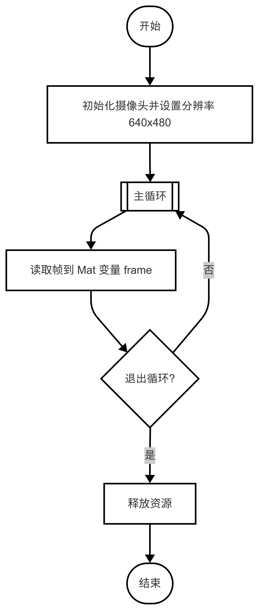
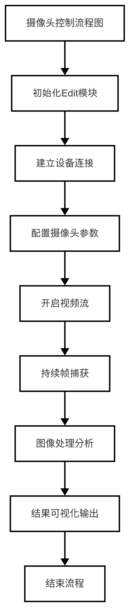
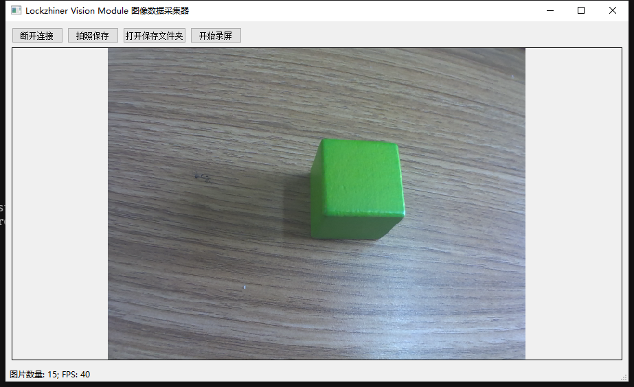

# 摄像头模块使用指南

## 章节说明
本章节主要演示如何使用LockAI进行视频流的读取，同时使用Edit模块进行图像传输。

---

## 1. 基础知识讲解

### 1.1 OpenCV简介
OpenCV（Open Source Computer Vision Library）是一个开源的计算机视觉库，提供丰富的图像处理和视频捕获功能。通过其`VideoCapture`类，开发者可以轻松调用摄像头设备并获取视频流。

### 1.2 VideoCapture模块
`cv::VideoCapture`是OpenCV中用于管理视频输入的核心类，支持从摄像头、视频文件或网络流读取帧。常用功能包括：
- 设备初始化与参数设置（分辨率、帧率）
- 逐帧捕获图像
- 资源释放管理

---

## 2. API文档

### 2.1 cv::VideoCapture类
#### 2.1.1 cv::VideoCapture类依赖头文件
```cpp
#include <opencv2/opencv.hpp>
```
#### 2.1.2 初始化摄像头
```cpp
cv::VideoCapture cap;
```
- **功能**：创建摄像头管理对象
- **说明**：该对象用于后续所有摄像头操作，未调用`open()`前不占用硬件资源

#### 2.1.3 设置摄像头分辨率
```cpp
cap.set(cv::CAP_PROP_FRAME_WIDTH, width);
cap.set(cv::CAP_PROP_FRAME_HEIGHT, height);
```
- **参数**：
  - `cv::CAP_PROP_FRAME_WIDTH`: 帧宽度（像素）
  - `cv::CAP_PROP_FRAME_HEIGHT`: 帧高度（像素）

**分辨率对照表**：根据摄像头的分辨率和帧率，选择合适的分辨率和帧率。以下为常见分辨率与帧率对照表
| 摄像头分辨率（4:3） | FPS |
|---------------------|-----|
| 480x360             | 25  |
| 640x480             | 25  |
| 960x720             | 14  |
| 1280x960            | 13  |
| 1920x1440           | 13  |

| 摄像头分辨率（16:9） | FPS |
|----------------------|-----|
| 480x270              | 25  |
| 640x360              | 25  |
| 960x540              | 25  |
| 1280x720             | 15  |
| 1920x1080            | 12  |

#### 2.1.4 打开摄像头设备
```cpp
cap.open(0);
```
- **参数**：0表示默认摄像头设备，也可以指定其他设备编号
- **返回值**：成功打开返回`true`，否则返回`false`

#### 2.1.5 读取视频帧
```cpp
cap >> frame;
```
- **说明**：读取下一帧图像，如果当前帧为空，则返回`false`

---

### 2.2 lockzhiner_vision_module::edit::Edit类

#### 2.2.1 依赖头文件
```cpp
#include <lockzhiner_vision_module/edit/edit.h>
```

#### 2.2.2 初始化模块
```cpp
Edit edit;
```
- **说明**：创建Edit对象，用于后续图像传输操作

#### 2.2.3 建立连接
```cpp
edit.StartAndAcceptConnection();
```
- **参数**：无
- **返回值**：成功建立连接返回`true`，否则返回`false`

#### 2.2.4 图像传输
```cpp
edit.Print(frame);
```
- **参数**：`cv::Mat`对象，表示图像帧
- **返回值**：无

---

## 3. 综合代码解析

### 3.1 基础摄像头读取

#### 3.1.1 流程图



#### 3.1.2 代码解析
- 初始化摄像头
```cpp
cv::VideoCapture cap;
const int width = 640;
const int height = 480;
cap.set(cv::CAP_PROP_FRAME_WIDTH, width);
cap.set(cv::CAP_PROP_FRAME_HEIGHT, height);
```
- 逐帧捕获图像
```cpp
while (true) {
    cv::Mat frame;
    cap >> frame;
    if (frame.empty()) {
        std::cerr << "Warning: Couldn't read a frame from the camera."
                    << std::endl;
        continue;
    }
}
```

#### 3.1.3 完整代码实现

```cpp
#include <iostream>
#include <opencv2/opencv.hpp>

int main() {
    cv::VideoCapture cap;
    cap.set(cv::CAP_PROP_FRAME_WIDTH, 640);
    cap.set(cv::CAP_PROP_FRAME_HEIGHT, 480);
    
    cap.open(0);  // 参数0表示默认摄像头设备
    if (!cap.isOpened()) {
        std::cerr << "Error: Could not open camera." << std::endl;
        return EXIT_FAILURE;
    }

    while (true) {
        cv::Mat frame;
        cap >> frame;
        if (frame.empty()) {
            std::cerr << "Warning: Couldn't read a frame from the camera."
                      << std::endl;
            continue;
        }
    }
    
    cap.release();
    return 0;
}
```

---

### 3.2 摄像头图像传输

#### 3.2.1 流程图



#### 3.2.2 代码解析
- 初始化摄像头和Edit模块
```cpp
cv::VideoCapture cap;
const int width = 640;
const int height = 480;
cap.set(cv::CAP_PROP_FRAME_WIDTH, width);
cap.set(cv::CAP_PROP_FRAME_HEIGHT, height);

lockzhiner_vision_module::edit::Edit edit;
```
- 建立连接
```cpp
if (!edit.StartAndAcceptConnection()) {
    std::cerr << "Error: Failed to start and accept connection." << std::endl;
    return EXIT_FAILURE;
}
```
- 逐帧捕获图像并传输
```cpp
while (true) {
    cv::Mat frame;
    cap >> frame;
    if (frame.empty()) {
        std::cerr << "Warning: Couldn't read a frame from the camera."
                    << std::endl;
        continue;
    }
    edit.Print(frame);
}
```
#### 3.2.3 完整代码实现
```cpp
#include <lockzhiner_vision_module/edit/edit.h>
#include <iostream>
#include <opencv2/opencv.hpp>

int main()
{
  // 初始化 edit 模块
  lockzhiner_vision_module::edit::Edit edit;
  if (!edit.StartAndAcceptConnection())
  {
    std::cerr << "Error: Failed to start and accept connection." << std::endl;
    return EXIT_FAILURE;
  }
  std::cout << "Device connected successfully." << std::endl;

  // 初始化摄像头
  cv::VideoCapture cap;
  int width = 640;  // 设置摄像头分辨率宽度
  int height = 480; // 设置摄像头分辨率高度
  cap.set(cv::CAP_PROP_FRAME_WIDTH, width);
  cap.set(cv::CAP_PROP_FRAME_HEIGHT, height);

  // 打开摄像头设备
  cap.open(0); // 参数 0 表示默认摄像头设备
  if (!cap.isOpened())
  {
    std::cerr << "Error: Could not open camera." << std::endl;
    return EXIT_FAILURE;
  }

  // 主循环：读取摄像头帧并传递给 edit 模块
  while (true)
  {
    cv::Mat frame; // 存储每一帧图像
    cap >> frame;  // 获取新的一帧

    // 检查是否成功读取帧
    if (frame.empty())
    {
      std::cerr << "Warning: Couldn't read a frame from the camera."
                << std::endl;
      continue;
    }

    // 使用 edit 模块处理帧
    edit.Print(frame);
  }

  // 释放摄像头资源
  cap.release();
  return 0;
}
```

---

## 4. 编译过程
### 4.1 编译环境搭建
- 请确保你已经按照 [开发环境搭建指南](../../../../docs/introductory_tutorial/cpp_development_environment.md) 正确配置了开发环境。
- 同时以正确连接开发板。
### 4.2 Cmake介绍
```cmake
# CMake最低版本要求  
cmake_minimum_required(VERSION 3.10)  

project(test_capture)

set(CMAKE_CXX_STANDARD 17)
set(CMAKE_CXX_STANDARD_REQUIRED ON)

# 定义项目根目录路径
set(PROJECT_ROOT_PATH "${CMAKE_CURRENT_SOURCE_DIR}/../..")
message("PROJECT_ROOT_PATH = " ${PROJECT_ROOT_PATH})

include("${PROJECT_ROOT_PATH}/toolchains/arm-rockchip830-linux-uclibcgnueabihf.toolchain.cmake")

# 定义 OpenCV SDK 路径
set(OpenCV_ROOT_PATH "${PROJECT_ROOT_PATH}/third_party/opencv-mobile-4.10.0-lockzhiner-vision-module")
set(OpenCV_DIR "${OpenCV_ROOT_PATH}/lib/cmake/opencv4")
find_package(OpenCV REQUIRED)
set(OPENCV_LIBRARIES "${OpenCV_LIBS}")
# 定义 LockzhinerVisionModule SDK 路径
set(LockzhinerVisionModule_ROOT_PATH "${PROJECT_ROOT_PATH}/third_party/lockzhiner_vision_module_sdk")
set(LockzhinerVisionModule_DIR "${LockzhinerVisionModule_ROOT_PATH}/lib/cmake/lockzhiner_vision_module")
find_package(LockzhinerVisionModule REQUIRED)

# 配置摄像头数据
add_executable(Test-Capture test_capture.cc)
target_include_directories(Test-Capture PRIVATE ${LOCKZHINER_VISION_MODULE_INCLUDE_DIRS})
target_link_libraries(Test-Capture PRIVATE ${OPENCV_LIBRARIES} ${LOCKZHINER_VISION_MODULE_LIBRARIES})

install(
    TARGETS Test-Capture
    RUNTIME DESTINATION .  
)
```
### 4.3 编译项目
使用 Docker Destop 打开 LockzhinerVisionModule 容器并执行以下命令来编译项目
```bash
# 进入Demo所在目录
cd /LockzhinerVisionModuleWorkSpace/LockzhinerVisionModule/Cpp_example/A01_capture
# 创建编译目录
rm -rf build && mkdir build && cd build
# 配置交叉编译工具链
export TOOLCHAIN_ROOT_PATH="/LockzhinerVisionModuleWorkSpace/arm-rockchip830-linux-uclibcgnueabihf"
# 使用cmake配置项目
cmake ..
# 执行编译项目
make -j8 && make install
```

在执行完上述命令后，会在build目录下生成可执行文件。

---
## 5. 例程运行示例
### 5.1 准备工作
- 下载凌智视觉模块图片传输助手：[点击下载](https://gitee.com/LockzhinerAI/LockzhinerVisionModule/releases/download/v0.0.0/LockzhinerVisionModuleImageFetcher.exe)
### 5.2 运行过程
在凌智视觉模块中输入以下命令：
```shell
chmod 777 Test_Capture
./Test_Capture
```
### 5.3 运行效果


---

## 6. 总结
本文档介绍了如何使用 LockAI 和 OpenCV 实现摄像头模块的视频流读取与图像传输。核心步骤包括：
- 初始化摄像头并设置分辨率；
- 打开摄像头并逐帧捕获图像；
- 使用 Edit 模块进行图像传输。

**注意事项**：
1. 推荐使用 `640x480` 分辨率以平衡性能和画质；
2. 确保 Edit 模块连接成功后再进行图像传输；