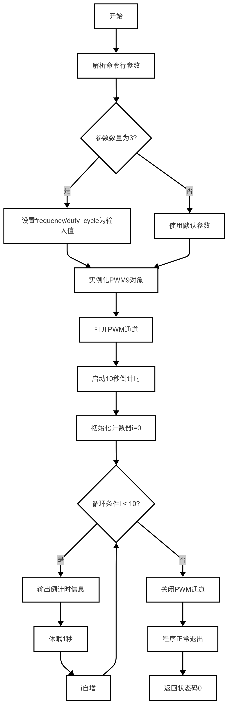
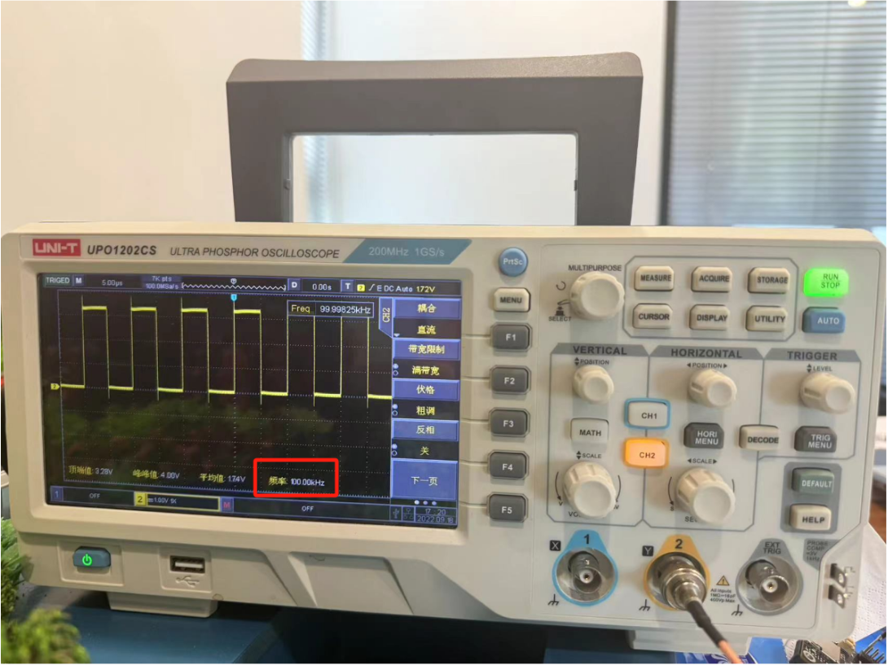

# PWM使用指南
- 在电子工程和嵌入式系统开发中，脉冲宽度调制（PWM, Pulse Width Modulation）是一项关键技术，它允许我们通过调整脉冲信号的占空比来控制模拟信号的平均电平。
## 1. PWM基本知识
### 1.1 什么是PWM
PWM（Pulse Width Modulation，脉冲宽度调制）是一种通过改变脉冲信号的占空比来控制输出信号的技术。
- 频率：表示每秒产生脉冲信号的次数，单位为Hz。
- 占空比：表示高电平时间与整个周期的比例，范围为0.0到1.0（或0%到100%）。例如：
  - 占空比为0.5表示高电平占一半时间，低电平占一半时间。
  - 占空比为1.0表示始终为高电平。
  - 占空比为0.0表示始终为低电平。
### 1.2 PWM的应用场景
PWM广泛应用于以下领域：
- 电机控制：通过调节占空比控制电机转速。
- LED亮度调节：通过改变占空比控制LED的亮度。
- 信号生成：用于生成特定波形的信号。

---

## 2. API文档
### 2.1 头文件
```c++
#include <lockzhiner_vision_module/periphery/pwm/pwm.h>
```
### 2.2 配置PWM输出参数
```c++
bool Config(uint32_t frequency, float duty_cycle);
```
- 参数：
  - frequency：表示每秒产生脉冲信号的次数，单位为Hz。
  - duty_cycle：表示高电平时间与整个周期的比例，范围为0.0到1.0（或0%到100%）。
- 返回值：
  - true：表示配置成功。
  - false：表示配置失败。
### 2.3 打开PWM输出
```c++
bool Open();
```
- 参数：无
- 返回值：
  - true：表示打开成功。
  - false：表示打开失败。
### 2.4 关闭PWM输出
```c++
bool Close();
```
- 参数：无
- 返回值：
  - true：表示关闭成功。
  - false：表示关闭失败。
---

## 3. 综合代码解析

### 3.1 流程图




### 3.2 代码解析
- 解析命令行参数
```c++
if (argc == 3) {
    frequency = std::atoi(argv[1]);
    duty_cycle = std::strtof(argv[2], nullptr);
  }
```
- 实例化PWM9对象
```c++
lockzhiner_vision_module::periphery::PWM9 pwm;
```
- 打开PWM通道
```c++
pwm.Open()
```
### 3.3 全部代码
```c++
#include <lockzhiner_vision_module/periphery/pwm/pwm.h>

#include <cstdlib> // 为了使用atoi()
#include <cstring> // 为了使用strtof()
#include <iostream>
#include <thread>

int main(int argc, char *argv[])
{
  uint32_t frequency = 1000000;
  float duty_cycle = 0.5;
  if (argc == 3)
  {
    frequency = std::atoi(argv[1]);
    duty_cycle = std::strtof(argv[2], nullptr);
  }
  std::cout << "frequency is " << frequency << std::endl;
  std::cout << "duty_cycle is " << duty_cycle << std::endl;

  lockzhiner_vision_module::periphery::PWM9 pwm;

  if (!pwm.Open(frequency, duty_cycle))
  {
    std::cout << "Failed to open adc." << std::endl;
    return 1;
  }

  for (int i = 0; i < 10; i++)
  {
    std::cout << "Wait: " << i << "/" << 10 << std::endl;
    std::this_thread::sleep_for(std::chrono::seconds(1));
  }

  // 关闭 PWM
  if (!pwm.Close())
  {
    std::cout << "Failed to open adc." << std::endl;
    return 1;
  }
  return 0;
}
```
## 4. 编译过程
### 4.1 编译环境搭建
- 请确保你已经按照 [开发环境搭建指南](../../../../docs/introductory_tutorial/cpp_development_environment.md) 正确配置了开发环境。
- 同时以正确连接开发板。
### 4.2 Cmake介绍
```cmake
# CMake最低版本要求  
cmake_minimum_required(VERSION 3.10)  

project(test_pwm)

set(CMAKE_CXX_STANDARD 17)
set(CMAKE_CXX_STANDARD_REQUIRED ON)

# 定义项目根目录路径
set(PROJECT_ROOT_PATH "${CMAKE_CURRENT_SOURCE_DIR}/../..")
message("PROJECT_ROOT_PATH = " ${PROJECT_ROOT_PATH})

include("${PROJECT_ROOT_PATH}/toolchains/arm-rockchip830-linux-uclibcgnueabihf.toolchain.cmake")

# 定义 LockzhinerVisionModule SDK 路径
set(LockzhinerVisionModule_ROOT_PATH "${PROJECT_ROOT_PATH}/third_party/lockzhiner_vision_module_sdk")
set(LockzhinerVisionModule_DIR "${LockzhinerVisionModule_ROOT_PATH}/lib/cmake/lockzhiner_vision_module")
find_package(LockzhinerVisionModule REQUIRED)

# 配置 PWM 输出 Demo
add_executable(Test-PWM PWM.cc)
target_include_directories(Test-PWM PRIVATE ${LOCKZHINER_VISION_MODULE_INCLUDE_DIRS})
target_link_libraries(Test-PWM PRIVATE ${LOCKZHINER_VISION_MODULE_LIBRARIES})

install(
    TARGETS Test-PWM
    RUNTIME DESTINATION .  
)
```
### 4.3 编译项目
使用 Docker Destop 打开 LockzhinerVisionModule 容器并执行以下命令来编译项目
```bash
# 进入Demo所在目录
cd /LockzhinerVisionModuleWorkSpace/LockzhinerVisionModule/Cpp_example/A03_PWM
# 创建编译目录
rm -rf build && mkdir build && cd build
# 配置交叉编译工具链
export TOOLCHAIN_ROOT_PATH="/LockzhinerVisionModuleWorkSpace/arm-rockchip830-linux-uclibcgnueabihf"
# 使用cmake配置项目
cmake ..
# 执行编译项目
make -j8 && make install
```

在执行完上述命令后，会在build目录下生成可执行文件。

---

## 5. 例程运行示例
### 5.2 运行过程
在凌智视觉模块中输入以下命令：
```shell
chmod 777 Test-PWM
./Test-PWM 1000 0.5
```
### 5.3 运行效果
- 运行代码后，我们在示波器上可以看到如下波形


---

## 6. 总结
通过上述内容，我们介绍了PWM的基本概念、API定义以及具体的使用示例。按照以下步骤，您可以轻松地使用PWM功能：
- 初始化PWM通道：通过Open()函数设置PWM的频率和占空比。
- 运行PWM输出：根据需求保持PWM输出一段时间。
- 关闭PWM通道：操作完成后，务必调用Close()函数释放资源，避免PWM持续输出。
