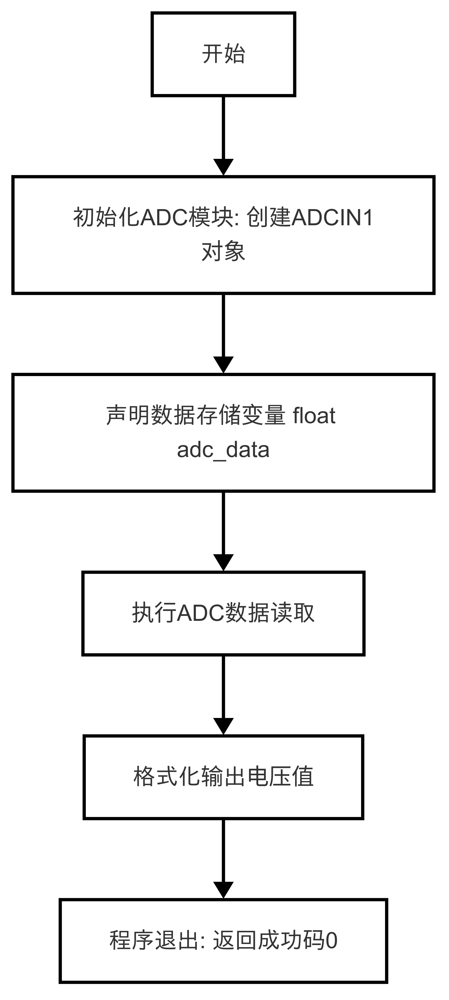
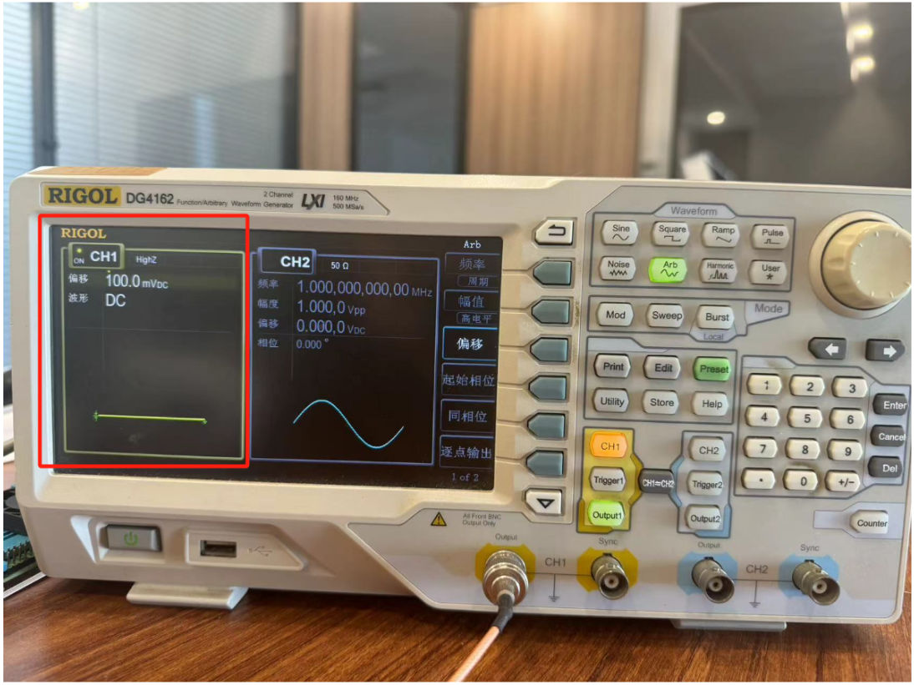

# ADC使用指南
- 在嵌入式系统开发中，读取模拟信号是常见的需求。例如，测量电池电量、温度传感器数据等场景都需要用到ADC（Analog-to-Digital Converter，模数转换器）。LockAI提供了ADC引脚，方便用户获取模拟信号。
## 1. ADC基本知识
### 1.1 什么是ADC
ADC（Analog-to-Digital Converter，模数转换器）是一种将模拟信号转换为数字信号的硬件模块。
- 模拟信号：连续变化的信号，例如电压或电流。
- 数字信号：离散的数值，通常以二进制形式表示。
- 分辨率：ADC的精度，通常以位数表示（如12位ADC可以表示0到4095之间的值）。
### 1.2 ADC应用场景
ADC广泛应用于以下领域：
- 电池电量检测：通过测量电池电压估算电量。
- 环境监测：读取温度、湿度等传感器的模拟输出。
- 音频处理：将模拟音频信号转换为数字信号进行处理。

---

## 2. API 文档
### 2.1 使用ADC类需要引用头文件
```c++
#include <lockzhiner_vision_module/periphery/adc/adc.h>
```
### 2.2 读取模拟信号（转换后的）
```c++
bool Read(float& adc_data);
```
- 参数：
  - [out] adc_data: 存储转换后的电压值（单位：伏特）
- 返回值
  - true：表示读取成功。
  - false：表示读取失败。
### 2.3 读取模拟信号（原始的）
```c++
float Read();
```
- 参数：无
- 返回值：
  - 返回模拟信号值（单位：mV）
  - 失败时返回0.0f
---

## 3. 综合代码解析

### 3.1 流程图




### 3.2 代码解析
- 初始化ADC引脚
```c++
lockzhiner_vision_module::periphery::ADCIN1 adc;
```
- 读取模拟信号
```c++
adc.Read(adc_data)
```

### 3.3 完整代码实现
```c++
#include <lockzhiner_vision_module/periphery/adc/adc.h>

#include <iostream>

int main()
{
  lockzhiner_vision_module::periphery::ADCIN1 adc;
  float adc_data;
  if (!adc.Read(adc_data))
  {
    std::cout << "Failed to read adc data." << std::endl;
    return 1;
  }
  std::cout << "adc_data is " << adc_data << "mV" << std::endl;
  return 0;
}
```
---

## 4. 编译过程
### 4.1 编译环境搭建
- 请确保你已经按照 [开发环境搭建指南](../../../../docs/introductory_tutorial/cpp_development_environment.md) 正确配置了开发环境。
- 同时以正确连接开发板。
### 4.2 Cmake介绍
```cmake
# CMake最低版本要求  
cmake_minimum_required(VERSION 3.10)  

project(test_adc)

set(CMAKE_CXX_STANDARD 17)
set(CMAKE_CXX_STANDARD_REQUIRED ON)

# 定义项目根目录路径
set(PROJECT_ROOT_PATH "${CMAKE_CURRENT_SOURCE_DIR}/../..")
message("PROJECT_ROOT_PATH = " ${PROJECT_ROOT_PATH})

include("${PROJECT_ROOT_PATH}/toolchains/arm-rockchip830-linux-uclibcgnueabihf.toolchain.cmake")

# 定义 LockzhinerVisionModule SDK 路径
set(LockzhinerVisionModule_ROOT_PATH "${PROJECT_ROOT_PATH}/third_party/lockzhiner_vision_module_sdk")
set(LockzhinerVisionModule_DIR "${LockzhinerVisionModule_ROOT_PATH}/lib/cmake/lockzhiner_vision_module")
find_package(LockzhinerVisionModule REQUIRED)

# 配置 ADC 读取 Demo
add_executable(Test-ADC ADC.cc)
target_include_directories(Test-ADC PRIVATE ${LOCKZHINER_VISION_MODULE_INCLUDE_DIRS})
target_link_libraries(Test-ADC PRIVATE ${LOCKZHINER_VISION_MODULE_LIBRARIES})

install(
    TARGETS Test-ADC
    RUNTIME DESTINATION .  
)
```
### 4.3 编译项目
使用 Docker Destop 打开 LockzhinerVisionModule 容器并执行以下命令来编译项目
```bash
# 进入Demo所在目录
cd /LockzhinerVisionModuleWorkSpace/LockzhinerVisionModule/Cpp_example/A01_adc
# 创建编译目录
rm -rf build && mkdir build && cd build
# 配置交叉编译工具链
export TOOLCHAIN_ROOT_PATH="/LockzhinerVisionModuleWorkSpace/arm-rockchip830-linux-uclibcgnueabihf"
# 使用cmake配置项目
cmake ..
# 执行编译项目
make -j8 && make install
```

在执行完上述命令后，会在build目录下生成可执行文件。

---

## 5. 例程运行示例
### 5.1 运行过程
在凌智视觉模块中输入以下命令：
```shell
chmod 777 Test-ADC
./Test-ADC
```
### 5.2 运行效果
- 外部输入电压如下图所示

- 程序运行结果如下图所示

可以看到有一定的误差，误差一般在10mv以内

---

## 6. 总结
通过上述内容，我们介绍了ADC的基本概念、API定义以及具体的使用示例。按照以下步骤，您可以轻松地使用ADC功能：
- 初始化ADC引脚：创建对应的ADC对象（如ADCIN1）。
- 读取模拟信号：调用Read()函数获取模拟信号值。
- 处理读取结果：检查返回值是否成功，并根据需要处理读取到的数据。
