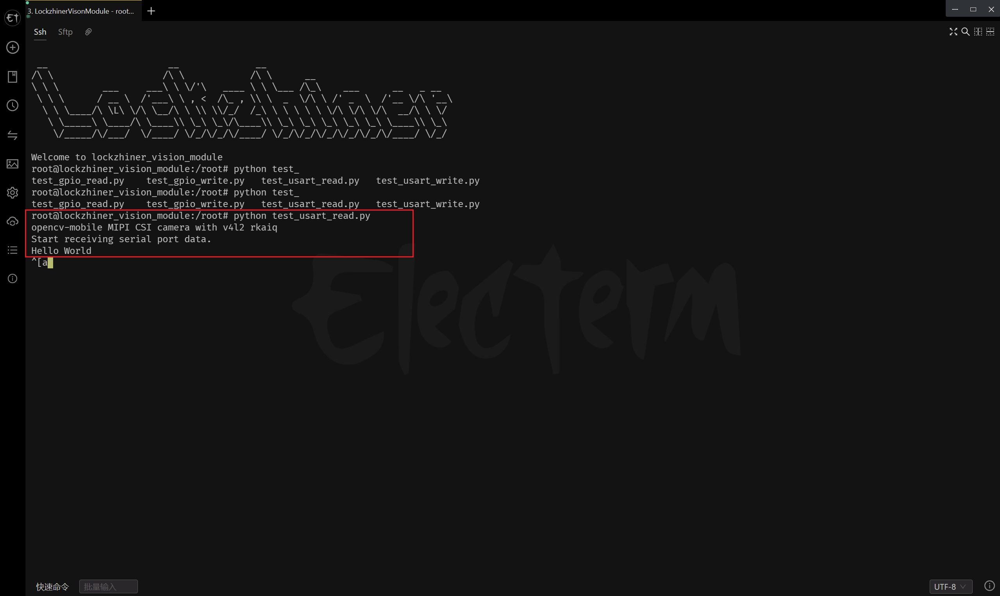

# 串口通讯
串口（Serial Port），也称为串行接口或串行通信接口，是一种用于连接计算机与外部设备并进行数据传输的接口技术。它使用较少的导线（通常只需要几根线），并且可以在较长的距离上可靠地传输数据，尽管速度相对较慢。

在本章节中，我们将介绍如何使用 Lockzhiner Vision Module 上的串口进行数据传输。为了方便调试，我们使用 CH340 USB 转串口模块（以下简称 CH340） 进行调试，请正确将模块的引脚按照以下方式连接：

- LockzhinerVisionModule RX1 <-> CH340 TXD
- LockzhinerVisionModule TX1 <-> CH340 RXD
- LockzhinerVisionModule GND <-> CH340 GND

---

## 1. 串口通讯基本知识
### 1.1 什么是串口通讯

串口通讯是一种通过串行方式传输数据的技术，数据以位为单位逐位发送和接收。相比并行通讯，串口通讯具有以下特点：
- 优点：
  - 使用较少的导线，适合远距离传输。
  - 实现简单，成本较低。
- 缺点：
  - 数据传输速度较慢。
### 1.2常见参数
串口通讯的关键参数包括：
- 波特率（Baud Rate）：表示每秒传输的位数，通常为 9600、38400、57600、115200 等。
- 数据位（Data Bits）：表示每位传输的数据位数，通常为 8 位。
- 停止位（Stop Bits）：表示发送和接收的停止位，通常为 1 位。
- 校验位（Parity Bit）：表示校验位，通常为无校验位、奇校验位和偶校验位。
* 在LockAI中我们主要关心波特率即可。

---

## 2. API文档
### 2.1 头文件
```c++
#include <lockzhiner_vision_module/periphery/usart/usart.h>
```
### 2.2 打开串口
```c++
bool Open(uint32_t baud_rate = 115200);
```
- 参数：
  - baud_rate：波特率，默认为115200。（支持标准波特率值）
- 返回值：
  - true：打开串口成功。
  - false：打开串口失败。
### 2.3 关闭串口
```c++
bool Close();
```
- 返回值：
  - true：关闭串口成功。
  - false：关闭串口失败。
### 2.4 发送数据
```c++
bool Write(const std::string& data);
```
- 参数：
  - data：要发送的数据。
- 返回值：
  - true：发送数据成功。
  - false：发送数据失败。
### 2.5 读取数据
```c++
bool Read(std::string& data, size_t size);
```
- 参数：
  - data：用于存储读取数据的字符串。
  - size：要读取的数据大小。
- 返回值：
  - true：读取数据成功。
  - false：读取数据失败。

---

## 3. 综合代码解析
### 3.1 串口读数据示例
#### 3.1.1 流程图


#### 3.1.2 代码解释
- 初始化USART模块，创建USART1对象。
```c++
lockzhiner_vision_module::periphery::USART1 usart;
```
- 打开串口
```c++
usart.Open(115200)
```
- 串口读取
```c++
 usart.Read(buffer, 1024);
```
#### 3.1.3 代码实现
```c++
#include <lockzhiner_vision_module/periphery/usart/usart.h>

#include <iostream>

int main()
{
  lockzhiner_vision_module::periphery::USART1 usart;
  if (!usart.Open(115200))
  {
    std::cout << "Failed to open usart." << std::endl;
    return 1;
  }

  std::cout << "Start receiving serial port data." << std::endl;
  while (1)
  {
    std::string buffer;
    usart.Read(buffer, 1024);
    if (!buffer.empty())
    {
      std::cout << buffer << std::endl;
    }
  }
  return 0;
}
```

### 3.2 串口写数据示例
#### 3.2.1 流程图


#### 3.2.2 代码解释
- 初始化USART模块，
```c++
 lockzhiner_vision_module::periphery::USART1 usart;
```
- 打开串口
```c++
usart.Open(115200)
```
- 发送数据
```c++
usart.Write("Hello World\n");
```
#### 3.2.3 代码实现
```c++
#include <lockzhiner_vision_module/periphery/usart/usart.h>

#include <iostream>

int main()
{
  lockzhiner_vision_module::periphery::USART1 usart;
  if (!usart.Open(115200))
  {
    std::cout << "Failed to open usart." << std::endl;
    return 1;
  }

  if (!usart.Write("Hello World\n"))
  {
    std::cout << "Failed to send data." << std::endl;
    return 1;
  }
  return 0;
}
```

---

## 4. 编译过程
### 4.1 编译环境搭建
- 请确保你已经按照 [开发环境搭建指南](../../../../docs/introductory_tutorial/cpp_development_environment.md) 正确配置了开发环境。
- 同时以正确连接开发板。
### 4.2 Cmake介绍
```cmake
# CMake最低版本要求  
cmake_minimum_required(VERSION 3.10)  

project(test_usart)

set(CMAKE_CXX_STANDARD 17)
set(CMAKE_CXX_STANDARD_REQUIRED ON)

# 定义项目根目录路径
set(PROJECT_ROOT_PATH "${CMAKE_CURRENT_SOURCE_DIR}/../..")
message("PROJECT_ROOT_PATH = " ${PROJECT_ROOT_PATH})

include("${PROJECT_ROOT_PATH}/toolchains/arm-rockchip830-linux-uclibcgnueabihf.toolchain.cmake")

# 定义 LockzhinerVisionModule SDK 路径
set(LockzhinerVisionModule_ROOT_PATH "${PROJECT_ROOT_PATH}/third_party/lockzhiner_vision_module_sdk")
set(LockzhinerVisionModule_DIR "${LockzhinerVisionModule_ROOT_PATH}/lib/cmake/lockzhiner_vision_module")
find_package(LockzhinerVisionModule REQUIRED)

# 配置 USART 输出 Demo
add_executable(Test-USART-Write USART_Write.cc)
target_include_directories(Test-USART-Write PRIVATE ${LOCKZHINER_VISION_MODULE_INCLUDE_DIRS})
target_link_libraries(Test-USART-Write PRIVATE ${LOCKZHINER_VISION_MODULE_LIBRARIES})

# 配置 USART 读取 Demo
add_executable(Test-USART-Read USART_Read.cc)
target_include_directories(Test-USART-Read PRIVATE ${LOCKZHINER_VISION_MODULE_INCLUDE_DIRS})
target_link_libraries(Test-USART-Read PRIVATE ${LOCKZHINER_VISION_MODULE_LIBRARIES})

install(
    TARGETS Test-USART-Read
    TARGETS Test-USART-Write
    RUNTIME DESTINATION .  
)
```
### 4.3 编译项目
使用 Docker Destop 打开 LockzhinerVisionModule 容器并执行以下命令来编译项目
```bash
# 进入Demo所在目录
cd /LockzhinerVisionModuleWorkSpace/LockzhinerVisionModule/Cpp_example/A05_USART
# 创建编译目录
rm -rf build && mkdir build && cd build
# 配置交叉编译工具链
export TOOLCHAIN_ROOT_PATH="/LockzhinerVisionModuleWorkSpace/arm-rockchip830-linux-uclibcgnueabihf"
# 使用cmake配置项目
cmake ..
# 执行编译项目
make -j8 && make install
```

在执行完上述命令后，会在build目录下生成可执行文件。

---

## 5. 例程运行示例
### 5.1 运行过程
在凌智视觉模块中输入以下命令：
```shell
chmod 777 Test-USART-Read
./Test-USART-Read
chmod 777 Test-USART-Write
./Test-USART-Write
```
### 5.2 运行结果
- 在电脑端打开串口调试工具，选择对应串口，波特率为115200，数据位为8，停止位为1，校验位为无校验位。
- 电脑端串口配置如下所示：

- 运行串口写数据示例后，我们在电脑端可以收到如下数据。

- 运行串口读数据示例后，我们在电脑端发送Hello World，然后我们收到如下数据。


---

## 6. 总结
通过上述内容，我们介绍了串口通讯的基本概念、API定义以及具体的使用示例。按照以下步骤，您可以轻松地使用串口功能：
- 初始化串口：调用Open()函数设置波特率并打开串口。
- 读取数据：调用Read()函数从串口接收数据。
- 写入数据：调用Write()函数向串口发送数据。
- 关闭串口：操作完成后，调用Close()函数释放资源。
