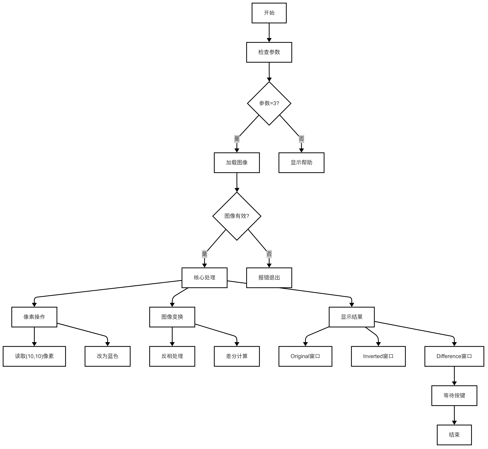
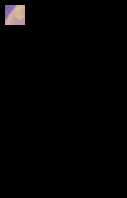

# 图像的基本运算
在图像处理中，理解图像的基本操作是掌握计算机视觉技术的关键。本章节将介绍 OpenCV 中图像的基本运算方法，包括像素操作、逻辑运算和差值运算，并通过一个综合示例展示其实际应用。

---

## 1. 基本知识讲解
### 1.1 图像坐标系

在图像处理中，坐标是一个非常重要的概念：

- 原点：图像的左上角为原点 (0, 0)。
- x 轴：从左到右递增。
- y 轴：从上到下递增。
### 1.2 图像的基本属性
每张图像都有以下基本属性：

- 宽度（Width）：图像的列数。
- 高度（Height）：图像的行数。
- 通道数（Channels）：
  - 灰度图：1 个通道。
  - 彩色图：通常为 3 个通道（BGR）。
### 1.3 图像的基本操作
图像的基本操作包括：

- 获取和设置像素值：访问和修改图像中的像素值。
- 逻辑运算：如按位与、或、异或等。
- 差值运算：计算两张图像之间的差异。

---

## 2.API文档
### 2.1 头文件
```cpp
#include <opencv2/opencv.hpp>
```
### 2.2 获取设置像素点
```c++
uchar cv::Mat::at<uchar>(int row, int col) const; // 灰度图
cv::Vec3b cv::Mat::at<cv::Vec3b>(int row, int col) const; // 彩色图
```
- 参数:
  - row：行索引(y坐标)
  - col：列索引(x坐标)
- 返回值:
  - 对于灰度图，返回单通道值（unchar）
  - 对于彩色图，返回三通道值（cv::Vec3b）
### 2.3 设置像素点：
```c++
void cv::Mat::at<uchar>(int row, int col) = value; // 灰度图
void cv::Mat::at<cv::Vec3b>(int row, int col) = value; // 彩色图
```
- 参数:
  - row：行索引(y坐标)
  - col：列索引(x坐标)
  - value:要设置的像素值（uchar或cv::Vec3b）
### 2.4 获取图像的宽度和高度
#### 2.4.1 获取宽度
```c++
int cv::Mat::cols;
```
- 返回值
  - 返回图像的宽度（列数）
#### 2.4.2 获取高度
```c++
int cv::Mat::rows;
```
- 返回值
  - 返回图像的高度（行数）
### 2.5 获取图像的格式和大小
#### 2.5.1 判断是否为灰度图
```c++
int cv::Mat::channels();
```
- 返回值
  - 1表示灰度图
  - 3表示彩色图
#### 2.5.2 获取图像大小（字节数）
```c++
size_t cv::Mat::total(); // 总像素数
size_t cv::Mat::elemSize(); // 每个像素的字节数
size_t totalBytes = img.total() * img.elemSize();//计算公式
```
- 返回值
  - 返回图像的总字节数
### 2.6 图像取反
```c++
void cv::bitwise_not(InputArray src, OutputArray dst);
```
- 参数:
  - src：输入图像（cv::Mat）
  - dst：输出图像（cv::Mat）
- 返回值：
  - 结果储存在dst中
### 2.7 图像逻辑运算
#### 2.7.1 按位与（AND）
```c++
void cv::bitwise_and(InputArray src1, InputArray src2, OutputArray dst);
```
-参数：
  - src1：输入图像1（cv::Mat）
  - src2：输入图像2（cv::Mat）
  - dst：输出图像（cv::Mat）
- 返回值：
  - 结果储存在dst中
#### 2.7.2 按位或（OR）
```c++
void cv::bitwise_or(InputArray src1, InputArray src2, OutputArray dst);
```
- 参数：
  - src1：输入图像1（cv::Mat）
  - src2：输入图像2（cv::Mat）
  - dst：输出图像（cv::Mat）
- 返回值：
  - 结果储存在dst中
#### 2.7.3 按位异或（XOR）
```c++
void cv::bitwise_xor(InputArray src1, InputArray src2, OutputArray dst);
```
- 参数：
  - src1：输入图像1（cv::Mat）
  - src2：输入图像2（cv::Mat）
  - dst：输出图像（cv::Mat）
- 返回值：
  - 结果储存在dst中
#### 2.7.4 按位取反（NOT）
```c++
void cv::bitwise_not(InputArray src, OutputArray dst);
```
- 参数：
  - src：输入图像（cv::Mat）
  - dst：输出图像（cv::Mat）
- 返回值：
  - 结果储存在dst中
#### 2.7.5 复杂的图像逻辑运算
- 如果需要实现复杂的逻辑运算（如NAND、NOR、NXOR等），可以通过组合上述基本函数来完成。例如：
**NAND 与非运算
```c++
cv::Mat nandResult;
cv::bitwise_and(img1, img2, nandResult); // 计算 AND
cv::bitwise_not(nandResult, nandResult); // 取反得到 NAND
```
- 通过这样的组合我们就可以实现更为复杂的逻辑运算了。
### 2.8 绝对差值
```c++
void cv::absdiff(InputArray src1, InputArray src2, OutputArray dst);
```
- 参数：
  - src1：输入图像1（cv::Mat）
  - src2：输入图像2（cv::Mat）
  - dst：输出图像（cv::Mat）
- 返回值：
  - 结果储存在dst中

---

## 3.综合代码解析

### 3.1 流程图



### 3.2 代码解析
- 像素操作
```c++
// 从(10,10)开始，宽40，高40，设置为蓝色
cv::Rect roi(10, 10, 40, 40);  
image1(roi).setTo(cv::Scalar(255, 0, 0));
```
- 图像变换
```c++
// 图像取反
cv::Mat invertedImage;
cv::bitwise_not(image1, invertedImage);
// 图像差分
cv::Mat diffImage;
cv::absdiff(image1, image2, diffImage);
```
- 显示结果
```c++
 // 显示结果
cv::imshow("Original Image", image1);
cv::imshow("Inverted Image", invertedImage);
cv::imshow("Difference Image", diffImage);
```
### 3.3 代码实现
```c++  
#include <lockzhiner_vision_module/edit/edit.h>
#include <iostream>
#include <opencv2/opencv.hpp>

int main(int argc, char *argv[])
{
  // 检查命令行参数数量是否正确
  if (argc != 3)
  {
    std::cerr << "Usage: " << argv[0] << " <image1_path> <image2_path>" << std::endl;
    return -1;
  }

  // 从命令行参数中读取图像路径
  std::string image1Path = argv[1];
  std::string image2Path = argv[2];

  // 加载图像
  cv::Mat image1 = cv::imread(image1Path);
  cv::Mat image2 = cv::imread(image2Path);

  // 检查图像是否加载成功
  if (image1.empty() || image2.empty())
  {
    std::cerr << "Error: Could not load images!" << std::endl;
    return -1;
  }

  // 获取图像尺寸
  int width = image1.cols;
  int height = image1.rows;
  std::cout << "Image size: " << width << "x" << height << std::endl;

  // 从(10,10)开始，宽40，高40，设置为蓝色
  cv::Rect roi(10, 10, 40, 40);
  image1(roi).setTo(cv::Scalar(255, 0, 0));

  // 图像取反
  cv::Mat invertedImage;
  cv::bitwise_not(image1, invertedImage);

  // 图像差分
  cv::Mat diffImage;
  cv::absdiff(image1, image2, diffImage);

  // 显示结果
  cv::imshow("Original Image", image1);
  cv::imshow("Inverted Image", invertedImage);
  cv::imshow("Difference Image", diffImage);

  cv::waitKey(0);
  return 0;
}
```

---

## 4. 编译过程
### 4.1 编译环境搭建
- 请确保你已经按照 [开发环境搭建指南](../../../../docs/introductory_tutorial/cpp_development_environment.md) 正确配置了开发环境。
- 同时以正确连接开发板。
### 4.2 Cmake介绍
```cmake
# CMake最低版本要求  
cmake_minimum_required(VERSION 3.10)  

project(test-basic-method)

set(CMAKE_CXX_STANDARD 17)
set(CMAKE_CXX_STANDARD_REQUIRED ON)

# 定义项目根目录路径
set(PROJECT_ROOT_PATH "${CMAKE_CURRENT_SOURCE_DIR}/../..")
message("PROJECT_ROOT_PATH = " ${PROJECT_ROOT_PATH})

include("${PROJECT_ROOT_PATH}/toolchains/arm-rockchip830-linux-uclibcgnueabihf.toolchain.cmake")

# 定义 OpenCV SDK 路径
set(OpenCV_ROOT_PATH "${PROJECT_ROOT_PATH}/third_party/opencv-mobile-4.10.0-lockzhiner-vision-module")
set(OpenCV_DIR "${OpenCV_ROOT_PATH}/lib/cmake/opencv4")
find_package(OpenCV REQUIRED)
set(OPENCV_LIBRARIES "${OpenCV_LIBS}")
# 定义 LockzhinerVisionModule SDK 路径
set(LockzhinerVisionModule_ROOT_PATH "${PROJECT_ROOT_PATH}/third_party/lockzhiner_vision_module_sdk")
set(LockzhinerVisionModule_DIR "${LockzhinerVisionModule_ROOT_PATH}/lib/cmake/lockzhiner_vision_module")
find_package(LockzhinerVisionModule REQUIRED)

# 基本图像处理示例
add_executable(Test-basic-method basic_method.cc)
target_include_directories(Test-basic-method PRIVATE ${LOCKZHINER_VISION_MODULE_INCLUDE_DIRS})
target_link_libraries(Test-basic-method PRIVATE ${OPENCV_LIBRARIES} ${LOCKZHINER_VISION_MODULE_LIBRARIES})

install(
    TARGETS Test-basic-method
    RUNTIME DESTINATION .  
)
```
### 4.3 编译项目
使用 Docker Destop 打开 LockzhinerVisionModule 容器并执行以下命令来编译项目
```bash
# 进入Demo所在目录
cd /LockzhinerVisionModuleWorkSpace/LockzhinerVisionModule/Cpp_example/B01_basic_method
# 创建编译目录
rm -rf build && mkdir build && cd build
# 配置交叉编译工具链
export TOOLCHAIN_ROOT_PATH="/LockzhinerVisionModuleWorkSpace/arm-rockchip830-linux-uclibcgnueabihf"
# 使用cmake配置项目
cmake ..
# 执行编译项目
make -j8 && make install
```

在执行完上述命令后，会在build目录下生成可执行文件。

---

## 5. 例程运行示例
### 5.1 运行过程

在凌智视觉模块中输入以下命令：
```shell
chmod 777 Test-basic-method
# 需要输入两张大小一样的图片
./Test-basic-method image1_path image2_path
```
### 5.2 运行结果
- 原始图像：


- 原始图像左上角加上一个40*40的矩形蓝像素点


- 图像取反结果：


- 图像差分结果：



---

## 6.总结
通过上述内容，我们介绍了图像的基本操作及其对应的 OpenCV API。按照以下步骤，您可以轻松地进行图像的基本运算：
- 获取和设置像素值：使用 cv::Mat::at 方法访问和修改像素。
- 逻辑运算：使用 cv::bitwise_and、cv::bitwise_or 等函数实现逻辑运算。
- 差值运算：使用 cv::absdiff 计算图像之间的差异。
- 复杂运算：通过组合基本函数实现更复杂的逻辑运算。

