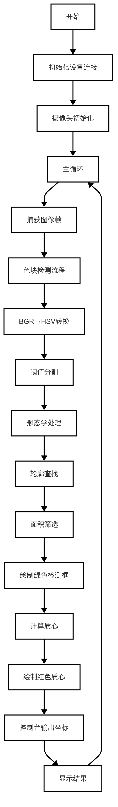
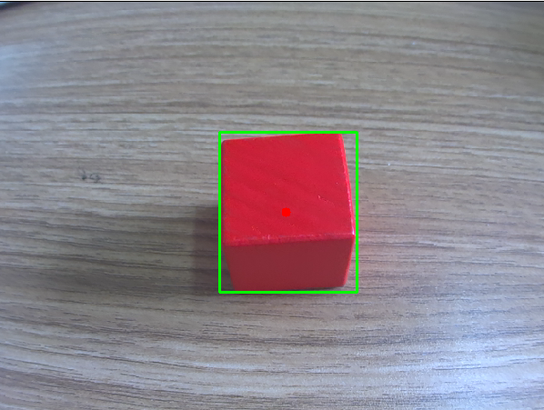

# 寻找色块
在传统计算机视觉场景中，颜色识别是目标检测和分割的重要手段之一。通过识别特定颜色的色块，可以在相对纯净的背景下快速定位目标区域。本章节提供了一个简单的色块识别案例，并将其封装为一个自定义函数 find_blobs，方便快速移植和使用。
## 1. 基本知识讲解
### 1.1 色块识别的重要性
- 颜色特征提取：颜色是一种重要的视觉特征，尤其在背景较为单一的情况下，能够快速区分目标区域。
- 应用场景：广泛应用于机器人导航、工业自动化、物体跟踪等领域。
- HSV 颜色空间：相比于 RGB 颜色空间，HSV 更适合用于颜色识别，因为它可以将颜色信息（Hue）、饱和度（Saturation）和亮度（Value）分离，便于设置阈值。
### 1.2 色块识别的流程
- 获取图像。
- 将图像从 BGR 转换为 HSV 颜色空间。
- 创建二值掩码，筛选出符合颜色范围的像素。
- 使用形态学操作清除噪声。
- 查找轮廓并筛选符合条件的色块。
- 计算外接矩形和中心点。
- 绘制结果并输出。

---

## 2. API文档
### 2.1 头文件
```c++
#include <opencv2/opencv.hpp>
```
### 2.2 生成掩码
```c++
cv::inRange(src, lowerb, upperb, dst);
```
- 参数说明：
  - src：输入图像，可以是单通道或三通道的图像。
  - lowerb：颜色下界，是一个Scalar对象，表示要查找的颜色的下限。
  - upperb：颜色上界，是一个Scalar对象，表示要查找的颜色的上限。
  - dst：输出图像，是一个单通道的8位无符号整数图像，表示生成的掩码。
- 返回值：
  -  无
### 2.3 创建形态学操作所需的结构元素核
```c++
cv::getStructuringElement(shape, ksize, anchor);
```
- 参数说明：
  - shape：核形状，可以是RECT、CROSS、ELLIPSE等。
  - ksize：核大小，是一个Size对象，表示核的宽度和高度。
  - anchor：锚点，是一个Point对象，表示核的锚点位置。
- 返回值：
  - 返回一个核，是一个Mat对象。
### 2.4 形态学操作：清除噪声
```c++
cv::morphologyEx(src, dst, op, kernel, anchor, iterations, borderType, borderValue);
```
- 参数说明：
  - src：输入图像，可以是单通道或三通道的图像。
  - dst：输出图像，是一个单通道的8位无符号整数图像，表示生成的掩码。
  - op：操作类型，可以是OPEN、CLOSE、GRADIENT、TOPHAT、BLACKHAT等。
  - kernel：核，是一个Mat对象，表示形态学操作的核。
  - anchor：锚点，是一个Point对象，表示核的锚点位置。
  - iterations：迭代次数，是一个整数，表示形态学操作的迭代次数。
  - borderType：边界类型，可以是BORDER_CONSTANT、BORDER_REPLICATE、BORDER_REFLECT、BORDER_WRAP、BORDER_REFLECT_101等。
  - borderValue：边界值，是一个Scalar对象，表示边界区域的值。
- 返回值：
  - 无
### 2.5 查找轮廓
```c++
cv::findContours(image, contours, hierarchy, mode, method, offset);
```
- 参数说明：
  - image：输入图像，可以是单通道或三通道的图像。
  - contours：输出参数，是一个vector<vector<Point>>对象，表示轮廓的集合。
  - hierarchy：输出参数，是一个vector<Vec4i>对象，表示轮廓的层级关系。
  - mode：轮廓发现模式，可以是RETR_EXTERNAL、RETR_LIST、RETR_CCOMP、RETR_TREE等。
  - method：轮廓 approximation 方法，可以是CHAIN_APPROX_NONE、CHAIN_APPROX_SIMPLE、CHAIN_APPROX_TC89_L1、CHAIN_APPROX_TC89_KCOS等。
  - offset：轮廓偏移量，是一个Point对象，表示轮廓的偏移量。
- 返回值：
  - 返回一个整数，表示轮廓的数量。
### 2.6 获取轮廓的外接矩形
```c++
cv::boundingRect(points);
```
- 参数说明：
  - points：输入参数，是一个vector<Point>对象，表示轮廓的点集合。
- 返回值：
  - 返回一个Rect对象，表示轮廓的外接矩形。
### 2.7 计算矩阵矩
```c++
cv::moments(array, binaryImage);
```
- 参数说明：
  - array：输入参数，是一个Mat对象，表示输入的矩阵。
  - binaryImage：输入参数，是一个布尔值，表示是否将输入的矩阵转换为二值矩阵。
- 返回值：
  - 返回一个 Moments对象，表示矩阵的矩。
### 2.8 绘制矩形框
```c++
cv::rectangle(img, pt1, pt2, color, thickness, lineType, shift);
```
- 参数说明：
  - img：输入参数，是一个Mat对象，表示输入的图像。
  - pt1：输入参数，是一个Point对象，表示矩形的左上角点。
  - pt2：输入参数，是一个Point对象，表示矩形的右下角点。
  - color：输入参数，是一个Scalar对象，表示矩形的颜色。
  - thickness：输入参数，是一个整数，表示矩形的线宽。
  - lineType：输入参数，是一个整数，表示矩形的线类型。
  - shift：输入参数，是一个整数，表示坐标的精度。
- 返回值：
  - 无
### 2.9 绘制圆
```c++
cv::circle(img, center, radius, color, thickness, lineType, shift);
```
- 参数说明：
  - img：输入参数，是一个Mat对象，表示输入的图像。
  - center：输入参数，是一个Point对象，表示圆心。
  - radius：输入参数，是一个整数，表示圆的半径。
  - color：输入参数，是一个Scalar对象，表示圆的颜色。
  - thickness：输入参数，是一个整数，表示圆的线宽。
  - lineType：输入参数，是一个整数，表示圆的线类型。
  - shift：输入参数，是一个整数，表示坐标的精度。
- 返回值：
  - 无

---

## 3. 综合代码介绍

### 3.1 流程图



### 3.2 核心代码解析
- BGR转HSV
```c++
cv::cvtColor(image, hsv_image, cv::COLOR_BGR2HSV);
```
- 阈值分割
```c++
cv::inRange(hsv_image, lower_bound, upper_bound, mask););
```
- 形态学处理
```c++
cv::Mat kernel = cv::getStructuringElement(cv::MORPH_RECT, cv::Size(kernel_size, kernel_size));
cv::morphologyEx(mask, mask, cv::MORPH_OPEN, kernel);
```
- 查找轮廓
```c++
cv::findContours(mask, contours, cv::RETR_EXTERNAL, cv::CHAIN_APPROX_SIMPLE);
```
自定义函数参数如下所示
```c++
std::vector<std::vector<cv::Point>> find_blobs(
    const cv::Mat &image,
    const cv::Scalar &lower_bound,
    const cv::Scalar &upper_bound,
    int min_area = 100,
    int kernel_size = 5);
```
- 参数说明：
  - image：输入参数，是一个Mat对象，表示输入的图像。
  - lower_bound：输入参数，是一个Scalar对象，表示颜色下界。
  - upper_bound：输入参数，是一个Scalar对象，表示颜色上界。
  - min_area：输入参数，是一个整数，表示最小面积。
  - kernel_size：输入参数，是一个整数，表示核大小。
- 返回值：
  - 返回一个vector<vector<Point>>对象，表示找到的色块的点集合。

### 3.3 完整代码实现
```c++
#include <lockzhiner_vision_module/edit/edit.h>
#include <opencv2/opencv.hpp>
#include <iostream>
#include <vector>

std::vector<std::vector<cv::Point>> find_blobs(
    const cv::Mat &image,
    const cv::Scalar &lower_bound,
    const cv::Scalar &upper_bound,
    int min_area = 100,
    int kernel_size = 5)
{

    // 转换为 HSV 颜色空间
    cv::Mat hsv_image;
    cv::cvtColor(image, hsv_image, cv::COLOR_BGR2HSV);

    // 创建二值掩码
    cv::Mat mask;
    cv::inRange(hsv_image, lower_bound, upper_bound, mask);

    // 形态学操作：清除噪声
    cv::Mat kernel = cv::getStructuringElement(cv::MORPH_RECT, cv::Size(kernel_size, kernel_size));
    cv::morphologyEx(mask, mask, cv::MORPH_OPEN, kernel);

    // 查找轮廓
    std::vector<std::vector<cv::Point>> contours;
    cv::findContours(mask, contours, cv::RETR_EXTERNAL, cv::CHAIN_APPROX_SIMPLE);

    // 筛选符合条件的色块
    std::vector<std::vector<cv::Point>> filtered_contours;
    for (const auto &contour : contours)
    {
        cv::Rect bounding_rect = cv::boundingRect(contour);
        if (bounding_rect.area() >= min_area)
        {
            filtered_contours.push_back(contour);
        }
    }
    return filtered_contours;
}

int main()
{
    lockzhiner_vision_module::edit::Edit edit;
    if (!edit.StartAndAcceptConnection())
    {
        std::cerr << "Error: Failed to start and accept connection." << std::endl;
        return EXIT_FAILURE;
    }
    std::cout << "Device connected successfully." << std::endl;

    cv::VideoCapture cap;
    int width = 640;  // 设置摄像头分辨率宽度
    int height = 480; // 设置摄像头分辨率高度
    cap.set(cv::CAP_PROP_FRAME_WIDTH, width);
    cap.set(cv::CAP_PROP_FRAME_HEIGHT, height);

    // 打开摄像头设备
    cap.open(0); // 参数 0 表示默认摄像头设备
    if (!cap.isOpened())
    {
        std::cerr << "Error: Could not open camera." << std::endl;
        return EXIT_FAILURE;
    }
    while (true)
    {
        cv::Mat image; // 存储每一帧图像
        cap >> image;  // 获取新的一帧

        // 定义颜色阈值（例如红色）
        cv::Scalar lower_red(170, 100, 100); // 红色下界
        cv::Scalar upper_red(179, 255, 255); // 红色上界

        // 调用 find_blobs 函数
        int min_area = 100;  // 最小面积阈值
        int kernel_size = 1; // 形态学操作核大小
        std::vector<std::vector<cv::Point>> blobs = find_blobs(image, lower_red, upper_red, min_area, kernel_size);

        // 绘制和打印检测到的色块
        for (const auto &contour : blobs)
        {
            // 计算外接矩形框
            cv::Rect bounding_rect = cv::boundingRect(contour);

            // 绘制矩形框
            cv::rectangle(image, bounding_rect, cv::Scalar(0, 255, 0), 2);

            // 计算中心点
            cv::Moments moments = cv::moments(contour);
            int cx = moments.m10 / moments.m00;
            int cy = moments.m01 / moments.m00;

            // 绘制中心点
            cv::circle(image, cv::Point(cx, cy), 5, cv::Scalar(0, 0, 255), -1);

            // 打印信息
            std::cout << "Blob detected at (" << cx << ", " << cy << ") with area " << bounding_rect.area() << std::endl;
        }
        edit.Print(image);
    }
    return 0;
}
```

---

## 4. 编译过程
### 4.1 编译环境搭建
- 请确保你已经按照 [开发环境搭建指南](../../../../docs/introductory_tutorial/cpp_development_environment.md) 正确配置了开发环境。
- 同时以正确连接开发板。
### 4.2 Cmake介绍
```cmake
# CMake最低版本要求  
cmake_minimum_required(VERSION 3.10)  

project(test-find-blobs)

set(CMAKE_CXX_STANDARD 17)
set(CMAKE_CXX_STANDARD_REQUIRED ON)

# 定义项目根目录路径
set(PROJECT_ROOT_PATH "${CMAKE_CURRENT_SOURCE_DIR}/../..")
message("PROJECT_ROOT_PATH = " ${PROJECT_ROOT_PATH})

include("${PROJECT_ROOT_PATH}/toolchains/arm-rockchip830-linux-uclibcgnueabihf.toolchain.cmake")

# 定义 OpenCV SDK 路径
set(OpenCV_ROOT_PATH "${PROJECT_ROOT_PATH}/third_party/opencv-mobile-4.10.0-lockzhiner-vision-module")
set(OpenCV_DIR "${OpenCV_ROOT_PATH}/lib/cmake/opencv4")
find_package(OpenCV REQUIRED)
set(OPENCV_LIBRARIES "${OpenCV_LIBS}")
# 定义 LockzhinerVisionModule SDK 路径
set(LockzhinerVisionModule_ROOT_PATH "${PROJECT_ROOT_PATH}/third_party/lockzhiner_vision_module_sdk")
set(LockzhinerVisionModule_DIR "${LockzhinerVisionModule_ROOT_PATH}/lib/cmake/lockzhiner_vision_module")
find_package(LockzhinerVisionModule REQUIRED)

# 基本图像处理示例
add_executable(Test-find-blobs find_blobs.cc)
target_include_directories(Test-find-blobs PRIVATE ${LOCKZHINER_VISION_MODULE_INCLUDE_DIRS})
target_link_libraries(Test-find-blobs PRIVATE ${OPENCV_LIBRARIES} ${LOCKZHINER_VISION_MODULE_LIBRARIES})

install(
    TARGETS Test-find-blobs
    RUNTIME DESTINATION .  
)
```
### 4.3 编译项目
使用 Docker Destop 打开 LockzhinerVisionModule 容器并执行以下命令来编译项目
```bash
# 进入Demo所在目录
cd /LockzhinerVisionModuleWorkSpace/LockzhinerVisionModule/Cpp_example/C01_find_blobs
# 创建编译目录
rm -rf build && mkdir build && cd build
# 配置交叉编译工具链
export TOOLCHAIN_ROOT_PATH="/LockzhinerVisionModuleWorkSpace/arm-rockchip830-linux-uclibcgnueabihf"
# 使用cmake配置项目
cmake ..
# 执行编译项目
make -j8 && make install
```

在执行完上述命令后，会在build目录下生成可执行文件。

---

## 5. 例程运行示例
### 5.1 运行过程
```shell
chmod 777 Test-find-blobs
./Test-find-blobs
```
### 5.2 运行效果


---

## 6. 总结
通过上述内容，我们详细介绍了色块识别的流程及相关 API 的使用方法，包括：

- 生成掩码：筛选符合颜色范围的像素。
- 形态学操作：清除噪声。
- 查找轮廓：获取目标区域的轮廓。
- 筛选与绘制：筛选符合条件的色块并绘制外接矩形和中心点。


