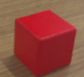

# 模板匹配
模板匹配是一种在图像中寻找特定模式的技术。它通过滑动一个模板图像（较小的图像）在输入图像上进行比较，找到最相似的区域。本章节提供了一个简单的模板匹配案例，并将其封装为一个自定义函数 performTemplateMatching，方便快速移植和使用。
## 1. 基本知识讲解
### 1.1 模板匹配的重要性
- 目标检测：模板匹配可以用于检测图像中的特定对象。
- 应用场景：广泛应用于物体识别、工业自动化、机器人导航等领域。
- 局限性：模板匹配对旋转、缩放和光照变化较为敏感，因此通常需要结合其他技术来提高鲁棒性。
### 1.2 模板匹配的流程
- 获取输入图像和模板图像。
- 使用模板匹配算法（如归一化互相关 NCC）计算相似度。
- 找到匹配结果中的最大值及其位置。
- 根据相似度阈值判断匹配是否成功。
- 绘制矩形框标记匹配区域并显示结果。

---

## 2. API 文档
### 2.1 头文件
```c++
#include <opencv2/opencv.hpp>
```
### 2.2 在输入图像中搜索模板图像的位置
```c++
void matchTemplate(InputArray image, InputArray templ, OutputArray result, int method);
```
- 参数：
  - image：待搜索的图像。
  - templ：模板图像。
  - result：搜索结果。
  - method：搜索方法，可以是 TM_SQDIFF、TM_SQDIFF_NORMED、TM_CCORR、TM_CCORR_NORMED、TM_CCOEFF、TM_CCOEFF_NORMED 之一。
- 返回值：
  - 无
### 2.3 获取匹配结果中的最大值及其位置
```c++
void minMaxLoc(InputArray src, double *minVal, double *maxVal, Point *minLoc, Point *maxLoc, InputArray mask = noArray());
```
- 参数：
  - src：输入矩阵。
  - minVal：最小值。
  - maxVal：最大值。
  - minLoc：最小值位置。
  - maxLoc：最大值位置。
  - mask：可选的掩码矩阵，用于指定要搜索的像素范围。
- 返回值：
  - 无

---

## 3. 综合代码解析

### 3.1 流程图


### 3.2 代码解释
- 模板匹配函数应用 
```c++
double similarityThreshold = 0.7; // 相似度阈值
bool useGrayscale = false;       // 是否使用灰度处理
bool matchSuccess = performTemplateMatching(img, templ, similarityThreshold, img, useGrayscale);
```
模板匹配函数具体参数定义如下所示。
```c++
bool performTemplateMatching(const Mat &inputImage, const Mat &templateImage, double threshold, Mat &outputImage,bool isGrayscale = false);
```
- 参数：
  - inputImage：输入图像。
  - templateImage：模板图像。
  - threshold：相似度阈值。
  - outputImage：输出图像。
  - isGrayscale：是否进行灰度处理。
- 返回值：
  - true：匹配成功。
  - false：匹配失败。

- 输出结果
```c++
edit.Print(img);
```
### 3.3 代码实现
```c++
#include <lockzhiner_vision_module/edit/edit.h>
#include <opencv2/opencv.hpp>
#include <iostream>

using namespace cv;
using namespace std;

// 模板匹配函数
bool performTemplateMatching(const Mat &inputImage, const Mat &templateImage, double threshold, Mat &outputImage, bool isGrayscale = false)
{
    // 确保模板图像比输入图像小
    if (templateImage.rows > inputImage.rows || templateImage.cols > inputImage.cols)
    {
        cout << "模板图像不能大于输入图像！" << endl;
        return false;
    }

    // 创建用于匹配的图像副本
    Mat templ = templateImage.clone();
    Mat img = inputImage.clone();

    // 如果选择灰度处理，则将输入图像和模板图像转换为灰度
    if (isGrayscale)
    {
        if (img.channels() == 3)
        {
            cvtColor(img, img, COLOR_BGR2GRAY);
        }
        if (templ.channels() == 3)
        {
            cvtColor(templ, templ, COLOR_BGR2GRAY);
        }
    }

    // 打印调试信息
    cout << "输入图像尺寸: " << img.size() << ", 通道数: " << img.channels() << endl;
    cout << "模板图像尺寸: " << templ.size() << ", 通道数: " << templ.channels() << endl;

    // 创建结果矩阵，用于存储匹配结果
    int resultRows = img.rows - templ.rows + 1;
    int resultCols = img.cols - templ.cols + 1;
    if (resultRows <= 0 || resultCols <= 0)
    {
        cout << "结果矩阵尺寸无效！请检查输入图像和模板图像的尺寸。" << endl;
        return false;
    }
    Mat result(resultRows, resultCols, CV_32FC1);

    // 使用归一化互相关（NCC）方法进行模板匹配
    double start = static_cast<double>(getTickCount());
    matchTemplate(img, templ, result, TM_CCOEFF_NORMED);
    double end = static_cast<double>(getTickCount());
    double elapsedTime = (end - start) / getTickFrequency();
    cout << "matchTemplate 运行时间: " << elapsedTime << " 秒" << endl;

    // 找到匹配结果中的最大值及其位置
    double minVal, maxVal;
    Point minLoc, maxLoc;
    minMaxLoc(result, &minVal, &maxVal, &minLoc, &maxLoc);

    // 输出相似度阈值判断
    if (maxVal >= threshold)
    {
        cout << "匹配成功！最大相似度: " << maxVal << endl;

        // 绘制矩形框标记匹配区域
        rectangle(outputImage, maxLoc, Point(maxLoc.x + templ.cols, maxLoc.y + templ.rows), Scalar(0, 255, 0), 2);
        return true;
    }
    else
    {
        cout << "匹配失败！最大相似度: " << maxVal << endl;
        return false;
    }
}

int main(int argc, char **argv)
{
    // 检查命令行参数数量是否正确
    if (argc != 2)
    {
        cout << "用法: " << argv[0] << " <模板图像路径>" << endl;
        return -1;
    }

    // 声明并初始化变量
    string templateImagePath = argv[1]; // 模板图像路径

    lockzhiner_vision_module::edit::Edit edit;
    if (!edit.StartAndAcceptConnection())
    {
        std::cerr << "Error: Failed to start and accept connection." << std::endl;
        return EXIT_FAILURE;
    }
    std::cout << "Device connected successfully." << std::endl;

    // 初始化摄像头
    cv::VideoCapture cap;
    int width = 320;  // 设置摄像头分辨率宽度
    int height = 240; // 设置摄像头分辨率高度
    cap.set(cv::CAP_PROP_FRAME_WIDTH, width);
    cap.set(cv::CAP_PROP_FRAME_HEIGHT, height);

    // 打开摄像头设备
    cap.open(0); // 参数 0 表示默认摄像头设备
    if (!cap.isOpened())
    {
        std::cerr << "Error: Could not open camera." << std::endl;
        return EXIT_FAILURE;
    }

    // 加载模板图像
    Mat templ = imread(templateImagePath, IMREAD_COLOR); // 默认加载彩色模板
    if (templ.empty())
    {
        std::cerr << "Error: Could not load template image." << std::endl;
        return EXIT_FAILURE;
    }

    while (true)
    {
        // 读取输入图像
        cv::Mat img;
        cap >> img;
        if (img.empty())
        {
            std::cerr << "Error: Captured frame is empty." << std::endl;
            break;
        }

        // 调用模板匹配函数
        double similarityThreshold = 0.7; // 相似度阈值
        bool useGrayscale = false;        // 是否使用灰度处理
        bool matchSuccess = performTemplateMatching(img, templ, similarityThreshold, img, useGrayscale);

        // 显示结果
        imshow("Template Matching Result", img);
        if (waitKey(1) == 27)
        { // 按 ESC 键退出
            break;
        }

        // 输出图像
        edit.Print(img);
    }

    return 0;
}
```

---

## 4. 编译过程
### 4.1 编译环境搭建
- 请确保你已经按照 [开发环境搭建指南](../../../../docs/introductory_tutorial/cpp_development_environment.md) 正确配置了开发环境。
- 同时以正确连接开发板。
### 4.2 Cmake介绍
```cmake
# CMake最低版本要求  
cmake_minimum_required(VERSION 3.10)  

project(test-TemplateMatching)

set(CMAKE_CXX_STANDARD 17)
set(CMAKE_CXX_STANDARD_REQUIRED ON)

# 定义项目根目录路径
set(PROJECT_ROOT_PATH "${CMAKE_CURRENT_SOURCE_DIR}/../..")
message("PROJECT_ROOT_PATH = " ${PROJECT_ROOT_PATH})

include("${PROJECT_ROOT_PATH}/toolchains/arm-rockchip830-linux-uclibcgnueabihf.toolchain.cmake")

# 定义 OpenCV SDK 路径
set(OpenCV_ROOT_PATH "${PROJECT_ROOT_PATH}/third_party/opencv-mobile-4.10.0-lockzhiner-vision-module")
set(OpenCV_DIR "${OpenCV_ROOT_PATH}/lib/cmake/opencv4")
find_package(OpenCV REQUIRED)
set(OPENCV_LIBRARIES "${OpenCV_LIBS}")
# 定义 LockzhinerVisionModule SDK 路径
set(LockzhinerVisionModule_ROOT_PATH "${PROJECT_ROOT_PATH}/third_party/lockzhiner_vision_module_sdk")
set(LockzhinerVisionModule_DIR "${LockzhinerVisionModule_ROOT_PATH}/lib/cmake/lockzhiner_vision_module")
find_package(LockzhinerVisionModule REQUIRED)

# 基本图像处理示例
add_executable(Test-TemplateMatching TemplateMatching.cc)
target_include_directories(Test-TemplateMatching PRIVATE ${LOCKZHINER_VISION_MODULE_INCLUDE_DIRS})
target_link_libraries(Test-TemplateMatching PRIVATE ${OPENCV_LIBRARIES} ${LOCKZHINER_VISION_MODULE_LIBRARIES})

install(
    TARGETS Test-TemplateMatching
    RUNTIME DESTINATION .  
)
```
### 4.3 编译项目
使用 Docker Destop 打开 LockzhinerVisionModule 容器并执行以下命令来编译项目
```bash
# 进入Demo所在目录
cd /LockzhinerVisionModuleWorkSpace/LockzhinerVisionModule/Cpp_example/A01_capture
# 创建编译目录
rm -rf build && mkdir build && cd build
# 配置交叉编译工具链
export TOOLCHAIN_ROOT_PATH="/LockzhinerVisionModuleWorkSpace/arm-rockchip830-linux-uclibcgnueabihf"
# 使用cmake配置项目
cmake ..
# 执行编译项目
make -j8 && make install
```

在执行完上述命令后，会在build目录下生成可执行文件。

---

## 5. 例程运行示例
### 5.1 准备工作
- 下载凌智视觉模块图片传输助手：[点击下载](https://gitee.com/LockzhinerAI/LockzhinerVisionModule/releases/download/v0.0.0/LockzhinerVisionModuleImageFetcher.exe)
- 我们首先需要进行图像采集，采集一个480*320分辨率下的模板照片。
### 5.2 运行过程
在凌智视觉模块中输入以下命令：
```shell
chmod 777 Test-TemplateMatching template_0.png
./Test-TemplateMatching 
```
### 5.3 运行结果
- 运行结果如下：


- 模板照片为



---

## 6. 总结
通过上述内容，我们详细介绍了模板匹配的流程及相关 API 的使用方法，包括：
- 图像读取：加载输入图像和模板图像。
- 模板匹配：使用归一化互相关方法计算相似度。
- 查找极值：获取最佳匹配位置。
- 绘制与显示：标记匹配区域并显示结果。
希望这份文档能帮助您更好地理解和实现模板匹配功能！
注意事项：
- 在本次例程中摄像头需要运行在480*320分辨率下，否则会出现帧率过低的情况。如需更高帧率，可酌情再降低分辨率。

