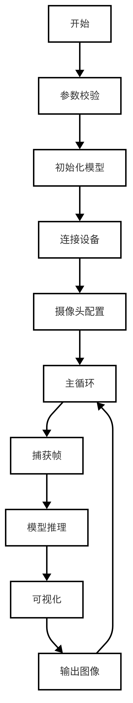
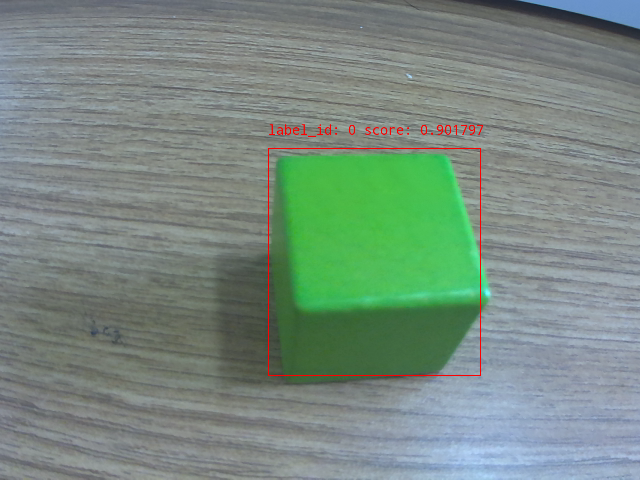

# 目标检测
本文档展示了如何使用 lockzhiner_vision_module::vision::PaddleDet 类进行目标检测，并通过 
lockzhiner_vision_module::vision::Visualize 函数将检测结果可视化。

---

## 1. 基础知识讲解
### 1.1 目标检测的基本介绍
目标检测是计算机视觉领域中的一个关键任务，它不仅需要识别图像中存在哪些对象，还需要定位这些对象的位置。具体来说，目标检测算法会输出每个检测到的对象的边界框（Bounding Box）以及其所属类别的概率或置信度得分。
- 应用场景：目标检测技术广泛应用于多个领域，包括但不限于安全监控、自动驾驶汽车、智能零售和医疗影像分析。
### 1.2 PaddleDetection 的基本介绍
PaddleDetection 是基于百度飞桨深度学习框架开发的一个高效的目标检测库，支持多种先进的目标检测模型，如 YOLO 系列、SSD、Faster R-CNN、Mask R-CNN 等。它提供了简单易用的接口，使得开发者能够快速部署高性能的目标检测应用。
- 特点：
  - 高性能：优化了推理速度，在保持高精度的同时实现了快速响应。
  - 灵活性：支持多种预训练模型，可以根据具体需求选择合适的模型架构。
  - 易于集成：提供 C++ API，便于嵌入式系统或桌面应用程序中使用。
  - 丰富的模型库：涵盖单阶段（One-stage）和双阶段（Two-stage）检测模型，满足不同场景的需求。
- 适用场景：适用于需要对视频流或图像进行实时分析的应用场景，例如安防监控、智能交通系统、工业自动化等。

---

## 2. API 文档
### 2.1 PaddleDetection 类
#### 2.1.1 头文件
```cpp
#include <lockzhiner_vision_module/vision/deep_learning/detection/paddle_det.h>
```
#### 2.1.2 构造函数
```cpp
lockzhiner_vision_module::vision::PaddleDetection();
```
- 作用：
  - 创建一个 PaddleDetection 对象，并初始化相关成员变量。
- 参数：
  - 无
- 返回值：
  - 无
#### 2.1.3 Initialize函数
```cpp
bool Initialize(const std::string& model_path);
```
- 作用：
  - 加载预训练的 PaddleDetection 模型。
- 参数：
  - model_path：模型路径，包含模型文件和参数文件。
- 返回值：
  - true：模型加载成功。
  - false：模型加载失败。
#### 2.1.4 SetThreshold函数
```cpp
void SetThreshold(float score_threshold = 0.5, float nms_threshold = 0.3);
```
- 作用：
  - 设置目标检测的置信度阈值和NMS阈值。
- 参数：
  - score_threshold：置信度阈值，默认值为0.5。
  - nms_threshold：NMS阈值，默认值为0.3。
- 返回值：
  - 无
#### 2.1.5 Predict函数
```cpp
std::vector<lockzhiner_vision_module::vision::DetectionResult> Predict(const cv::Mat& image);
```
- 作用：
  - 使用加载的模型对输入图像进行目标检测，返回检测结果。
- 参数：
  - input_mat (const cv::Mat&): 输入的图像数据，通常是一个 cv::Mat 变量。
- 返回值：
  - 返回一个包含多个 DetectionResult 对象的向量，每个对象表示一个检测结果。
### 2.2 DetectionResult 类
#### 2.2.1 头文件
```cpp
#include <lockzhiner_vision_module/vision/utils/visualize.h>
```
#### 2.2.2 box函数
```cpp
lockzhiner_vision_module::vision::Rect box() const;
```
- 作用：
  - 获取目标检测结果的边界框。
- 参数：
  - 无
- 返回值：
  - 返回一个 lockzhiner_vision_module::vision::Rect 对象，表示目标检测结果的边界框。
#### 2.2.3 score函数
```cpp
float score() const;
```
- 作用：
  - 获取目标检测结果的置信度得分。
- 参数：
  - 无
- 返回值：
  - 返回一个 float 类型的置信度得分。
#### 2.2.4 label_id函数
- 作用：
  - 获取目标检测结果的标签ID。
- 参数：
  - 无
- 返回值：
  - 返回一个整数，表示目标检测结果的标签ID。
### 2.3 Visualize 函数
### 2.3.1 头文件
```cpp
#include <lockzhiner_vision_module/vision/utils/visualize.h>
```
### 2.3.2 函数定义
```cpp
void lockzhiner_vision_module::vision::Visualize(
    const cv::Mat& input_mat,
    cv::Mat& output_image,
    const std::vector<lockzhiner_vision_module::vision::DetectionResult>& results,
    const std::vector<std::string>& labels = {},
    float font_scale = 0.4
);
```
- 作用：
  - 将目标检测结果可视化到输入图像上，并返回可视化后的图像。
- 参数：
  - input_mat (const cv::Mat&): 输入图像。
  - output_image (cv::Mat&): 输出图像，包含标注后的结果。
  - results (const std::vector<lockzhiner_vision_module::vision::DetectionResult>&): 检测结果列表。
  - labels (const std::vector<std::string>&): 可选的标签列表，用于标注类别名称，默认为空。
  - font_scale (float): 字体大小比例，默认为 0.4。
- 返回值：
  - 无

---

## 3. 示例代码解析

### 3.1 流程图



### 3.2 核心代码解析
- 初始化模型
```cpp
lockzhiner_vision_module::vision::PaddleDet model;
if (!model.Initialize(argv[1])) {
    std::cout << "Failed to initialize model." << std::endl;
    return 1;
}
```
- 模型推理
```cpp
auto results = model.Predict(input_mat);
```
- 可视化推理结果
```cpp
cv::Mat output_image;
lockzhiner_vision_module::vision::Visualize(input_mat, output_image, results);

edit.Print(output_image);
```
### 3.3 完整代码实现
```cpp
#include <lockzhiner_vision_module/vision/deep_learning/detection/paddle_det.h>
#include <lockzhiner_vision_module/vision/utils/visualize.h>
#include <lockzhiner_vision_module/edit/edit.h>
#include <chrono>
#include <iostream>
#include <opencv2/opencv.hpp>

using namespace std::chrono;

int main(int argc, char* argv[]) {
    if (argc != 2) {
        std::cerr << "Usage: Test-PaddleDet model_path" << std::endl;
        return 1;
    }

    // 初始化模型
    lockzhiner_vision_module::vision::PaddleDet model;
    if (!model.Initialize(argv[1])) {
        std::cout << "Failed to initialize model." << std::endl;
        return 1;
    }
    lockzhiner_vision_module::edit::Edit edit;
  if (!edit.StartAndAcceptConnection()) {
    std::cerr << "Error: Failed to start and accept connection." << std::endl;
    return EXIT_FAILURE;
  }
  std::cout << "Device connected successfully." << std::endl;
    // 打开摄像头
    cv::VideoCapture cap;
    cap.set(cv::CAP_PROP_FRAME_WIDTH, 640);
    cap.set(cv::CAP_PROP_FRAME_HEIGHT, 480);
    cap.open(0);

    if (!cap.isOpened()) {
        std::cerr << "Error: Could not open camera." << std::endl;
        return 1;
    }

    cv::Mat input_mat;
    while (true) {
        // 捕获一帧图像
        cap >> input_mat;
        if (input_mat.empty()) {
            std::cerr << "Warning: Captured an empty frame." << std::endl;
            continue;
        }

        // 调用模型进行预测
        high_resolution_clock::time_point start_time = high_resolution_clock::now();
        auto results = model.Predict(input_mat);
        high_resolution_clock::time_point end_time = high_resolution_clock::now();

        // 计算推理时间
        auto time_span = duration_cast<milliseconds>(end_time - start_time);
        std::cout << "Inference time: " << time_span.count() << " ms" << std::endl;

        // 可视化结果
        cv::Mat output_image;
        lockzhiner_vision_module::vision::Visualize(input_mat, output_image, results);

        edit.Print(output_image);
    }

    cap.release();
    return 0;
}
```

---

## 4. 编译过程
### 4.1 编译环境搭建
- 请确保你已经按照 [开发环境搭建指南](../../../../docs/introductory_tutorial/cpp_development_environment.md) 正确配置了开发环境。
- 同时以正确连接开发板。
### 4.2 Cmake介绍
```cmake
cmake_minimum_required(VERSION 3.10)

project(D01_test_detection)

set(CMAKE_CXX_STANDARD 17)
set(CMAKE_CXX_STANDARD_REQUIRED ON)

# 定义项目根目录路径
set(PROJECT_ROOT_PATH "${CMAKE_CURRENT_SOURCE_DIR}/../..")
message("PROJECT_ROOT_PATH = " ${PROJECT_ROOT_PATH})

include("${PROJECT_ROOT_PATH}/toolchains/arm-rockchip830-linux-uclibcgnueabihf.toolchain.cmake")

# 定义 OpenCV SDK 路径
set(OpenCV_ROOT_PATH "${PROJECT_ROOT_PATH}/third_party/opencv-mobile-4.10.0-lockzhiner-vision-module")
set(OpenCV_DIR "${OpenCV_ROOT_PATH}/lib/cmake/opencv4")
find_package(OpenCV REQUIRED)
set(OPENCV_LIBRARIES "${OpenCV_LIBS}")

# 定义 LockzhinerVisionModule SDK 路径
set(LockzhinerVisionModule_ROOT_PATH "${PROJECT_ROOT_PATH}/third_party/lockzhiner_vision_module_sdk")
set(LockzhinerVisionModule_DIR "${LockzhinerVisionModule_ROOT_PATH}/lib/cmake/lockzhiner_vision_module")
find_package(LockzhinerVisionModule REQUIRED)

add_executable(Test-detection test_detection.cc)
target_include_directories(Test-detection PRIVATE ${LOCKZHINER_VISION_MODULE_INCLUDE_DIRS})
target_link_libraries(Test-detection PRIVATE ${OPENCV_LIBRARIES} ${LOCKZHINER_VISION_MODULE_LIBRARIES})

install(
    TARGETS Test-detection
    RUNTIME DESTINATION .  
)
```
### 4.3 编译项目
使用 Docker Destop 打开 LockzhinerVisionModule 容器并执行以下命令来编译项目
```bash
# 进入Demo所在目录
cd /LockzhinerVisionModuleWorkSpace/LockzhinerVisionModule/Cpp_example/D01_test_detection
# 创建编译目录
rm -rf build && mkdir build && cd build
# 配置交叉编译工具链
export TOOLCHAIN_ROOT_PATH="/LockzhinerVisionModuleWorkSpace/arm-rockchip830-linux-uclibcgnueabihf"
# 使用cmake配置项目
cmake ..
# 执行编译项目
make -j8 && make install
```

在执行完上述命令后，会在build目录下生成可执行文件。

---

## 5. 例程运行示例
### 5.1 运行
```shell
chmod 777 Test-detection
# 在实际应用的过程中LZ-Picodet需要替换为下载的或者你的rknn模型
./Test-detection LZ-Picodet
```
### 5.2 结果展示
- 可以看到我们正确识别了绿色的方块，同时打印了标签和置信度。


---

## 6. 总结
本文档详细介绍了目标检测的基础知识及 PaddleDetection 的基本概念，并提供了详细的API文档说明，帮助开发者理解和实现目标检测与可视化功能。通过上述流程，可以构建高效的实时目标检测系统，满足多种应用场景的需求。