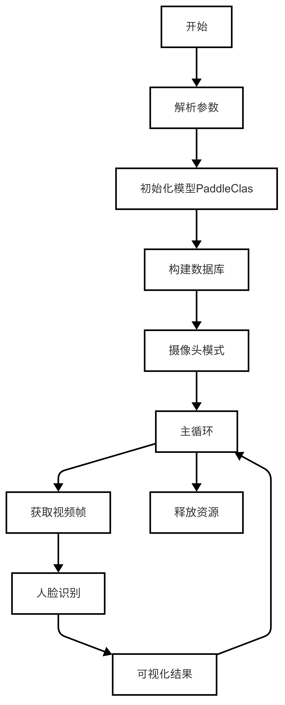
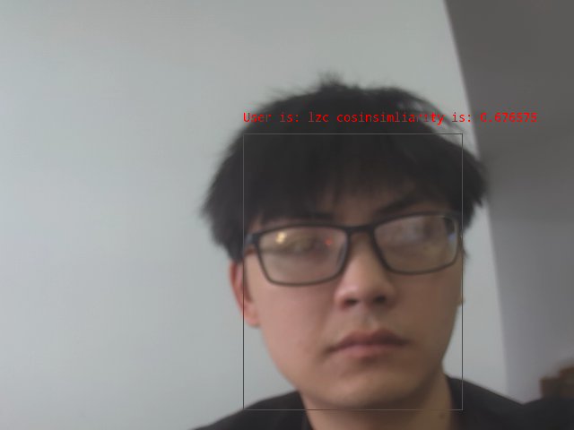

# 人脸识别系统
本章节基于 Lockzhiner Vision Module 的 LZ-Picodet 模型训练的人脸检测模型 LZ-Face，以及ArcFace人脸识别模型,实现了一个人脸识别系统。
## 1. 基本知识讲解
### 1.1 人脸识别简介
人脸识别是一种利用人的脸部特征进行身份识别的生物识别技术。它通过检测图像或视频中的人脸，提取如眼睛、鼻子和嘴巴等关键特征点，并将这些信息转化为面部特征向量，进而与已知人脸数据库中的数据比对来确认个人身份。被广泛应用于安全监控、门禁系统、移动设备解锁及社交媒体等领域。
### 1.2 人脸识别常用方法
人脸识别主要涉及到以下几个关键步骤：人脸检测、特征提取和匹配识别。以下是实现人脸识别的常用方法：
- 深度学习方法：现代的人脸识别系统大多采用深度学习方法，并结合大规模人脸数据库和高性能计算资源，实现了非常高的识别精度。
- 基于模板匹配的方法：通过将待识别人脸与预定义的标准人脸模板进行比较来实现识别。

---

## 2. C++ API 文档
### 2.1 FaceRecognitionSystem类
#### 2.1.1 头文件
```c++
#include <lockzhiner_vision_module/vision/deep_learning/face/face_recognition_system/face_recognition_system.h>
```
- 作用：用于声明FaceRecognitionSystem类，使得FaceRecognitionSystem类可以在当前文件中使用。

#### 2.1.2 构造类函数
```c++
lockzhiner_vision_module::vision::FaceRecognitionSystem face_system;
```
- 作用：用于实现人脸识别。
- 参数说明：
    - 无
- 返回值：
    - 无

#### 2.1.3 Predict函数
```c++
auto result = face_system.Predict(input_mat);
```
- 作用：FaceRecognitionSystem类中的一个函数，用于实现人脸识别。
- 参数说明：
    - input_mat：要识别的图像。
- 返回值：
    - 返回一个包含人脸识别结果的对象。该对象包含人脸的id，置信度和人脸的位置信息。

### 2.2 Visualize函数
#### 2.2.1 头文件
```c++
#include <lockzhiner_vision_module/vision/utils/visualize.h>
```
- 作用：用于声明Visualize函数，使得Visualize函数可以在当前源文件中使用。

#### 2.2.2 结果可视化
```c++
lockzhiner_vision_module::vision::Visualize(input_mat, output_image, result);
```
- 参数说明：
    - input_mat：原始输入图像。
    - output_image：用于存储带有可视化结果的输出图像。
    - result：输入参数，表示人脸识别的结果。该result对象包含人脸的id，置信度和人脸的位置信息。
- 返回值：
    - 无

---

## 3. 综合代码解析
### 3.1 流程图



### 3.2 核心代码解析
- 初始化人脸识别模型
```cpp
lockzhiner_vision_module::vision::FaceRecognitionSystem face_system;
```
- 构建人脸数据库
```cpp
if (!face_system.BuildDatabase(argv[3], argv[4])) {
  std::cout << "Failed to build database." << std::endl;
  return 1;
}
```
- 调用摄像头捕获图像
```c++
cv::VideoCapture cap;
// 设置摄像头获取帧的宽高
cap.set(cv::CAP_PROP_FRAME_WIDTH, 640);
cap.set(cv::CAP_PROP_FRAME_HEIGHT, 480);
cap.open(0);

// wihile循环中的以下代码用于捕获图像帧
cap >> input_mat;
if (input_mat.empty())
{
continue;
}
```
- 模型推理
```cpp
auto result = face_system.Predict(input_mat);
```

### 3.3 完整代码实现
```c++
#include <lockzhiner_vision_module/vision/deep_learning/face/face_recognition_system/face_recognition_system.h>
#include <lockzhiner_vision_module/vision/utils/visualize.h>
#include <lockzhiner_vision_module/edit/edit.h>
#include <chrono>
#include <cstdlib> 
#include <ctime>
#include <iostream>
#include <opencv2/opencv.hpp>

using namespace std::chrono;

lockzhiner_vision_module::vision::FaceRecognitionSystem face_system;

int main(int argc, char *argv[])
{
  if (argc != 5)
  {
    std::cerr << "Usage: Test-Face-Recognition-System det_model_path "
                 "rec_model_path database_root crop_root"
              << std::endl;
    return 1;
  }

  if (!face_system.Initialize(argv[1], argv[2]))
  {
    std::cout << "Failed to initialize face system." << std::endl;
    return 1;
  }

  if (!face_system.BuildDatabase(argv[3], argv[4]))
  {
    std::cout << "Failed to build database." << std::endl;
    return 1;
  }
  // 初始化 edit 模块
  lockzhiner_vision_module::edit::Edit edit;
  if (!edit.StartAndAcceptConnection())
  {
    std::cerr << "Error: Failed to start and accept connection." << std::endl;
    return EXIT_FAILURE;
  }
  std::cout << "Device connected successfully." << std::endl;

  cv::VideoCapture cap; 
  // 设置摄像头捕获帧的宽高
  cap.set(cv::CAP_PROP_FRAME_WIDTH, 640);
  cap.set(cv::CAP_PROP_FRAME_HEIGHT, 480);
  cap.open(0);

  if (!cap.isOpened())
  {
    std::cerr << "Error: Could not open camera." << std::endl;
    return EXIT_FAILURE;
  }

  cv::Mat input_mat;
  while (true)
  {
    int read_index = 0;
    int time_ms = 0;
    for (int i = 0; i < 30; i++)
    {
      // 获取当前时间点作为开始时间
      high_resolution_clock::time_point start_time =
          high_resolution_clock::now();
      cap >> input_mat;
      if (input_mat.empty())
      {
        continue;
      }
      // 使用 model 对象的 Predict 方法对输入图像进行预测
      auto result = face_system.Predict(input_mat);
      // 获取当前时间点作为结束时间
      high_resolution_clock::time_point end_time = high_resolution_clock::now();
      auto time_span = duration_cast<milliseconds>(end_time - start_time);
      time_ms += time_span.count();
      read_index += 1;

      cv::Mat output_image;
      lockzhiner_vision_module::vision::Visualize(input_mat, output_image,
                                                  result);
      // 使用 edit 模块处理帧
      edit.Print(output_image);
    }
    std::cout << "Frames per second: " << 1000.0 / time_ms * read_index
              << std::endl;
  }
  // 释放摄像头资源
  cap.release();
  return 0;
}
```

---

## 4. 编译调试
### 4.1 编译环境搭建
- 请确保你已经按照 [开发环境搭建指南](../../../../docs/introductory_tutorial/cpp_development_environment.md) 正确配置了开发环境。
- 同时已经正确连接开发板。
### 4.2 Cmake介绍
```cmake
cmake_minimum_required(VERSION 3.10)

project(D03_face_recognition_system)

set(CMAKE_CXX_STANDARD 17)
set(CMAKE_CXX_STANDARD_REQUIRED ON)

# 定义项目根目录路径
set(PROJECT_ROOT_PATH "${CMAKE_CURRENT_SOURCE_DIR}/../..")
message("PROJECT_ROOT_PATH = " ${PROJECT_ROOT_PATH})

include("${PROJECT_ROOT_PATH}/toolchains/arm-rockchip830-linux-uclibcgnueabihf.toolchain.cmake")

# 定义 OpenCV SDK 路径
set(OpenCV_ROOT_PATH "${PROJECT_ROOT_PATH}/third_party/opencv-mobile-4.10.0-lockzhiner-vision-module")
set(OpenCV_DIR "${OpenCV_ROOT_PATH}/lib/cmake/opencv4")
find_package(OpenCV REQUIRED)
set(OPENCV_LIBRARIES "${OpenCV_LIBS}")

# 定义 LockzhinerVisionModule SDK 路径
set(LockzhinerVisionModule_ROOT_PATH "${PROJECT_ROOT_PATH}/third_party/lockzhiner_vision_module_sdk")
set(LockzhinerVisionModule_DIR "${LockzhinerVisionModule_ROOT_PATH}/lib/cmake/lockzhiner_vision_module")
find_package(LockzhinerVisionModule REQUIRED)

add_executable(Test-face-recognition-system face_recognition_system.cc)
target_include_directories(Test-face-recognition-system PRIVATE ${LOCKZHINER_VISION_MODULE_INCLUDE_DIRS})
target_link_libraries(Test-face-recognition-system PRIVATE ${OPENCV_LIBRARIES} ${LOCKZHINER_VISION_MODULE_LIBRARIES})

install(
    TARGETS Test-face-recognition-system
    RUNTIME DESTINATION .  
)
```
### 4.3 编译项目
使用 Docker Destop 打开 LockzhinerVisionModule 容器并执行以下命令来编译项目
```bash
# 进入Demo所在目录
cd /LockzhinerVisionModuleWorkSpace/LockzhinerVisionModule/Cpp_example/D03_face_recognition_system
# 创建编译目录
rm -rf build && mkdir build && cd build
# 配置交叉编译工具链
export TOOLCHAIN_ROOT_PATH="/LockzhinerVisionModuleWorkSpace/arm-rockchip830-linux-uclibcgnueabihf"
# 使用cmake配置项目
cmake ..
# 执行编译项目
make -j8 && make install
```

在执行完上述命令后，会在build目录下生成可执行文件。

---

## 5. 例程运行示例
### 5.1 运行前准备
- 请确保你已经下载了 [凌智视觉模块人脸检测模型](https://gitee.com/LockzhinerAI/LockzhinerVisionModule/releases/download/v0.0.3/LZ-Face.rknn)
- 请确保你已经下载了 [凌智视觉模块人脸识别模型](https://gitee.com/LockzhinerAI/LockzhinerVisionModule/releases/download/v0.0.0/LZ-ArcFace.rknn)
### 5.2 运行过程
在凌智视觉模块输入以下命令：
```shell
chmod 777 Test-face-recognition-system
./Test-face-recognition-system LZ-Face LZ-ArcFace BaseDataset CropDataset
```
### 5.3 运行效果

### 5.4 注意事项
上面提到的BaseDataset和CropDataset需要提前创建。BaseDataset用于存储已有的人脸图像，同一个人的人脸图像保存在BaseDataset的一个子文件夹下。CropDataset文件夹创建时为空，用于保存裁剪后的人脸图像，目录结构和BaseDataset相同。

---

## 6. 总结
通过上述内容，我们成功实现了一个高效的人脸识别系统，包括：

- 获取并加载包含人脸的图像。
- 进行人脸检测和识别。
- 可视化人脸识别结果。