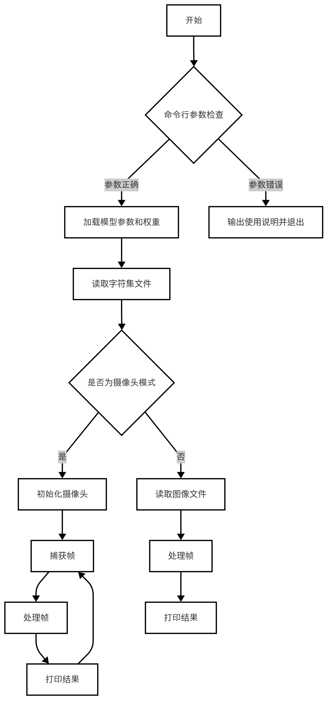
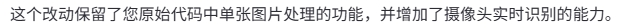
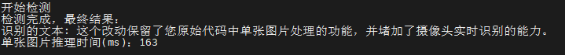

# OCR 文字识别
本章节在 Lockzhiner Vision Module 上基于OcrLiteNcnn模型, 实现了一个OCR文字识别系统。
## 1. 基本知识讲解
### 1.1 文字识别简介
OCR（光学字符识别）是指通过电子设备读取并转换纸质文档或图像中的文字为可编辑和处理的数字文本的技术。它涉及图像预处理、字符分割、特征提取、字符识别及后处理等步骤，以实现高准确度的文字转换。OCR技术极大提升了信息数字化的效率，广泛应用于数字化图书馆、自动化数据录入、车牌识别系统及辅助阅读工具等领域，是现代办公与生活中不可或缺的一部分。
### 1.2 文字识别常用方法
- 模板匹配：通过与预定义字符模板比较来识别字符，适用于固定字体和字号。
- 特征提取：从字符中提取关键特征（如线条、端点）并使用分类器识别，适应字体变化。
- 神经网络：利用卷积神经网络自动学习字符特征，特别适合复杂背景和多变字体，提供高准确率。
这些方法各有优势，选择取决于具体应用需求和文档特性。随着技术发展，基于神经网络的方法因其高性能而得到广泛应用。

---

## 2. C++ API 文档
### 2.1 Net类
#### 2.1.1 头文件
```cpp
#include <ncnn/net.h>
```
- 作用：用于声明Net类，使得Net类可以在当前文件中使用。

#### 2.1.2 构造类函数
```cpp
ncnn::Net net;
```
- 作用：创建一个Net类型的对象实例，用于实现文字识别。
- 参数说明：
    - 无
- 返回值：
    - 无

#### 2.1.3 load_param函数
```cpp
int load_param(const DataReader& dr);
```
- 参数说明：
    - dr：传入的参数文件路径。
- 返回值：
    - 返回值为0表示加载参数文件成功。

#### 2.1.4 load_model函数
```cpp
int load_model(const DataReader& dr);
```
- 参数说明：
    - dr：传入的模型文件路径。
- 返回值：返回值为0表示加载模型成功。

#### 2.1.5 from_pixels函数
```cpp
ncnn::Mat::from_pixels(srcResize.data, ncnn::Mat::PIXEL_BGR, srcResize.cols, srcResize.rows);
```
- 参数说明：
    - srcResize.data：输入图像的像素数据指针。
    - ncnn::Mat::PIXEL_BGR：输入像素数据的颜色格式。
    - srcResize.cols：输入图像的宽度。
    - srcResize.rows：输入图像的高度。
- 返回值：适配成 NCNN 所需的格式的包含图像数据的新对象。

### 2.2 Extractor类
#### 2.2.1 头文件
```cpp
#include <ncnn/net.h>
```
- 作用：用于声明Extractor类，使得Extractor类可以在当前文件中使用。

#### 2.2.2 构造类函数
```cpp
ncnn::Extractor extractor = net.create_extractor();
```
- 作用：从已经加载了神经网络模型的 net 中创建一个 Extractor 实例，用于执行文字识别的推理任务。
- 参数说明：
    - 无
- 返回值：
    - 无
    
---

## 3. OCR 字符识别代码解析
### 3.1 流程图



### 3.2 核心代码解析
- 加载模型参数和权重
```cpp
net.load_param(argv[2]);
net.load_model(argv[3]);
```
- 读取字符集文件
```cpp
std::ifstream in(argv[4]);
std::string line;
if (in) {
while (getline(in, line)) {  // line中不包括每行的换行符
    keys.push_back(line);
}
} else {
printf("The keys.txt file was not found\n");
return false;
}
if (keys.size() != 5531) {
fprintf(stderr, "missing keys\n");
return false;
}
```
- 对输入图像进行识别
```cpp
for (int i = 0; i < out.h; i++) {
    int maxIndex = 0;
    float maxValue = -1000.f;

    // Softmax 计算
    std::vector<float> exps(out.w);
    for (int j = 0; j < out.w; j++) {
      float expSingle = exp(outputData[i * out.w + j]);
      exps.at(j) = expSingle;
    }
    float partition = accumulate(exps.begin(), exps.end(), 0.0);  // 行总和

    // 找到最大值及其索引
    auto maxElementIt = std::max_element(exps.begin(), exps.end());
    maxIndex = std::distance(exps.begin(), maxElementIt);
    maxValue = *maxElementIt / partition;

    // 检测到有效字符
    if (maxIndex > 0 && maxIndex < keySize &&
        (!(i > 0 && maxIndex == lastIndex))) {
      scores.emplace_back(maxValue);
      strRes.append(keys[maxIndex - 1]);  // 将字符追加到结果字符串中
    }

    lastIndex = maxIndex;
  }
```
自定义函数说明
- OCR 文字识别
```cpp
void processFrame(Mat &src, ncnn::Net &net, const std::vector<std::string> &keys, const float meanValues[], const float normValues[], const int dstHeight)
```
- 作用：
    - 执行图像预处理，模型推理，Softmax解码，字符拼接全流程。
- 参数说明：
    - src：待识别的文本区域图像。
    - ocr_net：OCR识别模型。
    - keys：字符表（字符到索引映射）。
    - ocr_mean：图像归一化均值。
    - ocr_norm：图像归一化标准差。
    - dstHeight：目标高度。
- 返回值:
    - 无

### 3.3 完整代码实现
```cpp
#include <unistd.h> 
#include <iostream>
#include <opencv2/core/core.hpp>
#include <opencv2/highgui/highgui.hpp>
#include <opencv2/imgproc/imgproc.hpp>
#include <ncnn/net.h>
#include <fstream>
#include <numeric>

#include <chrono>
#include <cstdlib> 
#include <ctime> 
#include <opencv2/opencv.hpp>

#include <lockzhiner_vision_module/edit/edit.h>


using namespace cv;
using namespace std::chrono;
template <class ForwardIterator>
inline static size_t argmax(ForwardIterator first, ForwardIterator last) {
  return std::distance(first, std::max_element(first, last));
}

// 后续处理函数
void processFrame(Mat &src, ncnn::Net &net, const std::vector<std::string> &keys, const float meanValues[], const float normValues[], const int dstHeight) {
  float scale = (float)dstHeight / (float)src.rows;
  int dstWidth = int((float)src.cols * scale);
  std::cout << "resize" << std::endl;
  cv::Mat srcResize;
  resize(src, srcResize, cv::Size(dstWidth, dstHeight));
  std::cout << "resize success" << std::endl;
  ncnn::Mat input = ncnn::Mat::from_pixels(srcResize.data, ncnn::Mat::PIXEL_RGB,
                                          srcResize.cols, srcResize.rows);
  std::cout << "input success" << std::endl;
  input.substract_mean_normalize(meanValues, normValues);

  ncnn::Extractor extractor = net.create_extractor();
  // net.num_threads  = 6;
  extractor.input("input", input);
  std::cout << "extract success" << std::endl;
  ncnn::Mat out;
  extractor.extract("out", out);

  float *floatArray = (float *)out.data;
  std::vector<float> outputData(floatArray, floatArray + out.h * out.w);

  int keySize = keys.size();
  std::string strRes;
  std::vector<float> scores;
  int lastIndex = 0;
  int maxIndex;
  float maxValue;
  std::cout << "开始检测" << std::endl;
  high_resolution_clock::time_point start_time =
          high_resolution_clock::now();
  for (int i = 0; i < out.h; i++) {
    int maxIndex = 0;
    float maxValue = -1000.f;

    // Softmax 计算
    std::vector<float> exps(out.w);
    for (int j = 0; j < out.w; j++) {
      float expSingle = exp(outputData[i * out.w + j]);
      exps.at(j) = expSingle;
    }
    // 行总和
    float partition = accumulate(exps.begin(), exps.end(), 0.0);  

    // 找到最大值及其索引
    auto maxElementIt = std::max_element(exps.begin(), exps.end());
    maxIndex = std::distance(exps.begin(), maxElementIt);
    maxValue = *maxElementIt / partition;

    // 检测到有效字符
    if (maxIndex > 0 && maxIndex < keySize &&
        (!(i > 0 && maxIndex == lastIndex))) {
      scores.emplace_back(maxValue);
      // 将字符追加到结果字符串中
      strRes.append(keys[maxIndex - 1]);  
    }

    lastIndex = maxIndex;
  }
  high_resolution_clock::time_point end_time = high_resolution_clock::now();
  auto time_span = duration_cast<milliseconds>(end_time - start_time);
  // 所有检测完成后，一次性输出结果
  std::cout << "检测完成，最终结果：" << std::endl;
  std::cout << "识别的文本: " << strRes << std::endl;
  std::cout << "单张图片推理时间(ms): " << time_span.count() << std::endl;
  std::cout << std::endl;
  
} 

int main(int argc, char *argv[]) {
  if (argc != 5) {
    std::cerr
        << "Usage: ./ncnn_ocr <image_path> <param_path> <bin_path> <key_paths>"
        << std::endl;
  }
  const float meanValues[3] = {127.5, 127.5, 127.5};
  const float normValues[3] = {1.0 / 127.5, 1.0 / 127.5, 1.0 / 127.5};
  const int dstHeight = 32;
  ncnn::Net net;
  std::vector<std::string> keys;
  // Mat src = imread(argv[1]);  // default : BGR
  // Step 2: 加载 .param 和 .bin 文件
  net.load_param(argv[2]);
  net.load_model(argv[3]);
  std::cout << "load model success" << std::endl;
  std::ifstream in(argv[4]);
  std::string line;
  if (in) {
    // line中不包括每行的换行符
    while (getline(in, line)) {  
      keys.push_back(line);
    }
  } else {
    printf("The keys.txt file was not found\n");
    return false;
  }
  if (keys.size() != 5531) {
    fprintf(stderr, "missing keys\n");
    return false;
  }
  printf("total keys size(%lu)\n", keys.size());

  std::string argument(argv[1]);
  // Default: BGR
  Mat src = imread(argv[1]);  
  if (src.empty()) {
      std::cerr << "Error opening image file" << std::endl;
      return -1;
  }
  processFrame(src, net, keys, meanValues, normValues, dstHeight);
  return 0;
}
```

---

## 4. 编译调试
### 4.1 编译环境搭建
- 请确保你已经按照 [开发环境搭建指南](../../../../docs/introductory_tutorial/cpp_development_environment.md) 正确配置了开发环境。
- 同时已经正确连接开发板。
### 4.2 Cmake介绍
```cmake
cmake_minimum_required(VERSION 3.10)

project(test_distance)

set(CMAKE_CXX_STANDARD 17)
set(CMAKE_CXX_STANDARD_REQUIRED ON)

# 定义项目根目录路径
set(PROJECT_ROOT_PATH "${CMAKE_CURRENT_SOURCE_DIR}/../..")
message("PROJECT_ROOT_PATH = " ${PROJECT_ROOT_PATH})

include("${PROJECT_ROOT_PATH}/toolchains/arm-rockchip830-linux-uclibcgnueabihf.toolchain.cmake")

# 定义 OpenCV SDK 路径
set(OpenCV_ROOT_PATH "${PROJECT_ROOT_PATH}/third_party/opencv-mobile-4.10.0-lockzhiner-vision-module")
set(OpenCV_DIR "${OpenCV_ROOT_PATH}/lib/cmake/opencv4")
find_package(OpenCV REQUIRED)
set(OPENCV_LIBRARIES "${OpenCV_LIBS}")

# 定义 LockzhinerVisionModule SDK 路径
set(LockzhinerVisionModule_ROOT_PATH "${PROJECT_ROOT_PATH}/third_party/lockzhiner_vision_module_sdk")
set(LockzhinerVisionModule_DIR "${LockzhinerVisionModule_ROOT_PATH}/lib/cmake/lockzhiner_vision_module")
find_package(LockzhinerVisionModule REQUIRED)

# ncnn配置
set(NCNN_ROOT_DIR "${PROJECT_ROOT_PATH}/third_party/ncnn-20240820-lockzhiner-vision-module")  # 确保third_party层级存在
message(STATUS "Checking ncnn headers in: ${NCNN_ROOT_DIR}/include/ncnn")

# 验证头文件存在
if(NOT EXISTS "${NCNN_ROOT_DIR}/include/ncnn/net.h")
    message(FATAL_ERROR "ncnn headers not found. Confirm the directory contains ncnn: ${NCNN_ROOT_DIR}")
endif()

set(NCNN_INCLUDE_DIRS "${NCNN_ROOT_DIR}/include")
set(NCNN_LIBRARIES "${NCNN_ROOT_DIR}/lib/libncnn.a")

add_executable(Test-ncnn_rec ncnn_rec.cc)
target_include_directories(Test-ncnn_rec PRIVATE ${LOCKZHINER_VISION_MODULE_INCLUDE_DIRS}  ${NCNN_INCLUDE_DIRS})
target_link_libraries(Test-ncnn_rec PRIVATE ${OPENCV_LIBRARIES} ${NCNN_LIBRARIES} ${LOCKZHINER_VISION_MODULE_LIBRARIES})

install(
    TARGETS Test-ncnn_rec
    RUNTIME DESTINATION .  
)
```
### 4.3 编译项目
使用 Docker Destop 打开 LockzhinerVisionModule 容器并执行以下命令来编译项目
```bash
# 进入Demo所在目录
cd /LockzhinerVisionModuleWorkSpace/LockzhinerVisionModule/Cpp_example/D05_ocr_text_recognition
# 创建编译目录
rm -rf build && mkdir build && cd build
# 配置交叉编译工具链
export TOOLCHAIN_ROOT_PATH="/LockzhinerVisionModuleWorkSpace/arm-rockchip830-linux-uclibcgnueabihf"
# 使用cmake配置项目
cmake ..
# 执行编译项目
make -j8 && make install
```

在执行完上述命令后，会在build目录下生成可执行文件。

---

## 5. 执行结果
### 5.1 运行前准备
- 请确保你已经下载了 [凌智视觉模块文字识别参数文件](https://gitee.com/LockzhinerAI/LockzhinerVisionModule/releases/download/v0.0.6/crnn_lite_op.param)
- 请确保你已经下载了 [凌智视觉模块文字识别bin文件](https://gitee.com/LockzhinerAI/LockzhinerVisionModule/releases/download/v0.0.6/crnn_lite_op.bin)
- 请确保你已经下载了 [凌智视觉模块文字识别keys文件](https://gitee.com/LockzhinerAI/LockzhinerVisionModule/releases/download/v0.0.6/keys.txt)
### 5.2 运行过程
```shell
chmod 777 Test-ncnn_rec
# 对图像进行识别
./Test-ncnn_rec image_path crnn_lite_op.param crnn_lite_op.bin keys.txt
```
### 5.3 运行效果
#### 5.2.1 图像OCR识别
- 原始图像



- 识别结果



#### 5.2.2 注意事项
由于本章节只训练了一个识别模型，并没有训练检测模型，所有只针对包含单行文本的图像效果比较好，对于包含多行文本的识别，效果并不是很好。

---

## 6. 总结
通过上述内容，我们成功实现了一个简单的OCR字符识别系统，包括：

- 加载识别模型和检测图像。
- 进行字符识别。
- 将识别结果打印出来。
