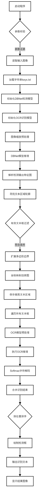
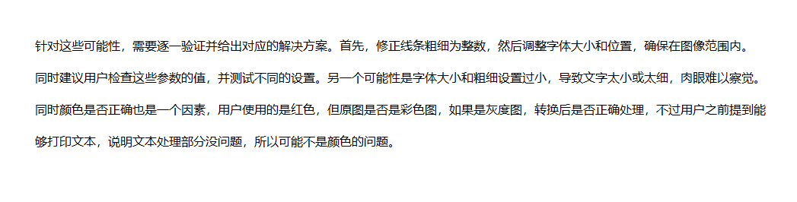
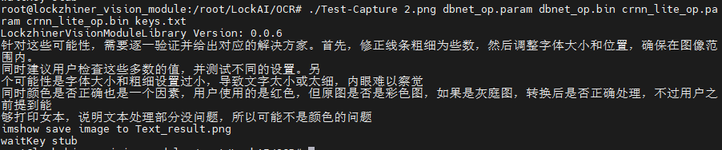

# OCR 中文字符识别
本章节在 Lockzhiner Vision Module 上基于OcrLiteNcnn模型, 实现了一个OCR中文字符识别系统。
## 1. 基本知识讲解
### 1.1 OCR中文字符识别简介
光学字符识别（OCR）是一种将图像中的文字转换为可编辑文本的技术，其中中文OCR因汉字结构复杂、字形多样而更具挑战性。通过图像预处理、深度学习模型（如CNN+RNN）及语言校正，系统能精准识别印刷体或手写中文，并适应不同字体、排版与复杂背景。该技术广泛应用于文档数字化、证件识别、智能办公等领域，尤其在处理海量纸质资料、提升信息处理效率方面具有重要意义。
### 1.2 OCR中文字符识别的核心步骤
要实现一个OCR中文字符识别，主要包含以下几个步骤：
- 图像预处理：
    - 灰度化与二值化：将彩色图像转换为黑白图像，增强文字与背景的对比度。
    - 降噪与倾斜校正：去除噪声，校正因拍摄导致的倾斜角度。
- 文字定位与区域检测：
    - 一般利用深度学习模型来检测图像中的文字区域。
- 字符分割:
    - 将连续文字块拆分为单个字符，解决粘连字符问题。
- 特征提取与识别：
    - 提取字符的几何特征或通过深度学习模型生成抽象特征。
- 后处理与校正

---

## 2. C++ API 文档
### 2.1 Net类
#### 2.1.1 头文件
```cpp
#include <ncnn/net.h>
```
- 作用：用于声明Net类，使得Net类可以在当前文件中使用。

#### 2.1.2 构造类函数
```cpp
ncnn::Net dbnet;
```
- 作用：创建一个Net类型的对象实例，用于实现文字区域的检测。
- 参数说明：
    - 无
- 返回值：
    - 无

```cpp
ncnn::Net ocr_net;
```
- 作用：创建一个Net类型的对象实例，用于实现文字的识别。
- 参数说明：
    - 无
- 返回值：
    - 无

#### 2.1.3 load_param函数
```cpp
int load_param(const DataReader& dr);
```
- 参数说明：
    - dr：传入的参数文件路径。
- 返回值：
    - 返回值为0表示加载参数文件成功。

#### 2.1.4 load_model函数
```cpp
int load_model(const DataReader& dr);
```
- 参数说明：
    - dr：传入的模型文件路径。
- 返回值：返回值为0表示加载模型成功。

#### 2.1.5 from_pixels函数
```cpp
ncnn::Mat::from_pixels(srcResize.data, ncnn::Mat::PIXEL_BGR, srcResize.cols, srcResize.rows);
```
- 参数说明：
    - srcResize.data：输入图像的像素数据指针。
    - ncnn::Mat::PIXEL_BGR：输入像素数据的颜色格式。
    - srcResize.cols：输入图像的宽度。
    - srcResize.rows：输入图像的高度。
- 返回值：适配成 NCNN 所需的格式的包含图像数据的新对象。

### 2.2 Extractor类
#### 2.2.1 头文件
```cpp
#include <ncnn/net.h>
```
- 作用：用于声明Extractor类，使得Extractor类可以在当前文件中使用。

#### 2.2.2 构造类函数
```cpp
ncnn::Extractor dbnet_extractor = dbnet.create_extractor();
```
- 作用：从已经加载了神经网络模型的 dbnet 中创建一个 Extractor 实例，用于执行文本区域检测的推理任务。
- 参数说明：
    - 无
- 返回值：
    - 无

```cpp
cnn::Extractor ocr_extractor = ocr_net.create_extractor();
```
- 作用：从已经加载了神经网络模型的 ocr_net 中创建一个 Extractor 实例，用于执行文本识别的推理任务。
- 参数说明：
    - 无
- 返回值：
    - 无

## 3. OCR 中文字符识别代码解析
### 3.1 流程图



### 3.2 核心代码解析
#### 3.2.1 向量归一化
```cpp
cv::Point2f normalize(const cv::Point2f& v);
```
- 作用：
    - 计算向量长度并归一化，用于后续几何变换（如多边形扩展方向计算）。
- 参数说明：
    - v：待归一化的二维向量。
- 返回值:
    - 返回单位长度的向量，若输入向量为零向量则返回(0, 0)。

#### 3.2.2 多边形边界扩张
```cpp
std::vector<cv::Point> expandPolygon(const std::vector<cv::Point>& inBox, float distance);
```
- 作用：
    - 基于邻边法线方向计算角平分线，向外扩展多边形边界，增强文本检测框的包容性。
- 参数说明：
    - inBox：输入的多边形顶点集合。
    - distance：扩展距离，控制文本框膨胀程度。
- 返回值:
    - 返回扩展后的新多边形顶点集合。

#### 3.2.3 文本检测框提取
```cpp
std::vector<TextBox> findRsBoxes(const cv::Mat &fMapMat, const cv::Mat &norfMapMat, ScaleParam &s, const float boxScoreThresh, const float unClipRatio);
```
- 作用：
    - 结合轮廓检测与UNet式后处理，生成最终文本检测框。
- 参数说明：
    - fMapMat：DBNet输出的概率图。
    - norfMapMat：二值化后的概率图。
    - s：图像缩放参数结构体。
    - boxScoreThresh：文本框置信度阈值。
    - unClipRatio：边界扩展系数。
- 返回值:
    - 返回包含文本框坐标、置信度的结构体列表。

#### 3.2.4 OCR文本识别
```cpp
void processFrame(Mat &src, ncnn::Net &ocr_net, const std::vector<std::string> &keys, 
                 const float ocr_mean[], const float ocr_norm[], int dstHeight, std::string &outputText);
```
- 作用：
    - 执行图像预处理，模型推理，Softmax解码，字符拼接全流程。
- 参数说明：
    - src：待识别的文本区域图像。
    - ocr_net：OCR识别模型。
    - keys：字符表（字符到索引映射）。
    - ocr_mean：图像归一化均值。
    - ocr_norm：图像归一化标准差。
    - dstHeight：目标高度。
    - outputText：输出识别结果字符串。
- 返回值:
    - 无

### 3.3 完整代码实现
```cpp
#include <iostream>
#include <opencv2/opencv.hpp>
#include <ncnn/net.h>
#include <chrono>
#include <vector>
#include <fstream>
#include <numeric>
#include <cmath>

using namespace cv;
using namespace std::chrono;

// 定义必要的参数
const float dbnet_meanValues[3] = {0.485f * 255, 0.456f * 255, 0.406f * 255};
const float dbnet_normValues[3] = {1.0f / 0.229f / 255.0f, 1.0f / 0.224f / 255.0f, 1.0f / 0.225f / 255.0f};

// 文本检测结构体
struct TextBox {
    std::vector<cv::Point> boxPoint;
    float score;
    std::string text;
};

// 图像缩放参数定义
struct ScaleParam {
    int srcWidth;
    int srcHeight;
    int dstWidth;
    int dstHeight;
    float ratioWidth;
    float ratioHeight;
};

// 文本检测相关函数
ScaleParam getScaleParam(const cv::Mat &src, const int targetSize) {
    int imgHeight = src.rows;
    int imgWidth = src.cols;
    float ratio = std::min(static_cast<float>(targetSize) / imgHeight, static_cast<float>(targetSize) / imgWidth);
    ScaleParam scaleParam;
    scaleParam.srcHeight = imgHeight;
    scaleParam.srcWidth = imgWidth;
    scaleParam.dstHeight = static_cast<int>(imgHeight * ratio);
    scaleParam.dstWidth = static_cast<int>(imgWidth * ratio);
    scaleParam.ratioHeight = ratio;
    scaleParam.ratioWidth = ratio;
    return scaleParam;
}

cv::Point2f normalize(const cv::Point2f& v) {
    float len = std::sqrt(v.x * v.x + v.y * v.y);
    return (len == 0) ? cv::Point2f(0, 0) : cv::Point2f(v.x / len, v.y / len);
}

// 多边形边界扩展
std::vector<cv::Point> expandPolygon(const std::vector<cv::Point>& inBox, float distance) {
    std::vector<cv::Point> outBox;
    int n = inBox.size();
    if (n < 3) return outBox; 

    for (int i = 0; i < n; ++i) {
        cv::Point2f prev = inBox[(i + n - 1) % n];
        cv::Point2f curr = inBox[i];
        cv::Point2f next = inBox[(i + 1) % n];

        cv::Point2f v1 = curr - prev;
        cv::Point2f v2 = next - curr;

        cv::Point2f normal1(-v1.y, v1.x);
        cv::Point2f normal2(-v2.y, v2.x);

        normal1 = normalize(normal1);
        normal2 = normalize(normal2);

        cv::Point2f bisectorNormal = normalize(normal1 + normal2);
        cv::Point2f newPoint = curr + bisectorNormal * distance;

        outBox.push_back(cv::Point(newPoint.x, newPoint.y));
    }
    return outBox;
}

// 提取检测到文本的检测框
std::vector<TextBox> findRsBoxes(const cv::Mat &fMapMat, const cv::Mat &norfMapMat, ScaleParam &s,
                                 const float boxScoreThresh, const float unClipRatio) {
    float minArea = 3;
    std::vector<TextBox> rsBoxes;
    std::vector<std::vector<cv::Point>> contours;
    cv::findContours(norfMapMat, contours, cv::RETR_LIST, cv::CHAIN_APPROX_SIMPLE);

    for (const auto& contour : contours) {
        double perimeter = cv::arcLength(contour, true);
        cv::RotatedRect minRect = cv::minAreaRect(contour);
        float minSideLen = std::min(minRect.size.width, minRect.size.height);
        if (minSideLen < minArea) continue;
        cv::Mat mask = cv::Mat::zeros(fMapMat.size(), CV_8UC1);
        for (int contour_idx = 0; contour_idx < contours.size(); contour_idx++) {
            cv::drawContours(mask, contours, contour_idx, cv::Scalar(255), cv::FILLED);
        }

        cv::Scalar meanScore = cv::mean(fMapMat, mask);
        float score = static_cast<float>(meanScore[0]);

        if (score < boxScoreThresh) continue;

        double area = cv::contourArea(contour);
        float distance = unClipRatio * static_cast<float>(area) / static_cast<float>(perimeter);
        std::vector<cv::Point> clipBox = expandPolygon(contour, distance);

        for (auto &point : clipBox) {
            point.x = std::max(0, std::min(static_cast<int>(point.x / s.ratioWidth), s.srcWidth - 1));
            point.y = std::max(0, std::min(static_cast<int>(point.y / s.ratioHeight), s.srcHeight - 1));
        }

        rsBoxes.emplace_back(TextBox{clipBox, score});
    }
    return rsBoxes;
}

void drawTextBox(cv::Mat &boxImg, const std::vector<cv::Point> &box, int thickness) {
    for (size_t i = 0; i < box.size(); ++i) {
        cv::line(boxImg, box[i], box[(i + 1) % box.size()], cv::Scalar(0, 255, 0), thickness);
    }
}

// 辅助函数
template <class ForwardIterator>
inline static size_t argmax(ForwardIterator first, ForwardIterator last) {
    return std::distance(first, std::max_element(first, last));
}

// 文本识别相关函数
void processFrame(Mat &src, ncnn::Net &ocr_net, const std::vector<std::string> &keys, 
                 const float ocr_mean[], const float ocr_norm[], int dstHeight, std::string &outputText) {
    float scale = (float)dstHeight / (float)src.rows;
    int dstWidth = int((float)src.cols * scale);
    Mat resized_patch;
    cv::resize(src, resized_patch, cv::Size(dstWidth, dstHeight));
    ncnn::Mat input = ncnn::Mat::from_pixels(resized_patch.data, ncnn::Mat::PIXEL_BGR, 
                                            resized_patch.cols, resized_patch.rows);
    input.substract_mean_normalize(ocr_mean, ocr_norm);
    ncnn::Extractor ocr_extractor = ocr_net.create_extractor();
    ocr_extractor.input("input", input);
    ncnn::Mat ocr_output;
    ocr_extractor.extract("out", ocr_output);
    float *floatArray = (float *)ocr_output.data;
    std::vector<float> outputData(floatArray, floatArray + ocr_output.h * ocr_output.w);
    int keySize = keys.size();
    std::string strRes;
    std::vector<float> scores;
    int lastIndex = 0;
    int maxIndex;
    float maxValue;
    for (int i = 0; i < ocr_output.h; i++) {
        int maxIndex = 0;
        float maxValue = -1000.f;
        // Softmax 计算
        std::vector<float> exps(ocr_output.w);
        for (int j = 0; j < ocr_output.w; j++) {
          float expSingle = exp(outputData[i * ocr_output.w + j]);
          exps.at(j) = expSingle;
        }
        // 行总和
        float partition = accumulate(exps.begin(), exps.end(), 0.0);  
        // 找到最大值及其索引
        auto maxElementIt = std::max_element(exps.begin(), exps.end());
        maxIndex = std::distance(exps.begin(), maxElementIt);
        maxValue = *maxElementIt / partition;
        // 检测到有效字符
        if (maxIndex > 0 && maxIndex < keySize &&
            (!(i > 0 && maxIndex == lastIndex))) {
          scores.emplace_back(maxValue);
          // 将字符追加到结果字符串中
          strRes.append(keys[maxIndex - 1]);  
        }
    
        lastIndex = maxIndex;
    }
    outputText = strRes;
}

int main(int argc, char *argv[]) {
    if (argc != 7) {
        std::cerr << "Usage: " << argv[0] 
                  << " <image_path> <dbnet_param> <dbnet_bin> <ocr_param> <ocr_bin> <keys.txt>" << std::endl;
        return -1;
    }
    
    // 读取输入图像
    Mat src = imread(argv[1], IMREAD_COLOR);
    if (src.empty()) {
        std::cerr << "Failed to read image." << std::endl;
        return -1;
    }

    // 加载OCR字符表
    std::vector<std::string> keys;
    std::ifstream in(argv[6]);
    std::string line;
    if (in) {
        while (getline(in, line)) {
            keys.push_back(line);
        }
    } else {
        std::cerr << "The keys.txt file was not found." << std::endl;
        return -1;
    }
    if (keys.size() != 5531) {
        std::cerr << "Invalid keys.txt format." << std::endl;
        return -1;
    }

    // 初始化DBNet检测模型
    ncnn::Net dbnet;
    dbnet.opt.use_vulkan_compute = false;
    if (dbnet.load_param(argv[2]) != 0 || dbnet.load_model(argv[3]) != 0) {
        std::cerr << "Failed to load DBNet model." << std::endl;
        return -1;
    }

    // 初始化OCR识别模型
    ncnn::Net ocr_net;
    ocr_net.opt.use_vulkan_compute = false;
    if (ocr_net.load_param(argv[4]) != 0 || ocr_net.load_model(argv[5]) != 0) {
        std::cerr << "Failed to load OCR model." << std::endl;
        return -1;
    }

    // 执行文本检测
    ScaleParam scaleParam = getScaleParam(src, 736);
    Mat srcResize;
    resize(src, srcResize, cv::Size(scaleParam.dstWidth, scaleParam.dstHeight));

    ncnn::Mat dbnet_input = ncnn::Mat::from_pixels(srcResize.data, ncnn::Mat::PIXEL_BGR, 
                                                  srcResize.cols, srcResize.rows);
    dbnet_input.substract_mean_normalize(dbnet_meanValues, dbnet_normValues);

    ncnn::Extractor dbnet_extractor = dbnet.create_extractor();
    dbnet_extractor.input("input0", dbnet_input);
    ncnn::Mat dbnet_output;
    dbnet_extractor.extract("out1", dbnet_output);

    // 解析检测输出
    Mat fMapMat(srcResize.rows, srcResize.cols, CV_32FC1);
    memcpy(fMapMat.data, (float *)dbnet_output.data, 
           srcResize.rows * srcResize.cols * sizeof(float));
    Mat norfMapMat = fMapMat > 0.3f;

    std::vector<TextBox> text_boxes = findRsBoxes(fMapMat, norfMapMat, scaleParam, 0.5f, 4.0f);
    
    // 初始化计数器
    int save_count = 0;
    // 执行文本识别
    for (auto& box : text_boxes) {
        // 裁剪文本区域
        Rect rect = cv::boundingRect(box.boxPoint);
        Mat text_patch = src(rect).clone(); 

        // 保存裁剪后的原始区域
        std::string filename = "cropped_" + std::to_string(save_count) + ".png";
        // 保存为PNG格式
        imwrite(filename, text_patch);
        save_count++;

        // 执行OCR识别
        const float ocr_mean[3] = {127.5f, 127.5f, 127.5f};
        const float ocr_norm[3] = {1.0f / 127.5f, 1.0f / 127.5f, 1.0f / 127.5f};
        std::string textResult;
        processFrame(text_patch, ocr_net, keys, ocr_mean, ocr_norm, 32, textResult);

        box.text = textResult;
    }

    // 对文本框进行排序
    std::sort(text_boxes.begin(), text_boxes.end(), [](const TextBox &a, const TextBox &b) {
        cv::Rect rectA = cv::boundingRect(a.boxPoint);
        cv::Rect rectB = cv::boundingRect(b.boxPoint);
        
        int centerYA = rectA.y + rectA.height / 2;
        int centerYB = rectB.y + rectB.height / 2;

        if (centerYA != centerYB) {
            return centerYA < centerYB;
        }
        return (rectA.x + rectA.width / 2) < (rectB.x + rectB.width / 2);
    });
    // 可视化结果
    for (const auto& box : text_boxes) {
        drawTextBox(src, box.boxPoint, 1);
        std::cout << box.text << std::endl;
        // 由于opencv并不支持绘制中文，所以一下代码可以注释掉，感兴趣的可以自己尝试一下。
        // putText(src, box.text, box.boxPoint[0], 
        //         FONT_HERSHEY_SIMPLEX, 0.8, 
        //         Scalar(0, 0, 255), 1);
    }

    // 显示结果
    imshow("Text_result", src);
    waitKey(0);
    return 0;
}
```

---

## 4. 编译调试
### 4.1 编译环境搭建
- 请确保你已经按照 [开发环境搭建指南](../../../../docs/introductory_tutorial/cpp_development_environment.md) 正确配置了开发环境。
- 同时已经正确连接开发板。
### 4.2 Cmake介绍
```cmake
cmake_minimum_required(VERSION 3.10)

project(ocr_synthesis)

set(CMAKE_CXX_STANDARD 17)
set(CMAKE_CXX_STANDARD_REQUIRED ON)

# 定义项目根目录路径
set(PROJECT_ROOT_PATH "${CMAKE_CURRENT_SOURCE_DIR}/../..")
message("PROJECT_ROOT_PATH = " ${PROJECT_ROOT_PATH})

include("${PROJECT_ROOT_PATH}/toolchains/arm-rockchip830-linux-uclibcgnueabihf.toolchain.cmake")

# 定义 OpenCV SDK 路径
set(OpenCV_ROOT_PATH "${PROJECT_ROOT_PATH}/third_party/opencv-mobile-4.10.0-lockzhiner-vision-module")
set(OpenCV_DIR "${OpenCV_ROOT_PATH}/lib/cmake/opencv4")
find_package(OpenCV REQUIRED)
set(OPENCV_LIBRARIES "${OpenCV_LIBS}")

# 定义 LockzhinerVisionModule SDK 路径
set(LockzhinerVisionModule_ROOT_PATH "${PROJECT_ROOT_PATH}/third_party/lockzhiner_vision_module_sdk")
set(LockzhinerVisionModule_DIR "${LockzhinerVisionModule_ROOT_PATH}/lib/cmake/lockzhiner_vision_module")
find_package(LockzhinerVisionModule REQUIRED)

# ncnn配置
set(NCNN_ROOT_DIR "${PROJECT_ROOT_PATH}/third_party/ncnn-20240820-lockzhiner-vision-module")  # 确保third_party层级存在
message(STATUS "Checking ncnn headers in: ${NCNN_ROOT_DIR}/include/ncnn")

# 验证头文件存在
if(NOT EXISTS "${NCNN_ROOT_DIR}/include/ncnn/net.h")
    message(FATAL_ERROR "ncnn headers not found. Confirm the directory contains ncnn: ${NCNN_ROOT_DIR}")
endif()

set(NCNN_INCLUDE_DIRS "${NCNN_ROOT_DIR}/include")
set(NCNN_LIBRARIES "${NCNN_ROOT_DIR}/lib/libncnn.a")

add_executable(Test-OcrLite OcrLite.cc)
target_include_directories(Test-OcrLite PRIVATE ${LOCKZHINER_VISION_MODULE_INCLUDE_DIRS}  ${NCNN_INCLUDE_DIRS})
target_link_libraries(Test-OcrLite PRIVATE ${OPENCV_LIBRARIES} ${NCNN_LIBRARIES} ${LOCKZHINER_VISION_MODULE_LIBRARIES})

install(
    TARGETS Test-OcrLite
    RUNTIME DESTINATION .  
)
```
### 4.3 编译项目
使用 Docker Destop 打开 LockzhinerVisionModule 容器并执行以下命令来编译项目
```bash
# 进入Demo所在目录
cd /LockzhinerVisionModuleWorkSpace/LockzhinerVisionModule/Cpp_example/D07_ocr_synthesis
# 创建编译目录
rm -rf build && mkdir build && cd build
# 配置交叉编译工具链
export TOOLCHAIN_ROOT_PATH="/LockzhinerVisionModuleWorkSpace/arm-rockchip830-linux-uclibcgnueabihf"
# 使用cmake配置项目
cmake ..
# 执行编译项目
make -j8 && make install
```

在执行完上述命令后，会在build目录下生成可执行文件。

---

## 5. 执行结果
### 5.1 运行前准备
- 请确保已经下载了模型，并保存在当前目录下。
### 5.2 运行过程
```shell
chmod 777 Test-OcrLite
./Test-OcrLite <image_path> dbnet_op.param dbnet_op.bin crnn_lite_op.param crnn_lite_op.bin keys.txt
```
### 5.3 运行结果
- 原始图像



- 识别结果



---

## 6. 总结
通过上述内容，我们成功实现了一个简单的OCR中文字符识别系统，包括：

- 加载模型和待识别图像。
- 进行文本区域检测推理和文本识别推理。
- 打印并保存推理结果。