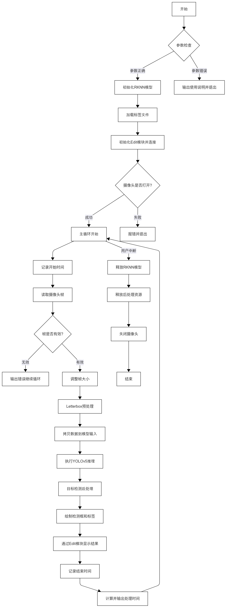
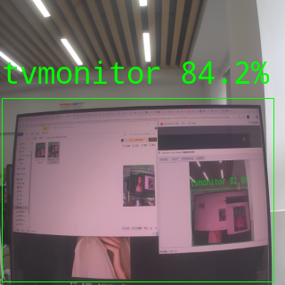

# YOLOV5目标检测
本章节基于 Lockzhiner Vision Module 和 YOLOv5 目标检测模型，实现实时目标检测功能。
## 1. 基本知识简介
### 1.1 目标检测简介
目标检测是计算机视觉领域中的一个关键任务，它不仅需要识别图像中存在哪些对象，还需要定位这些对象的位置。具体来说，目标检测算法会输出每个检测到的对象的边界框（Bounding Box）以及其所属类别的概率或置信度得分。
- 应用场景：目标检测技术广泛应用于多个领域，包括但不限于安全监控、自动驾驶汽车、智能零售和医疗影像分析。
### 1.2 YOLOv5简介
YOLOv5 是 Ultralytics 在 2020 年基于 PyTorch 开发的一种高效目标检测模型，属于 YOLO 系列。它通过一次前向传播即可预测目标的类别和位置，适用于实时检测任务。YOLOv5 提供了多种模型大小（如 YOLOv5s、m、l、x），适应不同硬件条件。其结构包括骨干网络 CSPDarknet、特征融合层和检测头，支持多尺度预测和自定义训练，广泛用于各种检测场景。

## 2. API 文档
### 2.1 YOLOv5模型类
#### 2.1.1 头文件
```cpp
#include "yolov5.h"
```
#### 2.1.2 模型初始化函数
```cpp
int init_yolov5_model(const char* model_path, rknn_app_context_t* ctx);
```
- 作用：加载YOLOv5 RKNN模型并初始化推理上下文
- 参数
    - model_path：RKNN模型文件路径
    - ctx：模型上下文指针
- 返回值：
    - 0：初始化成功
    - -1：初始化失败
#### 2.1.3 模型推理函数
```cpp
int inference_yolov5_model(rknn_app_context_t* ctx, 
                         object_detect_result_list* od_results);
```
- 作用：执行模型推理并获取检测结果
- 参数：
    - ctx：已初始化的模型上下文
    - od_results：检测结果存储结构体指针
- 返回值：
    - 0：推理成功
    - -1 ：推理失败
#### 2.1.4 模型释放函数
```cpp
void release_yolov5_model(rknn_app_context_t* ctx);
```
- 作用：释放模型相关资源
- 参数：
    - ctx：待释放的模型上下文
- 返回值：无
### 2.2 图像处理函数
#### 2.2.1 Letterbox处理
```cpp
cv::Mat letterbox(cv::Mat& image);
```
- 作用：保持图像比例进行缩放，添加灰边填充
- 参数：
    -image:输入图像(RGB格式)
- 返回值：
    - 返回预处理图像
#### 2.2.2 坐标映射函数
```cpp
void mapCoordinates(float& x, float& y);
```
- 作用：将模型输出坐标映射回原始图像坐标系
- 参数：
    - x/y：模型输出坐标（输入输出参数）
- 返回值:无
### 2.3 结果处理函数
#### 2.3.1 后处理初始化
```cpp
void init_post_process();
```
- 作用：加载类别标签文件
- 参数：无
- 返回值：无
#### 2.3.2 结果绘制函数
```cpp
void draw_detections(int count, 
                    object_detect_result* results,
                    cv::Mat& frame,
                    void (*mapFunc)(float&, float&));
```
- 作用：在图像上绘制检测框和标签
- 参数：
    - count:检测结果数量
    - results：检测结果数组
    - frame：目标图像帧
    - mapFunc：坐标映射函数指针
- 返回值：无
## 3. 代码解析
### 3.1 流程图



### 3.2核心代码解析
- 模型初始化
```cpp
rknn_app_context_t rknn_app_ctx;
init_yolov5_model("yolov5s.rknn", &rknn_app_ctx);
```
- 图像预处理
```cpp
cv::Mat letterboxImage = letterbox(frame); // 保持比例缩放
memcpy(rknn_app_ctx.input_mems[0]->virt_addr, 
       letterboxImage.data, 
       model_width * model_height * 3);
```
- 模型推理
```cpp
object_detect_result_list od_results;
inference_yolov5_model(&rknn_app_ctx, &od_results);
```
- 结果可视化
```cpp
draw_detections(od_results.count, 
               od_results.results,
               frame,
               mapCoordinates);
```
### 3.3 完整代码实现
```cpp
#include <stdio.h>
#include <string.h>
#include <lockzhiner_vision_module/edit/edit.h>
#include "yolov5.h"
#include "opencv2/core/core.hpp"
#include "opencv2/highgui/highgui.hpp"
#include "opencv2/imgproc/imgproc.hpp"
#include <lockzhiner_vision_module/core/logger.h>
#include <chrono>
// output img size
#define DISP_WIDTH 320
#define DISP_HEIGHT 320

// disp size
int width = DISP_WIDTH;
int height = DISP_HEIGHT;

// model size
int model_width = 320;
int model_height = 320;

int leftPadding;
int topPadding;

// label size
extern int obj_class_num;
char *lable;

int main(int argc, char *argv[])
{
	if (argc != 4)
	{
		LOGGER_INFO("Usage: %s ./yolov5_main model_path ./label size\n ./label_txt");
	}
	obj_class_num = atoi(argv[2]);
	lable = argv[3];
	// Rknn model
	char text[16];
	// rknn上下文结构体
	rknn_app_context_t rknn_app_ctx;
	object_detect_result_list od_results;
	int ret;
	const char *model_path = argv[1];
	memset(&rknn_app_ctx, 0, sizeof(rknn_app_context_t));

	// Step 1: Load RKNN model
	if (init_yolov5_model(model_path, &rknn_app_ctx) != 0)
	{
		printf("❌ Failed to load RKNN model!\n");
		return -1;
	}
	printf("✅ RKNN model loaded successfully.\n");

	// 加载标签文件
	init_post_process();

	// 打开摄像头
	lockzhiner_vision_module::edit::Edit edit;
	if (!edit.StartAndAcceptConnection())
	{
		std::cerr << "Error: Failed to start and accept connection." << std::endl;
		return EXIT_FAILURE;
	}

	cv::VideoCapture cap;
	cap.set(cv::CAP_PROP_FRAME_WIDTH, 640);
	cap.set(cv::CAP_PROP_FRAME_HEIGHT, 480);
	cap.open(0);

	if (!cap.isOpened())
	{
		std::cerr << "Error: Could not open camera." << std::endl;
		return 1;
	}
	cv::Mat frame;
	// 在 while 循环外声明 start 和 end 变量
	std::chrono::steady_clock::time_point start, end;

	while (true)
	{
		// 记录开始时间
		start = std::chrono::steady_clock::now();
		// Step 2: Load image from command line
		cap >> frame;
		if (frame.empty())
		{
			LOGGER_INFO("❌ Failed to read frame from camera.\n");
			continue;
		}
		cv::resize(frame, frame, cv::Size(width, height), 0, 0, cv::INTER_LINEAR);
		cv::Mat letterboxImage = letterbox(frame);

		if (letterboxImage.empty() || letterboxImage.total() * letterboxImage.elemSize() != model_width * model_height * 3)
		{

			LOGGER_ERROR("❌ Input image format or size mismatch!\n");
			release_yolov5_model(&rknn_app_ctx);
			return -1;
		}

		if (rknn_app_ctx.input_mems == nullptr || rknn_app_ctx.input_mems[0] == nullptr)
		{

			LOGGER_ERROR("❌ RKNN input memory not allocated!\n");
			release_yolov5_model(&rknn_app_ctx);
			return -1;
		}

		memcpy(rknn_app_ctx.input_mems[0]->virt_addr, letterboxImage.data, model_width * model_height * 3);

		if (inference_yolov5_model(&rknn_app_ctx, &od_results) != 0)
		{
			LOGGER_ERROR("inference_yolov5_model failed");
			release_yolov5_model(&rknn_app_ctx);
			return -1;
		}

		draw_detections(od_results.count,	// 传入结果数量
						od_results.results, // 传入结果数组
						frame,				// 图像帧
						mapCoordinates);	// 直接使用现有坐标映射函数

		edit.Print(frame);
		// 记录结束时间
		end = std::chrono::steady_clock::now();
		// 计算耗时（秒）
		double elapsed_time = std::chrono::duration<double>(end - start).count();
		printf("Frame processed in %.4f seconds\n", elapsed_time);
	}
	release_yolov5_model(&rknn_app_ctx);
	deinit_post_process();
	cap.release();
	return 0;
}
```

## 4. 编译过程
### 4.1 编译环境搭建
- 请确保你已经按照 [开发环境搭建指南](../../../../docs/introductory_tutorial/cpp_development_environment.md) 正确配置了开发环境。
- 同时以正确连接开发板。
### 4.2 Cmake介绍
```cmake
# CMake最低版本要求  
cmake_minimum_required(VERSION 3.10)  

project(test-find-blobs)

set(CMAKE_CXX_STANDARD 17)
set(CMAKE_CXX_STANDARD_REQUIRED ON)

# 定义项目根目录路径
set(PROJECT_ROOT_PATH "${CMAKE_CURRENT_SOURCE_DIR}/../..")
message("PROJECT_ROOT_PATH = " ${PROJECT_ROOT_PATH})

include("${PROJECT_ROOT_PATH}/toolchains/arm-rockchip830-linux-uclibcgnueabihf.toolchain.cmake")

# 定义 OpenCV SDK 路径
set(OpenCV_ROOT_PATH "${PROJECT_ROOT_PATH}/third_party/opencv-mobile-4.10.0-lockzhiner-vision-module")
set(OpenCV_DIR "${OpenCV_ROOT_PATH}/lib/cmake/opencv4")
find_package(OpenCV REQUIRED)
set(OPENCV_LIBRARIES "${OpenCV_LIBS}")
# 定义 LockzhinerVisionModule SDK 路径
set(LockzhinerVisionModule_ROOT_PATH "${PROJECT_ROOT_PATH}/third_party/lockzhiner_vision_module_sdk")
set(LockzhinerVisionModule_DIR "${LockzhinerVisionModule_ROOT_PATH}/lib/cmake/lockzhiner_vision_module")
find_package(LockzhinerVisionModule REQUIRED)

set(RKNPU2_BACKEND_BASE_DIR "${LockzhinerVisionModule_ROOT_PATH}/include/lockzhiner_vision_module/vision/deep_learning/runtime")
if(NOT EXISTS ${RKNPU2_BACKEND_BASE_DIR})
    message(FATAL_ERROR "RKNPU2 backend base dir missing: ${RKNPU2_BACKEND_BASE_DIR}")
endif()

add_executable(yolov5_main
    main.cc
    postprocess.cc
    yolov5.cc
    yolov5.h  
    postprocess.h
)
target_include_directories(yolov5_main PRIVATE ${LOCKZHINER_VISION_MODULE_INCLUDE_DIRS} ${rknpu2_INCLUDE_DIRS} ${RKNPU2_BACKEND_BASE_DIR})
target_link_libraries(yolov5_main PRIVATE ${OPENCV_LIBRARIES} ${LOCKZHINER_VISION_MODULE_LIBRARIES})

install(
    TARGETS yolov5_main
    RUNTIME DESTINATION .  
)
```
### 4.3 编译项目
使用 Docker Destop 打开 LockzhinerVisionModule 容器并执行以下命令来编译项目
```bash
# 进入Demo所在目录
cd /LockzhinerVisionModuleWorkSpace/LockzhinerVisionModule/Cpp_example/D10_yolov5
# 创建编译目录
rm -rf build && mkdir build && cd build
# 配置交叉编译工具链
export TOOLCHAIN_ROOT_PATH="/LockzhinerVisionModuleWorkSpace/arm-rockchip830-linux-uclibcgnueabihf"
# 使用cmake配置项目
cmake ..
# 执行编译项目
make -j8 && make install
```

在执行完上述命令后，会在build目录下生成可执行文件。

## 5. 例程运行示例
### 5.1 运行
```shell
chmod 777 yolov5_main
# 在实际应用的过程中LZ-Picodet需要替换为下载的或者你的rknn模型
./yolov5_main ./voc320.rknn 20 label
```
### 5.2 结果展示

- 可以看到我们可以正确识别多种类别的

