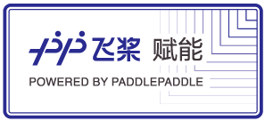

<h1 align="center">凌智视觉模块(Lockzhiner Vision Module)</h1>

    
    
    
    

  
      

凌智视觉模块(Lockzhiner Vision Module) 是福州市凌睿智捷电子有限公司联合百度 PaddlePaddle 倾力打造的一款高集成度人工智能视觉模块，专为边缘端人工智能和机器视觉应用而设计，其特色包括：

* 计算能力：凌智视觉模块搭载单核 ARM Cortex-A7 处理器，并集成了 NEON 和 FPU，以更出色地处理 SIMD 和浮点计算。同时，该模块支持 Int8 量化，内置 0.5 TOPs 的 NPU，足以应对绝大多数的视觉应用场景。
* 开源适配：凌智视觉模块与 PaddleClas, PaddleDetection, PaddleSeg 和 PaddleOCR 等基于飞桨框架的视觉套件完美适配。
* 简单易用：配合星河社区 AI Studio，用户可以实现一键训练、一键部署，从而极大地减轻了部署负担。

> 注：
> 
> 针对 Paddle 视觉套件，凌智视觉模块目前已经支持了 PaddleClas 和 PaddleDetection, 其余的 PaddleSeg 和 PaddleOCR 套件正在适配中，未来会陆续上线。
> 针对 PaddleX 套件，凌智视觉模块目前已经适配了 PaddleClas 模型，其余的 PaddleDetection, PaddleSeg 和 PaddleOCR 套件正在适配中，未来会陆续上线。
> 针对星河社区 PaddleX 模型产线，凌智视觉模块暂未适配，未来会陆续上线。
> 更详细的参数请参考 [凌智视觉模块设备详细参数文档](./docs/device_parameters.md)

## 🔄 最新日志

## 💡 入门学习教程

这一部分教程旨在为你提供一个系统化的学习路径，帮助你快速上手 Lockzhiner Vision Module。通过一系列详细的教程，你将学会如何烧录镜像、连接设备、搭建开发环境和编写简单的程序。

* [凌智视觉模块烧录镜像指南](./docs/introductory_tutorial/burn_image.md)
* [凌智视觉模块连接设备指南](./docs/introductory_tutorial/connect_device_using_ssh.md)
* [凌智视觉模块 Python 开发环境搭建指南](./docs/introductory_tutorial/python_development_environment.md)

<!-- 
如果你需要开发 Python 程序，请参考以下教程搭建开发环境:

* [凌智视觉模块 Python 开发环境搭建指南](./docs/introductory_tutorial/python_development_environment.md)

如果你需要开发 C++ 程序，请参考以下教程搭建开发环境:

* [凌智视觉模块 C++ 开发环境搭建指南](./docs/introductory_tutorial/cpp_development_environment.md)
* [基于 C++ 编写 Hello World 程序](./example/hello_world) 
-->

## 🔌 外设控制教程

Lockzhiner Vision Module 拥有丰富的 IO 接口，其接口图片如下图所示:

为了帮助你快速上手教程，我们提供了一系列的外设控制例程，你可以点击链接快速学习

* [凌智视觉模块 ADC 使用指南](./example/periphery/adc)
* [凌智视觉模块 Capture(摄像头) 使用指南](./example/periphery/capture)
* [凌智视觉模块 GPIO 使用指南](./example/periphery/gpio)
* [凌智视觉模块 PWM 使用指南](./example/periphery/pwm)
* [凌智视觉模块 USART(串口) 使用指南](./example/periphery/usart)

## 🧠 深度学习视觉部署教程

这一部分教程将引导你从零开始训练并部署各种深度学习模型，包括分类模型、检测模型、分割模型和 OCR 模型。通过这些实战教程，你将学习到如何利用 Lockzhiner Vision Module 的高性能计算能力以及借助 Paddle 生态系统的丰富资源，轻松实现视觉任务的训练和部署。

* [凌智视觉模块分类模型部署指南](./example/vision/classification)
* [凌智视觉模块检测模型部署指南](./example/vision/detetcion)
<!-- * [分割模型部署指南(支持中)]() -->
<!-- * [OCR 模型部署指南(支持中)]() -->

## 👍 特色部署教程

* [凌智视觉模块手写数字识别部署指南](./example/special/digit_handwritten_recognition)
* [凌智视觉模块二维码识别与检测部署指南](./example/special/qr_code_recognition)
<!-- * [人脸佩戴口罩检测部署指南(支持中)]() -->

## 🐛 Bug反馈

如果您遇到问题，您可以前往 [Lockzhiner Vision Module Issues](https://gitee.com/LockzhinerAI/LockzhinerVisionModule/issues) 并点击已完成按钮查看其他用户反馈且我们已经解决的 Bug。

如果查找不到对应的解决方案，可点击新建 Issues 来反馈您的 Bug，我们将尽快与您沟通并及时解决 Bug。

## 🔧 使用到的开源仓库

开源是推动技术进步和创新的重要力量，我们采用了多个开源仓库来增强功能、提升效率。

* [OnnxSlim](https://github.com/inisis/OnnxSlim)
* [OpenCV Mobile](https://github.com/nihui/opencv-mobile)
* [Paddle2ONNX](https://github.com/PaddlePaddle/Paddle2ONNX)
* [PaddleClas](https://github.com/PaddlePaddle/PaddleClas)
* [PaddleDetection](https://github.com/PaddlePaddle/PaddleDetection)
* [PaddleOCR](https://github.com/PaddlePaddle/PaddleOCR)
* [PaddleSeg](https://github.com/PaddlePaddle/PaddleSeg)
* [readerwriterqueue](https://github.com/cameron314/readerwriterqueue)
* [RKNN Toolkit 2](https://github.com/airockchip/rknn-toolkit2)

## 😊 致谢

凌智视觉模块(Lockzhiner Vision Module) 离不开社区的支持，特别感谢以下个人（或团体）：

* 感谢 Rockchip NPU 团队帮忙调试 Paddle 模型到 RKNN 模型的推理和优化
* 感谢 PaddlePaddle 团队在适配 PaddleX 等套件上提供的帮助
* 感谢 nihui 大佬帮忙审核并将 Lockzhiner Vision Module 的 ISP 代码合入到 opencv-mobile

## 📜 开源协议

Lockzhiner Vision Module 全系列仓库遵循 [Apache License Version 2.0](./LICENSE)。
