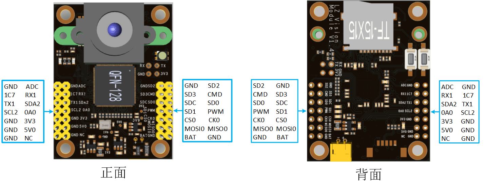

<h1 align="center">凌智视觉模块(Lockzhiner Vision Module)</h1>

    
    
    
    

  
      

凌智视觉模块(Lockzhiner Vision Module) 是福州市凌睿智捷电子有限公司联合百度飞桨倾力打造的一款高集成度人工智能视觉模块，专为边缘端人工智能和机器视觉应用而设计，其特色包括：

* 计算能力：凌智视觉模块搭载单核 ARM Cortex-A7 处理器，并集成了 NEON 和 FPU, 以更出色地处理 SIMD 和浮点计算。同时，该模块支持 Int8 量化，内置 1 TOPs 的 NPU, 足以应对绝大多数的视觉应用场景。
* 开源适配：凌智视觉模块与飞桨低代码开发工具 PaddleX 完美适配，目前支持PaddleX 中的通用图像分类模型产线, 其余任务场景正在适配中, 未来会陆续上线。
* 简单易用：配合飞桨星河社区 Al Studio, 用户可以实现一键训练；配合凌智视觉算法部署库，用户可以实现一键部署，极大地减轻了用户的使用成本。

    
    
    

> 注：
> 
> * 更详细的参数请参考 [凌智视觉模块设备详细参数文档](./docs/device_parameters.md)

## 🔄 最新日志

## 🎁 购买链接

- [凌智电子-凌智视觉模块](http://e.tb.cn/h.gB2QDrBQqTk6T5b?tk=9Ypj3ogzhLG)

## 💡 入门学习教程

这一部分教程旨在为你提供一个系统化的学习路径，帮助你快速上手 Lockzhiner Vision Module。通过一系列详细的教程, 你将学会如何烧录镜像、连接设备、搭建开发环境和编写简单的程序。

* [凌智视觉模块烧录镜像指南](./docs/introductory_tutorial/burn_image.md)
* [凌智视觉模块连接设备指南](./docs/introductory_tutorial/connect_device_using_ssh.md)
* [凌智视觉模块 Python 开发环境搭建指南](./docs/introductory_tutorial/python_development_environment.md)

<!-- 
如果你需要开发 Python 程序，请参考以下教程搭建开发环境:

* [凌智视觉模块 Python 开发环境搭建指南](./docs/introductory_tutorial/python_development_environment.md)

如果你需要开发 C++ 程序，请参考以下教程搭建开发环境:

* [凌智视觉模块 C++ 开发环境搭建指南](./docs/introductory_tutorial/cpp_development_environment.md)
* [基于 C++ 编写 Hello World 程序](./example/hello_world) 
-->

## 🔌 外设控制教程

Lockzhiner Vision Module 拥有丰富的 IO 接口，其接口图片如下图所示:

为了帮助你快速上手教程，我们提供了一系列的外设控制例程，你可以点击链接快速学习

* [凌智视觉模块 ADC 使用指南](./example/periphery/adc)
* [凌智视觉模块 Capture(摄像头) 使用指南](./example/periphery/capture)
* [凌智视觉模块 GPIO 使用指南](./example/periphery/gpio)
* [凌智视觉模块 PWM 使用指南](./example/periphery/pwm)
* [凌智视觉模块 USART(串口) 使用指南](./example/periphery/usart)

## 🧠 深度学习视觉部署教程

这一部分教程将引导你从零开始训练并部署各种深度学习模型，包括分类模型、检测模型、分割模型和 OCR 模型。通过这些实战教程，你将学习到如何利用 Lockzhiner Vision Module 的高性能计算能力以及借助飞桨生态系统的丰富资源，轻松实现视觉任务的训练和部署。

* [凌智视觉模块分类模型部署指南](./example/vision/classification)
* [凌智视觉模块检测模型部署指南](./example/vision/detetcion)
<!-- * [分割模型部署指南(支持中)]() -->
<!-- * [OCR 模型部署指南(支持中)]() -->

## 👍 目标分类案例

* [凌智视觉模块手写数字识别部署指南](./example/special/digit_handwritten_recognition)
* [凌智视觉模块猫狗识别部署指南](example/special/cat_and_dog_classification)
* [凌智视觉模块花卉识别部署指南](example/special/flower_classfication/)

## 👍 特色功能教程

* [凌智视觉模块人脸检测部署指南](example/vision/face_detection)
* [凌智视觉模块人脸识别部署指南](example/vision/face_recognition)
* [凌智视觉模块二维码检测与识别部署指南](./example/special/qr_code_recognition)
* [凌智视觉模块条码检测与识别部署指南](./example/special/bar_code_recognition)
<!-- * [人脸佩戴口罩检测部署指南(支持中)]() -->

## 🐛 Bug反馈

如果您遇到问题，您可以前往 [Lockzhiner Vision Module Issues](https://gitee.com/LockzhinerAI/LockzhinerVisionModule/issues) 并点击已完成按钮查看其他用户反馈且我们已经解决的 Bug。

如果查找不到对应的解决方案，可点击新建 Issues 来反馈您的 Bug, 我们将尽快与您沟通并及时解决 Bug。

## 🔧 使用到的开源仓库

开源是推动技术进步和创新的重要力量，我们采用了多个开源仓库来增强功能、提升效率。

* [OnnxSlim](https://github.com/inisis/OnnxSlim)
* [OpenCV Mobile](https://github.com/nihui/opencv-mobile)
* [Paddle2ONNX](https://github.com/PaddlePaddle/Paddle2ONNX)
* [PaddleClas](https://github.com/PaddlePaddle/PaddleClas)
* [PaddleDetection](https://github.com/PaddlePaddle/PaddleDetection)
* [PaddleOCR](https://github.com/PaddlePaddle/PaddleOCR)
* [PaddleSeg](https://github.com/PaddlePaddle/PaddleSeg)
* [readerwriterqueue](https://github.com/cameron314/readerwriterqueue)
* [RKNN Toolkit 2](https://github.com/airockchip/rknn-toolkit2)

## 😊 致谢

凌智视觉模块(Lockzhiner Vision Module) 离不开社区的支持，特别感谢以下个人（或团体）：

* 感谢 Rockchip NPU 团队帮忙调试 PaddlePaddle 模型到 RKNN 模型的推理和优化
* 感谢飞桨团队在适配 PaddleX 等套件上提供的帮助
* 感谢 nihui 大佬帮忙审核并将 Lockzhiner Vision Module 的 ISP 代码合入到 opencv-mobile

## 📜 开源协议

Lockzhiner Vision Module 全系列仓库遵循 [Apache License Version 2.0](./LICENSE)。
