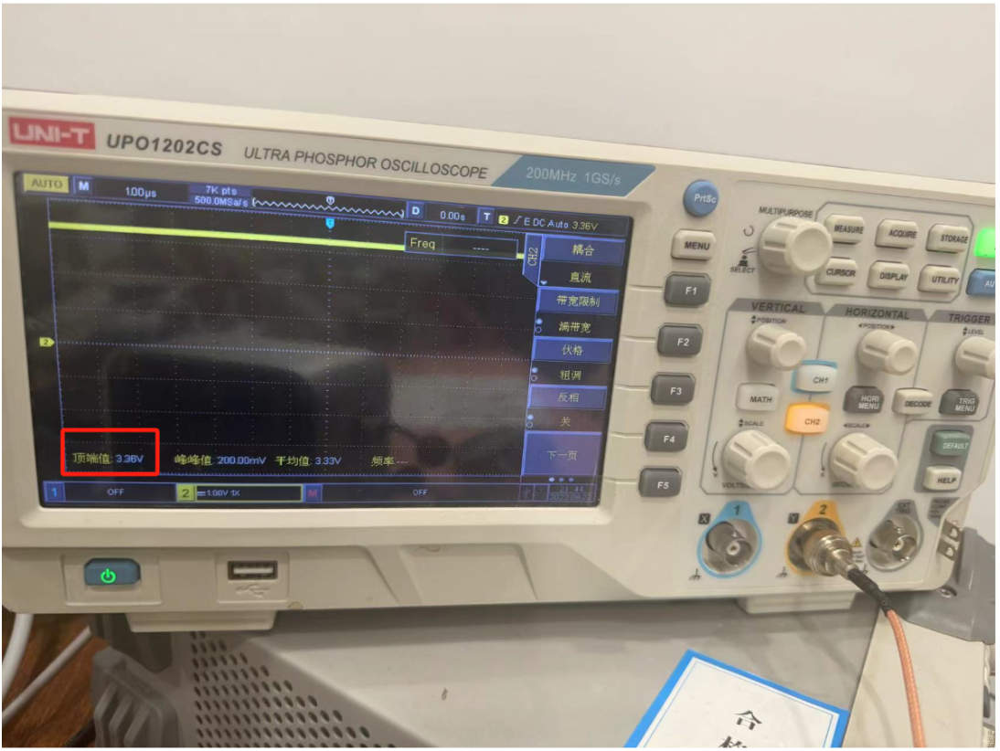
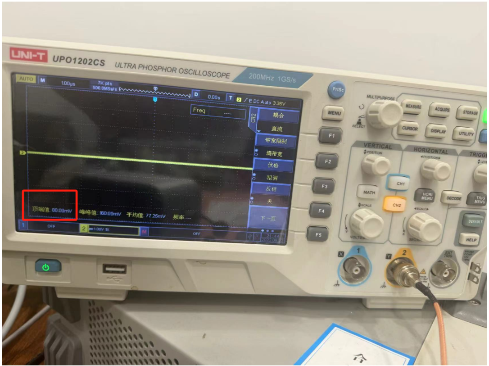
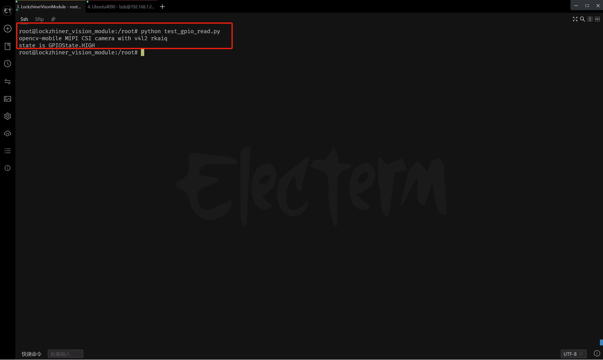

# GPIO使用指南
在外设的使用过程中，最基本的就是GPIO的使用。在本章节，我们将介绍GPIO的使用。

---

## 1. GPIO基本知识
### 1.1 什么是GPIO
GPIO（General Purpose Input/Output，通用输入输出）是微控制器或处理器上的一种引脚，可以由用户配置为输入模式或输出模式，用于与外部设备进行交互。
- 输入模式：GPIO引脚可以读取外部信号的状态（高电平或低电平）。
- 输出模式：GPIO引脚可以输出高电平或低电平信号，驱动外部设备。
### 1.2 GPIO的工作模式
GPIO通常支持以下两种工作模式：
- 输入模式：用于检测外部信号的状态，例如按键输入。
- 输出模式：用于控制外部设备，例如点亮LED灯。
### 1.3 GPIO的状态
GPIO的状态可以是以下三种之一：
- 低电平（LOW）：表示逻辑0，通常对应于0V。
- 高电平（HIGH）：表示逻辑1，通常对应于供电电压（例如3.3V或5V）。
- 错误状态（ERROR）：表示GPIO操作失败。

---

## 2.API文档

### 2.1 头文件
```c++
#include <lockzhiner_vision_module/periphery/gpio/gpio.h>
```
### 2.2 GPIOMode枚举类型
```c++
enum class GPIOMode {
    IN,     ///< 输入模式（信号检测）
    OUT     ///< 输出模式（设备驱动）
};
```
- 作用：定义GPIO引脚的工作模式
- 成员说明：
  - IN：表示输入模式。
  - OUT：表示输出模式。
### 2.3 GPIOState枚举类型
```c++
enum class GPIOState {
    LOW = 0,    ///< 低电平（0V）
    HIGH = 1,    ///< 高电平（3.3V/5V）
    ERROR = 2   ///< 操作异常状态
};
```
- 作用：定义GPIO引脚的状态。
- 成员说明：
  - LOW：表示低电平（0V）。
  - HIGH：表示高电平（3.3V/5V）。
  - ERROR：操作异常状态
### 2.4 GPIOBase类
#### 2.4.1 头文件
```cpp
#include <lockzhiner_vision_module/periphery/gpio/gpio.h>
```
#### 2.4.1 配置GPIO工作模式
```c++
bool config(GPIOMode mode);
```
- 参数：
  - mode：GPIO的工作模式，可以是GPIOMode::IN或GPIOMode::OUT。
- 返回值：
  - true：表示配置成功。
  - false：表示配置失败。
#### 2.4.2 设置GPIO输出状态
```c++
bool Write(GPIOState state);
```
- 参数：
  - state：GPIO的状态，可以是GPIOState::LOW或GPIOState::HIGH。
- 返回值：
  - true：表示设置成功。
  - false'：表示设置失败。
#### 2.4.3 读取GPIO状态
```c++
bool Read(GPIOState& state);
```
- 参数：
  - state：GPIO的状态，用于存储读取到的状态。
- 返回值：
  - true：表示读取成功。
  - false：表示读取失败。
### 2.5 GPIO硬件映射
```c++
/*---- GPIO0系列 ----*/
using GPIO0A0 = GPIOBase<0, 'A', 0>;  ///< 端口0A的第0脚

/*---- GPIO1系列 ----*/
using GPIO1C7 = GPIOBase<1, 'C', 7>;  ///< 端口1C的第7脚

/*---- GPIO2系列 ----*/
using GPIO2A0 = GPIOBase<2, 'A', 0>;  ///< 端口2A的第0脚
using GPIO2A1 = GPIOBase<2, 'A', 1>;  ///< 端口2A的第1脚
```
- 说明：
  - GPIO0A0: 表示端口组0，端口A的第0脚
  - GPIO1C7: 表示端口组1，端口C的第7脚
  - GPIO2A0: 表示端口组2，端口A的第0脚
 
---

## 3. 综合代码解析
### 3.1 GPIO输入模式使用示例
#### 3.1.1 流程图


#### 3.1.2 代码解析
- 创建GPIO0A0对象gpio
```c++
 lockzhiner_vision_module::periphery::GPIO0A0 gpio;
```
- 配置GPIOState变量state
```c++
lockzhiner_vision_module::periphery::GPIOState state;
```
- 配置GPIO为输入模式
```c++
if (!gpio.Config(lockzhiner_vision_module::periphery::GPIOMode::IN)) {
    std::cout << "Failed to config gpio mode" << std::endl;
    return 1;
  }
```
- 读取GPIO状态,如果无法读取的话打印 Failed to read gpio mode。
```c++
if (!gpio.Read(state)) {
  std::cout << "Failed to read gpio mode" << std::endl;
  return 1;
}
```
- 输出结果
```c++
td::cout << "state is " << static_cast<uint8_t>(state) << std::endl;
```
#### 3.1.2 代码实现
```c++
#include <lockzhiner_vision_module/periphery/gpio/gpio.h>

#include <iostream>
#include <thread>

int main()
{
  lockzhiner_vision_module::periphery::GPIO0A0 gpio;

  if (!gpio.Config(lockzhiner_vision_module::periphery::GPIOMode::IN))
  {
    std::cout << "Failed to config gpio mode" << std::endl;
    return 1;
  }

  lockzhiner_vision_module::periphery::GPIOState state;
  if (!gpio.Read(state))
  {
    std::cout << "Failed to read gpio mode" << std::endl;
    return 1;
  }

  std::cout << "state is " << static_cast<uint8_t>(state) << std::endl;
  return 0;
}
```
### 3.2 GPIO输出模式使用示例
#### 3.2.1 流程图


#### 3.2.2 代码解析
- 创建GPIO0A0对象gpio
```c++
lockzhiner_vision_module::periphery::GPIO0A0 gpio;
```
- 配置GPIOState变量state
```c++
lockzhiner_vision_module::periphery::GPIOState state;
```
- 配置GPIO为输出模式
```c++
if (!gpio.Config(lockzhiner_vision_module::periphery::GPIOMode::OUT)) {
    std::cout << "Failed to config gpio mode" << std::endl;
    return 1;
  }
```
- 输出高电平信号
```c++
if (!gpio.Write(lockzhiner_vision_module::periphery::GPIOState::HIGH)) {
    std::cout << "Failed to write gpio mode" << std::endl;
    return 1;
  }
```
#### 3.2.2 代码实现
```c++
#include <lockzhiner_vision_module/periphery/gpio/gpio.h>

#include <iostream>
#include <thread>

int main() {
  lockzhiner_vision_module::periphery::GPIO0A0 gpio;

  if (!gpio.Config(lockzhiner_vision_module::periphery::GPIOMode::OUT)) {
    std::cout << "Failed to config gpio mode" << std::endl;
    return 1;
  }

  if (!gpio.Write(lockzhiner_vision_module::periphery::GPIOState::HIGH)) {
    std::cout << "Failed to config gpio mode" << std::endl;
    return 1;
  }

  for (int i = 0; i < 10; i++) {
    std::cout << "Wait: " << i << "/" << 10 << std::endl;
    std::this_thread::sleep_for(std::chrono::seconds(1));
  }

  if (!gpio.Write(lockzhiner_vision_module::periphery::GPIOState::LOW)) {
    std::cout << "Failed to config gpio mode" << std::endl;
    return 1;
  }

  return 0;
}
```
---
## 4.编译过程
### 4.1 编译环境搭建
- 请确保你已经按照 [开发环境搭建指南](../../../../docs/introductory_tutorial/cpp_development_environment.md) 正确配置了开发环境。
- 同时以正确连接开发板。
### 4.2 Cmake介绍
```cmake
# CMake最低版本要求  
cmake_minimum_required(VERSION 3.10)  

project(test_gpio)

set(CMAKE_CXX_STANDARD 17)
set(CMAKE_CXX_STANDARD_REQUIRED ON)

# 定义项目根目录路径
set(PROJECT_ROOT_PATH "${CMAKE_CURRENT_SOURCE_DIR}/../..")
message("PROJECT_ROOT_PATH = " ${PROJECT_ROOT_PATH})

include("${PROJECT_ROOT_PATH}/toolchains/arm-rockchip830-linux-uclibcgnueabihf.toolchain.cmake")

# 定义 LockzhinerVisionModule SDK 路径
set(LockzhinerVisionModule_ROOT_PATH "${PROJECT_ROOT_PATH}/third_party/lockzhiner_vision_module_sdk")
set(LockzhinerVisionModule_DIR "${LockzhinerVisionModule_ROOT_PATH}/lib/cmake/lockzhiner_vision_module")
find_package(LockzhinerVisionModule REQUIRED)

# 配置 GPIO 输出 Demo
add_executable(Test-GPIO-Write GPIO_Write.cc)
target_include_directories(Test-GPIO-Write PRIVATE ${LOCKZHINER_VISION_MODULE_INCLUDE_DIRS})
target_link_libraries(Test-GPIO-Write PRIVATE ${LOCKZHINER_VISION_MODULE_LIBRARIES})

# 配置 GPIO 读取 Demo
add_executable(Test-GPIO-Read GPIO_Read.cc)
target_include_directories(Test-GPIO-Read PRIVATE ${LOCKZHINER_VISION_MODULE_INCLUDE_DIRS})
target_link_libraries(Test-GPIO-Read PRIVATE ${LOCKZHINER_VISION_MODULE_LIBRARIES})

install(
    TARGETS Test-GPIO-Read
    TARGETS Test-GPIO-Write
    RUNTIME DESTINATION .  
)
```
### 4.3 编译项目
使用 Docker Destop 打开 LockzhinerVisionModule 容器并执行以下命令来编译项目
```bash
# 进入Demo所在目录
cd /LockzhinerVisionModuleWorkSpace/LockzhinerVisionModule/cpp_example/A02_GPIO
# 创建编译目录
rm -rf build && mkdir build && cd build
# 配置交叉编译工具链
export TOOLCHAIN_ROOT_PATH="/LockzhinerVisionModuleWorkSpace/arm-rockchip830-linux-uclibcgnueabihf"
# 使用cmake配置项目
cmake ..
# 执行编译项目
make -j8 && make install
```
---
## 5. 运行效果展示
### 5.1 准备工作
1. 下载凌智视觉模块图片传输助手：[点击下载](https://gitee.com/LockzhinerAI/LockzhinerVisionModule/releases/download/v0.0.0/LockzhinerVisionModuleImageFetcher.exe)

### 5.2 运行过程
在凌智视觉模块中输入以下命令：
```shell
 chmod 777 Test-GPIO-Read
 ./Test-GPIO-Read
 chmod 777 Test-GPIO-Write
 ./Test-GPIO-Write
```
### 5.3 运行结果
- 运行GPIO输出例程
我们可以查看示波器看到，GPIO_0A0输出了3.4V左右的电压

电压持续10s后回复了正常

- 运行GPIO输入例程
可以看到，在接高电平引脚的情况下，引脚的状态信息为 GPIOState.LOW

在接低电平引脚的情况下，引脚的状态信息为 GPIOState.HIGH


---

## 6. 总结
通过上述内容，我们介绍了GPIO的基本概念、API定义以及具体的使用示例。按照以下步骤，您可以轻松地使用GPIO：
- 配置GPIO的工作模式（输入或输出）。
- 根据需求读取或写入GPIO状态。
- 检查操作是否成功，并根据返回值处理异常。


