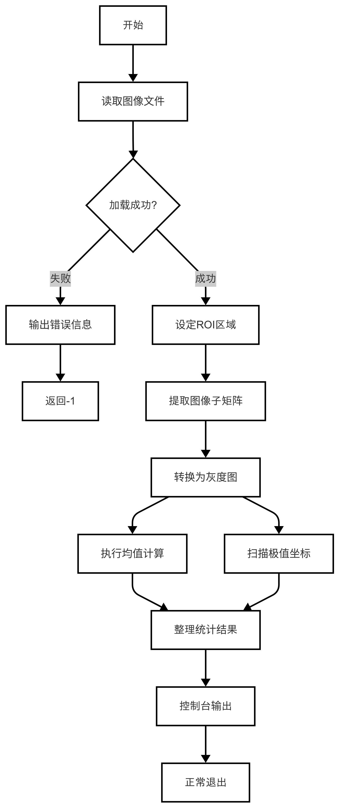
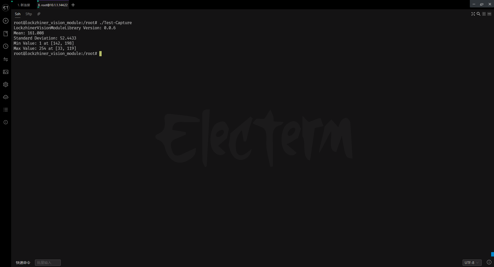

# 使用图像的统计信息
在图像处理中，统计信息可以帮助我们了解图像的特性，例如区域内的像素分布、颜色转换以及特定区域的分析。本章节将介绍如何提取兴趣区域（ROI）、转换颜色通道、计算均值和标准差，以及查找最小值和最大值，并通过一个综合示例展示其实际应用。
## 1.基本知识讲解
### 1.1 图像的兴趣区域（ROI）
- ROI（Region of Interest）：指图像中感兴趣的区域，通常用于局部分析或处理。
- 提取 ROI 的目的是减少数据量并专注于特定区域，从而提高处理效率。
### 1.2 颜色空间转换
- 不同的颜色空间适用于不同的任务。例如：
  - 灰度图：简化图像处理，常用于边缘检测等任务。
  - HSV：用于颜色分割任务，分离色调、饱和度和亮度。
  - LAB：更接近人类视觉感知，适合颜色校正。
### 1.3 图像统计信息
- 均值和标准差：反映图像整体亮度及亮度变化情况。
- 最小值和最大值：帮助识别图像中的极端像素值及其位置。

---

## 2.API文档
### 2.1 头文件
```c++
#include <opencv2/opencv.hpp>
```
### 2.2 提取兴趣区域（ROI）
```c++
cv::Mat roi = image(cv::Rect(x, y, w, h));
```
- 功能：
  - 从图像中提取一个矩形区域。
- 参数：
  - image：输入图像（cv::Mat类型）。
  - (x, y):ROI左上角的坐标。
  - (w, h):ROI的宽高。
- 返回值：
  - 提取出的ROI图像（cv::Mat类型）。
### 2.3 转换为灰度图
```c++
cv::cvtColor(image, grayImage, cv::COLOR_BGR2GRAY);
```
- 功能：
  - 将彩色图像转换为灰度图像。
- 参数：
  - image：输入图像（cv::Mat类型）。
  - grayImage：输出灰度图像（cv::Mat类型）。
  - COLOR_BGR2GRAY：将BGR图像转换为灰度图像。
- 返回值：
  - 无。最后结果储存在grayImage中。
**注意：** 其中根据不同的转换要求可以使用不同的转换代码，具体如下所示。

---
| 转换方向               | 转换代码              | 描述                                   |
|------------------------|-----------------------|----------------------------------------|
| **BGR ↔ Grayscale**    | `cv::COLOR_BGR2GRAY`  | 将 BGR 图像转换为灰度图像               |
|                        | `cv::COLOR_GRAY2BGR`  | 将灰度图像转换为 BGR 图像               |
| **BGR ↔ RGB**          | `cv::COLOR_BGR2RGB`   | 将 BGR 图像转换为 RGB 图像              |
|                        | `cv::COLOR_RGB2BGR`   | 将 RGB 图像转换为 BGR 图像              |
| **BGR ↔ HSV**          | `cv::COLOR_BGR2HSV`   | 将 BGR 图像转换为 HSV 图像              |
|                        | `cv::COLOR_HSV2BGR`   | 将 HSV 图像转换为 BGR 图像              |
| **BGR ↔ LAB**          | `cv::COLOR_BGR2LAB`   | 将 BGR 图像转换为 LAB 图像              |
|                        | `cv::COLOR_Lab2BGR`   | 将 LAB 图像转换为 BGR 图像              |
| **BGR ↔ YUV**          | `cv::COLOR_BGR2YUV`   | 将 BGR 图像转换为 YUV 图像              |
|                        | `cv::COLOR_YUV2BGR`   | 将 YUV 图像转换为 BGR 图像              |
| **BGR ↔ XYZ**          | `cv::COLOR_BGR2XYZ`   | 将 BGR 图像转换为 CIE XYZ 图像          |
|                        | `cv::COLOR_XYZ2BGR`   | 将 CIE XYZ 图像转换为 BGR 图像          |
| **BGR ↔ YCrCb**        | `cv::COLOR_BGR2YCrCb` | 将 BGR 图像转换为 YCrCb 图像            |
|                        | `cv::COLOR_YCrCb2BGR` | 将 YCrCb 图像转换为 BGR 图像            |
| **BGR ↔ HLS**          | `cv::COLOR_BGR2HLS`   | 将 BGR 图像转换为 HLS 图像              |
|                        | `cv::COLOR_HLS2BGR`   | 将 HLS 图像转换为 BGR 图像              |
| **BGR ↔ Luv**          | `cv::COLOR_BGR2Luv`   | 将 BGR 图像转换为 Luv 图像              |
|                        | `cv::COLOR_Luv2BGR`   | 将 Luv 图像转换为 BGR 图像              |
| **BGR ↔ Bayer**        | `cv::COLOR_BayerBG2BGR` | 将 Bayer 格式图像转换为 BGR 图像      |
| **BGR ↔ RGBA**         | `cv::COLOR_BGR2RGBA`  | 将 BGR 图像转换为 RGBA 图像（添加 Alpha 通道） |
|                        | `cv::COLOR_RGBA2BGR`  | 将 RGBA 图像转换为 BGR 图像             |
---

### 2.4 计算均值和标准差：
```c++
cv::meanStdDev(src, mean, stddev);
```
- 功能：
  - 计算图像或矩阵元素的平均值和标准偏差。
- 参数：
  - src：输入图像或矩阵（cv::Mat类型）。
  - mean：输出平均值（cv::Scalar类型）。
  - stddev：输出标准偏差（cv::Scalar类型）。
- 返回值：
  - 无。最后结果储存在mean和stddev中。
### 2.5 计算最小值和最大值：
```c++
cv::minMaxLoc(src, &minVal, &maxVal, &minLoc, &maxLoc);
```
- 功能：
  - 在输入图像或矩阵中找到最小值和最大值。
- 参数：
  - src：输入图像或矩阵（cv::Mat类型）。
  - minVal：输出最小值（double类型）。
  - maxVal：输出最大值（double类型）。
  - minLoc：输出最小值对应的位置（cv::Point类型）。
  - maxLoc：输出最大值对应的位置（cv::Point类型）。
- 返回值：
  - 无。最后结果储存在minVal、maxVal、minLoc和maxLoc中。

---

## 3.综合代码解析

### 3.1 流程图



### 3.2 代码解释
- 读取图像文件
```c++
cv::Mat image = cv::imread("2.jpg");
if (image.empty()) {
    std::cerr << "Error: Could not open image!" << std::endl;
    return -1;
}
```
- 设定ROI区域
```c++
// 定义 ROI 并提取
cv::Rect roiRect(50, 50, 200, 200);
cv::Mat roi = image(roiRect);
```
- 转换为灰度图
```c++
cv::Mat grayRoi;
cv::cvtColor(roi, grayRoi, cv::COLOR_BGR2GRAY);
```
- 均值和标准差计算
```c++
// 计算均值和标准差
cv::Scalar mean, stddev;
cv::meanStdDev(grayRoi, mean, stddev);
```
### 3.3 代码实现
```c++
#include <opencv2/opencv.hpp>
#include <iostream>

int main()
{
    // 读取图像
    cv::Mat image = cv::imread("example.jpg");
    if (image.empty())
    {
        std::cerr << "Error: Could not open image!" << std::endl;
        return -1;
    }

    // 定义 ROI 并提取
    cv::Rect roiRect(50, 50, 200, 200);
    cv::Mat roi = image(roiRect);

    // 转换为灰度图
    cv::Mat grayRoi;
    cv::cvtColor(roi, grayRoi, cv::COLOR_BGR2GRAY);

    // 计算均值和标准差
    cv::Scalar mean, stddev;
    cv::meanStdDev(grayRoi, mean, stddev);

    // 计算最小值和最大值
    double minVal, maxVal;
    cv::Point minLoc, maxLoc;
    cv::minMaxLoc(grayRoi, &minVal, &maxVal, &minLoc, &maxLoc);

    // 输出结果
    std::cout << "Mean: " << mean[0] << std::endl;
    std::cout << "Standard Deviation: " << stddev[0] << std::endl;
    std::cout << "Min Value: " << minVal << " at " << minLoc << std::endl;
    std::cout << "Max Value: " << maxVal << " at " << maxLoc << std::endl;

    return 0;
}
```

---

## 4.编译过程
### 4.1 编译环境搭建
- 请确保你已经按照 [开发环境搭建指南](../../../../docs/introductory_tutorial/cpp_development_environment.md) 正确配置了开发环境。
- 同时以正确连接开发板。
### 4.2 Cmake介绍
```cmake
# CMake最低版本要求  
cmake_minimum_required(VERSION 3.10)  

project(test-Image-information-statistics)

set(CMAKE_CXX_STANDARD 17)
set(CMAKE_CXX_STANDARD_REQUIRED ON)

# 定义项目根目录路径
set(PROJECT_ROOT_PATH "${CMAKE_CURRENT_SOURCE_DIR}/../..")
message("PROJECT_ROOT_PATH = " ${PROJECT_ROOT_PATH})

include("${PROJECT_ROOT_PATH}/toolchains/arm-rockchip830-linux-uclibcgnueabihf.toolchain.cmake")

# 定义 OpenCV SDK 路径
set(OpenCV_ROOT_PATH "${PROJECT_ROOT_PATH}/third_party/opencv-mobile-4.10.0-lockzhiner-vision-module")
set(OpenCV_DIR "${OpenCV_ROOT_PATH}/lib/cmake/opencv4")
find_package(OpenCV REQUIRED)
set(OPENCV_LIBRARIES "${OpenCV_LIBS}")
# 定义 LockzhinerVisionModule SDK 路径
set(LockzhinerVisionModule_ROOT_PATH "${PROJECT_ROOT_PATH}/third_party/lockzhiner_vision_module_sdk")
set(LockzhinerVisionModule_DIR "${LockzhinerVisionModule_ROOT_PATH}/lib/cmake/lockzhiner_vision_module")
find_package(LockzhinerVisionModule REQUIRED)

# 图像信息处理
add_executable(Test-Image-information-statistics Image_information_statistics.cc)
target_include_directories(Test-Image-information-statistics PRIVATE ${LOCKZHINER_VISION_MODULE_INCLUDE_DIRS})
target_link_libraries(Test-Image-information-statistics PRIVATE ${OPENCV_LIBRARIES} ${LOCKZHINER_VISION_MODULE_LIBRARIES})

install(
    TARGETS Test-Image-information-statistics
    RUNTIME DESTINATION .  
)
```
### 4.3 编译项目
使用 Docker Destop 打开 LockzhinerVisionModule 容器并执行以下命令来编译项目
```bash
# 进入Demo所在目录
cd /LockzhinerVisionModuleWorkSpace/LockzhinerVisionModule/cpp_example/B02_Image_information_statistics
# 创建编译目录
rm -rf build && mkdir build && cd build
# 配置交叉编译工具链
export TOOLCHAIN_ROOT_PATH="/LockzhinerVisionModuleWorkSpace/arm-rockchip830-linux-uclibcgnueabihf"
# 使用cmake配置项目
cmake ..
# 执行编译项目
make -j8 && make install
```

在执行完上述命令后，会在build目录下生成可执行文件。

---

## 5. 例程运行示例
### 5.1 运行过程
在凌智视觉模块中输入以下命令：
```shell
chmod 777 Test-Image-information-statistics
./Test-Image-information-statistics
```
### 5.2 运行效果
在运行上述代码时，会输出以下结果：


---

## 6. 总结
通过上述内容，我们介绍了如何使用 OpenCV 提取图像的 ROI、转换颜色空间、计算统计信息等操作。按照以下步骤，您可以轻松地进行图像的统计分析：
- 提取 ROI：使用 cv::Rect 提取感兴趣区域。
- 颜色转换：使用 cv::cvtColor 转换颜色空间。
- 计算统计信息：
  - 使用 cv::meanStdDev 计算均值和标准差。
  - 使用 cv::minMaxLoc 查找最小值和最大值及其位置。
- 综合应用：结合上述方法对图像进行局部分析和全局统计。