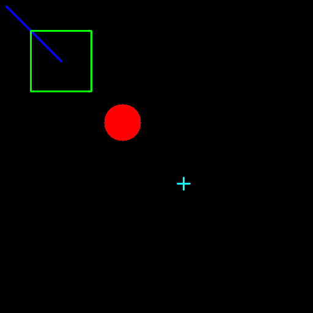

# 画图功能
在计算机视觉和图像处理中，画图功能是非常重要的工具，尤其是在需要向用户反馈信息时。通过绘制线条、矩形框、圆形以及文字等图形元素，可以直观地展示结果或标注关键信息。本章节将介绍 OpenCV 中常用的画图功能，并通过一个综合示例展示其实际应用。
## 1.基本知识讲解
### 1.1 图像画图的重要性
- 视觉反馈：画图功能可以帮助开发者或用户直观地理解算法的输出结果。
- 标注目标：例如在目标检测中，可以用矩形框标注检测到的目标。
- 调试与验证：通过绘制中间结果，可以快速验证算法是否正常工作。
### 1.2 OpenCV 的画图函数
OpenCV 提供了多种画图函数，用于在图像上绘制不同的几何图形和文字。这些函数的核心思想是操作像素矩阵，从而生成所需的图形。

---

## 2.API文档
### 2.1 依赖的头文件
```c++
#include <opencv2/opencv.hpp>
```
### 2.2 画线
```c++
cv::line(image, cv::Point(x0, y0), cv::Point(x1, y1), color, thickness);
```
- 参数说明：
  - image：画图的图像
  - cv::Point(x0, y0)：起点
  - cv::Point(x1, y1)：终点
  - color：线的颜色
  - thickness：线的粗细

### 2.3 画矩形框
```c++
cv::rectangle(image, cv::Rect(x, y, w, h), color, thickness);
```
- 参数说明：
  - image：画图的图像
  - cv::Rect(x, y, w, h)：矩形的左上角坐标和宽高
  - color：线的颜色
  - thickness：线的粗细
### 2.4 画圆
```c++
cv::circle(image, cv::Point(x, y), radius, color, thickness);
```
- 参数说明：
  - image：画图的图像
  - cv::Point(x, y)：圆心坐标
  - radius：圆的半径
  - color：线的颜色
  - thickness：线的粗细
### 2.5 写字
```c++
cv::putText(image, text, cv::Point(x, y), font, fontScale, color, thickness);
```
- 参数说明：
  - image：画图的图像
  - text：要写的文字
  - cv::Point(x, y)：文字的左上角坐标
  - font：字体
  - fontScale：字体大小
  - color：线的颜色
  - thickness：线的粗细

---

## 3. 综合代码解析

### 3.1 流程图


### 3.2 代码解析
- 创建512*512黑色画布
```c++
// 创建一个空白图像 (512x512，3通道)
cv::Mat image = cv::Mat::zeros(512, 512, CV_8UC3);
```
- 绘制蓝色线条
```c++
// 画线
cv::line(image, cv::Point(10, 10), cv::Point(100, 100), cv::Scalar(255, 0, 0), 2);
```
- 绘制绿色矩形
```c++
// 画矩形
cv::rectangle(image, cv::Rect(50, 50, 100, 100), cv::Scalar(0, 255, 0), 2);
```
- 绘制红色实心圆
```c++
// 画圆
cv::circle(image, cv::Point(200, 200), 30, cv::Scalar(0, 0, 255), -1);
```
- 绘制黄色十字
```c++
int cross_x = 300, cross_y = 300, cross_size = 10;
cv::line(image, cv::Point(cross_x - cross_size, cross_y), cv::Point(cross_x + cross_size, cross_y), cv::Scalar(255, 255, 0), 2);
cv::line(image, cv::Point(cross_x, cross_y - cross_size), cv::Point(cross_x, cross_y + cross_size), cv::Scalar(255, 255, 0), 2);
```
- 添加黑色文字
```c++
// 写字
cv::putText(image, "Hello, OpenCV!", cv::Point(10, 400), cv::FONT_HERSHEY_SIMPLEX, 1.0, cv::Scalar(0, 0, 0), 2);
```
### 3.3 代码实现
```c++
#include <opencv2/opencv.hpp>
#include <iostream>

int main()
{
    // 创建一个空白图像 (512x512，3通道)
    cv::Mat image = cv::Mat::zeros(512, 512, CV_8UC3);

    // 画线
    cv::line(image, cv::Point(10, 10), cv::Point(100, 100), cv::Scalar(255, 0, 0), 2);

    // 画矩形
    cv::rectangle(image, cv::Rect(50, 50, 100, 100), cv::Scalar(0, 255, 0), 2);

    // 画圆
    cv::circle(image, cv::Point(200, 200), 30, cv::Scalar(0, 0, 255), -1);

    // 画十字
    int cross_x = 300, cross_y = 300, cross_size = 10;
    cv::line(image, cv::Point(cross_x - cross_size, cross_y), cv::Point(cross_x + cross_size, cross_y), cv::Scalar(255, 255, 0), 2);
    cv::line(image, cv::Point(cross_x, cross_y - cross_size), cv::Point(cross_x, cross_y + cross_size), cv::Scalar(255, 255, 0), 2);

    // 写字
    cv::putText(image, "Hello, OpenCV!", cv::Point(10, 400), cv::FONT_HERSHEY_SIMPLEX, 1.0, cv::Scalar(0, 0, 0), 2);

    // 显示图像
    cv::imshow("Drawing Example", image);
    cv::waitKey(0);

    return 0;
}
```

---

## 4. 编译过程
### 4.1 编译环境搭建
- 请确保你已经按照 [开发环境搭建指南](../../../../docs/introductory_tutorial/cpp_development_environment.md) 正确配置了开发环境。
- 同时以正确连接开发板。
### 4.2 Cmake介绍
```cmake
# CMake最低版本要求  
cmake_minimum_required(VERSION 3.10)  

project(test_draw)

set(CMAKE_CXX_STANDARD 17)
set(CMAKE_CXX_STANDARD_REQUIRED ON)

# 定义项目根目录路径
set(PROJECT_ROOT_PATH "${CMAKE_CURRENT_SOURCE_DIR}/../..")
message("PROJECT_ROOT_PATH = " ${PROJECT_ROOT_PATH})

include("${PROJECT_ROOT_PATH}/toolchains/arm-rockchip830-linux-uclibcgnueabihf.toolchain.cmake")

# 定义 OpenCV SDK 路径
set(OpenCV_ROOT_PATH "${PROJECT_ROOT_PATH}/third_party/opencv-mobile-4.10.0-lockzhiner-vision-module")
set(OpenCV_DIR "${OpenCV_ROOT_PATH}/lib/cmake/opencv4")
find_package(OpenCV REQUIRED)
set(OPENCV_LIBRARIES "${OpenCV_LIBS}")
# 定义 LockzhinerVisionModule SDK 路径
set(LockzhinerVisionModule_ROOT_PATH "${PROJECT_ROOT_PATH}/third_party/lockzhiner_vision_module_sdk")
set(LockzhinerVisionModule_DIR "${LockzhinerVisionModule_ROOT_PATH}/lib/cmake/lockzhiner_vision_module")
find_package(LockzhinerVisionModule REQUIRED)

# 画图示例
add_executable(Test-Draw Draw.cc)
target_include_directories(Test-Draw PRIVATE ${LOCKZHINER_VISION_MODULE_INCLUDE_DIRS})
target_link_libraries(Test-Draw PRIVATE ${OPENCV_LIBRARIES} ${LOCKZHINER_VISION_MODULE_LIBRARIES})

install(
    TARGETS Test-Draw
    RUNTIME DESTINATION .  
)
```
### 4.3 编译项目
使用 Docker Destop 打开 LockzhinerVisionModule 容器并执行以下命令来编译项目
```bash
# 进入Demo所在目录
cd /LockzhinerVisionModuleWorkSpace/LockzhinerVisionModule/cpp_example/B03_Draw
# 创建编译目录
rm -rf build && mkdir build && cd build
# 配置交叉编译工具链
export TOOLCHAIN_ROOT_PATH="/LockzhinerVisionModuleWorkSpace/arm-rockchip830-linux-uclibcgnueabihf"
# 使用cmake配置项目
cmake ..
# 执行编译项目
make -j8 && make install
```

在执行完上述命令后，会在build目录下生成可执行文件。

---

## 5. 例程运行展示
### 5.1 运行过程
在凌智视觉模块中输入以下命令：
```shell
chmod 777 Test-Draw
./Test-Draw
```
### 5.2 运行结果
运行例程代码，我们可以得到下面的图片。


可以看见其中就包含了画图的基本元素存在。

---

## 6. 总结
通过上述内容，我们介绍了 OpenCV 中常用的画图功能及其参数说明，包括：

- 画线：绘制直线。
- 画矩形框：绘制矩形框并支持填充。
- 画圆：绘制圆形并支持填充。
- 写字：在图像上绘制文字。

结合综合示例，您可以轻松地在图像上绘制各种几何图形和文字，从而实现更直观的视觉反馈。这些功能在目标检测、图像标注、调试等场景中非常实用。
