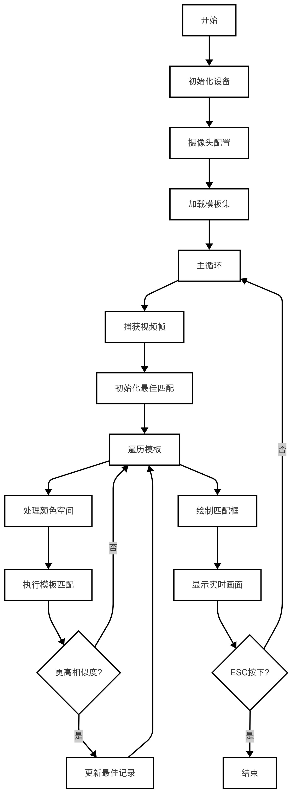
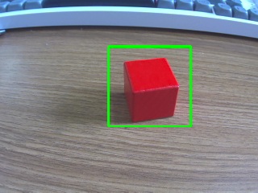
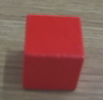
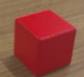
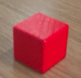
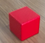

# 多模板匹配
多模板匹配是一种在图像中同时寻找多个模板的技术。通过对每个模板逐一进行匹配，找到与输入图像最相似的区域，并标记出匹配度最高的结果。本章节提供了一个简单的多模板匹配案例，并将其封装为一个自定义函数 multiTemplateMatching，方便快速移植和使用。

## 1. 基本知识讲解
### 1.1 多模板匹配的重要幸
- 目标检测：多模板匹配可以用于检测图像中的多个特定对象。
- 应用场景：广泛应用于物体识别、工业自动化、机器人导航等领域。
- 优势：支持多个模板的同时匹配，能够灵活处理多种目标。
- 局限性：对旋转、缩放和光照变化较为敏感，因此通常需要结合其他技术来提高鲁棒性。
### 1.2 多模板匹配的流程
- 获取输入图像和多个模板图像。
- 遍历每个模板，逐一执行模板匹配算法（如归一化互相关 NCC）。
- 找到每个模板匹配结果中的最大值及其位置。
- 根据相似度阈值筛选匹配结果，并记录匹配度最高的模板。
- 绘制矩形框标记匹配区域并显示结果。

---

## 2. API文档
### 2.1 头文件
```c++
#include <opencv2/opencv.hpp>
```
### 2.2 模板匹配
```c++
cv::matchTemplate(image, templ, result, method);
```
- 功能：在输入图像中搜索模板图像的最佳匹配位置。
- 参数：
    - image：输入图像。
    - templ：模板图像。
    - result：匹配结果图像，输出参数。
    - method：匹配方法，可选值有：
        - CV_TM_SQDIFF：平方差匹配。
- 返回值：无。

### 2.3 查找机制
```c++
cv::minMaxLoc(src, minVal, maxVal, minLoc, maxLoc, mask);
```
- 功能：查找匹配结果图像中的最小值和最大值及其位置。
- 参数：
    - src：输入矩阵。
    - minVal：输出的最小值。
    - maxVal：输出的最大值。
    - minLoc：最小值的位置。
    - maxLoc：最大值的位置。
    - mask：可选的掩码矩阵。
- 返回值：无。

---

## 3. 综合代码解析

### 3.1 流程图



### 3.2 代码解释
- 使用多模板匹配函数
```c++
multiTemplateMatching(img, templates, 0.7, true);
```
自定义多模板匹配函数具体参数如下所示。
```c++
void multiTemplateMatching(const Mat& img, const vector<string>& templatePaths,
                           double threshold = 0.7, bool isGrayscale = false);
```
- 功能：对多个模板逐一执行匹配，并标记匹配度最高的区域。                        
- 参数：
    - img：输入图像。
    - templatePaths：模板图像路径列表。
    - threshold：相似度阈值，默认为 0.7。
    - isGrayscale：是否将输入图像转换为灰度图像，默认为 false。
- 返回值：无。
- 输出结果
```c++
edit.Print(img);
```
### 3.3 完整代码实现
```c++
#include <lockzhiner_vision_module/edit/edit.h>

#include <iostream>
#include <opencv2/opencv.hpp>
#include <string>
#include <vector>

using namespace cv;
using namespace std;

// 多模板匹配函数（支持彩色或灰度图像，仅绘制匹配度最高的框）
void multiTemplateMatching(const Mat &img, const vector<string> &templatePaths,
                           double threshold = 0.7, bool isGrayscale = false)
{
  // 初始化最高匹配度和对应的模板路径、位置
  double bestMatchValue = 0.0;
  string bestMatchTemplatePath = "";
  Rect bestMatchRect;

  // 遍历每个模板路径
  for (const auto &templatePath : templatePaths)
  {
    // 加载模板图像（根据 isGrayscale 决定是灰度还是彩色）
    Mat templ = imread(templatePath, isGrayscale ? IMREAD_GRAYSCALE : IMREAD_COLOR);
    if (templ.empty())
    {
      cerr << "无法加载模板图像: " << templatePath << endl;
      continue;
    }

    // 如果输入图像是灰度图像，则将彩色图像转换为灰度
    Mat inputImage = img.clone();
    if (isGrayscale && inputImage.channels() == 3)
    {
      cvtColor(inputImage, inputImage, COLOR_BGR2GRAY);
    }

    // 创建结果矩阵
    int result_cols = inputImage.cols - templ.cols + 1;
    int result_rows = inputImage.rows - templ.rows + 1;
    Mat result(result_rows, result_cols, CV_32FC1);

    // 执行模板匹配
    matchTemplate(inputImage, templ, result, TM_CCOEFF_NORMED);

    // 查找最佳匹配位置
    double minVal, maxVal;
    Point minLoc, maxLoc;
    minMaxLoc(result, &minVal, &maxVal, &minLoc, &maxLoc);

    // 如果当前模板的最大匹配度高于之前的记录，则更新最佳匹配信息
    if (maxVal > bestMatchValue && maxVal >= threshold)
    {
      bestMatchValue = maxVal;
      bestMatchTemplatePath = templatePath;
      bestMatchRect = Rect(maxLoc.x, maxLoc.y, templ.cols, templ.rows);
    }
  }

  // 如果找到匹配度高于阈值的最佳匹配，则绘制矩形框
  if (!bestMatchTemplatePath.empty())
  {
    rectangle(img, bestMatchRect, Scalar(0, 255, 0), 2); // 绿色矩形框
    cout << "匹配到模板: " << bestMatchTemplatePath
         << ", 匹配度: " << bestMatchValue << endl;
  }
  else
  {
    cout << "未找到匹配度高于阈值的模板。" << endl;
  }
}

int main(int argc, char *argv[])
{
  lockzhiner_vision_module::edit::Edit edit;
  if (!edit.StartAndAcceptConnection())
  {
    std::cerr << "Error: Failed to start and accept connection." << std::endl;
    return EXIT_FAILURE;
  }
  std::cout << "Device connected successfully." << std::endl;

  cv::VideoCapture cap;
  int width = 320;  // 设置摄像头分辨率宽度
  int height = 240; // 设置摄像头分辨率高度
  cap.set(cv::CAP_PROP_FRAME_WIDTH, width);
  cap.set(cv::CAP_PROP_FRAME_HEIGHT, height);

  // 打开摄像头设备
  cap.open(0); // 参数 0 表示默认摄像头设备
  if (!cap.isOpened())
  {
    std::cerr << "Error: Could not open camera." << std::endl;
    return EXIT_FAILURE;
  }

  // 检查命令行参数是否提供了模板路径
  vector<string> templates;
  if (argc < 2)
  {
    cerr << "Usage: " << argv[0] << " template_path1 [template_path2 ...]" << endl;
    return EXIT_FAILURE;
  }

  // 从命令行读取模板路径
  for (int i = 1; i < argc; ++i)
  {
    templates.push_back(argv[i]);
  }

  while (true)
  {
    cv::Mat img; // 存储每一帧图像
    cap >> img;  // 获取新的一帧

    // 检查是否成功读取帧
    if (img.empty())
    {
      std::cerr << "Warning: Couldn't read a frame from the camera."
                << std::endl;
      continue;
    }

    // 执行多模板匹配（示例中仍使用彩色图像）
    multiTemplateMatching(img, templates, 0.7, true);

    // 显示结果
    edit.Print(img);
  }

  return 0;
}
```
### 4.2 Cmake介绍
```cmake
# CMake最低版本要求  
cmake_minimum_required(VERSION 3.10)  

project(test-TemplateMatching-more)

set(CMAKE_CXX_STANDARD 17)
set(CMAKE_CXX_STANDARD_REQUIRED ON)

# 定义项目根目录路径
set(PROJECT_ROOT_PATH "${CMAKE_CURRENT_SOURCE_DIR}/../..")
message("PROJECT_ROOT_PATH = " ${PROJECT_ROOT_PATH})

include("${PROJECT_ROOT_PATH}/toolchains/arm-rockchip830-linux-uclibcgnueabihf.toolchain.cmake")

# 定义 OpenCV SDK 路径
set(OpenCV_ROOT_PATH "${PROJECT_ROOT_PATH}/third_party/opencv-mobile-4.10.0-lockzhiner-vision-module")
set(OpenCV_DIR "${OpenCV_ROOT_PATH}/lib/cmake/opencv4")
find_package(OpenCV REQUIRED)
set(OPENCV_LIBRARIES "${OpenCV_LIBS}")
# 定义 LockzhinerVisionModule SDK 路径
set(LockzhinerVisionModule_ROOT_PATH "${PROJECT_ROOT_PATH}/third_party/lockzhiner_vision_module_sdk")
set(LockzhinerVisionModule_DIR "${LockzhinerVisionModule_ROOT_PATH}/lib/cmake/lockzhiner_vision_module")
find_package(LockzhinerVisionModule REQUIRED)

# 基本图像处理示例
add_executable(Test-TemplateMatching-more Template_Matching_more.cc)
target_include_directories(Test-TemplateMatching-more PRIVATE ${LOCKZHINER_VISION_MODULE_INCLUDE_DIRS})
target_link_libraries(Test-TemplateMatching-more PRIVATE ${OPENCV_LIBRARIES} ${LOCKZHINER_VISION_MODULE_LIBRARIES})

install(
    TARGETS Test-TemplateMatching-more
    RUNTIME DESTINATION .  
)
```

---

## 4. 编译结果
### 4.1 编译环境搭建
- 请确保你已经按照 [开发环境搭建指南](../../../../docs/introductory_tutorial/cpp_development_environment.md) 正确配置了开发环境。
- 同时以正确连接开发板。
### 4.3 编译项目
使用 Docker Destop 打开 LockzhinerVisionModule 容器并执行以下命令来编译项目
```bash
# 进入Demo所在目录
cd /LockzhinerVisionModuleWorkSpace/LockzhinerVisionModule/cpp_example/C03_TemplateMatching_more
# 创建编译目录
rm -rf build && mkdir build && cd build
# 配置交叉编译工具链
export TOOLCHAIN_ROOT_PATH="/LockzhinerVisionModuleWorkSpace/arm-rockchip830-linux-uclibcgnueabihf"
# 使用cmake配置项目
cmake ..
# 执行编译项目
make -j8 && make install
```

在执行完上述命令后，会在build目录下生成可执行文件。

---

## 5. 例程运行示例
### 5.1 准备工作
1. 下载凌智视觉模块图片传输助手：[点击下载](https://gitee.com/LockzhinerAI/LockzhinerVisionModule/releases/download/v0.0.0/LockzhinerVisionModuleImageFetcher.exe)

### 5.2 运行过程
在凌智视觉模块中输入以下命令：
```shell
chmod 777 Test-TemplateMatching-more
# 在实际运行中，模板数量越少，相对来说运行的帧率越高，如需更高帧率请自行降低分辨率。
./Test-TemplateMatching-more template_0.png template_1.png template_2.png template_3.png
```
### 5.3 运行效果
- 运行程序后，您将看到实时视频流中匹配度最高的区域被绿色矩形框标记出来。如果未找到匹配度高于阈值的模板，则会输出提示信息。
- 
- 模板照片如下





---

## 6. 总结
通过上述内容，我们详细介绍了多模板匹配的流程及相关 API 的使用方法，包括：

- 图像读取：加载输入图像和多个模板图像。
- 模板匹配：使用归一化互相关方法计算相似度。
- 查找极值：获取每个模板的最佳匹配位置。
- 绘制与显示：标记匹配度最高的区域并显示结果。
