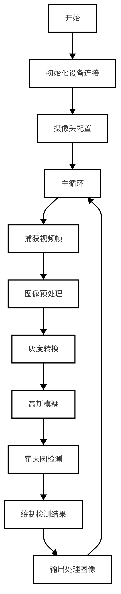
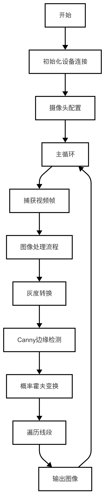
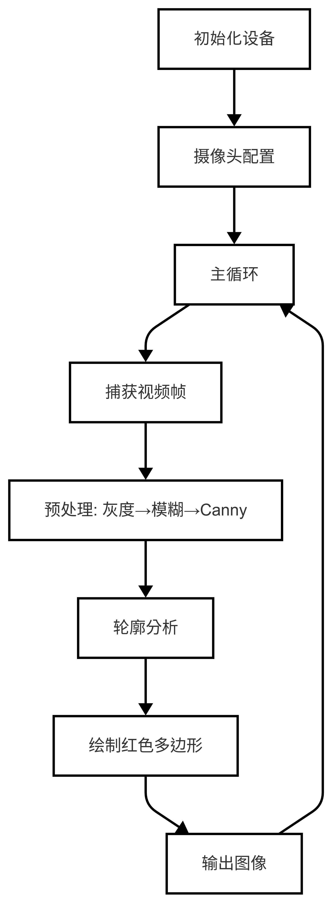
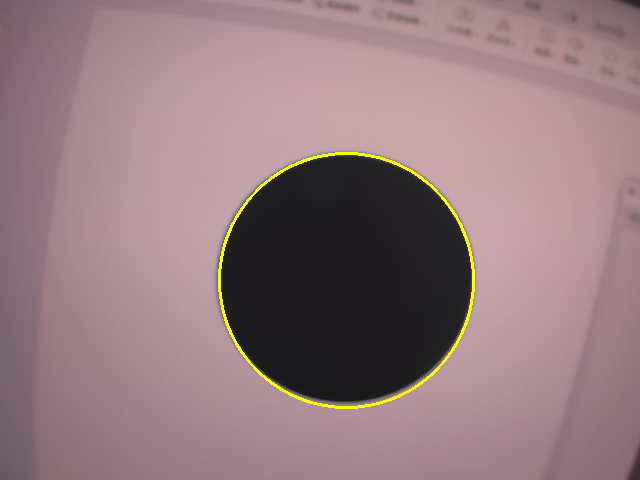
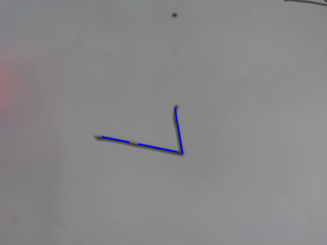
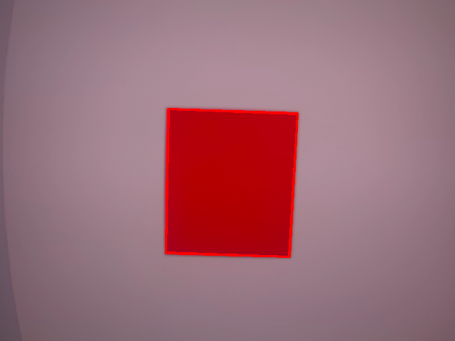

# 轮廓检测
本文档展示了如何使用 OpenCV 进行图像处理和特征检测，包括边缘检测、直线检测、圆检测以及多边形拟合。通过这些技术，可以实现对摄像头捕获的实时视频流进行分析，并标记出检测到的特征。

---

## 1. 基本知识讲解
### 1.1 图像处理的重要性
- 目标检测：图像处理技术可以用于检测图像中的特定对象或特征。
- 应用场景：广泛应用于物体识别、工业自动化、机器人导航、自动驾驶等领域。
- 常见任务：
  - 边缘检测：提取图像中的边界信息。
  - 直线检测：识别图像中的直线结构。
  - 圆检测：识别图像中的圆形结构。
  - 多边形拟合：将轮廓拟合成多边形以简化形状描述。
### 1.2 图像处理的基本流程
- 初始化摄像头：打开摄像头设备并设置分辨率。
- 读取图像帧：从摄像头中获取实时视频帧。
- 预处理：将图像转换为灰度图、降噪等操作。
- 特征检测：执行边缘检测、霍夫变换等算法。
- 结果绘制：在原图上绘制检测到的特征。
- 显示结果：将处理后的图像输出到屏幕。

---

## 2. API文档
### 2.1 头文件
```c++
#include <opencv2/opencv.hpp>
```
### 2.2 高斯模糊
```c++
cv::GaussianBlur(src, dst, Size(3, 3), 0);
```
- 参数：
  - src：输入图像。
  - dst：输出图像。
  - Size(3, 3)：卷积核大小。
  - 0：标准差。
- 返回值：
  - 无。
### 2.3 边缘检测
```c++
cv::Canny(src, dst, 50, 150);
```
- 参数：
  - src：输入图像。
  - dst：输出图像。
  - 50：低阈值。
  - 150：高阈值。
  - apertureSize：Sobel 算子的孔径大小（默认为 3）。
  - L2gradient：是否使用 L2 范数计算梯度（默认为 false）。
- 返回值：
  - 无。
### 2.4 查找图像中的轮廓
```c++
cv::findContours(src, contours, hierarchy, mode, method);
```
- 参数：
  - src：输入图像。
  - contours：轮廓列表。
  - hierarchy：轮廓层级信息。
  - mode：轮廓查找模式（默认为 CV_RETR_EXTERNAL）。
  - method：轮廓 approximation 方法（默认为 CV_CHAIN_APPROX_SIMPLE）。
- 返回值：
  - 无
### 2.5 对轮廓进行多边形拟合
```c++
cv::approxPolyDP(contours[i], approx, epsilon, closed);
```
- 参数：
  - contours[i]：轮廓。
  - approx：多边形顶点列表。
  - epsilon：精度参数，表示最大距离，用于控制多边形拟合的精度。
  - closed：是否闭合多边形（默认为 false）。
- 返回值：
  - 无
### 2.6 使用概率霍夫变换检测直线
```c++
cv::HoughLinesP(src, lines, 1, CV_PI / 180, 50, 50, 10);
```
- 参数：
  - src：输入图像。
  - lines：检测到的直线列表。
  - 1：rho 分辨率。
  - CV_PI / 180：theta 分辨率。
  - 50：最小线段长度。
  - 50：最大线段间隔。
  - 10：线段阈值。
- 返回值：
  - 无
### 2.7 使用霍夫变化检测圆型
```c++
cv::HoughCircles(src, circles, CV_HOUGH_GRADIENT, 1, src.rows / 8, 200, 100, 0, 0);
```
- 参数：
  - src：输入图像。
  - circles：检测到的圆列表。
  - CV_HOUGH_GRADIENT：检测方法。
  - 1：rho 分辨率。
  - src.rows / 8：theta 分辨率。
  - 200：最小圆半径。
  - 100：最大圆半径。
  - 0：圆心 x 坐标。
  - 0：圆心 y 坐标。
- 返回值：
  - 无

---

## 3. 综合代码解析
### 3.1 识别圆
#### 3.1.1 流程图



#### 3.1.2 核心代码解析
- 灰度转换
```c++
cv::cvtColor(src, gray, cv::COLOR_BGR2GRAY);
```
- 高斯模糊
```c++
cv::GaussianBlur(gray, gray, cv::Size(5, 5), 0);
```
- 霍夫圆检测并绘制圆
```c++
std::vector<cv::Vec3f> circles;
cv::HoughCircles(gray, circles, cv::HOUGH_GRADIENT, 1, gray.rows / 16, 100, 30, 1, 300);
for (const cv::Vec3f &circle : circles) {
    cv::Point center(cvRound(circle[0]), cvRound(circle[1]));
    int radius = cvRound(circle[2]);
    cv::circle(src, center, radius, cv::Scalar(0, 255, 255), 2);  // 绘制圆
}
```
#### 3.1.3 完整代码实现
```c++
#include <lockzhiner_vision_module/edit/edit.h>
#include <opencv2/opencv.hpp>
#include <iostream>

int main()
{
    lockzhiner_vision_module::edit::Edit edit;
    if (!edit.StartAndAcceptConnection())
    {
        std::cerr << "Error: Failed to start and accept connection." << std::endl;
        return EXIT_FAILURE;
    }
    std::cout << "Device connected successfully." << std::endl;
    // 初始化摄像头
    cv::VideoCapture cap;
    int width = 640;  // 设置摄像头分辨率宽度
    int height = 480; // 设置摄像头分辨率高度
    cap.set(cv::CAP_PROP_FRAME_WIDTH, width);
    cap.set(cv::CAP_PROP_FRAME_HEIGHT, height);

    cap.open(0); // 参数 0 表示默认摄像头设备
    if (!cap.isOpened())
    {
        std::cerr << "Error: Could not open camera." << std::endl;
        return EXIT_FAILURE;
    }

    while (true)
    {
        // 读取输入图像
        cv::Mat src;
        cap >> src; // 获取新的一帧
        if (src.empty())
        {
            std::cerr << "Warning: Couldn't read a frame from the camera." << std::endl;
            continue;
        }

        // 转换为灰度图像
        cv::Mat gray;
        cv::cvtColor(src, gray, cv::COLOR_BGR2GRAY);

        // 高斯模糊降噪
        cv::GaussianBlur(gray, gray, cv::Size(5, 5), 0);

        // 圆检测（霍夫圆变换）
        std::vector<cv::Vec3f> circles;
        cv::HoughCircles(gray, circles, cv::HOUGH_GRADIENT, 1, gray.rows / 16, 100, 30, 1, 300);
        for (const cv::Vec3f &circle : circles)
        {
            cv::Point center(cvRound(circle[0]), cvRound(circle[1]));
            int radius = cvRound(circle[2]);
            cv::circle(src, center, radius, cv::Scalar(0, 255, 255), 2); // 绘制圆
        }

        edit.Print(src);
    }

    cap.release();
    return 0;
}
```
### 3.2 识别直线
#### 3.2.1 流程图



#### 3.2.2 核心代码解析
- 将原始图像转换为灰度图像
```c++
cv::cvtColor(src, gray, cv::COLOR_BGR2GRAY);
```
- Canny边缘检测
```c++
cv::Canny(gray, edges, 50, 150);
```
- 利用霍夫变换检测直线并在原图像中绘制
```c++
cv::HoughLinesP(edges, lines, 1, CV_PI / 180, 50, 50, 10);
for (const cv::Vec4i &line : lines)
{
    cv::line(src, cv::Point(line[0], line[1]), cv::Point(line[2], line[3]), cv::Scalar(255, 0, 0), 2);
}
```
#### 3.2.3 完整代码实现
```c++
#include <lockzhiner_vision_module/edit/edit.h>
#include <opencv2/opencv.hpp>
#include <iostream>

int main()
{
    lockzhiner_vision_module::edit::Edit edit;
    if (!edit.StartAndAcceptConnection())
    {
        std::cerr << "Error: Failed to start and accept connection." << std::endl;
        return EXIT_FAILURE;
    }
    std::cout << "Device connected successfully." << std::endl;
    // 初始化摄像头
    cv::VideoCapture cap;
    int width = 640;  // 设置摄像头分辨率宽度
    int height = 480; // 设置摄像头分辨率高度
    cap.set(cv::CAP_PROP_FRAME_WIDTH, width);
    cap.set(cv::CAP_PROP_FRAME_HEIGHT, height);

    cap.open(0); // 参数 0 表示默认摄像头设备
    if (!cap.isOpened())
    {
        std::cerr << "Error: Could not open camera." << std::endl;
        return EXIT_FAILURE;
    }

    while (true)
    {
        // 读取输入图像
        cv::Mat src;
        cap >> src; // 获取新的一帧
        if (src.empty())
        {
            std::cerr << "Warning: Couldn't read a frame from the camera." << std::endl;
            continue;
        }

        // 转换为灰度图像
        cv::Mat gray;
        cv::cvtColor(src, gray, cv::COLOR_BGR2GRAY);

        // 边缘检测（Canny）
        cv::Mat edges;
        cv::Canny(gray, edges, 50, 150);

        // 直线检测（霍夫变换）
        std::vector<cv::Vec4i> lines;
        cv::HoughLinesP(edges, lines, 1, CV_PI / 180, 50, 50, 10);
        for (const cv::Vec4i &line : lines)
        {
            cv::line(src, cv::Point(line[0], line[1]), cv::Point(line[2], line[3]), cv::Scalar(255, 0, 0), 2);
        }

        edit.Print(src);
    }

    cap.release();
    return 0;
}
```
### 3.3 识别多边形
#### 3.3.1 流程图



#### 3.3.2 核心代码解析
- 预处理：包括灰度转换、高斯模糊、Canny边缘检测
```c++
cv::cvtColor(src, gray, cv::COLOR_BGR2GRAY);
cv::GaussianBlur(gray, gray, cv::Size(5, 5), 0);
cv::Canny(gray, edges, 50, 150);
```
- 轮廓分析
```c++
std::vector<std::vector<cv::Point>> contours;
cv::findContours(edges, contours, cv::RETR_LIST, cv::CHAIN_APPROX_SIMPLE);
```
- 多边形拟合
```c++
for (size_t i = 0; i < contours.size(); i++) {
  std::vector<cv::Point> approx;
  cv::approxPolyDP(contours[i], approx,
                  cv::arcLength(contours[i], true) * 0.02, true);
  cv::drawContours(polygonImage,
                  std::vector<std::vector<cv::Point>>{approx}, -1,
                  cv::Scalar(0, 0, 255), 2);
}
```
#### 3.3.3 完整代码实现
```c++
#include <lockzhiner_vision_module/edit/edit.h>
#include <iostream>
#include <opencv2/opencv.hpp>

int main()
{
  lockzhiner_vision_module::edit::Edit edit;
  if (!edit.StartAndAcceptConnection())
  {
    std::cerr << "Error: Failed to start and accept connection." << std::endl;
    return EXIT_FAILURE;
  }
  std::cout << "Device connected successfully." << std::endl;
  // 初始化摄像头
  cv::VideoCapture cap;
  int width = 640;  // 设置摄像头分辨率宽度
  int height = 480; // 设置摄像头分辨率高度
  cap.set(cv::CAP_PROP_FRAME_WIDTH, width);
  cap.set(cv::CAP_PROP_FRAME_HEIGHT, height);

  cap.open(0); // 参数 0 表示默认摄像头设备
  if (!cap.isOpened())
  {
    std::cerr << "Error: Could not open camera." << std::endl;
    return EXIT_FAILURE;
  }

  while (true)
  {
    // 读取输入图像
    cv::Mat src;
    cap >> src; // 获取新的一帧
    if (src.empty())
    {
      std::cerr << "Warning: Couldn't read a frame from the camera."
                << std::endl;
      continue;
    }

    // 转换为灰度图像
    cv::Mat gray;
    cv::cvtColor(src, gray, cv::COLOR_BGR2GRAY);

    // 高斯模糊降噪
    cv::GaussianBlur(gray, gray, cv::Size(5, 5), 0);

    // 边缘检测（Canny）
    cv::Mat edges;
    cv::Canny(gray, edges, 50, 150);

    // 查找轮廓
    std::vector<std::vector<cv::Point>> contours;
    cv::findContours(edges, contours, cv::RETR_LIST, cv::CHAIN_APPROX_SIMPLE);

    // 多边形拟合
    cv::Mat polygonImage = src.clone();
    for (size_t i = 0; i < contours.size(); i++)
    {
      std::vector<cv::Point> approx;
      cv::approxPolyDP(contours[i], approx,
                       cv::arcLength(contours[i], true) * 0.02, true);
      cv::drawContours(polygonImage,
                       std::vector<std::vector<cv::Point>>{approx}, -1,
                       cv::Scalar(0, 0, 255), 2);
    }

    edit.Print(polygonImage);
  }

  cap.release();
  return 0;
}
```

---

## 4. 编译过程
### 4.1 编译环境搭建
- 请确保你已经按照 [开发环境搭建指南](../../../../docs/introductory_tutorial/cpp_development_environment.md) 正确配置了开发环境。
- 同时以正确连接开发板。
### 4.2 Cmake介绍
```cmake
# CMake最低版本要求  
cmake_minimum_required(VERSION 3.10)  

project(test_find_contours)

set(CMAKE_CXX_STANDARD 17)
set(CMAKE_CXX_STANDARD_REQUIRED ON)

# 定义项目根目录路径
set(PROJECT_ROOT_PATH "${CMAKE_CURRENT_SOURCE_DIR}/../..")
message("PROJECT_ROOT_PATH = " ${PROJECT_ROOT_PATH})

include("${PROJECT_ROOT_PATH}/toolchains/arm-rockchip830-linux-uclibcgnueabihf.toolchain.cmake")

# 定义 OpenCV SDK 路径
set(OpenCV_ROOT_PATH "${PROJECT_ROOT_PATH}/third_party/opencv-mobile-4.10.0-lockzhiner-vision-module")
set(OpenCV_DIR "${OpenCV_ROOT_PATH}/lib/cmake/opencv4")
find_package(OpenCV REQUIRED)
set(OPENCV_LIBRARIES "${OpenCV_LIBS}")
# 定义 LockzhinerVisionModule SDK 路径
set(LockzhinerVisionModule_ROOT_PATH "${PROJECT_ROOT_PATH}/third_party/lockzhiner_vision_module_sdk")
set(LockzhinerVisionModule_DIR "${LockzhinerVisionModule_ROOT_PATH}/lib/cmake/lockzhiner_vision_module")
find_package(LockzhinerVisionModule REQUIRED)

# 寻找圆型轮廓
add_executable(Test-find-circle find_circle.cc)
target_include_directories(Test-find-circle PRIVATE ${LOCKZHINER_VISION_MODULE_INCLUDE_DIRS})
target_link_libraries(Test-find-circle PRIVATE ${OPENCV_LIBRARIES} ${LOCKZHINER_VISION_MODULE_LIBRARIES})
# 寻找线
add_executable(Test-find-line find_line.cc)
target_include_directories(Test-find-line PRIVATE ${LOCKZHINER_VISION_MODULE_INCLUDE_DIRS})
target_link_libraries(Test-find-line PRIVATE ${OPENCV_LIBRARIES} ${LOCKZHINER_VISION_MODULE_LIBRARIES})
# 寻找多边形
add_executable(Test-find-polygon find_polygon.cc)
target_include_directories(Test-find-polygon PRIVATE ${LOCKZHINER_VISION_MODULE_INCLUDE_DIRS})
target_link_libraries(Test-find-polygon PRIVATE ${OPENCV_LIBRARIES} ${LOCKZHINER_VISION_MODULE_LIBRARIES})

install(
    TARGETS Test-find-circle
    TARGETS Test-find-line
    TARGETS Test-find-polygon
    RUNTIME DESTINATION .  
)
```
### 4.3 编译项目
使用 Docker Destop 打开 LockzhinerVisionModule 容器并执行以下命令来编译项目
```bash
# 进入Demo所在目录
cd /LockzhinerVisionModuleWorkSpace/LockzhinerVisionModule/cpp_example/C04_find_contours
# 创建编译目录
rm -rf build && mkdir build && cd build
# 配置交叉编译工具链
export TOOLCHAIN_ROOT_PATH="/LockzhinerVisionModuleWorkSpace/arm-rockchip830-linux-uclibcgnueabihf"
# 使用cmake配置项目
cmake ..
# 执行编译项目
make -j8 && make install
```

在执行完上述命令后，会在build目录下生成可执行文件。

---

## 5. 例程运行示例
### 5.1 圆识别
```shell
chmod find_circle
./find_circle
```
- 识别结果：


### 5.2 直线识别
```shell
chmod find_line
./find_line
```
- 识别结果：



### 5.3 多边形识别
```shell
chmod find_polygon
./find_polygon
```
- 多边形识别：



---

## 6. 总结
- 本文档深入探讨了使用 OpenCV 进行实时图像处理与特征检测的多种方法，展示了如何通过边缘检测、直线检测、圆检测以及多边形拟合等技术对摄像头捕获的视频流进行分析。同时使用传统视觉方法进行图像识别，对环境非常敏感，推荐使用LockAI目标检测方法进行不同物体的识别以取得更好的效果。
