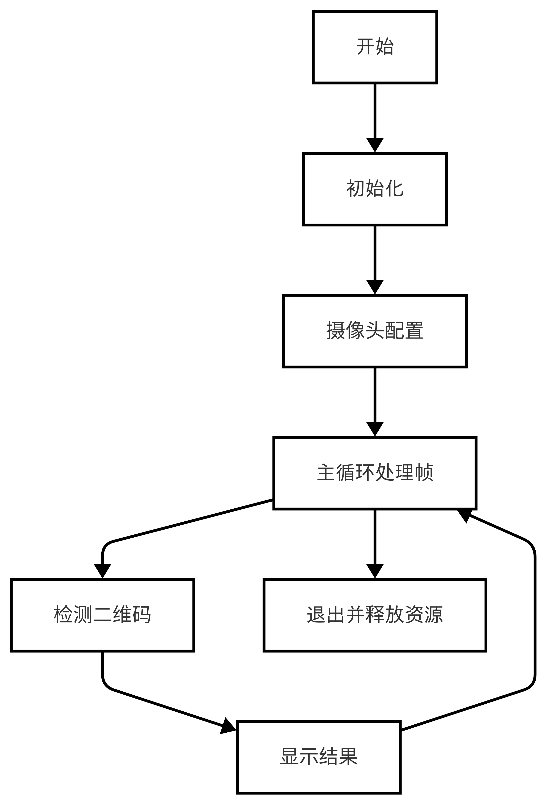
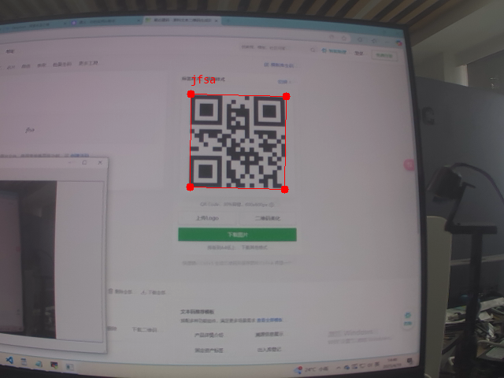

# 二维码识别
二维码识别是视觉模块经常使用到的功能之一，本章节中，我们将教会你如何使用 Lockzhiner Vision Module 进行二维码识别。
## 1. 基本知识讲解
### 1.1 二维码简介
二维码（QR Code）是一种高效的二维条码，能快速存储和读取信息，即使部分损坏也能准确识别。它广泛应用于移动支付、广告、物流、票务等领域，用户只需用智能手机扫描即可获取信息或完成操作，极大提升了效率和便利性。
### 1.2 二维码识别步骤
二维码识别主要通过两个步骤完成：图像捕捉和解码。
- 图像捕捉：使用设备摄像头拍摄包含二维码的图像。
- 解码：软件处理图像，定位并读取二维码中的数据，转换为原始信息。

常用工具如ZXing和OpenCV支持快速集成到应用中，使用户能轻松扫描并获取二维码信息。

---

## 2. C++ API文档
### 2.1 QRCodeDetector类
#### 2.1.1 头文件
```c++
#include <lockzhiner_vision_module/vision/code/code_detector.h>
```
- 作用：用于声明QRCodeDetector类,使得QRCodeDetector类可以在当前源文件中使用。

#### 2.1.2 构造类对象
```c++
lockzhiner_vision_module::vision::QRCodeDetector model;
```
- 作用：用于实现二维码识别。
- 参数说明：
    - 无
- 返回值：
    - 无
#### 2.1.3 Predict函数
```c++
auto results = model.Predict(input_mat);
```
- 作用：QRCodeDetector类中的一个函数，用于实现二维码识别。
- 参数说明:
    - input_mat: 输入参数，类型为cv::Mat，表示要分析的输入图像。
- 返回值：
    - 返回一个包含二维码检测结果的对象集合。每个Result对象包含二维码的位置信息和解码后的文本内容。
### 2.2 Visualize函数
#### 2.2.1 头文件
```c++
#include <lockzhiner_vision_module/vision/utils/visualize.h>
```
- 作用：用于声明Visualize函数，使得Visualize函数可以在当前源文件中使用。
#### 2.2.2 结果可视化
```c++
lockzhiner_vision_module::vision::Visualize(input_image, output_image,
                                              results);
```
- 参数说明：
    - input_image: 输入参数，表示原始输入图像。
    - output_image: 输出参数，用于存储带有可视化结果的输出图像。
    - results: 输入参数，表示二维码检测的结果集。每个Result对象包含二维码的位置信息和解码后的文本内容。
- 返回值：
    - 无

---

## 3. 综合代码介绍

### 3.1 流程图



### 3.2 核心代码解析
- 定义检测模型
```c++
lockzhiner_vision_module::vision::QRCodeDetector model;
```
- 调用摄像头捕获图像
```c++
cv::VideoCapture cap;
// 设置摄像头获取帧的宽高
cap.set(cv::CAP_PROP_FRAME_WIDTH, 640);
cap.set(cv::CAP_PROP_FRAME_HEIGHT, 480);
cap.open(0);

// wihile循环中的以下代码用于捕获图像帧
cap >> input_mat;
if (input_mat.empty())
{
continue;
}
```
- 检测二维码
```c++
auto results = model.Predict(input_mat); 
```

### 3.3 完整代码实现
```c++
#include <lockzhiner_vision_module/vision/code/code_detector.h>
#include <lockzhiner_vision_module/vision/utils/visualize.h>
#include <lockzhiner_vision_module/edit/edit.h>

#include <chrono>
#include <cstdlib>
#include <ctime>
#include <iostream>
#include <opencv2/opencv.hpp>

using namespace std::chrono;

lockzhiner_vision_module::vision::QRCodeDetector model;

int main()
{
  // 初始化 edit 模块
  lockzhiner_vision_module::edit::Edit edit;
  if (!edit.StartAndAcceptConnection())
  {
    std::cerr << "Error: Failed to start and accept connection." << std::endl;
    return EXIT_FAILURE;
  }
  std::cout << "Device connected successfully." << std::endl;

  cv::VideoCapture cap;
  // 设置摄像头获取帧的宽高
  cap.set(cv::CAP_PROP_FRAME_WIDTH, 640);
  cap.set(cv::CAP_PROP_FRAME_HEIGHT, 480);
  cap.open(0);

  if (!cap.isOpened())
  {
    std::cerr << "Error: Could not open camera." << std::endl;
    return EXIT_FAILURE;
  }

  cv::Mat input_mat;

  while (true)
  {
    int read_index = 0;
    int time_ms = 0;

    for (int i = 0; i < 30; i++)
    {
      high_resolution_clock::time_point start_time = high_resolution_clock::now();
      cap >> input_mat;
      if (input_mat.empty())
      {
        continue;
      }
      // 使用 model 对象的 Predict 方法对输入图像进行预测，获取二维码检测结果
      auto results = model.Predict(input_mat);

      high_resolution_clock::time_point end_time = high_resolution_clock::now();
      auto time_span = duration_cast<milliseconds>(end_time - start_time);
      time_ms += time_span.count();
      read_index += 1;

      cv::Mat output_image;
      // 调用 Visualize 函数对原始图像和检测结果进行可视化处理，并将结果存储在 output_image 中
      lockzhiner_vision_module::vision::Visualize(input_mat, output_image, results);
      edit.Print(output_image);
    }

    std::cout << "Frames per second: " << 1000.0 / time_ms * read_index << std::endl;
  }

  cap.release();
  return 0;
}
```

---

## 4. 编译调试
### 4.1 编译环境搭建
- 请确保你已经按照 [开发环境搭建指南](../../../../docs/introductory_tutorial/cpp_development_environment.md) 正确配置了开发环境。
- 同时以正确连接开发板。
### 4.2 Cmake介绍
```cmake
# CMake最低版本要求  
cmake_minimum_required(VERSION 3.10)  

project(test_qr_code_detector)

set(CMAKE_CXX_STANDARD 17)
set(CMAKE_CXX_STANDARD_REQUIRED ON)

# 定义项目根目录路径
set(PROJECT_ROOT_PATH "${CMAKE_CURRENT_SOURCE_DIR}/../..")
message("PROJECT_ROOT_PATH = " ${PROJECT_ROOT_PATH})

include("${PROJECT_ROOT_PATH}/toolchains/arm-rockchip830-linux-uclibcgnueabihf.toolchain.cmake")

# 定义 OpenCV SDK 路径
set(OpenCV_ROOT_PATH "${PROJECT_ROOT_PATH}/third_party/opencv-mobile-4.10.0-lockzhiner-vision-module")
set(OpenCV_DIR "${OpenCV_ROOT_PATH}/lib/cmake/opencv4")
find_package(OpenCV REQUIRED)
set(OPENCV_LIBRARIES "${OpenCV_LIBS}")

# 定义 LockzhinerVisionModule SDK 路径
set(LockzhinerVisionModule_ROOT_PATH "${PROJECT_ROOT_PATH}/third_party/lockzhiner_vision_module_sdk")
set(LockzhinerVisionModule_DIR "${LockzhinerVisionModule_ROOT_PATH}/lib/cmake/lockzhiner_vision_module")
find_package(LockzhinerVisionModule REQUIRED)

# 定义 ZXing SDK 路径
set(ZXing_ROOT_PATH "${PROJECT_ROOT_PATH}/third_party/zxing-cpp-v2.2.1-lockzhiner-vision-module")
set(ZXing_DIR "${ZXing_ROOT_PATH}/lib/cmake/ZXing")
set(ZXing_INCLUDE_DIRS "${ZXing_ROOT_PATH}/include")
find_package(ZXing REQUIRED)
set(ZXing_LIBRARIES "${ZXing_LIBS}")

# 基本图像处理示例
add_executable(Test-qr_code-detector test_qr_code_detector.cc)
target_include_directories(Test-qr_code-detector PRIVATE
    ${ZXing_INCLUDE_DIRS}          
    ${LOCKZHINER_VISION_MODULE_INCLUDE_DIRS}
)
target_link_libraries(Test-qr_code-detector PRIVATE ${OPENCV_LIBRARIES} ${LOCKZHINER_VISION_MODULE_LIBRARIES} ${ZXing_LIBRARIES} )
install(
    TARGETS Test-qr_code-detector
    RUNTIME DESTINATION .  
)
```
### 4.3 编译项目
使用 Docker Destop 打开 LockzhinerVisionModule 容器并执行以下命令来编译项目
```bash
# 进入Demo所在目录
cd /LockzhinerVisionModuleWorkSpace/LockzhinerVisionModule/cpp_example/C06_test_qr_code_detector
# 创建编译目录
rm -rf build && mkdir build && cd build
# 配置交叉编译工具链
export TOOLCHAIN_ROOT_PATH="/LockzhinerVisionModuleWorkSpace/arm-rockchip830-linux-uclibcgnueabihf"
# 使用cmake配置项目
cmake ..
# 执行编译项目
make -j8 && make install
```

在执行完上述命令后，会在build目录下生成可执行文件。

## 5. 例程运行示例
### 5.1 运行前准备
- 请确保你已经参考 [凌智视觉模块摄像头部署指南](../../../periphery/capture/README.md) 正确下载了凌智视觉模块图片传输助手。
### 5.2 运行过程
在凌智视觉模块输入以下命令：
```shell
chmod 777 Test-qr_code-detector 
./Test-qr_code-detector 
```
### 5.3 运行效果


---

## 6. 总结
通过上述内容，我们成功的实现了一个二维码识别系统，包括：

- 获取并加载包含二维码的图像。
- 进行二维码的检测和解码，返回检测和解码后的结果。
- 可视化包含二维码图像的识别结果。
