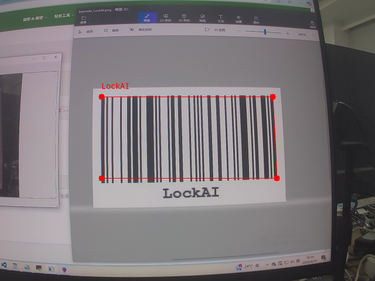

# 条码识别
条码识别是视觉模块经常使用到的功能之一，经常用于识别超市的货物信息。本章节中，我们将教会你如何使用 Lockzhiner Vision Module 进行条码识别。
## 1. 基本知识讲解
### 1.1 条码简介
条码是一种通过宽度不同的平行线条和间隔来表示数据的机器可读形式，能够被扫描设备快速读取并转换为数字信号。被广泛应用于零售、物流、医疗和制造等行业。条码技术提高了数据输入的速度和准确性，降低了成本，并且由于其高效性和兼容性强的特点，成为商品标识、库存管理、货物追踪等操作中不可或缺的一部分。无论是简单的产品编码还是一些复杂的包含文字、网址的信息，条码都能提供可靠的支持。
### 1.2 条码识别步骤
条码码识别主要通过两个步骤完成：图像捕捉和解码。
- 图像捕捉：使用设备摄像头拍摄包含条码的图像。
- 解码：软件处理图像，定位并读取条码中的数据，转换为原始信息。

常用工具如ZXing和ZBar提供了便捷的方法来集成条码识别功能，使得开发者可以轻松实现从图像捕捉到数据解码的过程。用户只需简单操作即可快速获取条码中的信息，极大提高了效率和便利性。

---

## 2. C++ API文档
### 2.1 Code128Detector类
#### 2.1.1 头文件
```c++
#include <lockzhiner_vision_module/vision/code/code_detector.h>
```
- 作用：用于声明Code128Detector类,使得Code128Detector类可以在当前源文件中使用。

#### 2.1.2 构造类对象
```c++
lockzhiner_vision_module::vision::Code128Detector model;
```
- 作用：用于实现条码识别。
- 参数说明：
    - 无
- 返回值：
    - 无

#### 2.1.3 Predict函数
```c++
auto results = model.Predict(input_mat);
```
- 作用：Code128Detector类中的一个函数，用于实现条码识别。
- 参数说明：
    - input_mat: 要识别的图像。
- 返回值：
    - 返回一个包含Code 128格式的条码检测结果的对象集合。每个Result对象包含条码的位置信息和解码后的文本内容。

### 2.2 Visualize函数
#### 2.2.1 头文件
```c++
#include <lockzhiner_vision_module/vision/utils/visualize.h>
```
- 作用：用于声明Visualize函数，使得Visualize函数可以在当前源文件中使用。
#### 2.2.2 结果可视化
```c++
lockzhiner_vision_module::vision::Visualize(input_image, output_image,
                                              results);
```
- 参数说明：
    - input_image: 输入参数，表示原始输入图像。
    - output_image: 输出参数，用于存储带有可视化结果的输出图像。
    - results: 输入参数，表示条码码检测的结果集。每个Result对象包含条码的位置信息和解码后的文本内容。
- 返回值：
    - 无

---

## 3. 综合代码介绍
### 3.1 流程图


### 3.2 核心代码解析
- 初始化
```c++
lockzhiner_vision_module::vision::Code128Detector model;
lockzhiner_vision_module::edit::Edit edit; 
```
- 调用摄像头捕获图像
```c++
cv::VideoCapture cap;
// 设置摄像头获取帧的宽高
cap.set(cv::CAP_PROP_FRAME_WIDTH, 640);
cap.set(cv::CAP_PROP_FRAME_HEIGHT, 480);
cap.open(0);

// wihile循环中的以下代码用于捕获图像帧
cap >> input_mat;
if (input_mat.empty())
{
continue;
}
```
- 条码检测
```c++
auto results = model.Predict(input_mat);
```

### 3.3 完整代码实现
```c++
#include <lockzhiner_vision_module/vision/code/code_detector.h>
#include <lockzhiner_vision_module/vision/utils/visualize.h>
#include <lockzhiner_vision_module/edit/edit.h>

#include <chrono>
#include <cstdlib>
#include <ctime>
#include <iostream>
#include <opencv2/opencv.hpp>

using namespace std::chrono;

lockzhiner_vision_module::vision::Code128Detector model;

int main()
{
  // 初始化 edit 模块
  lockzhiner_vision_module::edit::Edit edit;
  if (!edit.StartAndAcceptConnection())
  {                                                                           
    std::cerr << "Error: Failed to start and accept connection." << std::endl; 
    return EXIT_FAILURE;                                                       
  }

  std::cout << "Device connected successfully." << std::endl;

  cv::VideoCapture cap;
  // 设置摄像头获取帧宽高             
  cap.set(cv::CAP_PROP_FRAME_WIDTH, 640);  
  cap.set(cv::CAP_PROP_FRAME_HEIGHT, 480); 
  cap.open(0);                             

  if (!cap.isOpened())
  {                                                            
    std::cerr << "Error: Could not open camera." << std::endl; 
    return EXIT_FAILURE;                                     
  }

  cv::Mat input_mat; 

  while (true)
  {                     
    int read_index = 0; 
    int time_ms = 0;   

    for (int i = 0; i < 30; i++)
    {
      // 获取当前时间点作为开始时间                                                                           
      high_resolution_clock::time_point start_time = high_resolution_clock::now(); 
      cap >> input_mat;                                                            
      if (input_mat.empty())
      {           
        continue; 
      }
      // 使用 model 对象的 Predict 方法对输入图像进行预测，获取条码检测结果
      auto results = model.Predict(input_mat); 
      // 获取当前时间点作为结束时间
      high_resolution_clock::time_point end_time = high_resolution_clock::now(); 
      auto time_span = duration_cast<milliseconds>(end_time - start_time);       
      time_ms += time_span.count();                                              
      read_index += 1;                                                          

      cv::Mat output_image; 
      // 调用 Visualize 函数对原始图像和检测结果进行可视化处理，并将结果存储在 output_image 中                                                         
      lockzhiner_vision_module::vision::Visualize(input_mat, output_image, results); 
      edit.Print(output_image);                                                      
    }

    std::cout << "Frames per second: " << 1000.0 / time_ms * read_index << std::endl; 
  }

  cap.release(); 
  return 0;
}
```

---

## 4. 编译调试
### 4.1 编译环境搭建
- 请确保你已经按照 [开发环境搭建指南](../../../../docs/introductory_tutorial/cpp_development_environment.md) 正确配置了开发环境。
- 同时以正确连接开发板。
### 4.2 Cmake介绍
```cmake
# CMake最低版本要求  
cmake_minimum_required(VERSION 3.10)  

project(test_bar_codeDetector)

set(CMAKE_CXX_STANDARD 17)
set(CMAKE_CXX_STANDARD_REQUIRED ON)

# 定义项目根目录路径
set(PROJECT_ROOT_PATH "${CMAKE_CURRENT_SOURCE_DIR}/../..")
message("PROJECT_ROOT_PATH = " ${PROJECT_ROOT_PATH})

include("${PROJECT_ROOT_PATH}/toolchains/arm-rockchip830-linux-uclibcgnueabihf.toolchain.cmake")

# 定义 OpenCV SDK 路径
set(OpenCV_ROOT_PATH "${PROJECT_ROOT_PATH}/third_party/opencv-mobile-4.10.0-lockzhiner-vision-module")
set(OpenCV_DIR "${OpenCV_ROOT_PATH}/lib/cmake/opencv4")
find_package(OpenCV REQUIRED)
set(OPENCV_LIBRARIES "${OpenCV_LIBS}")

# 定义 LockzhinerVisionModule SDK 路径
set(LockzhinerVisionModule_ROOT_PATH "${PROJECT_ROOT_PATH}/third_party/lockzhiner_vision_module_sdk")
set(LockzhinerVisionModule_DIR "${LockzhinerVisionModule_ROOT_PATH}/lib/cmake/lockzhiner_vision_module")
find_package(LockzhinerVisionModule REQUIRED)

# 定义 ZXing SDK 路径
set(ZXing_ROOT_PATH "${PROJECT_ROOT_PATH}/third_party/zxing-cpp-v2.2.1-lockzhiner-vision-module")
set(ZXing_DIR "${ZXing_ROOT_PATH}/lib/cmake/ZXing")
set(ZXing_INCLUDE_DIRS "${ZXing_ROOT_PATH}/include")
find_package(ZXing REQUIRED)
set(ZXing_LIBRARIES "${ZXing_LIBS}")

# 基本图像处理示例
add_executable(test-bar-codeDetector test_bar_codeDetector.cc)
target_include_directories(test-bar-codeDetector PRIVATE
    ${ZXing_INCLUDE_DIRS}          
    ${LOCKZHINER_VISION_MODULE_INCLUDE_DIRS}
)
target_link_libraries(test-bar-codeDetector PRIVATE ${OPENCV_LIBRARIES} ${LOCKZHINER_VISION_MODULE_LIBRARIES} ${ZXing_LIBRARIES} )
install(
    TARGETS test-bar-codeDetector
    RUNTIME DESTINATION .  
)
```
### 4.3 编译项目
使用 Docker Destop 打开 LockzhinerVisionModule 容器并执行以下命令来编译项目
```bash
# 进入Demo所在目录
cd /LockzhinerVisionModuleWorkSpace/LockzhinerVisionModule/cpp_example/C07_test_bar_codeDetector
# 创建编译目录
rm -rf build && mkdir build && cd build
# 配置交叉编译工具链
export TOOLCHAIN_ROOT_PATH="/LockzhinerVisionModuleWorkSpace/arm-rockchip830-linux-uclibcgnueabihf"
# 使用cmake配置项目
cmake ..
# 执行编译项目
make -j8 && make install
```

在执行完上述命令后，会在build目录下生成可执行文件。

---

## 5. 例程运行示例
### 5.1 运行前准备
- 请确保你已经参考 [凌智视觉模块摄像头部署指南](../../../periphery/capture/README.md) 正确下载了凌智视觉模块图片传输助手。
### 5.2 运行过程
在凌智视觉模块输入以下命令：
```shell
chmod 777 test-bar-codeDetector
./test-bar-codeDetector
```
### 5.3 运行效果


---

## 6. 总结
通过上述内容，我们成功的实现了一个条码识别系统，包括：

-  获取并加载包含code 128格式的条码图像。
- 进行条码的检测和解码，返回检测和解码后的结果。
- 可视化包含条码图像的识别结果。
