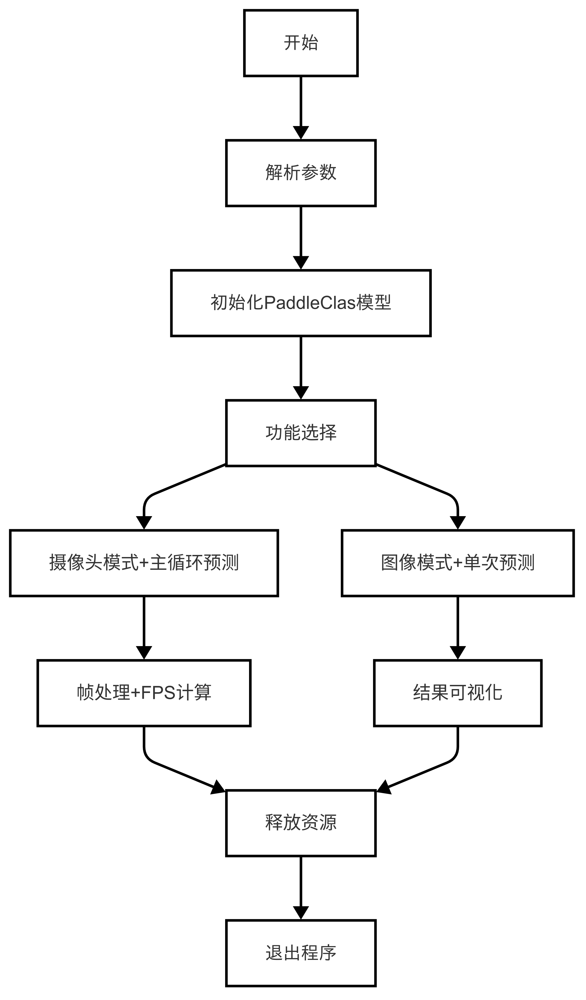
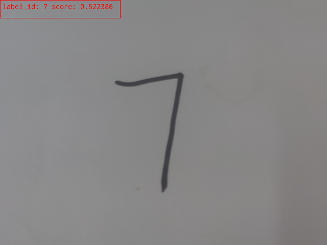
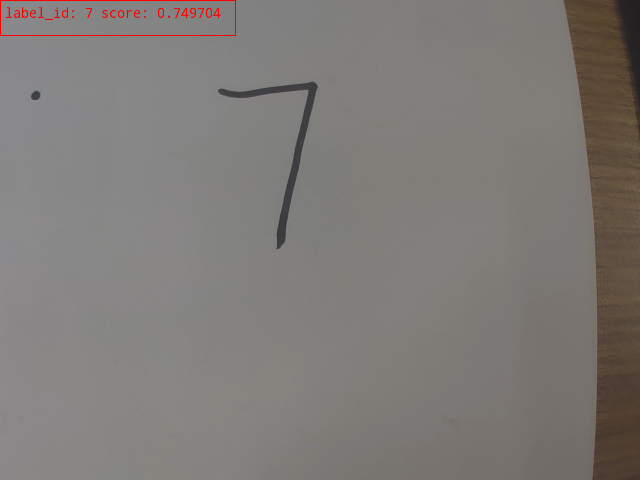

# 手写数字识别
手写数字识别是一种经典的模式识别和图像处理问题，旨在通过计算机自动识别用户手写的数字。本章节中，我们将教会你如何使用 Lockzhiner Vision Module 进行手写数字识别。
## 1. 基本知识讲解
### 1.1 手写数字识别简介
手写数字识别是一种利用计算机视觉和机器学习技术自动识别手写数字的过程。它通过图像预处理、特征提取和模型训练来实现高效准确的数字识别。被广泛应用于银行支票处理、邮政编码识别及考试评分等场景。这项技术不仅提高了数据处理的速度和准确性，还极大地简化了输入流程，为金融、邮政和教育等行业带来了显著的便利。
### 1.2 手写数字识别常用方法
目前，实现手写数字识别方法有很多，常用的方法如下：
- 卷积神经网络（CNN）：最流行的方法之一，能够自动从图像中学习特征。适用于复杂背景和不同书写风格的手写数字识别。
- 支持向量机（SVM）：一种传统的机器学习方法，通过提取图像的特征（如HOG特征）进行分类，适合处理较为规范的手写数字。
- K近邻算法（KNN）：基于相似度的分类方法，通过比较待识别数字与训练样本的距离来进行分类，简单但计算成本较高。

---

## 2. C++ API文档
### 2.1 PaddleClas类
#### 2.1.1 头文件
```c++
#include <lockzhiner_vision_module/vision/deep_learning/classification/paddle_clas.h>
```
- 作用：用于声明PaddleClas类，使得PaddleClas类可以在当前源文件中使用。

#### 2.1.2 构造类函数
```c++
lockzhiner_vision_module::vision::PaddleClas model;
```
- 作用：用于实现手写数字识别。
- 参数说明：
    - 无
- 返回值：
    - 无

#### 2.1.3 Predict函数
```c++
auto result = model.Predict(input_mat);
```
- 作用：PaddleClas类中的一个函数，用于实现手写数字识别。
- 参数说明：
    - input_mat：要识别的图像。
- 返回值：
    - 返回一个包含手写数字分类结果的对象。该Result对象包含预测得分（score）和对应的标签ID（label_id），即识别出的手写数字。

### 2.2 Visualize函数
#### 2.2.1 头文件
```c++
#include <lockzhiner_vision_module/vision/utils/visualize.h>
```
- 作用：用于声明Visualize函数，使得Visualize函数可以在当前源文件中使用。
#### 2.2.2 结果可视化
```c++
lockzhiner_vision_module::vision::Visualize(input_mat, output_image, result);
```
- 参数说明：
    - input_mat：表示原始输入图像。
    - output_image：用于存储带有可视化结果的输出图像。
    - result：输入参数，表示手写数字识别的结果。该Result对象包含预测得分（score）和对应的标签ID（label_id）。
- 返回值：
    - 无

---

## 3. 综合代码解析
### 3.1 流程图



### 3.2 核心代码解析
- 初始化分类模型
```cpp
lockzhiner_vision_module::vision::PaddleClas model;
```
自定义函数参数如下
- 图片手写数字识别
```c++
int TestImage(const std::string& image_path)
```
- 参数说明：
    - image_path：输入参数，表示包含手写数字的图像文件路径。
- 返回值：
    - 返回0表示成功执行，并保存执行结果为"cls_result.png"。

- 摄像头实时手写数字识别
```c++
int TestCapture()
```
- 参数说明：
    - 无
- 返回值：
    - 返回0表示执行成功，并将检测结果绘制在原始图像上。程序会持续从摄像头读取帧并进行处理，直到手动终止程序。

### 3.3 完整代码实现
```c++
#include <lockzhiner_vision_module/vision/deep_learning/classification/paddle_clas.h>
#include <lockzhiner_vision_module/vision/utils/visualize.h>
#include <lockzhiner_vision_module/edit/edit.h>
#include <chrono>
#include <cstdlib>
#include <ctime>
#include <iostream>
#include <opencv2/opencv.hpp>

using namespace std::chrono;

lockzhiner_vision_module::vision::PaddleClas model;

int TestCapture()
{
  // 初始化 edit 模块
  lockzhiner_vision_module::edit::Edit edit;
  if (!edit.StartAndAcceptConnection())
  {
    std::cerr << "Error: Failed to start and accept connection." << std::endl;
    return EXIT_FAILURE;
  }
  std::cout << "Device connected successfully." << std::endl;

  cv::VideoCapture cap; 
  // 设置摄像头长宽
  cap.set(cv::CAP_PROP_FRAME_WIDTH, 640);
  cap.set(cv::CAP_PROP_FRAME_HEIGHT, 480);
  cap.open(0);

  if (!cap.isOpened())
  {
    std::cerr << "Error: Could not open camera." << std::endl;
    return EXIT_FAILURE;
  }

  cv::Mat input_mat;
  while (true)
  {
    int read_index = 0;
    int time_ms = 0;
    for (int i = 0; i < 30; i++)
    {
      // 获取当前时间点作为开始时间
      high_resolution_clock::time_point start_time =
          high_resolution_clock::now();
      cap >> input_mat;
      if (input_mat.empty())
      {
        continue;
      }
      // 使用 model 对象的 Predict 方法对输入图像进行预测
      auto result = model.Predict(input_mat);
      // 获取当前时间点作为结束时间
      high_resolution_clock::time_point end_time = high_resolution_clock::now();
      auto time_span = duration_cast<milliseconds>(end_time - start_time);
      time_ms += time_span.count();
      read_index += 1;

      std::cout << "score is " << result.score << ";label_id is "
                << result.label_id << std::endl;

      cv::Mat output_image;
      lockzhiner_vision_module::vision::Visualize(input_mat, output_image,
                                                  result);
      // 使用 edit 模块处理帧
      edit.Print(output_image);
    }
    std::cout << "Frames per second: " << 1000.0 / time_ms * read_index
              << std::endl;
  }
  cap.release();
  return 0;
}

int TestImage(const std::string &image_path)
{
  cv::Mat input_image = cv::imread(image_path);
  auto result = model.Predict(input_image);
  std::cout << "score is " << result.score << ";label_id is " << result.label_id
            << std::endl;
  cv::Mat output_image;
  lockzhiner_vision_module::vision::Visualize(input_image, output_image,
                                              result);
  cv::imwrite("cls_result.png", output_image);
  return 0;
}

int main(int argc, char *argv[])
{
  if (argc != 3)
  {
    std::cerr << "Usage: Test-PaddleClas model_path <Capture|image_path>"
              << std::endl;
    return 1;
  }

  if (!model.Initialize(argv[1]))
  {
    std::cout << "Failed to initialize model." << std::endl;
    return 1;
  }

  std::string argument(argv[2]);
  if (argument == "Capture")
  {
    return TestCapture();
  }
  else
  {
    return TestImage(argument);
  }
  return 0;
}
```

---

## 4. 编译调试
### 4.1 编译环境搭建
- 请确保你已经按照 [开发环境搭建指南](../../../../docs/introductory_tutorial/cpp_development_environment.md) 正确配置了开发环境。
- 同时已经正确连接开发板。
### 4.2 Cmake介绍
```cmake
cmake_minimum_required(VERSION 3.10)

project(test_DigitHandRecog)

set(CMAKE_CXX_STANDARD 17)
set(CMAKE_CXX_STANDARD_REQUIRED ON)

# 定义项目根目录路径
set(PROJECT_ROOT_PATH "${CMAKE_CURRENT_SOURCE_DIR}/../..")
message("PROJECT_ROOT_PATH = " ${PROJECT_ROOT_PATH})

include("${PROJECT_ROOT_PATH}/toolchains/arm-rockchip830-linux-uclibcgnueabihf.toolchain.cmake")

# 定义 OpenCV SDK 路径
set(OpenCV_ROOT_PATH "${PROJECT_ROOT_PATH}/third_party/opencv-mobile-4.10.0-lockzhiner-vision-module")
set(OpenCV_DIR "${OpenCV_ROOT_PATH}/lib/cmake/opencv4")
find_package(OpenCV REQUIRED)
set(OPENCV_LIBRARIES "${OpenCV_LIBS}")

# 定义 LockzhinerVisionModule SDK 路径
set(LockzhinerVisionModule_ROOT_PATH "${PROJECT_ROOT_PATH}/third_party/lockzhiner_vision_module_sdk")
set(LockzhinerVisionModule_DIR "${LockzhinerVisionModule_ROOT_PATH}/lib/cmake/lockzhiner_vision_module")
find_package(LockzhinerVisionModule REQUIRED)

add_executable(Test-DigitHandRecog DigitHandRecog.cc)
target_include_directories(Test-DigitHandRecog PRIVATE ${LOCKZHINER_VISION_MODULE_INCLUDE_DIRS})
target_link_libraries(Test-DigitHandRecog PRIVATE ${OPENCV_LIBRARIES} ${LOCKZHINER_VISION_MODULE_LIBRARIES})

install(
    TARGETS Test-DigitHandRecog
    RUNTIME DESTINATION .  
)
```
### 4.3 编译项目
使用 Docker Destop 打开 LockzhinerVisionModule 容器并执行以下命令来编译项目
```bash
# 进入Demo所在目录
cd /LockzhinerVisionModuleWorkSpace/LockzhinerVisionModule/cpp_example/D02_DigitHandRecog
# 创建编译目录
rm -rf build && mkdir build && cd build
# 配置交叉编译工具链
export TOOLCHAIN_ROOT_PATH="/LockzhinerVisionModuleWorkSpace/arm-rockchip830-linux-uclibcgnueabihf"
# 使用cmake配置项目
cmake ..
# 执行编译项目
make -j8 && make install
```

在执行完上述命令后，会在build目录下生成可执行文件。

---

## 5. 例程运行示例
### 5.1 运行前准备
- 请确保你已经下载了 [凌智视觉模块手写数字分类模型](https://gitee.com/LockzhinerAI/LockzhinerVisionModule/releases/download/v0.0.0/LZ-DigitHandRecog.rknn)
### 5.2 运行过程
在凌智视觉模块输入以下命令：
```shell
chmod 777 Test-DigitHandRecog
# 调用摄像头实时识别
./Test-DigitHandRecog LZ-DigitHandRecog.rknn Capture
# 单张图像识别
./Test-DigitHandRecog LZ-DigitHandRecog.rknn image_path
```
### 5.3 运行效果
- 图像识别效果图
    
- 摄像头实时识别效果图
    

---

## 6. 总结
通过上述内容，我们成功的实现了一个手写数字识别系统，包括：

- 获取并加载包含手写数字的图像。
- 进行手写数字的检测和分类，返回检测和分类后的结果。
- 可视化包含手写数字图像的识别结果。