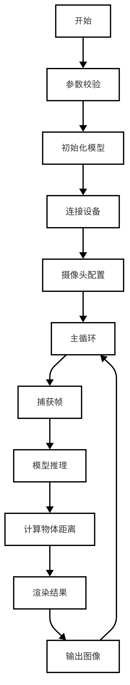
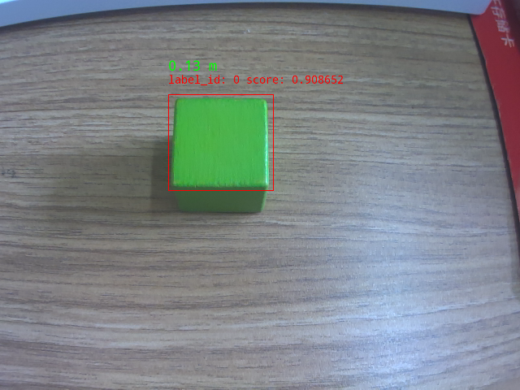

# 测距
本系统基于单目摄像头和目标检测模型，通过目标的真实物理尺寸和其在图像中的像素大小之间的关系，计算目标与摄像头之间的距离。该方案适用于嵌入式设备或高性能计算平台，并支持实时测距和可视化显示。
## 1. 基础知识 
### 1.1 测距原理
利用单目摄像头成像几何关系，测距公式如下：
$ 距离 = \frac{真实物体大小 \times 相机焦距}{目标在图像中的像素大小} $
- 真实物体大小：目标的实际物理尺寸（单位：米）。
- 相机焦距：需要通过标定获得，或者通过实验调整得到合适的值。
- 目标在图像中的像素大小：通过目标检测模型获取目标的边界框宽度和高度，并取其平均值作为目标的像素大小。
### 1.2 实现步骤
在实现测距系统的过程中，最重要的一步就是先检测到目标，通过判断目标的像素和实际大小的一个转换关系，从而得到目标与摄像头之间的距离。在本次实验中，我们就综合目标检测来做测距实验。
- 初始化目标检测模型：
  - 加载预训练的目标检测模型（如 PaddleDet）。
  - 初始化外部设备连接（如串口通信模块）。
- 捕获视频流：
  - 打开摄像头，设置分辨率（如 640x480）。
  - 捕获每一帧图像。
- 目标检测与测距：
  - 使用目标检测模型对每一帧图像进行预测，获取目标的边界框信息。
  - 根据边界框的宽度和高度计算目标的像素大小。
  - 使用测距公式计算目标与摄像头的距离。
- 结果可视化：
  - 在图像上绘制目标的边界框。
  - 将计算出的距离信息标注在图像上。
  - 将处理后的图像发送到外部设备显示。
- 循环运行：
  - 实时处理每一帧图像，直到用户退出程序。

---

## 2. API说明
### 2.1 PaddleDetection 类
#### 2.1.1 头文件
```cpp
#include <lockzhiner_vision_module/vision/deep_learning/detection/paddle_det.h>
```
#### 2.1.2 构造函数
```cpp
lockzhiner_vision_module::vision::PaddleDetection();
```
- 作用：
  - 创建一个 PaddleDetection 对象，并初始化相关成员变量。
- 参数：
  - 无
- 返回值：
  - 无
#### 2.1.3 Initialize函数
```cpp
bool Initialize(const std::string& model_path);
```
- 作用：
  - 加载预训练的 PaddleDetection 模型。
- 参数：
  - model_path：模型路径，包含模型文件和参数文件。
- 返回值：
  - true：模型加载成功。
  - false：模型加载失败。
#### 2.1.4 SetThreshold函数
```cpp
void SetThreshold(float score_threshold = 0.5, float nms_threshold = 0.3);
```
- 作用：
  - 设置目标检测的置信度阈值和NMS阈值。
- 参数：
  - score_threshold：置信度阈值，默认值为0.5。
  - nms_threshold：NMS阈值，默认值为0.3。
- 返回值：
  - 无
#### 2.1.5 Predict函数
```cpp
std::vector<lockzhiner_vision_module::vision::DetectionResult> Predict(const cv::Mat& image);
```
- 作用：
  - 使用加载的模型对输入图像进行目标检测，返回检测结果。
- 参数：
  - input_mat (const cv::Mat&): 输入的图像数据，通常是一个 cv::Mat 变量。
- 返回值：
  - 返回一个包含多个 DetectionResult 对象的向量，每个对象表示一个检测结果。
### 2.2 DetectionResult 类
#### 2.2.1 头文件
```cpp
#include <lockzhiner_vision_module/vision/utils/visualize.h>
```
#### 2.2.2 box函数
```cpp
lockzhiner_vision_module::vision::Rect box() const;
```
- 作用：
  - 获取目标检测结果的边界框。
- 参数：
  - 无
- 返回值：
  - 返回一个 lockzhiner_vision_module::vision::Rect 对象，表示目标检测结果的边界框。
#### 2.2.3 score函数
```cpp
float score() const;
```
- 作用：
  - 获取目标检测结果的置信度得分。
- 参数：
  - 无
- 返回值：
  - 返回一个 float 类型的置信度得分。
#### 2.2.4 label_id函数
- 作用：
  - 获取目标检测结果的标签ID。
- 参数：
  - 无
- 返回值：
  - 返回一个整数，表示目标检测结果的标签ID。
### 2.3 Visualize 函数
```cpp
void lockzhiner_vision_module::vision::Visualize(
    const cv::Mat& input_mat,
    cv::Mat& output_image,
    const std::vector<lockzhiner_vision_module::vision::DetectionResult>& results,
    const std::vector<std::string>& labels = {},
    float font_scale = 0.4
);
```
- 作用：
  - 将目标检测结果可视化到输入图像上，并返回可视化后的图像。
- 参数：
  - input_mat (const cv::Mat&): 输入图像。
  - output_image (cv::Mat&): 输出图像，包含标注后的结果。
  - results (const std::vector<lockzhiner_vision_module::vision::DetectionResult>&): 检测结果列表。
  - labels (const std::vector<std::string>&): 可选的标签列表，用于标注类别名称，默认为空。
  - font_scale (float): 字体大小比例，默认为 0.4。
- 返回值：
  - 无
---

## 3. 综合代码解析

### 3.1 流程图



### 3.2 核心代码解析
- 初始化模型
```cpp
lockzhiner_vision_module::vision::PaddleDet model;
if (!model.Initialize(argv[1])) {
    std::cout << "Failed to initialize model." << std::endl;
    return 1;
}
```
- 模型推理
```cpp
auto results = model.Predict(input_mat);
```
- 计算物体距离
```cpp
for (size_t i = 0; i < results.size(); ++i) {
    int width = results[i].box.width;
    int height = results[i].box.height;
    // 计算目标的平均像素大小
    float pixel_size = (width + height) / 2.0f;
    // 计算距离
    float distance = CalculateDistance(pixel_size, REAL_OBJECT_SIZE, FOCAL_LENGTH);
    // 将距离信息存储到 label_id 中（需要转换为整数）
    results[i].label_id = static_cast<int>(distance * 100);  // 单位：厘米
}
```
CalculateDistance函数具体参数定义如下所示。
```c++
float CalculateDistance(float pixel_size, float real_size, float focal_length) 
```
- 参数：
  - pixel_size：目标在图像中的像素大小，单位为像素。
  - real_size：目标的实际物理尺寸，单位为米。
  - focal_length：相机焦距，单位为像素。
- 返回值：目标与摄像头之间的距离，单位为米。

### 3.3 完整代码实现
```c++
#include <lockzhiner_vision_module/vision/deep_learning/detection/paddle_det.h>
#include <lockzhiner_vision_module/vision/utils/visualize.h>
#include <lockzhiner_vision_module/edit/edit.h>
#include <chrono>
#include <cstdlib>
#include <ctime>
#include <iomanip>  
#include <iostream>
#include <sstream>  
#include <opencv2/opencv.hpp>

const float REAL_OBJECT_SIZE = 0.02f;
const float FOCAL_LENGTH = 800.0f;

float CalculateDistance(float pixel_size, float real_size, float focal_length) {
    return (real_size * focal_length) / pixel_size;
}

int main(int argc, char *argv[]) {
    if (argc != 2) {
        std::cerr << "Usage: Test-PaddleDet model_path" << std::endl;
        return 1;
    }

    // 初始化模型和设备连接
    lockzhiner_vision_module::vision::PaddleDet model;
    if (!model.Initialize(argv[1])) {
        std::cout << "Failed to initialize model." << std::endl;
        return 1;
    }

    lockzhiner_vision_module::edit::Edit edit;
    if (!edit.StartAndAcceptConnection()) {
        std::cerr << "Error: Failed to start and accept connection." << std::endl;
        return EXIT_FAILURE;
    }

    cv::VideoCapture cap;
    cap.set(cv::CAP_PROP_FRAME_WIDTH, 640);
    cap.set(cv::CAP_PROP_FRAME_HEIGHT, 480);
    cap.open(0);

    if (!cap.isOpened()) {
        std::cerr << "Error: Could not open camera." << std::endl;
        return 1;
    }

    cv::Mat input_mat;
    while (true) {
        cap >> input_mat;
        if (input_mat.empty()) {
            std::cerr << "Warning: Captured an empty frame." << std::endl;
            continue;
        }

        // 预测并可视化结果
        auto start_time = std::chrono::high_resolution_clock::now();
        auto results = model.Predict(input_mat);
        auto end_time = std::chrono::high_resolution_clock::now();
        auto time_span = std::chrono::duration_cast<std::chrono::milliseconds>(end_time - start_time);
        std::cout << "Inference time: " << time_span.count() << " ms" << std::endl;

        cv::Mat output_image;
        lockzhiner_vision_module::vision::Visualize(input_mat, output_image, results);

        // 在每个检测框上绘制距离信息
        for (size_t i = 0; i < results.size(); ++i) {
            int width = results[i].box.width;
            int height = results[i].box.height;
            float pixel_size = (width + height) / 2.0f;
            float distance = CalculateDistance(pixel_size, REAL_OBJECT_SIZE, FOCAL_LENGTH);

            // 格式化距离文本（保留两位小数）
            std::stringstream ss;
            ss << std::fixed << std::setprecision(2) << distance << " m";
            std::string distance_text = ss.str();

            // 在检测框左上方绘制距离
            cv::Rect box = results[i].box;
            cv::putText(
                output_image,
                distance_text,
                cv::Point(box.x, box.y - 25),  // 在框上方5像素处显示
                cv::FONT_HERSHEY_SIMPLEX,
                0.5,  // 字体大小
                cv::Scalar(0, 255, 0),  // 绿色文本
                2  // 线宽
            );
        }

        // 显示结果到外部设备
        edit.Print(output_image);
    }

    cap.release();
    return 0;
}
```

---

## 4. 编译过程
### 4.1 编译环境搭建
- 请确保你已经按照 [开发环境搭建指南](../../../../docs/introductory_tutorial/cpp_development_environment.md) 正确配置了开发环境。
- 同时以正确连接开发板。
### 4.2 Cmake介绍
```cmake
cmake_minimum_required(VERSION 3.10)

project(test_distance)

set(CMAKE_CXX_STANDARD 17)
set(CMAKE_CXX_STANDARD_REQUIRED ON)

# 定义项目根目录路径
set(PROJECT_ROOT_PATH "${CMAKE_CURRENT_SOURCE_DIR}/../..")
message("PROJECT_ROOT_PATH = " ${PROJECT_ROOT_PATH})

include("${PROJECT_ROOT_PATH}/toolchains/arm-rockchip830-linux-uclibcgnueabihf.toolchain.cmake")

# 定义 OpenCV SDK 路径
set(OpenCV_ROOT_PATH "${PROJECT_ROOT_PATH}/third_party/opencv-mobile-4.10.0-lockzhiner-vision-module")
set(OpenCV_DIR "${OpenCV_ROOT_PATH}/lib/cmake/opencv4")
find_package(OpenCV REQUIRED)
set(OPENCV_LIBRARIES "${OpenCV_LIBS}")

# 定义 LockzhinerVisionModule SDK 路径
set(LockzhinerVisionModule_ROOT_PATH "${PROJECT_ROOT_PATH}/third_party/lockzhiner_vision_module_sdk")
set(LockzhinerVisionModule_DIR "${LockzhinerVisionModule_ROOT_PATH}/lib/cmake/lockzhiner_vision_module")
find_package(LockzhinerVisionModule REQUIRED)

add_executable(Test-distance distance.cc)
target_include_directories(Test-distance PRIVATE ${LOCKZHINER_VISION_MODULE_INCLUDE_DIRS})
target_link_libraries(Test-distance PRIVATE ${OPENCV_LIBRARIES} ${LOCKZHINER_VISION_MODULE_LIBRARIES})

install(
    TARGETS Test-distance
    RUNTIME DESTINATION .  
)
```
### 4.3 编译项目
使用 Docker Destop 打开 LockzhinerVisionModule 容器并执行以下命令来编译项目
```bash
# 进入Demo所在目录
cd /LockzhinerVisionModuleWorkSpace/LockzhinerVisionModule/cpp_example/D04_distance
# 创建编译目录
rm -rf build && mkdir build && cd build
# 配置交叉编译工具链
export TOOLCHAIN_ROOT_PATH="/LockzhinerVisionModuleWorkSpace/arm-rockchip830-linux-uclibcgnueabihf"
# 使用cmake配置项目
cmake ..
# 执行编译项目
make -j8 && make install
```

在执行完上述命令后，会在build目录下生成可执行文件。

---

## 5. 例程运行示例
### 5.1 运行
```shell
chmod 777 Test-distance
# 实际使用过程中 LZ-Picodet 需要替换为你需要的rknn模型。
./Test-distance LZ-Picodet
```
### 5.2 结果展示
- 我们可以看见,在label_id中显示了实时距离，同时正确识别了绿色方块。


---

## 6. 总结
本系统通过结合目标检测模型和测距公式，实现了基于单目摄像头的实时测距功能。但是需要注意的是单目摄像头的测距只是大致测距，收到环境和检测质量的影响非常大，同时误差也几乎是不可控的。如有精确的测距需求，建议采用双目摄像头或其他测距方案实现。
