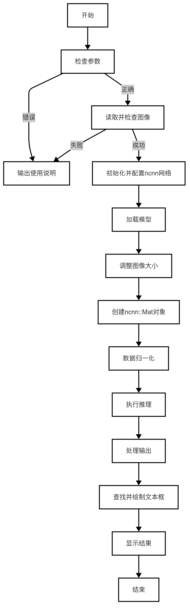
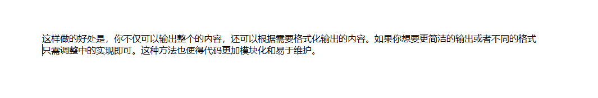
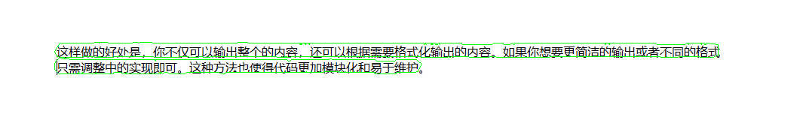

# OCR 文本框检测
本章节在Lockzhiner Vision Module 上基于OcrLiteNcnn模型, 实现了一个OCR文本框检测系统。
## 1. 基本知识讲解
### 1.1 文本检测简介
文本检测是一种识别图像中文字位置的技术，作为光学字符识别（OCR）的一部分，它能准确找出并定位图片或视频中的文字区域。适用于文档数字化、车牌识别、实时翻译和辅助视障人士等场景，通过自动化提取文本信息，极大提升了信息处理的效率与便捷性。
### 1.2 文本检测常用方法
- 连通域分析：适用于前景与背景对比明显的图像，通过识别连通区域定位文本。
- 边缘检测：利用Canny算子找到文本边缘，适合处理倾斜或弯曲的文本。
- 深度学习：使用卷积神经网络（CNN）等模型自动提取特征，特别擅长自然场景中的多方向和多尺度文本检测。

---

## 2. C++ API 文档
### 2.1 Net类
#### 2.1.1 头文件
```cpp
#include <ncnn/net.h>
```
- 作用：用于声明Net类，使得Net类可以在当前文件中使用。

#### 2.1.2 构造类函数
```cpp
ncnn::Net net;
```
- 作用：创建一个Net类型的对象实例，用于实现文字区域的检测。
- 参数说明：
    - 无
- 返回值：
    - 无

#### 2.1.3 load_param函数
```cpp
int load_param(const DataReader& dr);
```
- 参数说明：
    - dr：传入的参数文件路径。
- 返回值：
    - 返回值为0表示加载参数文件成功。

#### 2.1.4 load_model函数
```cpp
int load_model(const DataReader& dr);
```
- 参数说明：
    - dr：传入的模型文件路径。
- 返回值：返回值为0表示加载模型成功。

#### 2.1.5 from_pixels函数
```cpp
ncnn::Mat::from_pixels(srcResize.data, ncnn::Mat::PIXEL_BGR, srcResize.cols, srcResize.rows);
```
- 参数说明：
    - srcResize.data：输入图像的像素数据指针。
    - ncnn::Mat::PIXEL_BGR：输入像素数据的颜色格式。
    - srcResize.cols：输入图像的宽度。
    - srcResize.rows：输入图像的高度。
- 返回值：适配成 NCNN 所需的格式的包含图像数据的新对象。

### 2.2 Extractor类
#### 2.2.1 头文件
```cpp
#include <ncnn/net.h>
```
- 作用：用于声明Extractor类，使得Extractor类可以在当前文件中使用。

#### 2.2.2 构造类函数
```cpp
ncnn::Extractor extractor = net.create_extractor();
```
- 作用：从已经加载了神经网络模型的 net 中创建一个 Extractor 实例，用于执行文本区域框检测的推理任务。
- 参数说明：
    - 无
- 返回值：
    - 无

---

## 3. OCR 文本检测代码解析
### 3.1 流程图



### 3.2 核心代码解析
- 加载模型参数和权重
```cpp
net.load_param(argv[2]);
net.load_model(argv[3])
```
自定义函数说明
- 计算图像缩放比例以适应目标尺寸
```cpp
ScaleParam getScaleParam(const cv::Mat &src, const int targetSize);
``` 
- 参数说明：
    - src：输入的原始图像。
    - targetSize：目标尺寸大小。
- 返回值：
    - 返回一个 ScaleParam 结构体，该结构体包含了原图尺寸、缩放后的尺寸以及缩放比例等信息。

- 向量归一化函数
```cpp
cv::Point2f normalize(const cv::Point2f& v);
```
- 作用：
    - 计算向量长度并归一化，用于后续几何变换（如多边形扩展方向计算）。
- 参数说明：
    - v：待归一化的二维向量。
- 返回值：
    - 返回单位长度的向量，若输入向量为零向量则返回(0, 0)。

- 多边形扩张函数：用于扩大文本框边界
```cpp
std::vector<cv::Point> expandPolygon(const std::vector<cv::Point>& inBox, float distance)  
```
- 作用：
    - 基于邻边法线方向计算角平分线，向外扩展多边形边界，增强文本检测框的包容性。
- 参数说明：
    - inBox：输入的多边形顶点集合。
    - distance：扩展距离，控制文本框膨胀程度。
- 返回值：
    - 返回扩展后的新多边形顶点集合。

- 文本检测框提取
```cpp
std::vector<TextBox> findRsBoxes(const cv::Mat &fMapMat, const cv::Mat &norfMapMat, ScaleParam &s, const float boxScoreThresh, const float unClipRatio);
```
- 作用：
    - 结合轮廓检测与UNet式后处理，生成最终文本检测框。
- 参数说明：
    - fMapMat：DBNet输出的概率图。
    - norfMapMat：二值化后的概率图。
    - s：图像缩放参数结构体。
    - boxScoreThresh：文本框置信度阈值。
    - unClipRatio：边界扩展系数。
- 返回值:
    - 返回包含文本框坐标、置信度的结构体列表。

### 3.3 完整代码实现
```cpp
#include <unistd.h>
#include <iostream>
#include <opencv2/core/core.hpp>
#include <opencv2/highgui/highgui.hpp>
#include <opencv2/imgproc/imgproc.hpp>
#include <ncnn/net.h>
#include <chrono>
#include <cstdlib>
#include <ctime>

using namespace cv;
using namespace std::chrono;


// 定义必要的参数
const float meanValues[3] = {0.485f * 255, 0.456f * 255, 0.406f * 255};
const float normValues[3] = {1.0f / 0.229f / 255.0f, 1.0f / 0.224f / 255.0f, 1.0f / 0.225f / 255.0f};

// 图像缩放参数定义
struct ScaleParam {
    int srcWidth;
    int srcHeight;
    int dstWidth;
    int dstHeight;
    float ratioWidth;
    float ratioHeight;
};

// 文本框结构体的定义
struct TextBox {
    std::vector<cv::Point> boxPoint;
    float score;
};

// 计算图像缩放比例以适应目标尺寸
ScaleParam getScaleParam(const cv::Mat &src, const int targetSize) {
    int imgHeight = src.rows;
    int imgWidth = src.cols;
    float ratio = std::min(static_cast<float>(targetSize) / imgHeight, static_cast<float>(targetSize) / imgWidth);
    ScaleParam scaleParam;
    scaleParam.srcHeight = imgHeight;
    scaleParam.srcWidth = imgWidth;
    scaleParam.dstHeight = static_cast<int>(imgHeight * ratio);
    scaleParam.dstWidth = static_cast<int>(imgWidth * ratio);
    scaleParam.ratioHeight = ratio;
    scaleParam.ratioWidth = ratio;
    return scaleParam;
}

// 向量归一化函数
cv::Point2f normalize(const cv::Point2f& v) {
    float len = std::sqrt(v.x * v.x + v.y * v.y);
    // 防止除以零
    if (len == 0) return cv::Point2f(0, 0); 
    return cv::Point2f(v.x / len, v.y / len);
}

// 多边形扩张函数：用于扩大文本框边界
std::vector<cv::Point> expandPolygon(const std::vector<cv::Point>& inBox, float distance) {
    std::vector<cv::Point> outBox;
    int n = inBox.size();
    // 确保输入至少是一个三角形
    if (n < 3) return outBox; 

    for (int i = 0; i < n; ++i) {
        cv::Point2f prev = inBox[(i + n - 1) % n];
        cv::Point2f curr = inBox[i];
        cv::Point2f next = inBox[(i + 1) % n];

        cv::Point2f v1 = cv::Point2f(curr.x - prev.x, curr.y - prev.y);
        cv::Point2f v2 = cv::Point2f(next.x - curr.x, next.y - curr.y);

        cv::Point2f normal1(-v1.y, v1.x);
        cv::Point2f normal2(-v2.y, v2.x);

        normal1 = normalize(normal1);
        normal2 = normalize(normal2);

        cv::Point2f bisectorNormal = normal1 + normal2;
        bisectorNormal = normalize(bisectorNormal);

        cv::Point2f newPoint = curr + bisectorNormal * distance;

        outBox.push_back(cv::Point(newPoint.x, newPoint.y));
    }

    return outBox;
}

// 查找并处理文本框区域
std::vector<TextBox> findRsBoxes(const cv::Mat &fMapMat, const cv::Mat &norfMapMat, ScaleParam &s,
                                 const float boxScoreThresh, const float unClipRatio) {
    float minArea = 3;
    std::vector<TextBox> rsBoxes;
    std::vector<std::vector<cv::Point>> contours;
    cv::findContours(norfMapMat, contours, cv::RETR_LIST, cv::CHAIN_APPROX_SIMPLE);

    for (size_t i = 0; i < contours.size(); ++i) {
        double perimeter = cv::arcLength(contours[i], true);
        cv::RotatedRect minRect = cv::minAreaRect(contours[i]);
        float minSideLen = std::min(minRect.size.width, minRect.size.height);

        if (minSideLen < minArea)
            continue;

        // 创建一个掩码图像
        cv::Mat mask = cv::Mat::zeros(fMapMat.size(), CV_8UC1);
        cv::drawContours(mask, contours, static_cast<int>(i), cv::Scalar(255), cv::FILLED);

        // 计算掩码内部的平均得分
        cv::Scalar meanScore = cv::mean(fMapMat, mask);
        float score = static_cast<float>(meanScore[0]);

        if (score < boxScoreThresh)
            continue;

        // 使用expandPolygon实现多边形扩张
        double area = cv::contourArea(contours[i]);
        float distance = unClipRatio * area / static_cast<float>(perimeter);
        std::vector<cv::Point> clipBox = expandPolygon(contours[i], distance);

        if (minSideLen < minArea + 2)
            continue;

        for (auto &point : clipBox) {
            point.x = std::max(0, std::min(static_cast<int>(point.x / s.ratioWidth), s.srcWidth - 1));
            point.y = std::max(0, std::min(static_cast<int>(point.y / s.ratioHeight), s.srcHeight - 1));
        }

        rsBoxes.emplace_back(TextBox{clipBox, score});
    }
    return rsBoxes;
}

// 绘制文本框到图像上
void drawTextBox(cv::Mat &boxImg, const std::vector<cv::Point> &box, int thickness) {
    for (size_t i = 0; i < box.size(); ++i) {
        cv::line(boxImg, box[i], box[(i + 1) % box.size()], cv::Scalar(0, 255, 0), thickness);
    }
}

int main(int argc, char** argv) {
    if(argc != 4) {
        std::cerr << "Usage: " << argv[0] << " <image_path> <param_path> <bin_path>" << std::endl;
        return -1;
    }
    // 读取输入图像
    cv::Mat src = cv::imread(argv[1], cv::IMREAD_COLOR); 
    if(src.empty()) {
        std::cerr << "Failed to read image: " << argv[1] << std::endl;
        return -1;
    }

    ncnn::Net net;
    // 禁用一些可能不被支持的功能
    net.opt.use_vulkan_compute = false; 
    net.opt.use_bf16_storage = false;
    net.opt.use_fp16_packed = false;
    net.opt.use_fp16_storage = false;
    net.opt.use_fp16_arithmetic = false;

    // 加载模型参数和权重文件
    if (net.load_param(argv[2]) != 0 || net.load_model(argv[3]) != 0) {
        std::cerr << "Failed to load model from " << argv[2] << " and " << argv[3] << std::endl;
        return -1;
    }
    std::cout << "Model loaded successfully." << std::endl;
    // 736是自定义的参数，可以自己设置
    ScaleParam scaleParam = getScaleParam(src, 736);

    std::cout << " scaleParam successfully." << std::endl;
    float boxScoreThresh = 0.5f;
    float boxThresh = 0.3f;
    float unClipRatio = 3.5f;

    cv::Mat srcResize;
    resize(src, srcResize, cv::Size(scaleParam.dstWidth, scaleParam.dstHeight));
    std::cout << " resize successfully." << std::endl;

    // 准备输入数据，并进行均值标准化
    ncnn::Mat input = ncnn::Mat::from_pixels(srcResize.data, ncnn::Mat::PIXEL_BGR, srcResize.cols, srcResize.rows);
    input.substract_mean_normalize(meanValues, normValues);

    // 创建推理器并执行推理
    high_resolution_clock::time_point start_time =
          high_resolution_clock::now();
    ncnn::Extractor extractor = net.create_extractor();
    extractor.input("input0", input);
    ncnn::Mat out;
    extractor.extract("out1", out);
    high_resolution_clock::time_point end_time = high_resolution_clock::now();
    // 计算推理时间
    auto time_span = duration_cast<milliseconds>(end_time - start_time);
    std::cout << "单张图片推理时间(ms): " << time_span.count() << std::endl;

    // 创建一个单通道的 cv::Mat 来存储第一个通道的数据
    cv::Mat fMapMat(srcResize.rows, srcResize.cols, CV_32FC1);

    memcpy(fMapMat.data, (float *) out.data, srcResize.rows * srcResize.cols * sizeof(float));

    cv::Mat norfMapMat;
    norfMapMat = fMapMat > boxThresh;
    
    // 查找文本框并绘制在原图上
    std::vector<TextBox> textBoxes = findRsBoxes(fMapMat, norfMapMat, scaleParam, boxScoreThresh, unClipRatio);
    
    for (const auto &textBox : textBoxes) {
      drawTextBox(src, textBox.boxPoint, 1);
    }
    cv::imshow("Detected Text Boxes", src);
    cv::waitKey(0);

    return 0;
}
```

---

## 4. 编译调试
### 4.1 编译环境搭建
- 请确保你已经按照 [开发环境搭建指南](../../../../docs/introductory_tutorial/cpp_development_environment.md) 正确配置了开发环境。
- 同时已经正确连接开发板。
### 4.2 Cmake介绍
```cmake
cmake_minimum_required(VERSION 3.10)

project(ocr_text_detection)

set(CMAKE_CXX_STANDARD 17)
set(CMAKE_CXX_STANDARD_REQUIRED ON)

# 定义项目根目录路径
set(PROJECT_ROOT_PATH "${CMAKE_CURRENT_SOURCE_DIR}/../..")
message("PROJECT_ROOT_PATH = " ${PROJECT_ROOT_PATH})

include("${PROJECT_ROOT_PATH}/toolchains/arm-rockchip830-linux-uclibcgnueabihf.toolchain.cmake")

# 定义 OpenCV SDK 路径
set(OpenCV_ROOT_PATH "${PROJECT_ROOT_PATH}/third_party/opencv-mobile-4.10.0-lockzhiner-vision-module")
set(OpenCV_DIR "${OpenCV_ROOT_PATH}/lib/cmake/opencv4")
find_package(OpenCV REQUIRED)
set(OPENCV_LIBRARIES "${OpenCV_LIBS}")

# 定义 LockzhinerVisionModule SDK 路径
set(LockzhinerVisionModule_ROOT_PATH "${PROJECT_ROOT_PATH}/third_party/lockzhiner_vision_module_sdk")
set(LockzhinerVisionModule_DIR "${LockzhinerVisionModule_ROOT_PATH}/lib/cmake/lockzhiner_vision_module")
find_package(LockzhinerVisionModule REQUIRED)

# ncnn配置
set(NCNN_ROOT_DIR "${PROJECT_ROOT_PATH}/third_party/ncnn-20240820-lockzhiner-vision-module")  # 确保third_party层级存在
message(STATUS "Checking ncnn headers in: ${NCNN_ROOT_DIR}/include/ncnn")

# 验证头文件存在
if(NOT EXISTS "${NCNN_ROOT_DIR}/include/ncnn/net.h")
    message(FATAL_ERROR "ncnn headers not found. Confirm the directory contains ncnn: ${NCNN_ROOT_DIR}")
endif()

set(NCNN_INCLUDE_DIRS "${NCNN_ROOT_DIR}/include")
set(NCNN_LIBRARIES "${NCNN_ROOT_DIR}/lib/libncnn.a")

add_executable(Test-ncnn_dbnet ncnn_dbnet.cc)
target_include_directories(Test-ncnn_dbnet PRIVATE ${LOCKZHINER_VISION_MODULE_INCLUDE_DIRS}  ${NCNN_INCLUDE_DIRS})
target_link_libraries(Test-ncnn_dbnet PRIVATE ${OPENCV_LIBRARIES} ${NCNN_LIBRARIES} ${LOCKZHINER_VISION_MODULE_LIBRARIES})

install(
    TARGETS Test-ncnn_dbnet
    RUNTIME DESTINATION .  
)
```
### 4.3 编译项目
使用 Docker Destop 打开 LockzhinerVisionModule 容器并执行以下命令来编译项目
```bash
# 进入Demo所在目录
cd /LockzhinerVisionModuleWorkSpace/LockzhinerVisionModule/cpp_example/D06_ocr_text_detection
# 创建编译目录
rm -rf build && mkdir build && cd build
# 配置交叉编译工具链
export TOOLCHAIN_ROOT_PATH="/LockzhinerVisionModuleWorkSpace/arm-rockchip830-linux-uclibcgnueabihf"
# 使用cmake配置项目
cmake ..
# 执行编译项目
make -j8 && make install
```

在执行完上述命令后，会在build目录下生成可执行文件。

---

## 5. 执行结果
### 5.1 运行前准备
- 请确保你已经下载了 [凌智视觉模块文本检测参数文件](https://gitee.com/LockzhinerAI/LockzhinerVisionModule/releases/download/v0.0.6/dbnet_op.param)
- 请确保你已经下载了 [凌智视觉模块文本检测bin文件](https://gitee.com/LockzhinerAI/LockzhinerVisionModule/releases/download/v0.0.6/dbnet_op.bin)
### 5.2 运行过程
```shell
chmod 777 Test-ncnn_dbnet
./Test-ncnn_dbnet <image_path> dbnet_op.param dbnet_op.bin
```
### 5.3 运行效果
- 原始图像

- 检测结果


--- 

## 6. 总结
通过上述内容，我们成功实现了一个简单的OCR文本检测系统，包括：

- 加载检测模型和检测图像。
- 进行文本检测推理。
- 在原图上绘制检测结果并保存。