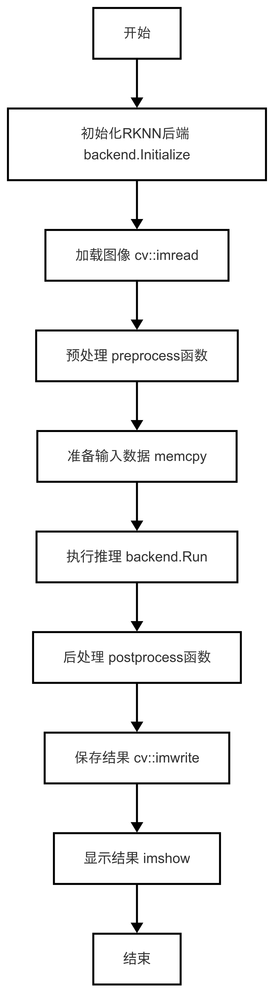
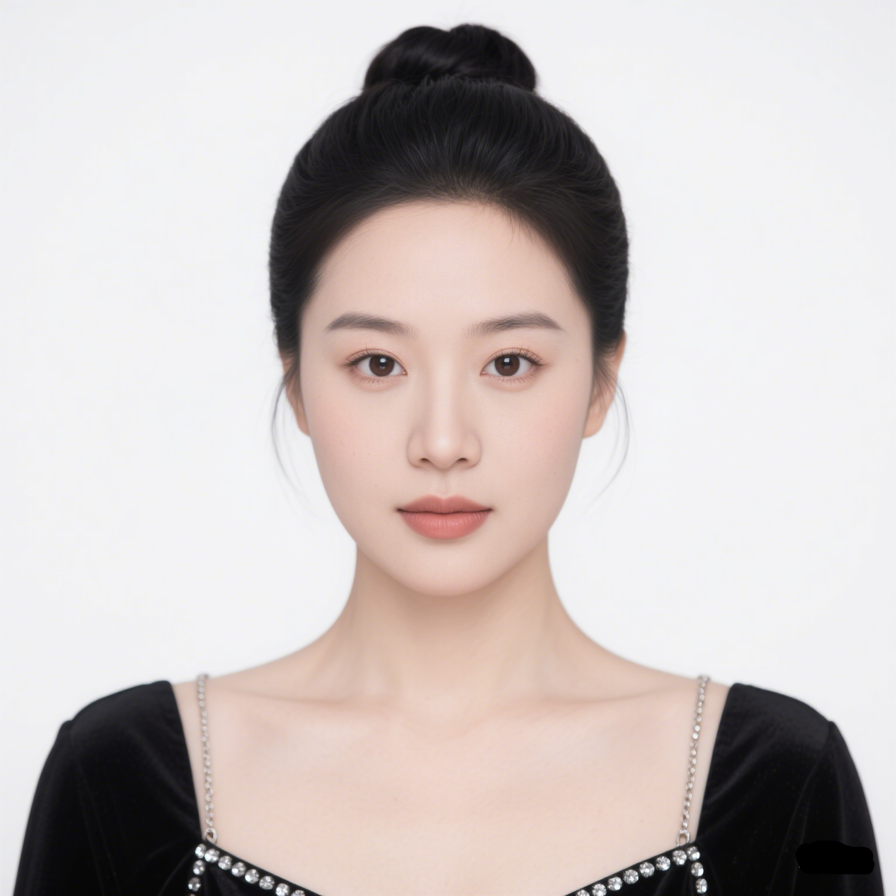
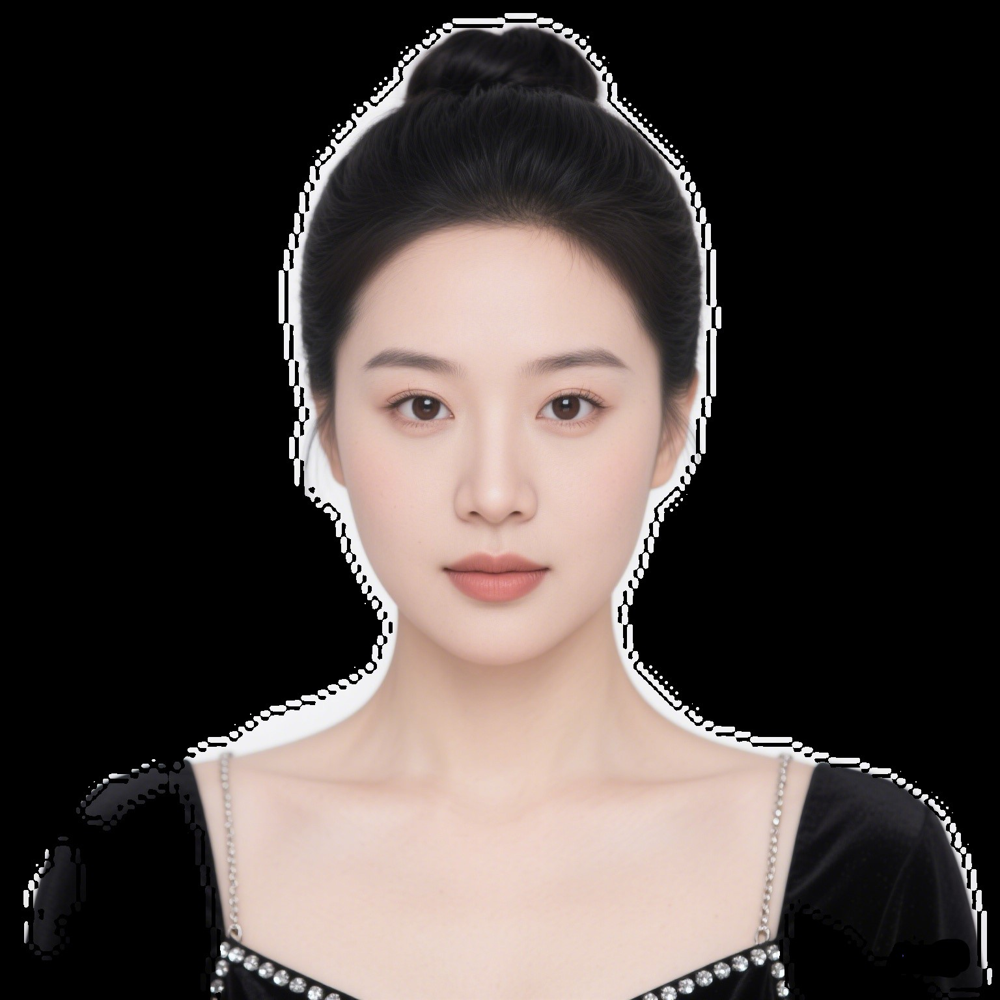

# 图像分割
本章节在 Lockzhiner Vision Module 上基于paddleseg模型, 实现了一个PP-HumanSeg人像分割案例。
## 1. 基本知识简介
### 1.1 人像分割简介
人像分割是一种基于计算机视觉的技术，通过深度学习算法精准识别图像或视频中的人物主体，将其与背景进行像素级分离。该技术可实时运行于移动端及嵌入式设备，广泛应用于虚拟背景、智能抠图、视频会议美颜等场景，支持复杂光照、多样姿态和遮挡情况下的高精度分割，兼顾处理速度与效果。
### 1.2 人像分割常用方法
目前对于实现人像分割任务的方法有很多，下面介绍几种常用的人像分割实现方法。
- ​​传统算法（如GrabCut）​：基于颜色直方图与图割优化，适合简单背景，计算量小但精度有限。
- U-Net系列：编码器-解码器结构，医学图像起家，适合精细边缘，需较高算力。
- ​DeepLab系列：采用空洞卷积扩大感受野，擅长复杂场景，模型较大。
- ​​BiSeNet​：双分支结构平衡速度与精度，实时分割首选，移动端友好。
- ​​PP-HumanSeg​：百度自研轻量模型，专为人像优化，支持半监督训练，RKNN部署效率高。

这些方法各有优势，其中在工业部署方面PP-HumanSeg（精度与速度平衡）和BiSeNet（高性价比）更适合，可配合OpenCV后处理优化边缘。

---

## 2. C++ API 文档
### 2.1 RKNPU2Backend 类
#### 2.1.1 头文件
```cpp
#include "rknpu2_backend/rknpu2_backend.h"
```
- 作用：创建一个RKNPU2Backend类，用于实现对rknn模型的处理。

#### 2.1.2 构造类函数
```cpp
ockzhiner_vision_module::vision::RKNPU2Backend backend;
```
- 作用：创建一个RKNPU2Backen类型的对象实例，用于实现人像分割。
- 参数说明：
    - 无
- 返回值：
    - 无

#### 2.1.3 Initialize 函数
```cpp
bool Initialize(const std::string &model_path, const std::string &param_path = "") override;
```
- 作用：初始化 RKNN 模型，加载模型文件和可选参数文件，完成推理引擎的准备工作。
- 参数说明：
    - model_path：必需参数，RKNN 模型文件路径（.rknn 格式）。
    - param_path：可选参数，额外参数文件路径（某些场景下用于补充模型配置，默认空字符串）。
- 返回值：返回ture/false，表示模型初始化是否成功。

#### 2.1.4 Run 函数
```cpp
bool Run();
```
- 作用：执行模型推理计算，驱动输入数据通过模型计算得到输出结果。
- 参数说明：
    - 无
- 返回值：
    - true：推理执行成功。
    - false：推理失败（可能原因：输入数据未准备、内存不足等）。

#### 2.1.5 GetInputAttrs 函数
```cpp
const std::vector<rknn_tensor_attr>& GetInputAttrs() const;
```
- 作用：获取模型所有输入张量的属性信息（维度/形状、数据类型、量化参数等）。
- 参数说明：
    - 无
- 返回值：常量引用形式的 rknn_tensor_attr 向量，包含输入张量属性。

#### 2.1.6 GetOutputAttrs 函数
```cpp
const std::vector<rknn_tensor_mem*>& GetInputMemories() const;
```
- 作用：获取模型所有输出张量的属性信息。
- 参数说明：无
- 返回值：常量引用形式的 rknn_tensor_attr 向量，包含输出张量属性。

## 3. PP-Humanseg人像分割代码解析
### 3.1 流程图



### 3.2 核心代码解析
- 初始化模型
```cpp
backend.Initialize(model_path)
```
- 获取输入输出属性
```cpp
const auto& input_attrs = backend.GetInputAttrs();
const auto& output_attrs = backend.GetOutputAttrs();
```
- 对输入图像进行推理
```cpp
backend.Run()
```
自定义函数说明
- pp-humanseg输入预处理
```cpp
cv::Mat preprocess(const cv::Mat& image, const std::vector<size_t>& input_dims) 
```
- 作用：对输入图像进行预处理操作，包括 ​​尺寸调整​​、​​颜色空间转换​​ 和 ​​量化处理​​，使其符合 RKNN 模型的输入要求。
- 参数说明：
    - image：输入图像（BGR 格式的 cv::Mat 对象）。
    - input_dims：模型输入张量的维度定义（需满足 [1, H, W, 3] 的 NHWC 格式）。
- 返回值：
    - 返回预处理后的量化张量（cv::Mat，数据类型为 CV_8S）。
    - 若输入维度不合法，返回空矩阵（cv::Mat()）并报错。
- pp-humanseg输入后处理
```cpp
cv::Mat postprocess(const rknn_tensor_mem* output_mem, 
                   const std::vector<size_t>& output_dims,
                   const cv::Size& target_size) 
```
- 作用：将模型输出的原始张量转换为高精度分割掩膜，包含 ​​概率解码​​、​​动态阈值分割​​、​​形态学优化​​和​​边缘增强​​等步骤，最终生成与原始图像尺寸匹配的二值化掩膜。
- 参数说明：
    - output_mem：模型输出的内存指针，包含量化后的原始数据。
    - output_dims：模型输出的维度信息，需满足 [1, 2, H, W] 的 NCHW 格式。
    - target_size：目标输出尺寸。
- 返回值：返回优化后的二值化掩膜。

### 3.3 完整代码实现
```cpp
#include <iostream>
#include <cmath>
#include <opencv2/opencv.hpp>
#include "rknpu2_backend/rknpu2_backend.h"
#include <chrono>
#include <cstdlib> 
#include <ctime> 

using namespace std::chrono;
// 输入和输出量化的scale和zeropoint
const float INPUT_SCALE = 1.0f / 255.0f; 
const int INPUT_ZP = -128;
const float OUTPUT_SCALE = 0.034558f;
const int OUTPUT_ZP = -128;

// 预处理函数
cv::Mat preprocess(const cv::Mat& image, const std::vector<size_t>& input_dims) {
    // 确保输入维度为NHWC [1, H, W, 3]
    if (input_dims.size() != 4 || input_dims[0] != 1 || input_dims[3] != 3) {
        std::cerr << "Invalid input dimensions" << std::endl;
        return cv::Mat();
    }

    const size_t input_h = input_dims[1];
    const size_t input_w = input_dims[2];

    // Resize并转换颜色空间
    cv::Mat resized, rgb;
    cv::resize(image, resized, cv::Size(input_w, input_h));
    cv::cvtColor(resized, rgb, cv::COLOR_BGR2RGB);

    // 量化到INT8
    cv::Mat quantized;
    rgb.convertTo(quantized, CV_8S, 255.0 * INPUT_SCALE, INPUT_ZP);

    return quantized;
}

// 后处理函数
cv::Mat postprocess(const rknn_tensor_mem* output_mem, 
                   const std::vector<size_t>& output_dims,
                   const cv::Size& target_size) {
    // 验证输出维度为NCHW [1, 2, H, W]
    if (output_dims.size() != 4 || output_dims[0] != 1 || output_dims[1] != 2) {
        std::cerr << "Invalid output dimensions" << std::endl;
        return cv::Mat();
    }

    const int8_t* data = static_cast<const int8_t*>(output_mem->virt_addr);
    const int h = output_dims[2];
    const int w = output_dims[3];

    // ================= 1. 概率图生成优化 =================
    cv::Mat prob_map(h, w, CV_32FC1);
    // 基于192x192模型的缩放补偿
    float spatial_weight = 1.0f - (h * w) / (192.0f * 192.0f); 
    
    for (int y = 0; y < h; ++y) {
        for (int x = 0; x < w; ++x) {
            const int bg_idx = 0 * h * w + y * w + x;
            const int fg_idx = 1 * h * w + y * w + x;
            // 带饱和保护的反量化
            float bg_logit = std::clamp((data[bg_idx] - OUTPUT_ZP) * OUTPUT_SCALE, -10.0f, 10.0f);
            float fg_logit = std::clamp((data[fg_idx] - OUTPUT_ZP) * OUTPUT_SCALE, -10.0f, 10.0f);

            // 空间注意力加权（中心区域增强）
            float center_weight = 1.0f - (std::abs(x - w/2.0f)/(w/2.0f) + std::abs(y - h/2.0f)/(h/2.0f))/2.0f;
            fg_logit *= (1.2f + 0.3f * center_weight * spatial_weight);

            // 稳健的Softmax计算
            float max_logit = std::max(bg_logit, fg_logit);
            float exp_sum = expf(bg_logit - max_logit) + expf(fg_logit - max_logit);
            prob_map.at<float>(y, x) = expf(fg_logit - max_logit) / (exp_sum + 1e-8f);
        }
    }

    // ================= 2. 自适应阈值优化 =================
    cv::Mat binary_mask;
    // 重点区域检测
    cv::Mat prob_roi = prob_map(cv::Rect(w/4, h/4, w/2, h/2)); 
    float center_mean = cv::mean(prob_roi)[0];
    float dynamic_thresh = std::clamp(0.45f - (center_mean - 0.5f) * 0.3f, 0.25f, 0.65f);
    
    cv::threshold(prob_map, binary_mask, dynamic_thresh, 255, cv::THRESH_BINARY);
    binary_mask.convertTo(binary_mask, CV_8U);

    // ================= 3. 多尺度形态学处理 =================
    std::vector<cv::Mat> mask_pyramid;
    // 构建金字塔
    cv::buildPyramid(binary_mask, mask_pyramid, 2); 
    
    // 小尺度去噪
    cv::Mat kernel1 = cv::getStructuringElement(cv::MORPH_ELLIPSE, cv::Size(3,3));
    cv::morphologyEx(mask_pyramid[1], mask_pyramid[1], cv::MORPH_OPEN, kernel1);
    
    // 中尺度填充
    cv::Mat kernel2 = cv::getStructuringElement(cv::MORPH_ELLIPSE, cv::Size(5,5));
    cv::morphologyEx(mask_pyramid[0], mask_pyramid[0], cv::MORPH_CLOSE, kernel2);
    
    // 金字塔重建
    cv::Mat refined_mask;
    cv::pyrUp(mask_pyramid[1], refined_mask, mask_pyramid[0].size());
    cv::bitwise_and(refined_mask, mask_pyramid[0], refined_mask);

    // ================= 4. 智能边缘优化 =================
    cv::Mat edge_weights;
    cv::distanceTransform(refined_mask, edge_weights, cv::DIST_L2, 3);
    cv::normalize(edge_weights, edge_weights, 0, 1.0, cv::NORM_MINMAX);
    
    cv::Mat probabilistic_edges;
    cv::Canny(refined_mask, probabilistic_edges, 50, 150);
    probabilistic_edges.convertTo(probabilistic_edges, CV_32F, 1.0/255.0);
    
    cv::Mat final_edges;
    cv::multiply(probabilistic_edges, edge_weights, final_edges);
    final_edges.convertTo(final_edges, CV_8U, 255.0);

    // ================= 5. 多模态融合输出 =================
    cv::Mat resized_mask;
    cv::resize(refined_mask, resized_mask, target_size, 0, 0, cv::INTER_LANCZOS4);
    
    cv::Mat final_mask;
    cv::bilateralFilter(resized_mask, final_mask, 5, 15, 15);
    
    // 最终保边处理
    cv::Mat edge_mask_hr;
    cv::resize(final_edges, edge_mask_hr, target_size, 0, 0, cv::INTER_NEAREST);
    final_mask.setTo(255, edge_mask_hr > 128);

    return final_mask;
}

int main(int argc, char* argv[]) {
    if (argc != 3) {
        std::cerr << "Usage: " << argv[0] << " <model_path> <image_path>" << std::endl;
        return 1;
    }

    const std::string model_path = argv[1];
    const std::string image_path = argv[2];

    // 初始化RKNN后端
    lockzhiner_vision_module::vision::RKNPU2Backend backend;
    if (!backend.Initialize(model_path)) {
        std::cerr << "Failed to initialize RKNN backend" << std::endl;
        return -1;
    }

    // 加载图像
    cv::Mat image = cv::imread(image_path);
    if (image.empty()) {
        std::cerr << "Failed to read image: " << image_path << std::endl;
        return -1;
    }

    // 获取输入属性
    const auto& input_attrs = backend.GetInputAttrs();
    if (input_attrs.empty()) {
        std::cerr << "No input attributes found" << std::endl;
        return -1;
    }
    const auto& input_attr = input_attrs[0];
    std::vector<size_t> input_dims(input_attr.dims, input_attr.dims + input_attr.n_dims);

    // 预处理
    cv::Mat preprocessed = preprocess(image, input_dims);
    if (preprocessed.empty()) {
        std::cerr << "Preprocessing failed" << std::endl;
        return -1;
    }

    // 验证输入数据尺寸
    const size_t expected_input_size = input_attr.size_with_stride;
    const size_t actual_input_size = preprocessed.total() * preprocessed.elemSize();
    if (expected_input_size != actual_input_size) {
        std::cerr << "Input size mismatch! Expected: " << expected_input_size
                  << ", Actual: " << actual_input_size << std::endl;
        return -1;
    }

    // 拷贝输入数据
    const auto& input_memories = backend.GetInputMemories();
    if (input_memories.empty() || !input_memories[0]) {
        std::cerr << "Invalid input memory" << std::endl;
        return -1;
    }
    memcpy(input_memories[0]->virt_addr, preprocessed.data, actual_input_size);

    // 执行推理
    high_resolution_clock::time_point start_time =
          high_resolution_clock::now();
    if (!backend.Run()) {
        std::cerr << "Inference failed" << std::endl;
        return -1;
    }
    
    // 获取输出
    const auto& output_attrs = backend.GetOutputAttrs();
    if (output_attrs.empty()) {
        std::cerr << "No output attributes found" << std::endl;
        return -1;
    }
    const auto& output_memories = backend.GetOutputMemories();
    if (output_memories.empty() || !output_memories[0]) {
        std::cerr << "Invalid output memory" << std::endl;
        return -1;
    }

    // 后处理
    const auto& output_attr = output_attrs[0];
    std::vector<size_t> output_dims(output_attr.dims, output_attr.dims + output_attr.n_dims);
    cv::Mat mask = postprocess(output_memories[0], output_dims, image.size());
    high_resolution_clock::time_point end_time = high_resolution_clock::now();
    auto time_span = duration_cast<milliseconds>(end_time - start_time);
    std::cout << "单张图片推理时间(ms): " << time_span.count() << std::endl;
    // 生成结果
    cv::Mat result;
    cv::bitwise_and(image, image, result, mask);

    // 保存结果
    const std::string output_path = "result.jpg";
    cv::imwrite(output_path, result);
    std::cout << "Result saved to: " << output_path << std::endl;

    // 显示调试视图
    cv::imshow("Original", image);
    cv::imshow("Mask", mask);
    cv::imshow("Result", result);
    cv::waitKey(0);

    return 0;
}
```

---

## 4. 编译调试
### 4.1 编译环境搭建
- 请确保你已经按照 [开发环境搭建指南](../../../../docs/introductory_tutorial/cpp_development_environment.md) 正确配置了开发环境。
- 同时已经正确连接开发板。
### 4.2 Cmake介绍
```cmake
cmake_minimum_required(VERSION 3.10)

project(pp_humanseg)

set(CMAKE_CXX_STANDARD 17)
set(CMAKE_CXX_STANDARD_REQUIRED ON)

# 定义项目根目录路径
set(PROJECT_ROOT_PATH "${CMAKE_CURRENT_SOURCE_DIR}/../..")
message("PROJECT_ROOT_PATH = " ${PROJECT_ROOT_PATH})

include("${PROJECT_ROOT_PATH}/toolchains/arm-rockchip830-linux-uclibcgnueabihf.toolchain.cmake")

# 定义 OpenCV SDK 路径
set(OpenCV_ROOT_PATH "${PROJECT_ROOT_PATH}/third_party/opencv-mobile-4.10.0-lockzhiner-vision-module")
set(OpenCV_DIR "${OpenCV_ROOT_PATH}/lib/cmake/opencv4")
find_package(OpenCV REQUIRED)
set(OPENCV_LIBRARIES "${OpenCV_LIBS}")

# 定义 LockzhinerVisionModule SDK 路径
set(LockzhinerVisionModule_ROOT_PATH "${PROJECT_ROOT_PATH}/third_party/lockzhiner_vision_module_sdk")
set(LockzhinerVisionModule_DIR "${LockzhinerVisionModule_ROOT_PATH}/lib/cmake/lockzhiner_vision_module")
find_package(LockzhinerVisionModule REQUIRED)

# 配置rknpu2
set(RKNPU2_BACKEND_BASE_DIR "${LockzhinerVisionModule_ROOT_PATH}/include/lockzhiner_vision_module/vision/deep_learning/runtime")
if(NOT EXISTS ${RKNPU2_BACKEND_BASE_DIR})
    message(FATAL_ERROR "RKNPU2 backend base dir missing: ${RKNPU2_BACKEND_BASE_DIR}")
endif()


add_executable(Test-pp_humanseg pp_humanseg.cc)
target_include_directories(Test-pp_humanseg PRIVATE ${LOCKZHINER_VISION_MODULE_INCLUDE_DIRS}  ${rknpu2_INCLUDE_DIRS} ${RKNPU2_BACKEND_BASE_DIR})
target_link_libraries(Test-pp_humanseg PRIVATE ${OPENCV_LIBRARIES} ${NCNN_LIBRARIES} ${LOCKZHINER_VISION_MODULE_LIBRARIES})

install(
    TARGETS Test-pp_humanseg
    RUNTIME DESTINATION .  
)
```
### 4.3 编译项目
使用 Docker Destop 打开 LockzhinerVisionModule 容器并执行以下命令来编译项目。
```bash
# 进入Demo所在目录
cd /LockzhinerVisionModuleWorkSpace/LockzhinerVisionModule/cpp_example/D08_pp_humanseg
# 创建编译目录
rm -rf build && mkdir build && cd build
# 配置交叉编译工具链
export TOOLCHAIN_ROOT_PATH="/LockzhinerVisionModuleWorkSpace/arm-rockchip830-linux-uclibcgnueabihf"
# 使用cmake配置项目
cmake ..
# 执行编译项目
make -j8 && make install
```

在执行完上述命令后，会在build目录下生成可执行文件。

---

## 5. 执行结果
### 5.1 运行前准备
- 请确保你已经下载了 [凌智视觉模块人像分割模型](https://gitee.com/LockzhinerAI/LockzhinerVisionModule/releases/download/v0.0.6/pp-humanseg.rknn)
### 5.2 运行过程
```shell
chmod 777 Test-pp_humanseg
# 对人像进行分割
./Test-pp_humanseg pp-humanseg.rknn image_path
```
### 5.3 运行效果
#### 5.3.1 人像分割结果
- 原始图像



- 分割结果



#### 5.3.2 注意事项
由于分割的模型很小，并且在模型转换过程中会有精度损失，所以在测试的时候尽量选择背景比较纯净的图像效果比较好。

---

## 6. 总结
通过上述内容，我们成功实现了一个简单的人像分割的例子，包括：

- 加载图像分割的rknn模型和待分割图像。
- 图像预处理和模型推理。
- 图像后处理并保存分割结果。