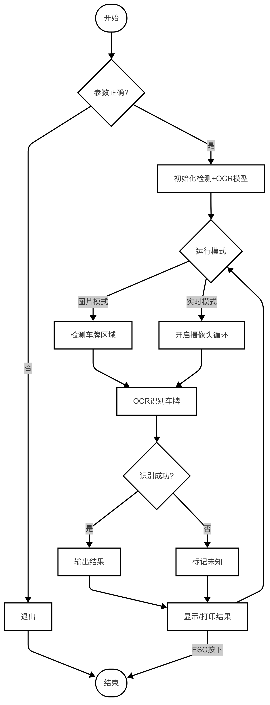
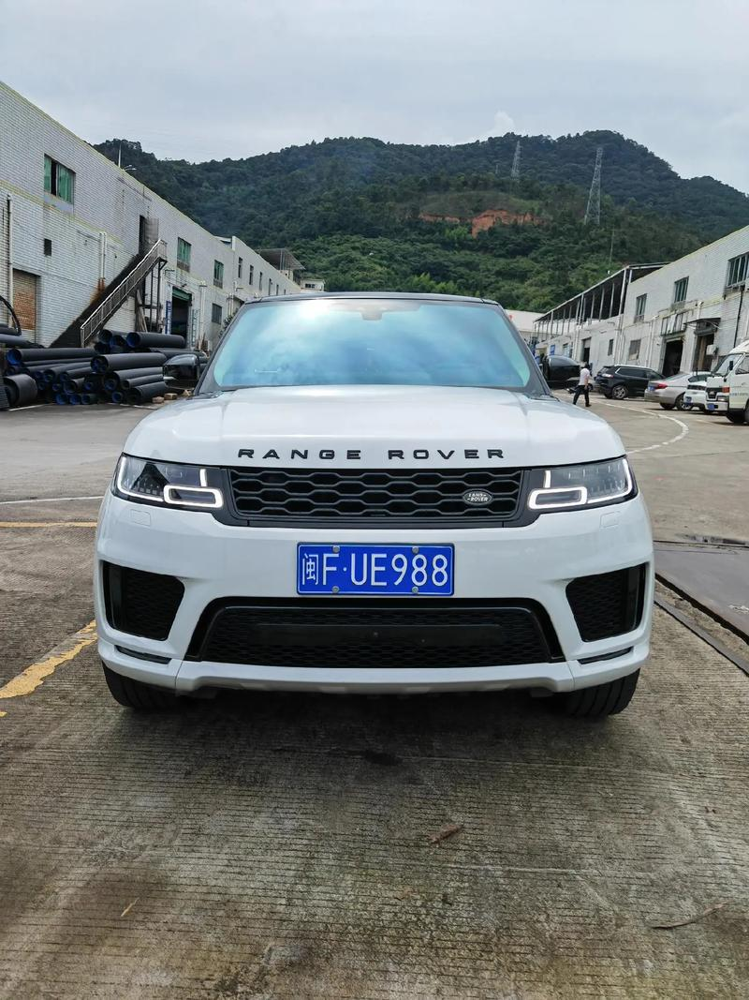
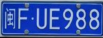
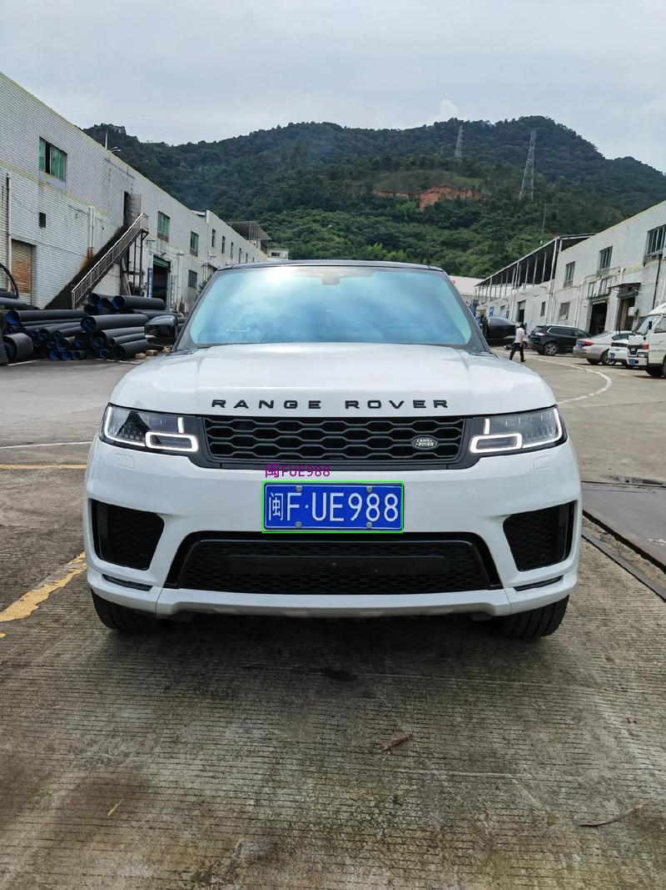

# 车牌识别
本章节在 Lockzhiner Vision Module 上基于 PaddleDet 目标检测类和rcnn文本识别模型，实现了一个车牌识别案例。
## 1. 基本知识简介
### 1.1 车牌识别简介
车牌识别是一种基于计算机视觉和深度学习的技术，通过图像处理、字符分割和光学字符识别算法，自动提取车辆牌照中的文字与数字信息。该技术可实时识别不同光照、角度和复杂背景下的车牌，广泛应用于智能交通管理、停车场收费系统、电子警察执法等场景。
### 1.2 车牌识别流程
- ​​车牌检测：
    - ​深度学习​​：YOLO、Faster R-CNN等检测模型定位车牌区域。
    - ​​传统方法：颜色空间分析（蓝色/黄色车牌）+边缘检测。
- ​​车牌矫正：透视变换调整倾斜角度，Hough直线检测旋转角度。
- ​字符分割：​​垂直投影法分割字符，连通域分析处理粘连字符。
- 字符识别：
    - ​CRNN​​：CNN+RNN+CTC结构，端到端识别。
    - OCR模型​​：Tesseract、PaddleOCR等开源工具。

---

## 2. C++ API文档
### 2.1 PaddleDetection 类
#### 2.1.1 头文件
```cpp
#include <lockzhiner_vision_module/vision/deep_learning/detection/paddle_det.h>
```
#### 2.1.2 构造函数
```cpp
lockzhiner_vision_module::vision::PaddleDetection();
```
- 作用：
  - 创建一个 PaddleDetection 对象，并初始化相关成员变量。
- 参数：
  - 无
- 返回值：
  - 无
#### 2.1.3 Initialize函数
```cpp
bool Initialize(const std::string& model_path);
```
- 作用：
  - 加载预训练的 PaddleDetection 模型。
- 参数：
  - model_path：模型路径，包含模型文件和参数文件。
- 返回值：
  - true：模型加载成功。
  - false：模型加载失败。
#### 2.1.4 SetThreshold函数
```cpp
void SetThreshold(float score_threshold = 0.5, float nms_threshold = 0.3);
```
- 作用：
  - 设置目标检测的置信度阈值和NMS阈值。
- 参数：
  - score_threshold：置信度阈值，默认值为0.5。
  - nms_threshold：NMS阈值，默认值为0.3。
- 返回值：
  - 无
#### 2.1.5 Predict函数
```cpp
std::vector<lockzhiner_vision_module::vision::DetectionResult> Predict(const cv::Mat& image);
```
- 作用：
  - 使用加载的模型对输入图像进行目标检测，返回检测结果。
- 参数：
  - input_mat (const cv::Mat&): 输入的图像数据，通常是一个 cv::Mat 变量。
- 返回值：
  - 返回一个包含多个 DetectionResult 对象的向量，每个对象表示一个检测结果。

### 2.2 Net类
#### 2.2.1 头文件
```cpp
#include <ncnn/net.h>
```
- 作用：用于声明Net类，使得Net类可以在当前文件中使用。

#### 2.2.2 构造类函数
```cpp
ncnn::Net ocr_net;
```
- 作用：创建一个Net类型的对象实例，用于加载模型和参数等。
- 参数说明：无
- 返回值：无

#### 2.3.3 load_param函数
```cpp
int load_param(const DataReader& dr);
```
- 参数说明：
    - dr：传入的参数文件路径。
- 返回值：
    - 返回值为0表示加载参数文件成功。

#### 2.2.4 load_model函数
```cpp
int load_model(const DataReader& dr);
```
- 参数说明：
    - dr：传入的模型文件路径。
- 返回值：返回值为0表示加载模型成功。

#### 2.2.5 from_pixels函数
```cpp
ncnn::Mat::from_pixels(plate_img.data, ncnn::Mat::PIXEL_BGR, plate_img.cols, 
                                        plate_img.rows);
```
- ​​作用​​：将原始图像像素数据转换为 ncnn::Mat 对象，​​同时进行缩放操作​​，适配神经网络的输入尺寸要求。
- 参数说明：
    - plate_img.data：输入图像的像素数据指针。
    - ncnn::Mat::PIXEL_BGR：输入像素的颜色格式。
    - plate_img.cols, plate_img.rows：原始图像的宽度和高度。
- 返回值​​：返回一个 ncnn::Mat 对象，包含缩放后的图像数据，格式为 ​​CHW 排列。

### 2.3 Extractor类
#### 2.3.1 头文件
```cpp
#include <ncnn/net.h>
```
- 作用：用于声明Extractor类，使得Extractor类可以在当前文件中使用。

#### 2.3.2 构造类函数
```cpp
ncnn::Extractor ex = ocr_net.create_extractor();
```
- 作用：从已经加载了神经网络模型的 net 中创建一个 Extractor 实例，用于执行车牌识别的推理任务。
- 参数说明：无
- 返回值：无

---

## 3. 车牌识别代码解析
### 3.1 流程图



### 3.2 核心代码解析
- 初始化车牌检测模型
```cpp
lockzhiner_vision_module::vision::PaddleDet detector;
if (!detector.Initialize(argv[1])) {
    cerr << "Failed to load detection model: " << argv[1] << endl;
    return 1;
}
```
- 车牌检测模型推理
```cpp
auto results = detector.Predict(image);
```
- 可视化并显示推理结果
```cpp
cv::Mat output_image = image.clone();
for (const auto& det : results) {
    cv::Rect rect(
        static_cast<int>(det.box.x),
        static_cast<int>(det.box.y),
        static_cast<int>(det.box.width),
        static_cast<int>(det.box.height)
    );
    cv::rectangle(
        output_image,
        rect,
        cv::Scalar(0, 255, 0),
        1,
        cv::LINE_AA
    );
}
cv::imshow("Detection Result", output_image);
```
- 加载字符识别参数和模型
```cpp
ocr_net.load_param(param_path.c_str())
ocr_net.load_model(model_path.c_str())
```
- 归一化处理
```cpp
const float mean[3] = {127.5f, 127.5f, 127.5f};
const float norm[3] = {0.0078125f, 0.0078125f, 0.0078125f};
in.substract_mean_normalize(mean, norm);
```
- 解码预测结果
```cpp
string license;
vector<int> preb;
for (int c = 0; c < feat.c; c++) {
    const float* data = feat.channel(c);
    for (int w = 0; w < feat.w; w++) {
        float max_val = -FLT_MAX;
        int max_idx = 0;
        for (int h = 0; h < feat.h; h++) {
            float val = data[w + h * feat.w];
            if (val > max_val) {
                max_val = val;
                max_idx = h;
            }
        }
        preb.push_back(max_idx);
    }
}

// 后处理去重
vector<int> valid_labels;
int prev = -1;
for (size_t i = 0; i < preb.size(); ++i) {
    if (preb[i] != 67 && preb[i] != prev) {
        valid_labels.push_back(preb[i]);
    }
    prev = preb[i];
}

for (int idx : valid_labels) {
    license += plate_chars[idx];
}
```
自定义函数说明
- 车牌字符识别
```cpp
string RecognizePlate(cv::Mat plate_img);
```
- 作用：对分割出来的车牌进行识别。
- 参数说明：
    - plate_image：待识别的车牌图像。
- 返回值：返回一串字符串类型的数据，表示识别到的车牌是什么。

### 3.3 完整代码实现
```cpp
#include <lockzhiner_vision_module/vision/deep_learning/detection/paddle_det.h>
#include <ncnn/net.h>
#include <lockzhiner_vision_module/edit/edit.h>
#include <chrono>
#include <iostream>
#include <vector>
#include <opencv2/opencv.hpp>
#include "myfontface.h"

using namespace std;
using namespace std::chrono;

// OCR字符集配置
const string plate_chars[68] = {
    "京", "沪", "津", "渝", "冀", "晋", "蒙", "辽", "吉", "黑", "苏", "浙",
    "皖", "闽", "赣", "鲁", "豫", "鄂", "湘", "粤", "桂", "琼", "川", "贵",
    "云", "藏", "陕", "甘", "青", "宁", "新", "0",  "1",  "2",  "3",  "4",
    "5",  "6",  "7",  "8",  "9",  "A",  "B",  "C",  "D",  "E",  "F",  "G",
    "H",  "J",  "K",  "L",  "M",  "N",  "P",  "Q",  "R",  "S",  "T",  "U",
    "V",  "W",  "X",  "Y",  "Z",  "I",  "O",  "-"};

ncnn::Net ocr_net;

bool InitOCRModel(const string& param_path, const string& model_path) {
    return ocr_net.load_param(param_path.c_str()) == 0 &&
           ocr_net.load_model(model_path.c_str()) == 0;
}

string RecognizePlate(cv::Mat plate_img) {
    cv::resize(plate_img, plate_img, cv::Size(94, 24));
    
    ncnn::Mat in = ncnn::Mat::from_pixels(plate_img.data, 
                                        ncnn::Mat::PIXEL_BGR,
                                        plate_img.cols, 
                                        plate_img.rows);

    const float mean[3] = {127.5f, 127.5f, 127.5f};
    const float norm[3] = {0.0078125f, 0.0078125f, 0.0078125f};
    in.substract_mean_normalize(mean, norm);

    ncnn::Extractor ex = ocr_net.create_extractor();
    ex.input("input.1", in);
    
    ncnn::Mat feat;
    ex.extract("131", feat);

    string license;
    vector<int> preb;
    for (int c = 0; c < feat.c; c++) {
        const float* data = feat.channel(c);
        for (int w = 0; w < feat.w; w++) {
            float max_val = -FLT_MAX;
            int max_idx = 0;
            for (int h = 0; h < feat.h; h++) {
                float val = data[w + h * feat.w];
                if (val > max_val) {
                    max_val = val;
                    max_idx = h;
                }
            }
            preb.push_back(max_idx);
        }
    }

    // 后处理去重
    vector<int> valid_labels;
    int prev = -1;
    for (size_t i = 0; i < preb.size(); ++i) {
        if (preb[i] != 67 && preb[i] != prev) {
            valid_labels.push_back(preb[i]);
        }
        prev = preb[i];
    }

    for (int idx : valid_labels) {
        license += plate_chars[idx];
    }

    return license.empty() ? "UNKNOWN" : license;
}

int main(int argc, char** argv) {
    // 参数验证
    if (argc < 4 || argc > 5) {
        cerr << "Usage: " << argv[0] 
             << " <det_model> <ocr_param> <ocr_model> [image_path]\n"
             << "Example:\n"
             << "  Realtime: " << argv[0] << " det_model ocr.param ocr.bin\n"
             << "  Image:    " << argv[0] << " det_model ocr.param ocr.bin test.jpg\n";
        return 1;
    }

    // 初始化检测模型
    lockzhiner_vision_module::vision::PaddleDet detector;
    if (!detector.Initialize(argv[1])) {
        cerr << "Failed to load detection model: " << argv[1] << endl;
        return 1;
    }

    // 初始化OCR模型
    if (!InitOCRModel(argv[2], argv[3])) {
        cerr << "Failed to load OCR model: " << argv[2] << " and " << argv[3] << endl;
        return 1;
    }
    MyFontFace myfont;
    // 设置文字参数
    double font_scale = 0.6;
    int thickness = 1;

    // 图片处理模式
    if (argc == 5) {
        cv::Mat image = cv::imread(argv[4]);
        if (image.empty()) {
            cerr << "Failed to read image: " << argv[4] << endl;
            return 1;
        }

        auto results = detector.Predict(image);
        // 可视化并显示结果
        cv::Mat output_image = image.clone();
        for (const auto& det : results) {
            cv::Rect rect(
                static_cast<int>(det.box.x),
                static_cast<int>(det.box.y),
                static_cast<int>(det.box.width),
                static_cast<int>(det.box.height)
            );
            cv::rectangle(
                output_image,
                rect,
                cv::Scalar(0, 255, 0),
                1,
                cv::LINE_AA
            );
        }
        cout << "\n===== 检测到 " << results.size() << " 个车牌 =====" << endl;

        for (size_t i = 0; i < results.size(); ++i) {
            const auto& det = results[i];
            cv::Rect roi(det.box.x, det.box.y, det.box.width, det.box.height);
            roi &= cv::Rect(0, 0, image.cols, image.rows);

            if (roi.area() > 0) {
                cv::Mat plate_img = image(roi);
                cv::imshow("DetectionSeg Result", plate_img);
                string plate_num = RecognizePlate(plate_img);
                // 左上角偏移
                cv::Point text_org(roi.x + 2, roi.y - 2); 
                // 先绘制黑色背景提升可读性
                cv::putText(output_image, plate_num, text_org,
                    cv::Scalar(0, 0, 0),   // 颜色
                    myfont,                // 字体对象
                    font_scale,            // 字体尺寸
                    thickness + 2,         // 线宽
                    cv::PutTextFlags::PUT_TEXT_ALIGN_LEFT,  // 对齐方式
                    cv::Range(0, 0));                     // 自动换行范围（0表示不换行）
                cv::putText(output_image, plate_num, text_org, cv::Scalar(127, 0, 127), myfont, 10);

                cout << "车牌 " << i+1 << ":\n"
                     << "  位置: [" << roi.x << ", " << roi.y 
                     << ", " << roi.width << "x" << roi.height << "]\n"
                     << "  置信度: " << det.score << "\n"
                     << "  识别结果: " << plate_num << "\n" << endl;

                cv::imshow("Detection Result", output_image);
            }
        }
        cv::waitKey(0);
    }
    // 实时摄像头模式
    else {
        // 初始化设备连接
        lockzhiner_vision_module::edit::Edit edit;
        if (!edit.StartAndAcceptConnection()) {
            std::cerr << "Error: Failed to start and accept connection." << std::endl;
            return EXIT_FAILURE;
        }
        std::cout << "Device connected successfully." << std::endl;

        cv::VideoCapture cap;
        cap.set(cv::CAP_PROP_FRAME_WIDTH, 640);
        cap.set(cv::CAP_PROP_FRAME_HEIGHT, 480);
        cap.open(0);
        if (!cap.isOpened()) {
            cerr << "Error: Could not open camera" << endl;
            return 1;
        }

        cout << "实时识别模式启动 (按ESC退出)..." << endl;

        cv::Mat frame;
        while (true) {
            cap >> frame;
            if (frame.empty()) continue;

            auto results = detector.Predict(frame);

            cv::Mat display_frame = frame.clone();
            for (const auto& det : results) {
                cv::Rect rect(
                    static_cast<int>(det.box.x),
                    static_cast<int>(det.box.y),
                    static_cast<int>(det.box.width),
                    static_cast<int>(det.box.height)
                );
                cv::rectangle(
                    display_frame,
                    rect,
                    cv::Scalar(0, 255, 0),
                    1,
                    cv::LINE_AA
                );
            }

            // 添加时间戳
            auto now = system_clock::now();
            time_t now_time = system_clock::to_time_t(now);
            cout << "\n===== " << ctime(&now_time)
                 << "检测到 " << results.size() << " 个车牌 =====" << endl;

            for (const auto& det : results) {
                cv::Rect roi(det.box.x, det.box.y, det.box.width, det.box.height);
                roi &= cv::Rect(0, 0, frame.cols, frame.rows);

                if (roi.area() > 0) {
                    cv::Mat plate_img = frame(roi);
                    string plate_num = RecognizePlate(plate_img);
                    // 左上角偏移
                    cv::Point text_org(roi.x + 2, roi.y - 2); 
                    // 先绘制黑色背景提升可读性
                    cv::putText(display_frame, plate_num, text_org,
                        cv::Scalar(0, 0, 0),   // 颜色
                        myfont,                // 字体对象
                        font_scale,            // 字体尺寸
                        thickness + 2,         // 线宽
                        cv::PutTextFlags::PUT_TEXT_ALIGN_LEFT,  // 对齐方式
                        cv::Range(0, 0));                     // 自动换行范围（0表示不换行）
                    cv::putText(display_frame, plate_num, text_org, cv::Scalar(127, 0, 127), myfont, 10);

                    cout << "[实时结果] 位置(" << roi.x << "," << roi.y 
                         << ") 识别: " << plate_num 
                         << " (置信度: " << det.score << ")" << endl;
                }
            }
            edit.Print(display_frame);
            // 退出检测
            if (cv::waitKey(1) == 27) break;
        }
    }
    return 0;
}
```

---

## 4. 编译调试
### 4.1 编译环境搭建
- 请确保你已经按照 [开发环境搭建指南](../../../../docs/introductory_tutorial/cpp_development_environment.md) 正确配置了开发环境。
- 同时已经正确连接开发板。
### 4.2 Cmake介绍
```cmake
cmake_minimum_required(VERSION 3.10)

project(plate_recognize)

set(CMAKE_CXX_STANDARD 17)
set(CMAKE_CXX_STANDARD_REQUIRED ON)

# 定义项目根目录路径
set(PROJECT_ROOT_PATH "${CMAKE_CURRENT_SOURCE_DIR}/../..")
message("PROJECT_ROOT_PATH = " ${PROJECT_ROOT_PATH})

include("${PROJECT_ROOT_PATH}/toolchains/arm-rockchip830-linux-uclibcgnueabihf.toolchain.cmake")

# 定义 OpenCV SDK 路径
set(OpenCV_ROOT_PATH "${PROJECT_ROOT_PATH}/third_party/opencv-mobile-4.10.0-lockzhiner-vision-module")
set(OpenCV_DIR "${OpenCV_ROOT_PATH}/lib/cmake/opencv4")
find_package(OpenCV REQUIRED)
set(OPENCV_LIBRARIES "${OpenCV_LIBS}")

# 定义 LockzhinerVisionModule SDK 路径
set(LockzhinerVisionModule_ROOT_PATH "${PROJECT_ROOT_PATH}/third_party/lockzhiner_vision_module_sdk")
set(LockzhinerVisionModule_DIR "${LockzhinerVisionModule_ROOT_PATH}/lib/cmake/lockzhiner_vision_module")
find_package(LockzhinerVisionModule REQUIRED)

# ncnn配置
set(NCNN_ROOT_DIR "${PROJECT_ROOT_PATH}/third_party/ncnn-20240820-lockzhiner-vision-module")  # 确保third_party层级存在
message(STATUS "Checking ncnn headers in: ${NCNN_ROOT_DIR}/include/ncnn")

# 验证头文件存在
if(NOT EXISTS "${NCNN_ROOT_DIR}/include/ncnn/net.h")
    message(FATAL_ERROR "ncnn headers not found. Confirm the directory contains ncnn: ${NCNN_ROOT_DIR}")
endif()

set(NCNN_INCLUDE_DIRS "${NCNN_ROOT_DIR}/include")
set(NCNN_LIBRARIES "${NCNN_ROOT_DIR}/lib/libncnn.a")

add_executable(Test-plate_recognize plate_recognize.cc)
target_include_directories(Test-plate_recognize PRIVATE ${LOCKZHINER_VISION_MODULE_INCLUDE_DIRS}  ${NCNN_INCLUDE_DIRS})
target_link_libraries(Test-plate_recognize PRIVATE ${OPENCV_LIBRARIES} ${NCNN_LIBRARIES} ${LOCKZHINER_VISION_MODULE_LIBRARIES})

install(
    TARGETS Test-plate_recognize
    RUNTIME DESTINATION .  
)
```
### 4.3 编译项目
使用 Docker Destop 打开 LockzhinerVisionModule 容器并执行以下命令来编译项目
```bash
# 进入Demo所在目录
cd /LockzhinerVisionModuleWorkSpace/LockzhinerVisionModule/cpp_example/D09_plate_recognize
# 创建编译目录
rm -rf build && mkdir build && cd build
# 配置交叉编译工具链
export TOOLCHAIN_ROOT_PATH="/LockzhinerVisionModuleWorkSpace/arm-rockchip830-linux-uclibcgnueabihf"
# 使用cmake配置项目
cmake ..
# 执行编译项目
make -j8 && make install
```

在执行完上述命令后，会在build目录下生成可执行文件。

---

## 5. 执行结果
### 5.1 运行前准备
- 请确保你已经下载了 [凌智视觉模块车牌识别参数文件](https://gitee.com/LockzhinerAI/LockzhinerVisionModule/releases/download/v0.0.6/lpr2d.param)
- 请确保你已经下载了 [凌智视觉模块车牌识别bin文件](https://gitee.com/LockzhinerAI/LockzhinerVisionModule/releases/download/v0.0.6/lpr2d.bin)
- 请确保你已经下载了 [凌智视觉模块车牌检测模型](https://gitee.com/LockzhinerAI/LockzhinerVisionModule/releases/download/v0.0.6/Plate_recognize.rknn)
### 5.2 运行过程
```shell
chmode 777 Test-plate_recognize
# 对车牌图片进行识别
./Test-plate_recognize Plate_recognize.rknn lpr2d.param lpr2d.bin image_path
# 摄像头实时识别
./Test-plate_recognize Plate_recognize.rknn lpr2d.param lpr2d.bin
```
### 5.3 运行结果
- 原始图像



- 分割出来的车牌图像



- 识别结果



---

## 6. 总结
通过上述内容，我们成功实现了一个车牌识别系统，包括：

- 加载车牌检测模型和rcnn字符识别模型
- 进行车牌检测并将车牌分割出来。
- 将分割出来的车牌进行字符识别。
- 保存识别结果。