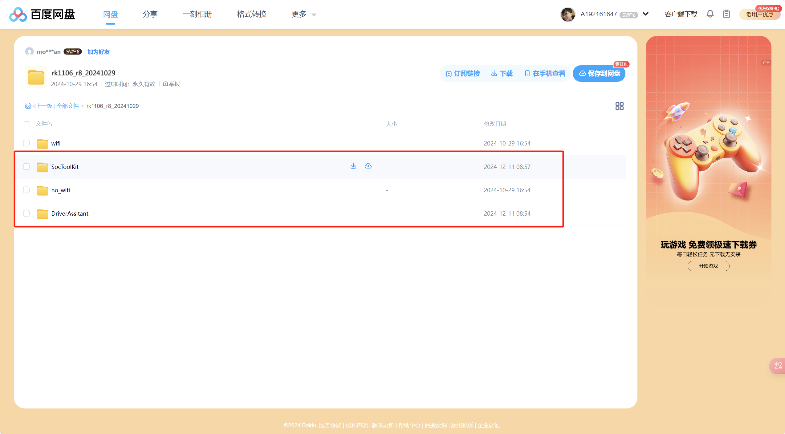
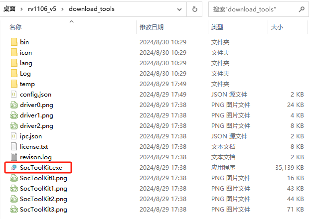
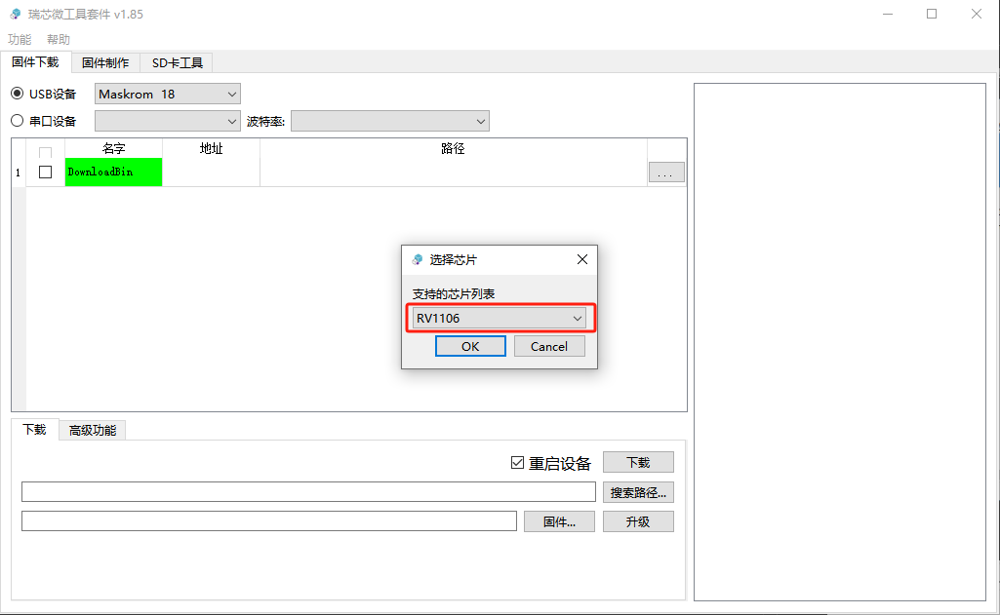
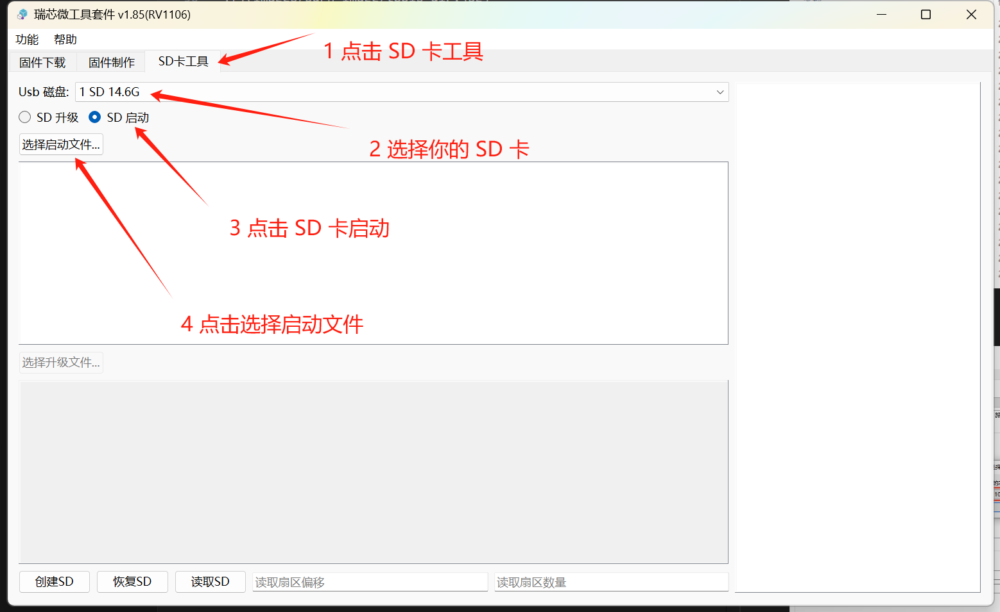
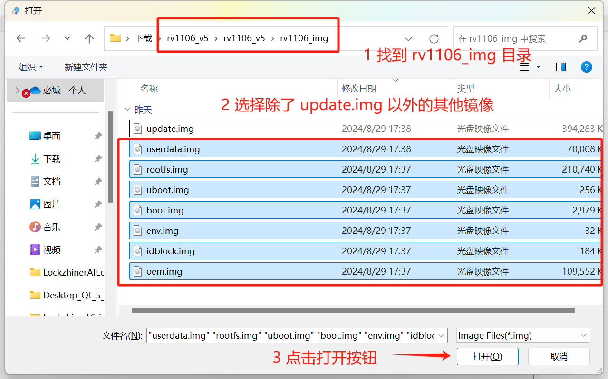
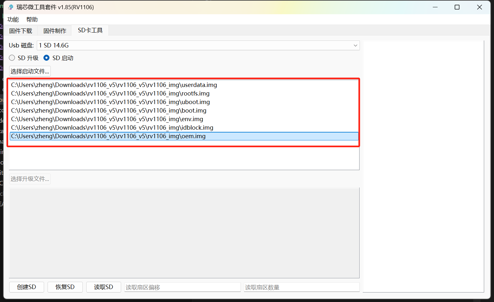
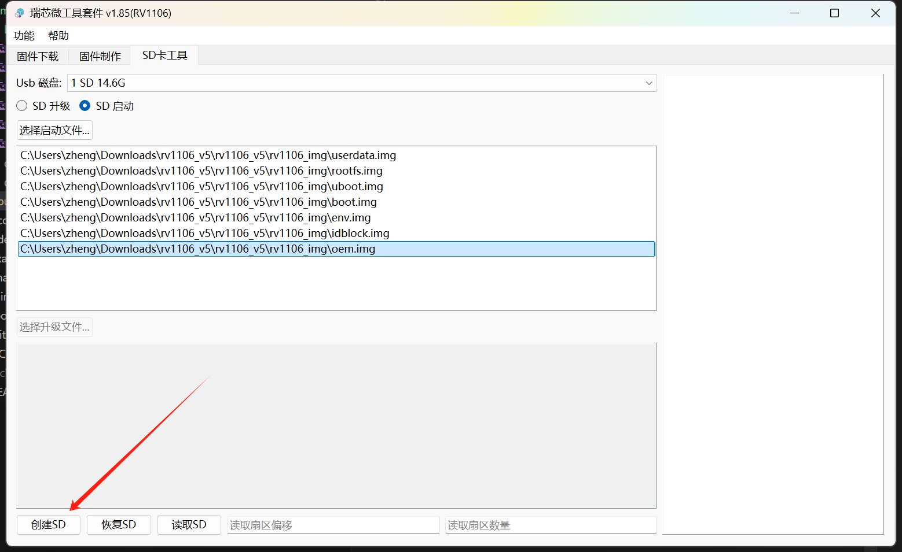
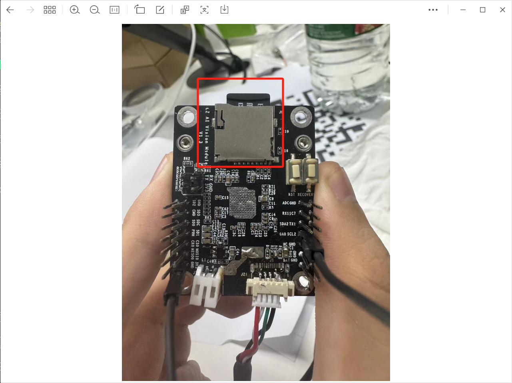

<h1 align="center">凌智视觉模块烧录镜像指南</h1>

发布版本：V0.0.0

日期：2024-09-26

文件密级：□绝密 □秘密 □内部资料 ■公开  

---

**免责声明**  

本文档按**现状**提供，福州凌睿智捷电子有限公司（以下简称**本公司**）不对本文档中的任何陈述、信息和内容的准确性、可靠性、完整性、适销性、适用性及非侵权性提供任何明示或暗示的声明或保证。本文档仅作为使用指导的参考。  

由于产品版本升级或其他原因，本文档可能在未经任何通知的情况下不定期更新或修改。  

**读者对象**  

本教程适用于以下工程师：  

- 技术支持工程师  
- 软件开发工程师  

**修订记录**  

| **日期**   | **版本** | **作者** | **修改说明** |
| :--------- | -------- | -------- | ------------ |
| 2024/09/26 | 0.0.0    | 黄展坤     | 初始版本     |

## 1 简介

在本章节中，您将学习到如何使用镜像烧录工具将镜像文件成功烧录到目标设备中。

## 2 前期准备

在开始烧录前，我们需要做一些前期的准备:

* 请准备一张 **64G 容量以下**的 SD 卡，这里我们选用的是 16G 的 SD 卡。请将 SD 卡插入读卡器并正确连接电脑。
* 请正确下载 Lockzhiner Vision Module 的镜像软件包到你喜欢的位置。

## 3 开始烧录

使用解压工具（这里选用的是 Bandzip）解压 Lockzhiner Vision Module 的镜像压缩包到你喜欢的位置

前往解压的压缩包目录，在 download_tools 目录下，打开 SocToolKit.exe 软件，这是一个镜像烧写工具

弹出的界面中选择 RV1106

按照下图顺序，依次点击 **SD卡启动** -> **选择USB磁盘**  -> **选择启动文件**

弹出的窗口中 **找到 rv1106_img 目录** -> **选择除了 update.img 以外的所有文件** -> **点击打开按钮**

> 注意，这里的启动文件**不包括 update.img**

点击创建 SD 卡

## 4 插入 SD 卡

将 SD 卡插入 Lockzhiner Vision Module

## 5 验证是否烧录成功

烧录完成后，请将 SD 卡插入 Lockzhiner Vision Module，并参考 [连接设备指南](./connect_device_using_ssh.md) 来连接设备并输出 Hello World