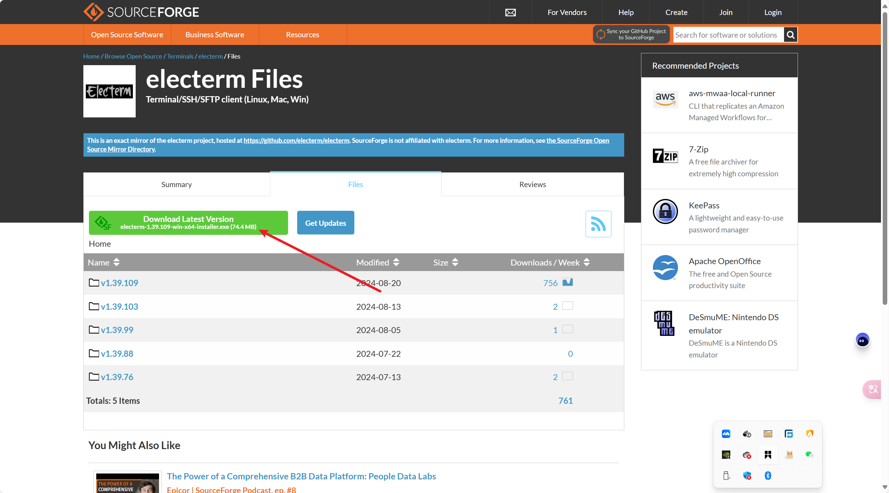
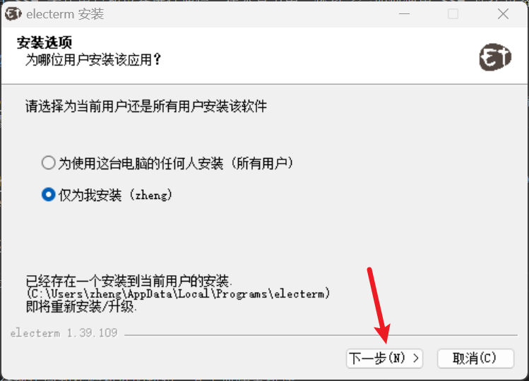
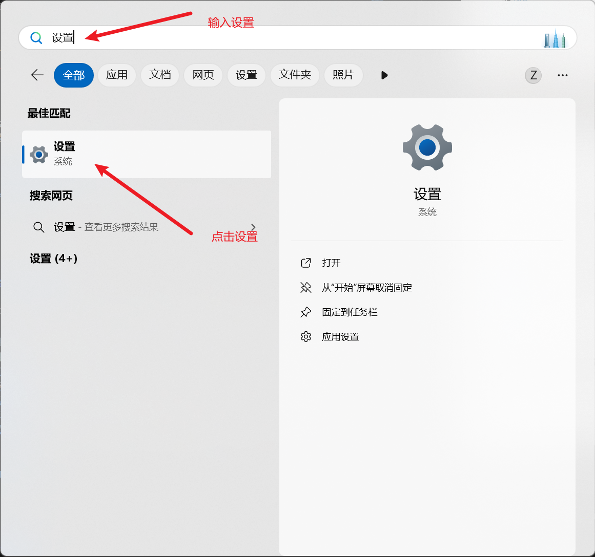
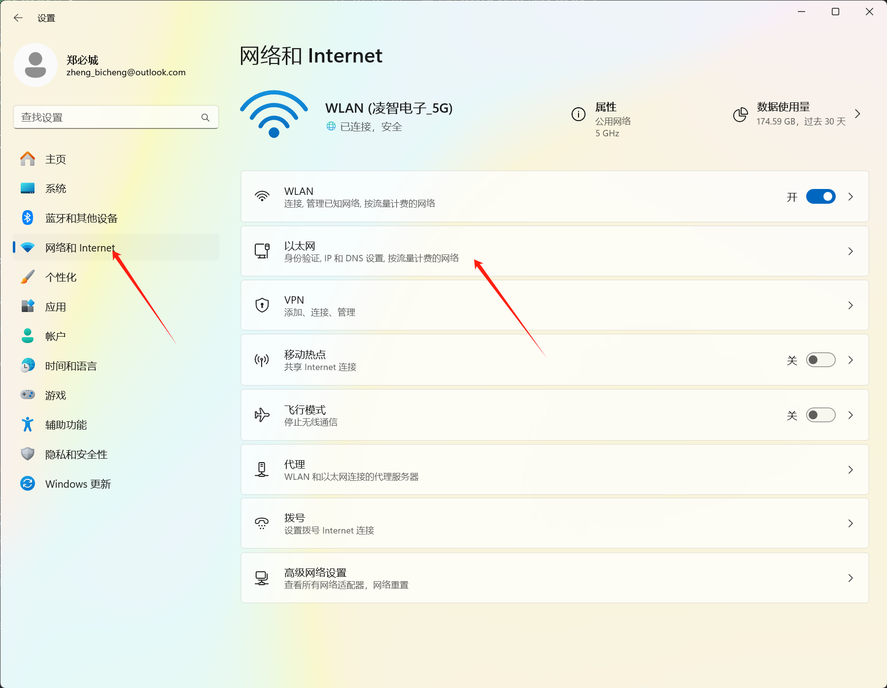
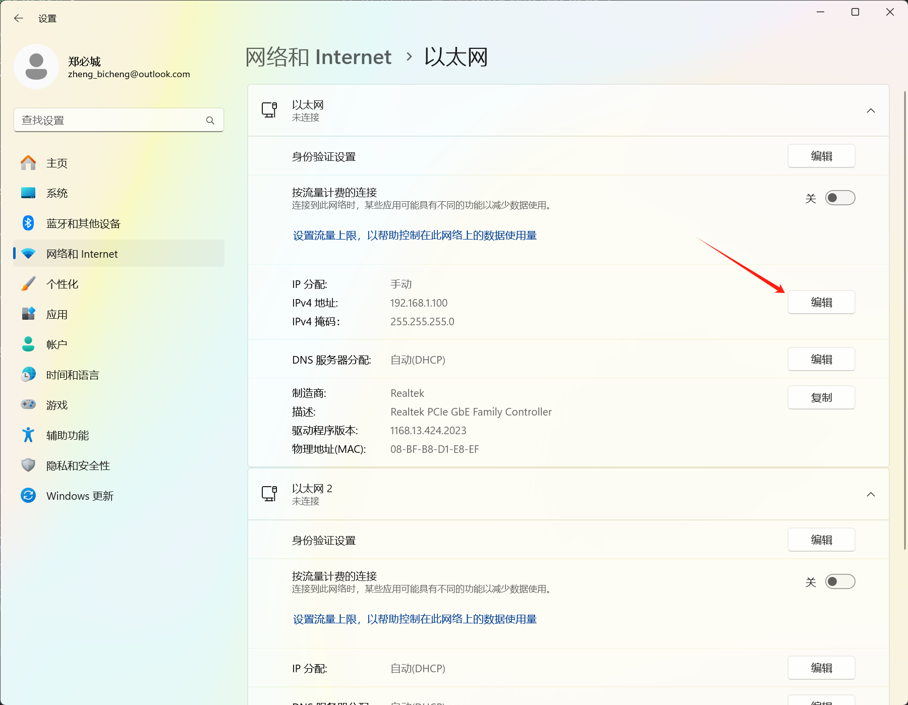
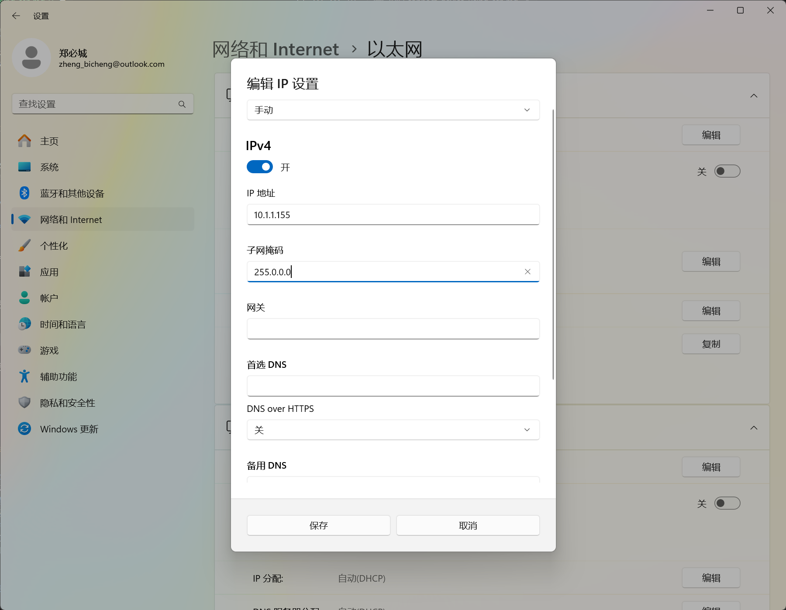
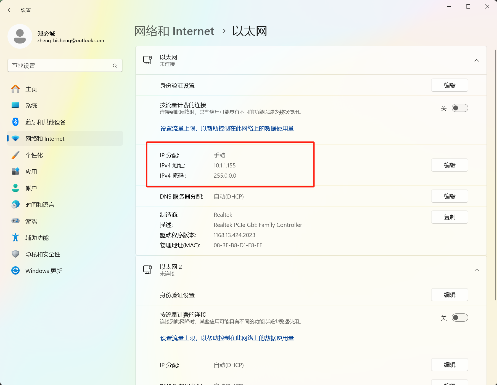
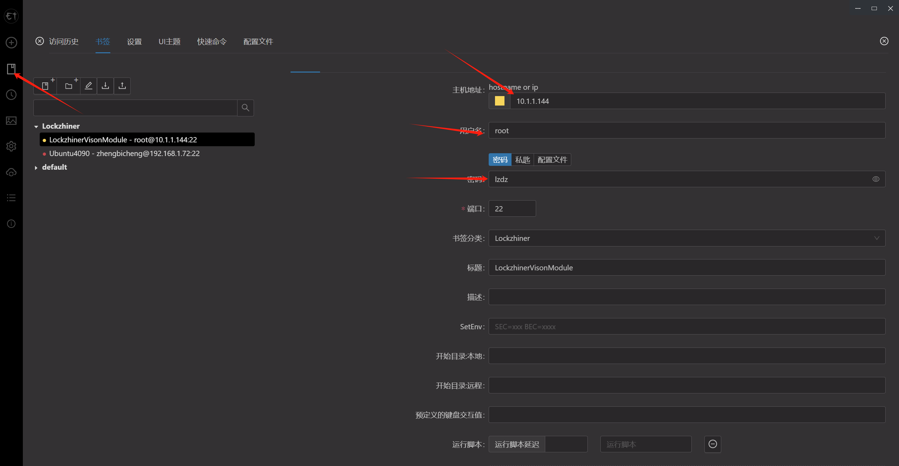
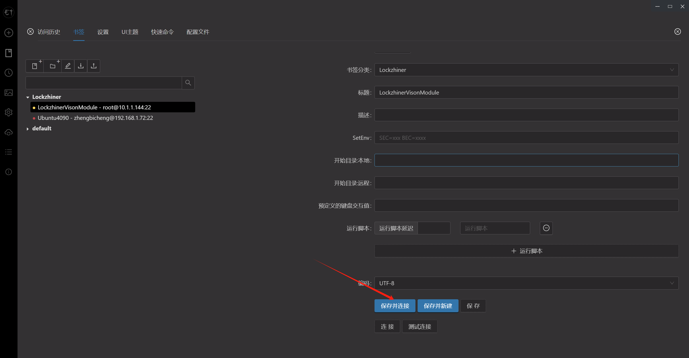
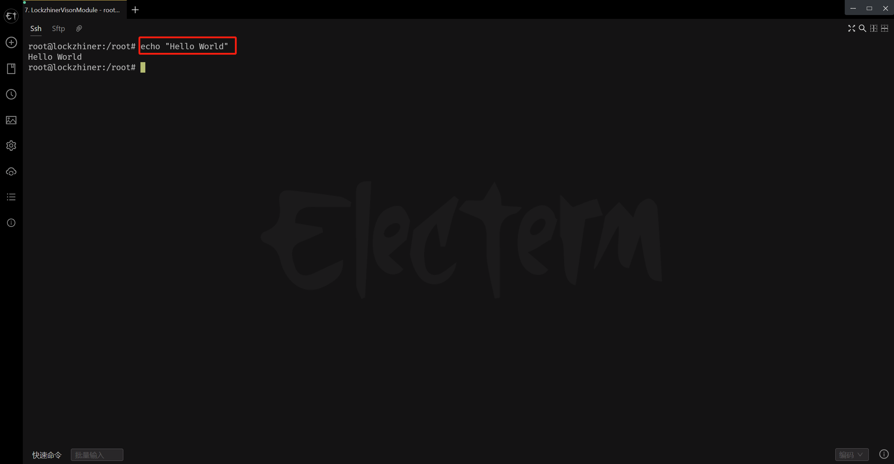

<h1 align="center">连接设备指南</h1>

发布版本：V0.0.1 

日期：2024-08-28

文件密级：□绝密 □秘密 □内部资料 ■公开  

---

**免责声明**  

本文档按**现状**提供，福州凌睿智捷电子有限公司（以下简称**本公司**）不对本文档中的任何陈述、信息和内容的准确性、可靠性、完整性、适销性、适用性及非侵权性提供任何明示或暗示的声明或保证。本文档仅作为使用指导的参考。  

由于产品版本升级或其他原因，本文档可能在未经任何通知的情况下不定期更新或修改。  

**读者对象**  

本教程适用于以下工程师：  

- 技术支持工程师  
- 软件开发工程师  

**修订记录**  

| **日期**   | **版本** | **作者** | **修改说明** |
| :--------- | -------- | -------- | ------------ |
| 2024/08/01 | 0.0.0    | 杨宁     | 初始版本     |
| 2024/08/28 | 0.0.1    | 郑必城     | 修复文档错误 |

## 1 简介

SSH 是一种用于在不安全网络上安全地访问和传输数据的协议，Lockzhiner Vision Module 使用 SSH 来让用户和设备进行通信。在本章节中，你将学会如何使用 SSH 连接设备并在屏幕上输出 Hello World。

## 2 下载并安装 electerm (可选)

[electerm](https://github.com/electerm/electerm) 是一款跨平台的 (linux, mac, win) 开源终端客户端，支持 ssh/sftp 等多种通信方式。我们默认使用 electerm 进行 SSH 和 FTP 通信，当然你也可以自由的选择其他的客户端来完成通信。

前往 [electerm sourceforge](https://sourceforge.net/projects/electerm.mirror/files/) 并点击 **Download Latest Version** 按钮来下载 electerm。



打开你下载的软件，一直点击下一步即可完成安装。



## 3 设置本机 IP 地址

要想使用 SSH 就必须保证本机和虚拟网口处在同一个 IP 下。请将设备连接上电脑并按照你的操作系统，按顺序执行以下步骤:

### 3.1 Win11 设置本机 IP 地址

键盘按下 **Win + Q** 呼出搜索框 -> 输入并点击设置



点击 **网络和 Internet** -> 点击 **以太网**



点击 **编辑** 并配置 IP 地址。这里将 IPV4 地址设置为 **10.1.1.155**，子网掩码设置为 **255.0.0.0**。




填完完成后点击 **保存**，你的界面应该如下图所示:



### 3.2 Win10 设置本机 IP 地址

待补充

## 4 使用 SSH 连接设备

为了方便大家使用，Lockzhiner Vision Module 在开机时默认启动 SSH 服务器并虚拟化一个网口。Lockzhiner Vision Module 的 SSH 详细信息如下：

```
登录账号：root
登录密码：lzdz
静态IP地址：10.1.1.144
```

打开 electerm 或者你本地的 SSH 编辑器，打开网络配置，将 IP、用户名、密码分别进行以下配置



点击保存并连接来连接到设备



屏幕上将出现以下界面


## 5 在屏幕上打印 Hello World

我们使用 Linux 命令行，输入以下命令在屏幕上打印 Hello World

```bash
echo "Hello World"
```

