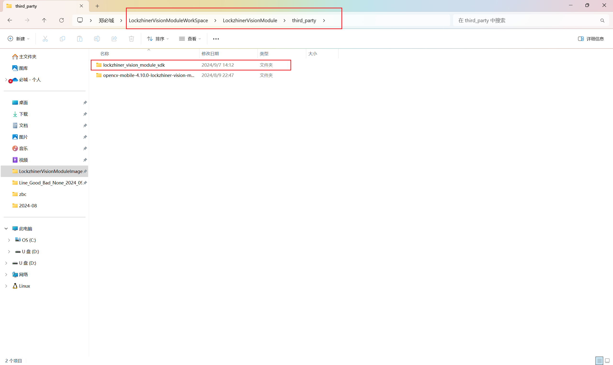

<h1 align="center">凌智视觉模块 C++ 开发环境搭建指南</h1>

发布版本：V0.0.0

日期：2024-09-26

文件密级：□绝密 □秘密 □内部资料 ■公开  

---

**免责声明**  

本文档按**现状**提供，福州凌睿智捷电子有限公司（以下简称**本公司**）不对本文档中的任何陈述、信息和内容的准确性、可靠性、完整性、适销性、适用性及非侵权性提供任何明示或暗示的声明或保证。本文档仅作为使用指导的参考。  

由于产品版本升级或其他原因，本文档可能在未经任何通知的情况下不定期更新或修改。  

**读者对象**  

本教程适用于以下工程师：  

- 技术支持工程师  
- 软件开发工程师  

**修订记录**  

| **日期**   | **版本** | **作者** | **修改说明** |
| :--------- | -------- | -------- | ------------ |
| 2024/09/26 | 0.0.0    | 黄展坤     | 初始版本     |
|2025/04/29  | 0.0.1    |林铮汉     | 补充部分说明  |

## 1 简介

Lockzhiner Vision Module 的 C++ 开发依赖 Ubuntu 系统，但是大多数用户仍然希望能在 Windows 系统上进行开发，因此我们特地推出了在 Windows 上使用 Docker 来进行开发的方法。在进行开发之前，我们需要创建 Docker 容器并安装开发必备的软件，主要分为以下几步进行:

* 安装 Docker Destop
* 读取镜像并创建和配置容器
* 安装交叉编译工具链

## 2 安装 Docker Destop

前往 [Docker 官网](https://www.docker.com/)下载 Docker Destop 安装包


如在下载中有困难，可使用我们提供的百度网盘下载 Docker Destop 安装包

[Docker安装包](https://pan.baidu.com/s/1Z2GYRx3RG6u4a1pDxZAoQg)
提取码: g5mc

打开安装包，按照以下顺序进行安装并重启电脑


重启电脑后，打开 Docker Destop，按顺序点击以下按钮 


安装完成后将会自动打开 Docker Destop，如下图


如在这一步出现下图所示


请参照如下博客进行WSL的安装和更新

[docker 安装问题解决方案](https://blog.csdn.net/cplvfx/article/details/138033592)

## 3 创建 Lockzhiner Vision Module 工作目录

打开磁盘，选择合适的位置准备创建 Lockzhiner Vision Module 工作目录。注意，工作目录存放的绝对路径请不要包含任何中文字符。

接下来**右键鼠标** -> **新建** -> **文件夹**，文件夹名字取名为 **LockzhinerVisionModuleWorkSpace**


进入新建的文件夹，先点击地址栏检查地址是否包含中文路径。


## 4 使用 Docker 加载镜像

接下来使用 **Shift + 鼠标右键** -> **在此处打开 PowerShell 窗口**


在 PowerShell 中输入以下命令来下载并安装 ubuntu-22.04 镜像:

```bash
wget https://gitee.com/LockzhinerAI/LockzhinerVisionModule/releases/download/v0.0.0/ubuntu-22.04.tar -Outfile ubuntu-22.04.tar
docker load -i ubuntu-22.04.tar
```


> 注意:
>
> 如果执行 **docker load** 时报错 **The system cannot find the file specified.** 请检查 Docker Destop 是否已经正常开启。

## 5 使用 Docker 创建并配置容器

在 PowerShell 中继续输入以下命令来创建并进入 Docker 容器，挂载容器时会将当前的工作目录映射到容器的 **/LockzhinerVisionModuleWorkSpace** 目录下

```bash
docker run -it --name LockzhinerVisionModule -v ${PWD}:/LockzhinerVisionModuleWorkSpace ubuntu:jammy /bin/bash
```


执行以下命令来更新 Apt 源

```bash
# 配置中科大软件源
sed -i 's@//.*archive.ubuntu.com@//mirrors.ustc.edu.cn@g' /etc/apt/sources.list
# 更新 Apt 源
apt update
```


执行以下命令来下载并安装命令行补全工具

```bash
# 安装 bash-completion
apt-get install -y bash-completion

# 运行这行命令后输入 no，并按回车
dpkg-reconfigure dash

# 运行 bash_completion
cd /usr/share/bash-completion
chmod +x bash_completion
./bash_completion
```


执行以下命令来退出容器

```bash
exit
```


## 6 配置项目编译环境

安装完 Docker 环境后，我们需要在容器中配置项目的编译环境。每一次在 Pwoershell 中使用命令来打开容器比较麻烦，这里我们使用 Docker Destop 来打开容器：

* 打开 **Docker Destop**
* 点击 **Containers**
* 点击运行按钮
* 点击 **LockzhinerVisionModule** 容器
* 点击 Exec 按钮进入命令行界面


### 6.1 下载必备软件包

在 Docker 容器中输入以下命令来安装交叉编译工具所需的依赖工具包

```bash
apt install -y cmake git wget unzip
apt install build-essential
```


### 6.2 下载交叉编译工具链

为了将 C++ 代码编译为在 Lockzhiner Vision Module 上运行的程序，我们需要在 Docker 容器中下载并安装交叉编译工具。

执行以下代码，进入 Lockzhiner Vision Module 工作目录并下载交叉编译工具

```bash
cd /LockzhinerVisionModuleWorkSpace/
git clone https://gitee.com/LockzhinerAI/arm-rockchip830-linux-uclibcgnueabihf.git
```


### 6.3 下载/更新 LockzhinerVisionModule 仓库

如果是首次配置环境，执行以下命令

```bash
cd /LockzhinerVisionModuleWorkSpace
git clone https://gitee.com/LockzhinerAI/LockzhinerVisionModule.git
cd LockzhinerVisionModule
mkdir -p third_party
```

如果是为了更新 LockzhinerVisionModule 仓库，执行以下命令

```bash
cd /LockzhinerVisionModuleWorkSpace/LockzhinerVisionModule
git pull
```

### 6.4 下载/更新库

执行以下命令来安装最新的库（会删除旧版本）

```bash
cd /LockzhinerVisionModuleWorkSpace/LockzhinerVisionModule
rm -rf opencv-mobile-4.10.0-lockzhiner-vision-module.zip
wget https://gitee.com/LockzhinerAI/opencv-mobile/releases/download/v29/opencv-mobile-4.10.0-lockzhiner-vision-module.zip
unzip -qo opencv-mobile-4.10.0-lockzhiner-vision-module.zip -d third_party
# 下载 fmt
rm -rf fmt-11.0.2-lockzhiner-vision-module.zip
wget https://gitee.com/LockzhinerAI/fmt/releases/download/11.0.2/fmt-11.0.2-lockzhiner-vision-module.zip
unzip -qo fmt-11.0.2-lockzhiner-vision-module.zip -d third_party
# 下载 pybind11
rm -rf pybind11-v2.13.5.zip
wget https://gitee.com/LockzhinerAI/pybind11/releases/download/v2.13.5/pybind11-v2.13.5.zip
unzip -qo pybind11-v2.13.5.zip -d third_party
# 下载 python3.11
rm -rf python3.11-lockzhiner-vision-module.zip
wget https://gitee.com/LockzhinerAI/pybind11/releases/download/v2.13.5/python3.11-lockzhiner-vision-module.zip
unzip -qo python3.11-lockzhiner-vision-module.zip -d third_party
# 下载 zxing-cpp
rm -rf zxing-cpp-v2.2.1-lockzhiner-vision-module.zip
wget https://gitee.com/LockzhinerAI/zxing-cpp/releases/download/v2.2.1/zxing-cpp-v2.2.1-lockzhiner-vision-module.zip
unzip -qo zxing-cpp-v2.2.1-lockzhiner-vision-module.zip -d third_party
# 下载 NCNN
rm -rf ncnn-20240820-lockzhiner-vision-module.zip
wget https://gitee.com/LockzhinerAI/ncnn/releases/download/20240820/ncnn-20240820-lockzhiner-vision-module.zip
unzip -qo ncnn-20240820-lockzhiner-vision-module.zip -d third_party
```

### 6.5 下载/更新 LockzhinerVisionModule SDK

执行以下命令来安装最新的 LockzhinerVisionModule SDK（会删除旧版本）

```bash
cd /LockzhinerVisionModuleWorkSpace/LockzhinerVisionModule
rm -rf third_party/lockzhiner_vision_module_sdk
rm -rf lockzhiner_vision_module_sdk.zip
# 其中v0.0.6为SDK的版本号，最新版本号请以发行版更新为准。
wget https://gitee.com/LockzhinerAI/LockzhinerVisionModule/releases/download/v0.0.6/lockzhiner_vision_module_sdk.zip
unzip -qo lockzhiner_vision_module_sdk.zip -d third_party
```

参考[连接设备指南](./connect_device_using_ssh.md)打开 Electerm 并连接设备，点击 **Sftp** 按钮。


使用任务管理器打开 **LockzhinerVisionModuleWorkSpace** 文件夹，按以下顺序操作来找到 SDK 存放目录:

* 打开 LockzhinerVisionModule
* 打开 third_party



点击地址栏并复制地址，如下图


回到 Electerm 将复制的地址粘贴到地址栏中并跳转到该目录，如下图:


选中 SDK ，单击鼠标右键并点击 **上传** 将 SDK 传输到 Lockzhiner Vision Module


点击 **Ssh** 回到 Lockzhiner Vision Module 命令行执行界面，运行以下命令拷贝动态库到系统中:

```bash
cd lockzhiner_vision_module_sdk
bash install-sh.sh 
```


## 7 验证开发环境

请参考 [编写第一个 Hello World 程序](../../Cpp_example/hello_world/README.md) 来验证开发环境是否能够正常使用