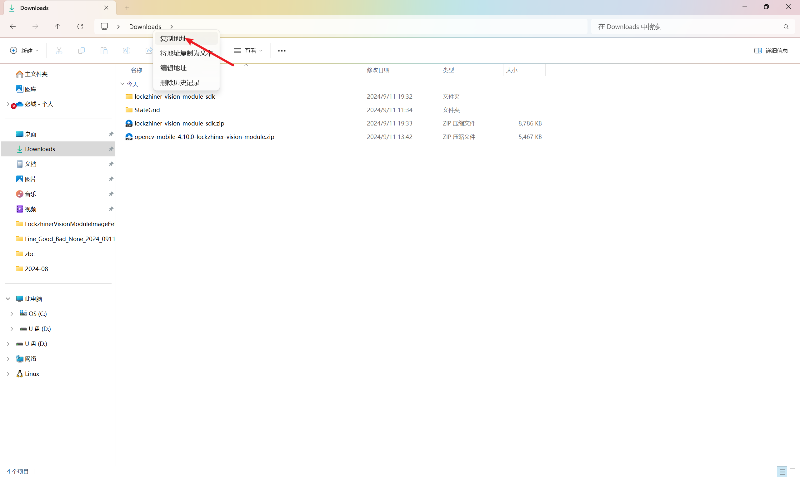

<h1 align="center">凌智视觉模块 Python 开发环境搭建指南</h1>

发布版本：V0.0.0

日期：2024-09-11

文件密级：□绝密 □秘密 □内部资料 ■公开  

---

**免责声明**  

本文档按**现状**提供，福州凌睿智捷电子有限公司（以下简称**本公司**）不对本文档中的任何陈述、信息和内容的准确性、可靠性、完整性、适销性、适用性及非侵权性提供任何明示或暗示的声明或保证。本文档仅作为使用指导的参考。  

由于产品版本升级或其他原因，本文档可能在未经任何通知的情况下不定期更新或修改。  

**读者对象**  

本教程适用于以下工程师：  

- 技术支持工程师  
- 软件开发工程师  

**修订记录**  

| **日期**   | **版本** | **作者** | **修改说明** |
| :--------- | -------- | -------- | ------------ |
| 2024/09/11 | 0.0.0    | 郑必城     | 初始版本     |

## 1 简介

Lockzhiner Vision Module 的 Python 开发不需要像 C++ 一样的交叉编译操作，因此你只需要将 Lockzhiner Module SDK 正确安装即可。

## 2 下载/更新 LockzhinerVisionModule SDK

点击 [Lockzhiner Vision Module SDK 下载链接](https://gitee.com/LockzhinerAI/LockzhinerVisionModule/releases/download/v0.0.3/lockzhiner_vision_module_sdk.zip) 下载 Lockzhiner Vision Module SDK。解压到本地后，请使用解压软件解压 SDK，一般我们推荐使用 Bandzip。


参考[连接设备指南](./connect_device_using_ssh.md)打开 Electerm 并连接设备，点击 **Sftp** 按钮。


接下来我们使用文件管理器打开 SDK 解压后存放的文件夹，找到 **lockzhiner_vision_module_sdk** 目录，点击地址栏并复制地址：



回到 Electerm 将复制的地址粘贴到地址栏中并跳转到该目录，选中 SDK，单击鼠标右键并点击 **上传** 将 SDK 传输到 Lockzhiner Vision Module


点击 **Ssh** 回到 Lockzhiner Vision Module 命令行执行界面，运行以下命令拷贝动态库到系统中:

```bash
cd lockzhiner_vision_module_sdk
bash install-sh.sh 
```


## 3 验证开发环境

使用 Electerm 连接到 Lockzhiner Vision Module，执行以下命令来验证 python 开发环境：

```bash
python
print("Hello World")
```