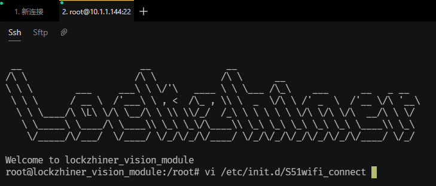
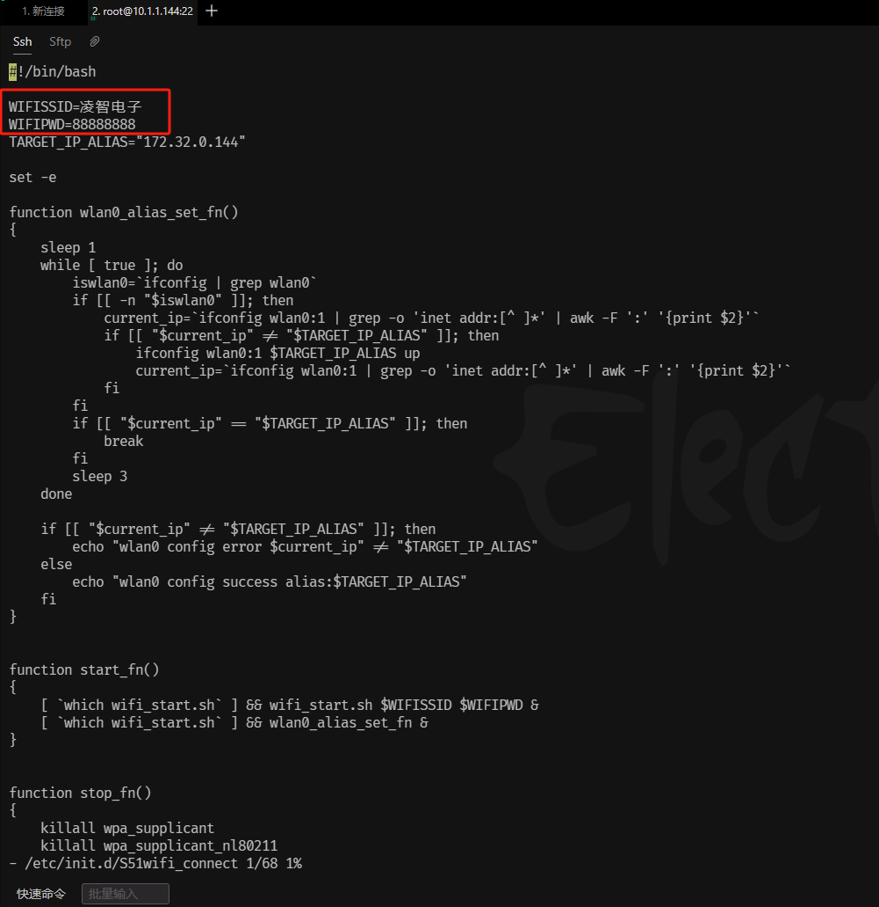
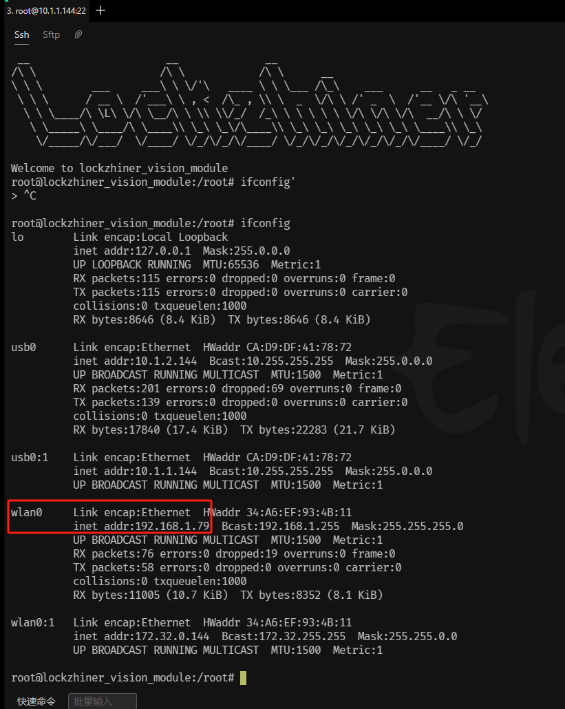

<h1 align="center">凌智视觉模块 WiFi 配置指南</h1>

发布版本：V0.0.1

日期：2024-12-18

文件密级：□绝密 □秘密 □内部资料 ■公开  

---

**免责声明**  

本文档按**现状**提供，福州凌睿智捷电子有限公司（以下简称**本公司**）不对本文档中的任何陈述、信息和内容的准确性、可靠性、完整性、适销性、适用性及非侵权性提供任何明示或暗示的声明或保证。本文档仅作为使用指导的参考。  

由于产品版本升级或其他原因，本文档可能在未经任何通知的情况下不定期更新或修改。  

**读者对象**  

本教程适用于以下工程师：  

- 技术支持工程师  
- 软件开发工程师

**修订记录**  

| **日期**     | **版本** | **作者** | **修改说明** |
|:-----------| -------- | -------- | ------------ |
| 2024/12/18 | 0.0.0    | 黄展坤     | 初始版本     |

## 1. 简介

凌智视觉模块支持通过 WiFi 连接到互联网，实现远程监控、远程控制等功能。本文档将介绍如何配置凌智视觉模块的 WiFi 连接。

## 2. 配置 WiFi 连接

在开始配置之前，请确保已经根据 [凌智视觉模块连接设备指南](./connect_device_using_ssh.md) 正确连接到凌智视觉模块。

使用 electerm 软件通过 SSH 连接到凌智视觉模块，输入以下命令：
```bash
vi /etc/init.d/S51wifi_connect
```



修改 `WIFISSID` 和 `WIFIPWD` 变量的值为你的 WiFi 账号和密码。输入 `i` 进入编辑模式：


> 注意：Lockzhiner AI 仅支持 2.4G WiFi 连接，不支持 5G WiFi 连接和热点连接。



修改完成后，保存文件并退出 vi 编辑器。

```bash
:wq
```

重启系统使配置生效：

```bash
reboot
```

等待系统重启完成，输入以下命令查看 WiFi 连接情况：
```bash
ifconfig
```



如果看到 wlan0 网卡的 `inet addr` 字段显示了 IP 地址，则说明 WiFi 连接成功。