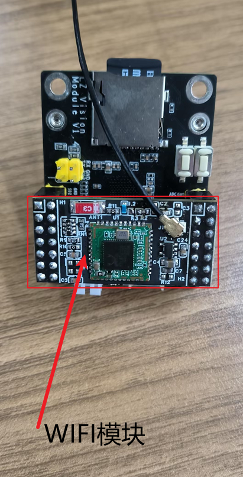
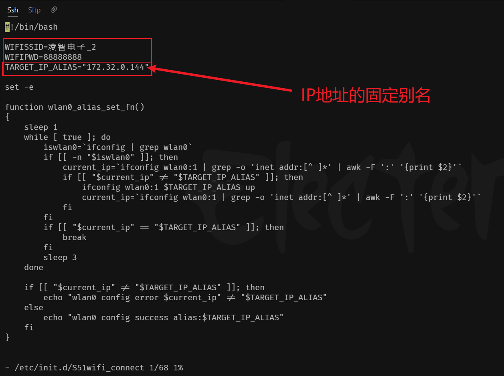
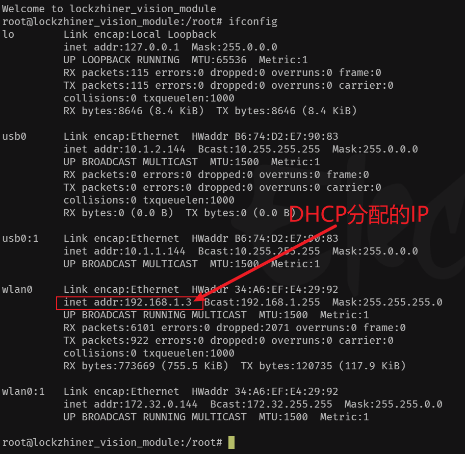
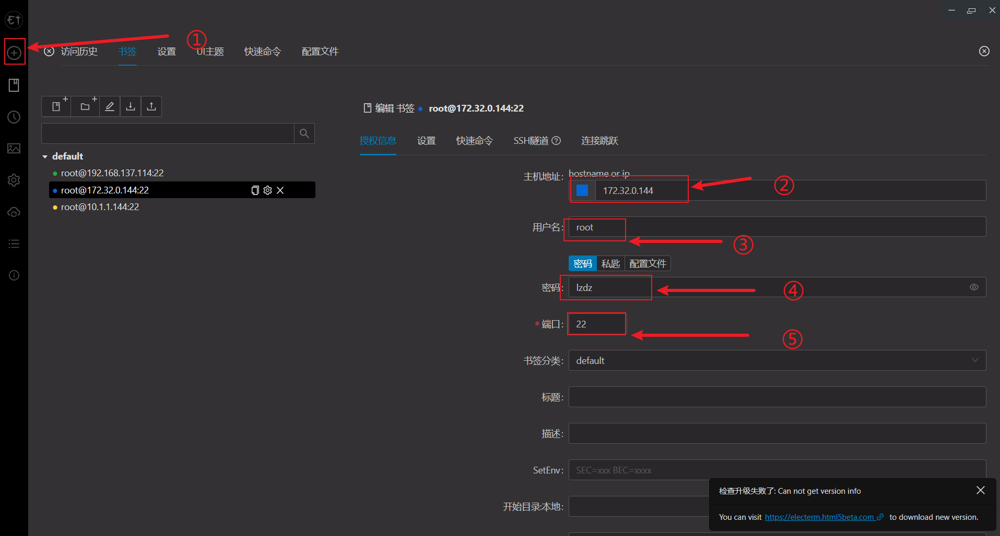
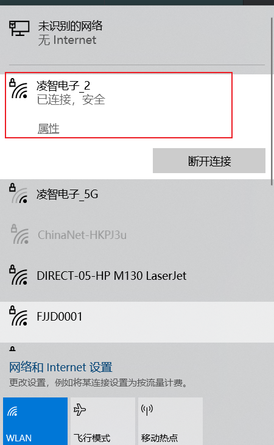
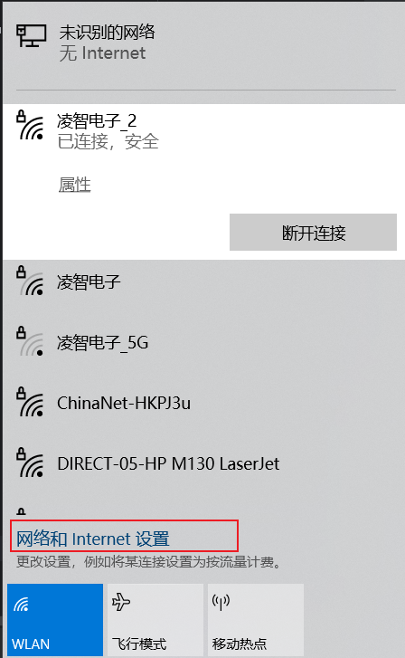
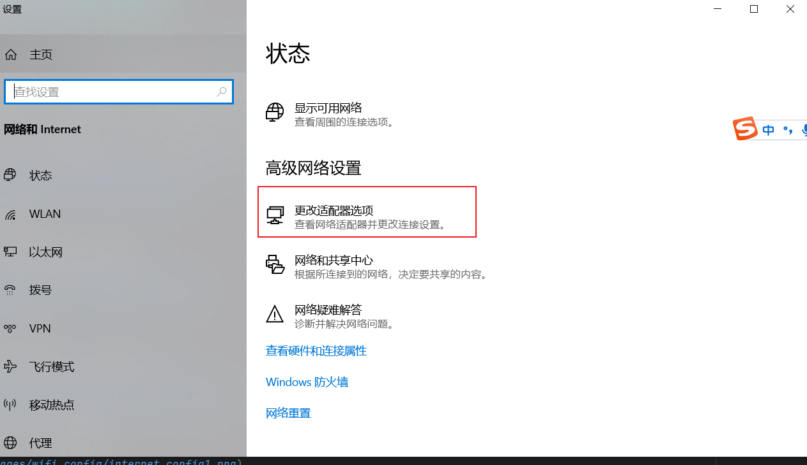
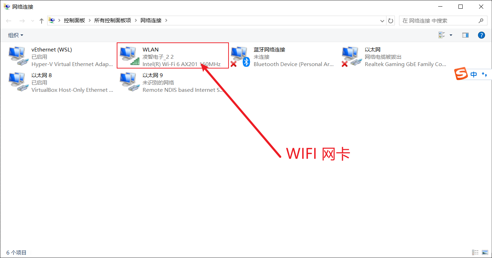
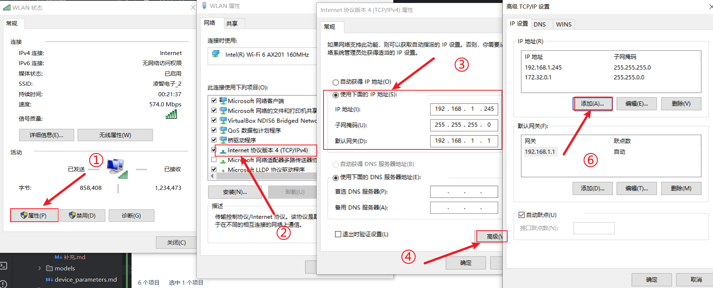
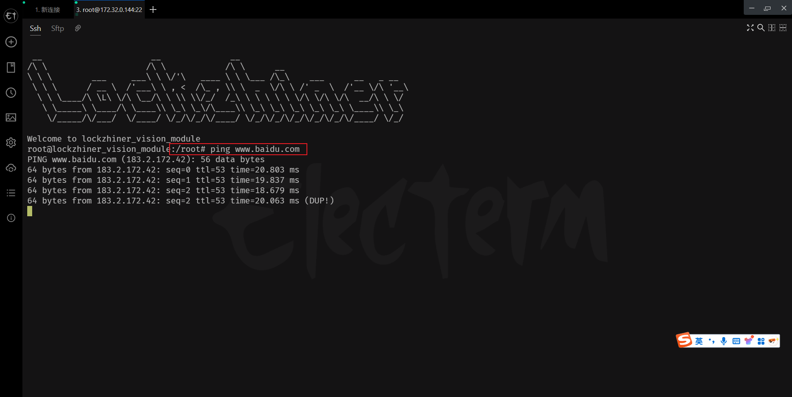

<h1 align="center">凌智视觉模块 WiFi 配置指南</h1>

发布版本：V0.0.1

日期：2024-12-18

文件密级：□绝密 □秘密 □内部资料 ■公开  

---

**免责声明**  

本文档按**现状**提供，福州凌睿智捷电子有限公司（以下简称**本公司**）不对本文档中的任何陈述、信息和内容的准确性、可靠性、完整性、适销性、适用性及非侵权性提供任何明示或暗示的声明或保证。本文档仅作为使用指导的参考。  

由于产品版本升级或其他原因，本文档可能在未经任何通知的情况下不定期更新或修改。  

**读者对象**  

本教程适用于以下工程师：  

- 技术支持工程师  
- 软件开发工程师

**修订记录**  

| **日期**     | **版本** | **作者** | **修改说明** |
|:-----------| -------- | -------- | ------------ |
| 2024/12/18 | 0.0.0    | 黄展坤     | 初始版本     |
|2024/12/30|0.0.1|钟海滨||

**注：** 在阅读本教程之前，首先确保手上有 wifi 模块并且确保模块已经正确安装：




## 1. 简介

凌智视觉模块支持通过 WiFi 连接到互联网，实现远程监控、远程控制等功能。本文档将介绍如何配置凌智视觉模块的 WiFi 连接。


## 2. 配置 WiFi 连接

在开始配置之前，请确保已经根据 [凌智视觉模块连接设备指南](./connect_device_using_ssh.md) 正确连接到凌智视觉模块。

使用 electerm 软件通过 SSH 连接到凌智视觉模块，输入以下命令：
```bash
vi /etc/init.d/S51wifi_connect
```


修改 `WIFISSID` 和 `WIFIPWD` 变量的值为你的 WiFi 账号和密码。输入 `i` 进入编辑模式：


> 注意：Lockzhiner AI 仅支持 2.4G WiFi 连接，不支持 5G WiFi 连接和热点连接。



修改完成后，保存文件并退出 vi 编辑器。

```bash
:wq
```

重启系统使配置生效：

```bash
reboot
```

等待系统重启完成，输入以下命令查看 WiFi 连接情况：
```bash
ifconfig
```



如果看到 wlan0 网卡的 `inet addr` 字段显示了 IP 地址，则说明 WiFi 连接成功。

## 3 使用 wifi 连接设备

在 WiFi 设置时有三个配置选项：
```python
    WIFISSID="你的wifi名称"
    WIFIPWD="你的wifi密码"
    TARGET_IP_ALIAS="172.32.0.144"
```

其中有个可配置项“TARGET_IP_ALIAS” 是默认 wlan0 固定 ip 别名172.32.0.144， ，在还不确定 dhcp 获取到的ip地址时可以先用ip别名地址访问。
**注意：** TARGET_IP_ALIAS 切不可设置为路由地址，否则会导致路由地址被覆盖，影响设备正常访问。

在还不确定dhcp获取到的ip地址时可以先用 ip 别名地址访问的详细步骤如下：

- 1. 确保 wifi 连接是准确的，可以在 ssh 使用 ifconfig 查看wlan0 的 ip 地址


- 2. 配置 SSH

新建一个 ssh 连接端，操作步骤如下图



- 3. 连接 wifi 

需要确保两个设备连接的 wifi 在同一个网段之下



点击**网络和 Internet 配置**



选择**更改网络适配器选项**



选择**本机的 WIFI 网卡**



**右键**本机 WIFI 网卡后，选择**属性**==>>进入WIFI网卡的配置选项页面

选择**属性**==>>选择**Internet 协议版本4**==>>勾选**使用下面的 IP 地址**配置一个可以用的 IP 地址

配置完成后==>> 选择**高级**==>>选择**添加**配置 **TCP/IP** 地址====一路确定，确保修改生效


具体操作如下图：



确保两个设备处在同一网段后，即可进行下一步。

- 4. 使用 WIFI 连接设备

在完成上述配置后，即可连接设备，使用 ping www.baidu.com 验证网络连接是否通畅

