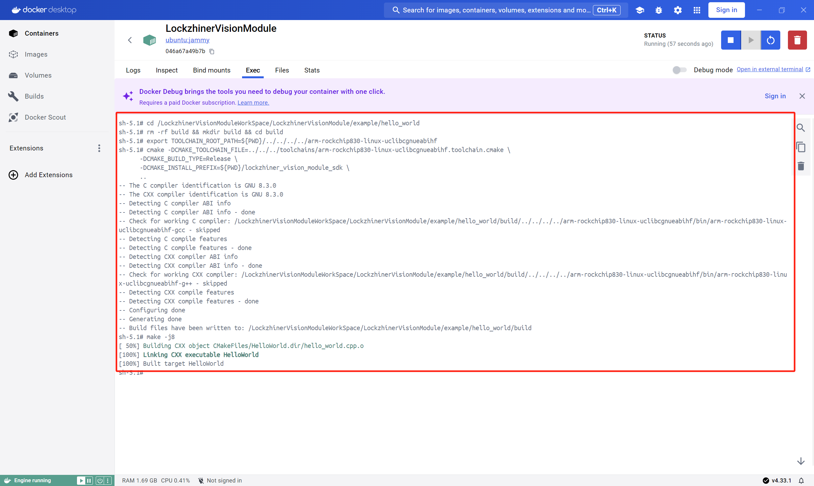
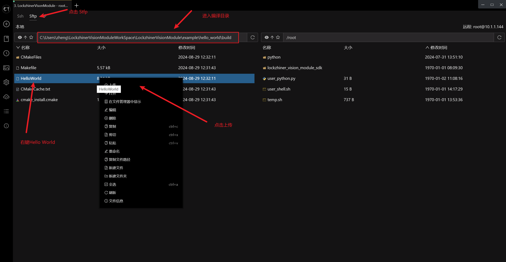
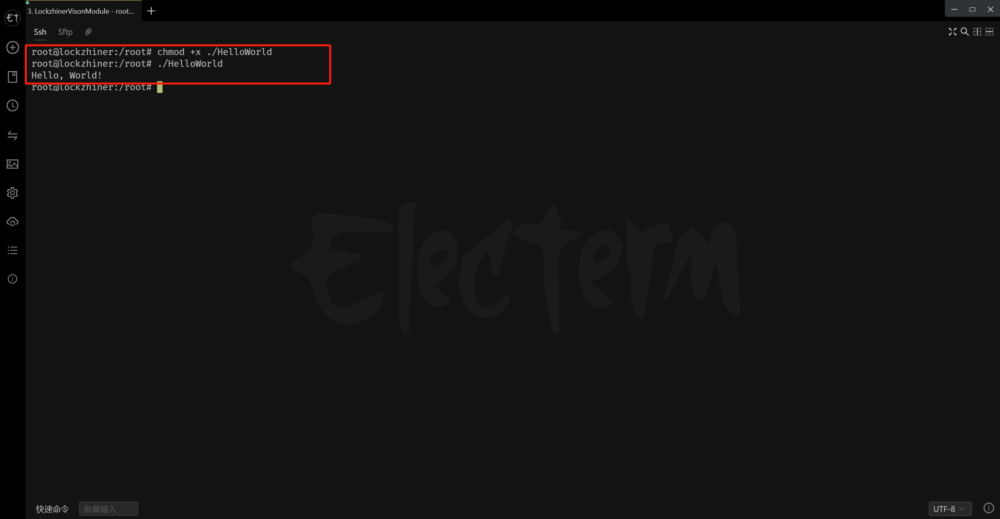

<h1 align="center">基于 C++ 编写 Hello World 程序</h1>

发布版本：V0.0.0

日期：2024-09-11

文件密级：□绝密 □秘密 □内部资料 ■公开  

---

**免责声明**  

本文档按**现状**提供，福州凌睿智捷电子有限公司（以下简称**本公司**）不对本文档中的任何陈述、信息和内容的准确性、可靠性、完整性、适销性、适用性及非侵权性提供任何明示或暗示的声明或保证。本文档仅作为使用指导的参考。  

由于产品版本升级或其他原因，本文档可能在未经任何通知的情况下不定期更新或修改。  

**读者对象**  

本教程适用于以下工程师：  

- 技术支持工程师  
- 软件开发工程师  

**修订记录**  

| **日期**   | **版本** | **作者** | **修改说明** |
| :--------- | -------- | -------- | ------------ |
| 2024/09/11 | 0.0.0    | 郑必城     | 初始版本     |

## 1 简介

Hello World 是软件工程师的入门第一课，很多人早就把代码倒背如流。和传统的 C++ 开发不同，开发在 Lockzhiner Vision Module 运行的 C++ 程序需要交叉编译。为了让多数没有接触过交叉编译的新手快速上手，我们特地准备了最简单的 Hello World 来让你快速上手。

> 注:
>
> 基于 Python 的 Hello World 例程网络上有非常多，如果你使用 Python 进行开发，请跳过这一章节。

## 2 前期准备

在开始这个章节前，请确保你已经按照 [开发环境搭建指南](../../docs/introductory_tutorial/cpp_development_environment.md) 正确配置了开发环境。

## 3 项目介绍

我们使用 CMake 构建项目，项目配置文件的内容如下

```cmake
# CMake最低版本要求  
cmake_minimum_required(VERSION 3.10)  
  
# 设置项目名称和版本  
project(HelloWorld VERSION 1.0)  
  
# 指定C++标准  
set(CMAKE_CXX_STANDARD 11) # 设置C++11为标准  
set(CMAKE_CXX_STANDARD_REQUIRED True) # 要求必须支持C++11标准  
  
# 添加可执行文件  
# hello_world.cpp是源文件，HelloWorld是生成的可执行文件名  
add_executable(HelloWorld hello_world.cpp)
```

对应的 C++ 文件的内容如下

```cpp
#include <iostream>  
  
int main() {  
    std::cout << "Hello, World!" << std::endl;  
    return 0;  
}
```

为了让用户能快速配置交叉编译工具链，我们提供了 [arm-rockchip830-linux-uclibcgnueabihf.toolchain.cmake](../../toolchains/arm-rockchip830-linux-uclibcgnueabihf.toolchain.cmake)。你只需要在配置项目时将 **CMAKE_TOOLCHAIN_FILE** 参数指定为该文件路径即可让 cmake 快速检测到已经配置的交叉编译工具。

## 4 编译项目

使用 Docker Destop 打开 LockzhinerVisionModule 容器并执行以下命令来编译项目

```bash
# 进入 Demo 目录
cd /LockzhinerVisionModuleWorkSpace/LockzhinerVisionModule/example/hello_world

# 创建编译目录
rm -rf build && mkdir build && cd build

# 配置交叉编译工具链
export TOOLCHAIN_ROOT_PATH=${PWD}/../../../../arm-rockchip830-linux-uclibcgnueabihf

# 使用 cmake 配置项目
cmake -DCMAKE_TOOLCHAIN_FILE=../../../toolchains/arm-rockchip830-linux-uclibcgnueabihf.toolchain.cmake \
      -DCMAKE_BUILD_TYPE=Release \
      ..

# 执行编译
make -j8
```



## 5 执行 Hello World 程序

参考 [连接设备指南](../../docs/introductory_tutorial/connect_device_using_ssh.md) 正确连接 Lockzhiner Vision Module 设备。


使用 SFTP 功能将软件上传到 Lockzhiner Vision Module



在 Lockzhiner Vision Module 上运行以下代码来执行 Hello World 程序

```bash
# 给程序添加可执行权限
chmod +x ./HelloWorld
# 运行程序
./HelloWorld
```

