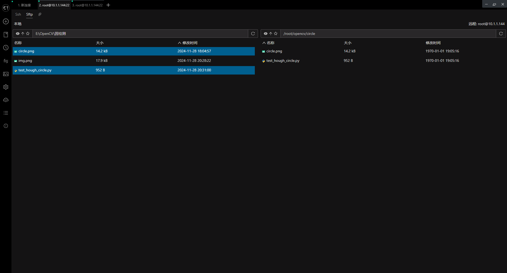
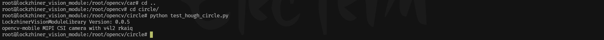
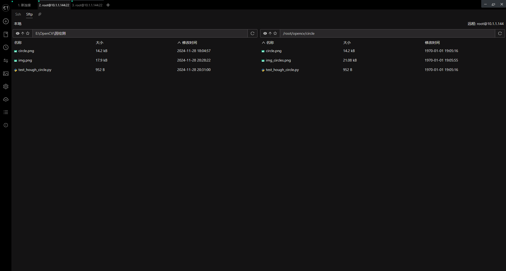
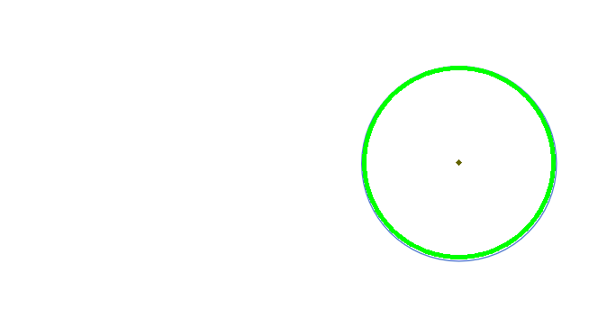

<h1 align="center">凌智视觉模块 OpenCV 圆形检测 Python 部署指南</h1>

发布版本：V0.0.0

日期：2024-11-29

文件密级：□绝密 □秘密 □内部资料 ■公开  

---

**免责声明**  

本文档按**现状**提供，福州凌睿智捷电子有限公司（以下简称**本公司**）不对本文档中的任何陈述、信息和内容的准确性、可靠性、完整性、适销性、适用性及非侵权性提供任何明示或暗示的声明或保证。本文档仅作为使用指导的参考。  

由于产品版本升级或其他原因，本文档可能在未经任何通知的情况下不定期更新或修改。  

**读者对象**  

本教程适用于以下工程师：  

- 技术支持工程师  
- 软件开发工程师  

**修订记录**  

| **日期**     | **版本** | **作者** | **修改说明** |
|:-----------| -------- |--------| ------------ |
| 2024/11/29 | 0.0.0    | 钟海滨    | 初始版本     |

## 1 简介

在计算机视觉领域，圆形检测是一项常见的任务，广泛应用于工业检测、医疗影像分析、自动驾驶等多个领域。准确地检测圆形不仅可以提高系统的自动化程度，还能显著提升工作效率。 本文将详细介绍如何使用 OpenCV 库在凌智视觉模块上实现高效的圆形检测功能。


## 2 Python API 文档

```python

def cvtColor(src, code, dstCn=0):
    """
    转换图像颜色空间。
    参数:
    - src: 输入图像。
    - code: 颜色空间转换代码。
    - dstCn: 目标图像的通道数，如果为0则根据code自动确定。
    返回:
    - 转换后的图像。
    """
    return cv2.cvtColor(src, code, dstCn)

def GaussianBlur(src, ksize, sigmaX, sigmaY=0, borderType=cv2.BORDER_DEFAULT):
    """
    使用高斯滤波模糊图像。
    参数:
    - src: 输入图像。
    - ksize: 滤波器的大小，必须是正奇数。
    - sigmaX: 水平方向的标准差。
    - sigmaY: 垂直方向的标准差，如果为0则与sigmaX相同。
    - borderType: 边界处理方式，默认为cv2.BORDER_DEFAULT。
    返回:
    - 模糊后的图像。
    """
    temp_ksize = convert2size(ksize)
    return cv2.GaussianBlur(src, temp_ksize, sigmaX, sigmaY, borderType)

def HoughCircles(image, method, dp, minDist, param1, param2, minRadius, maxRadius):
    """
    使用霍夫变换检测图像中的圆。
    参数:
    - image: 输入图像，应为8位单通道（灰度）图像。
    - method: 检测方法，通常为cv2.HOUGH_GRADIENT。
    - dp: 累加器分辨率与图像分辨率的反比。
    - minDist: 检测到的圆的中心之间的最小距离。
    - param1: 梯度值阈值。
    - param2: 累加器阈值。
    - minRadius: 最小圆半径。
    - maxRadius: 最大圆半径。
    返回:
    - 检测到的圆的数组，每个圆包含三个值：圆心坐标(x, y)和半径。
    """
    return [cv2.HoughCircles(
        image, method, dp, minDist, param1, param2, minRadius, maxRadius
    )]

def circle(img, center, radius, color, thickness=1, lineType=8, shift=0):
    """
    在图像上绘制圆。
    参数:
    - img: 输入图像。
    - center: 圆心坐标。
    - radius: 圆的半径。
    - color: 圆的颜色，为一个包含BGR值的元组。
    - thickness: 圆轮廓的厚度，正值表示轮廓厚度，负值表示填充圆。
    - lineType: 线条类型，默认为8连接线。
    - shift: 圆心坐标和半径的缩放比例，默认为0表示无缩放。
    """
    temp_center = convert2point(center)
    temp_color = convert2scalar(color)
    cv2.circle(img, temp_center, radius, temp_color, thickness, lineType, shift)

```

## 3 在凌智视觉模块上进行边缘检测案例 

为了方便大家入手，我们提供了 OpenCV 圆形检测的 Python 例程。该程序可以使用摄像头进行端到端推理。
**测试图片下载链接**：[圆形检测图片](https://gitee.com/LockzhinerAI/LockzhinerVisionModule/releases/download/v0.0.4/circle.png)

```python
import lockzhiner_vision_module.cv2 as cv2
# 读取图像
image_path = 'circle.png'
img = cv2.imread(image_path)

if img is None:
    print("Error: Image not loaded.")
else:
    # 转换为灰度图像
    gray = cv2.cvtColor(img, cv2.COLOR_BGR2GRAY)

    # 使用高斯模糊减少噪声
    blurred = cv2.GaussianBlur(gray, (9, 9), 2)

    # 使用 HoughCircles 检测圆形
    circles = cv2.HoughCircles(blurred, cv2.HOUGH_GRADIENT, dp=1, minDist=50,
                               param1=50, param2=30, minRadius=0, maxRadius=0)
    if circles is not None:
        # 在图像上绘制检测到的圆
        for i in circles[0]:
            center = (int(i[0]), int(i[1]))
            radius = int(i[2])

            # 绘制圆心
            cv2.circle(img, center, 1, (0, 100, 100), 3)

            # 绘制圆
            cv2.circle(img, center, radius, (0, 255, 0), 3)

    # # 保存结果图像
    cv2.imwrite('img_circles.png', img)

```
## 4 上传并测试 Python 程序

参考 [连接设备指南](../../../../docs/introductory_tutorial/connect_device_using_ssh.md) 正确连接 Lockzhiner Vision Module 设备。


请使用 Electerm Sftp 依次上传以下文件:

- 进入存放 **test_hough_circle.py** 脚本文件的目录，将 **test_hough_circle.py** 上传到 Lockzhiner Vision Module
- 进入存放 **待检测图片** 存放的目录，将 **待检测图片** 上传到 Lockzhiner Vision Module

上传文件


请使用 Electerm Ssh 并在命令行中执行以下命令:

```bash
python test_hough_circle.py
```

运行程序后，屏幕上输出 



下载结果



圆形检测原图


圆形检测结果图片




