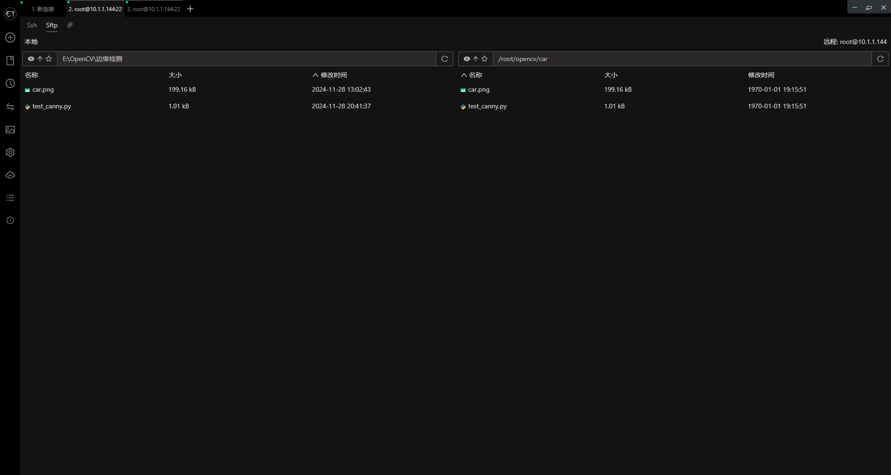
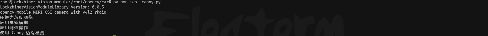
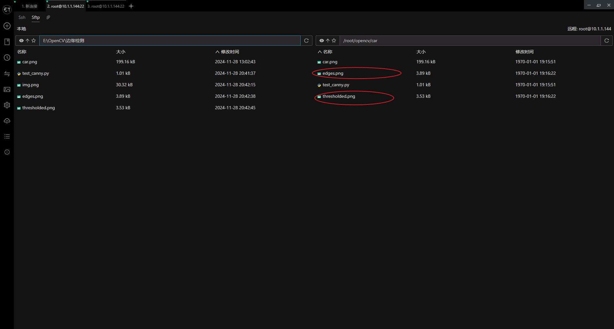
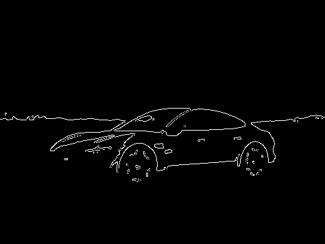

<h1 align="center">凌智视觉模块边缘检测案例</h1>

发布版本：V0.0.0

日期：2024-11-28

文件密级：□绝密 □秘密 □内部资料 ■公开  

---

**免责声明**  

本文档按**现状**提供，福州凌睿智捷电子有限公司（以下简称**本公司**）不对本文档中的任何陈述、信息和内容的准确性、可靠性、完整性、适销性、适用性及非侵权性提供任何明示或暗示的声明或保证。本文档仅作为使用指导的参考。  

由于产品版本升级或其他原因，本文档可能在未经任何通知的情况下不定期更新或修改。  

**读者对象**  

本教程适用于以下工程师：  

- 技术支持工程师  
- 软件开发工程师  

**修订记录**  

| **日期**     | **版本** | **作者** | **修改说明** |
|:-----------| -------- |--------| ------------ |
| 2024/11/28 | 0.0.0    | 钟海滨    | 初始版本     |

## 1 简介

OpenCV作为计算机图像处理库，提供了丰富的功能。我们在凌智视觉模块上适配了OpenCV的边缘检测算法，并封装了相关函数，使得用户能够快速使用OpenCV的边缘检测算法进行边缘检测。

## 2 在凌智视觉模块上进行边缘检测案例   
[OPENCV API 文档](../OpenCV_API.md)
为了快速上手，我们提供了边缘检测案例
```python
import lockzhiner_vision_module.cv2 as cv2
# 读取图片
image = cv2.imread('car.png')

# 检查图像是否成功读取
if image is None:
    print("Error: Unable to load image.")
    exit()

# 转换为灰度图像
gray = cv2.cvtColor(image, cv2.COLOR_BGR2GRAY)
print("转换为灰度图像")

# 高斯模糊
blurred = cv2.GaussianBlur(gray, (3, 3), 0)
print("应用高斯模糊")

# 阈值操作
_, thresholded = cv2.threshold(blurred, 100, 255, cv2.THRESH_BINARY)
print("应用阈值操作")
cv2.imwrite('thresholded.png', thresholded)
# 使用 Canny 边缘检测
edges = cv2.Canny(thresholded, 20, 10)
print("使用 Canny 边缘检测")
# 保存边缘检测结果
cv2.imwrite('edges.png', edges)
```
## 3 上传并测试 Python 程序

参考 [连接设备指南](../../../docs/introductory_tutorial/connect_device_using_ssh.md) 正确连接 Lockzhiner Vision Module 设备。


请使用 Electerm Sftp 依次上传以下文件:

- 进入存放 **test_canny.py** 脚本文件的目录，将 **test_canny.py** 上传到 Lockzhiner Vision Module
- 进入存放 **待检测图片** 存放的目录，将 **待检测图片** 上传到 Lockzhiner Vision Module

上传文件


请使用 Electerm Ssh 并在命令行中执行以下命令:

```bash
python test_canny.py
```

运行程序后，屏幕上输出 

下载结果

边缘检测结果图片

阈值操作结果图片


