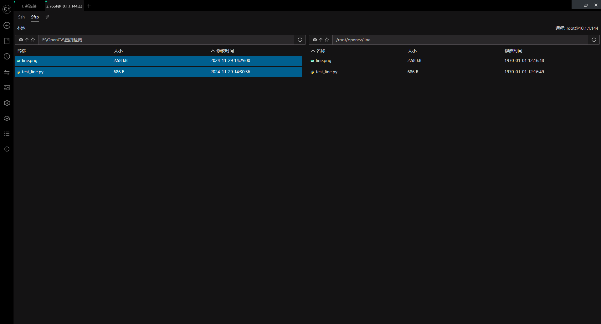
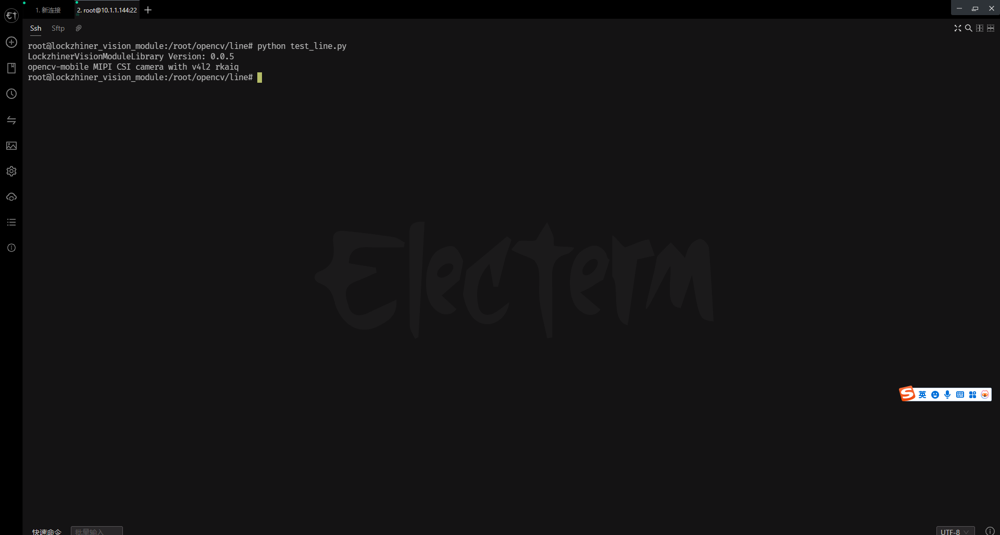
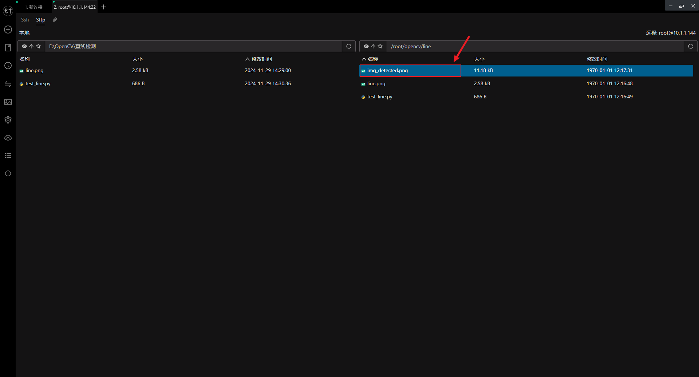
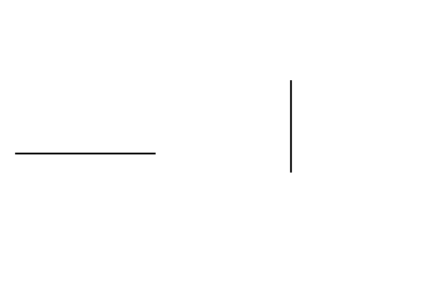
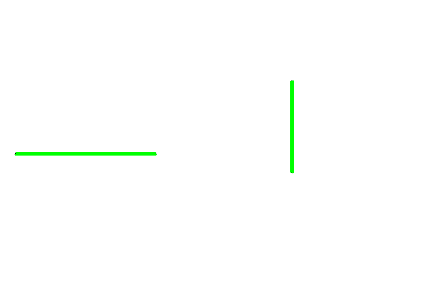

<h1 align="center">凌智视觉模块 OpenCV 直线检测 Python 部署指南</h1>

发布版本：V0.0.0

日期：2024-11-29

文件密级：□绝密 □秘密 □内部资料 ■公开  

---

**免责声明**  

本文档按**现状**提供，福州凌睿智捷电子有限公司（以下简称**本公司**）不对本文档中的任何陈述、信息和内容的准确性、可靠性、完整性、适销性、适用性及非侵权性提供任何明示或暗示的声明或保证。本文档仅作为使用指导的参考。  

由于产品版本升级或其他原因，本文档可能在未经任何通知的情况下不定期更新或修改。  

**读者对象**  

本教程适用于以下工程师：  

- 技术支持工程师  
- 软件开发工程师  

**修订记录**  

| **日期**     | **版本** | **作者** | **修改说明** |
|:-----------| -------- |--------| ------------ |
| 2024/11/29 | 0.0.0    | 钟海滨    | 初始版本     |

## 1 简介

直线检测是计算机视觉中的一个基本任务，广泛应用于图像处理、机器视觉和自动驾驶等领域。通过检测图像中的直线，可以实现道路边缘识别、物体边界检测等多种应用场景。本指南将详细介绍如何使用 OpenCV 库在凌智视觉模块上部署直线检测功能。

## 2 Python API 文档

```python
def cvtColor(src, code, dstCn=0):
    """
    转换图像的颜色空间。
    参数:
    - src: 输入图像。
    - code: 颜色空间转换的代码。
    - dstCn: 目标图像的通道数，默认为0。
    返回:
    - 颜色空间转换后的图像。
    """
  
def GaussianBlur(src, ksize, sigmaX, sigmaY=0, borderType=cv2.BORDER_DEFAULT):
    """
    对图像进行高斯模糊处理。
    参数:
    - src: 输入图像。
    - ksize: 高斯核的大小，可以是一个整数或两个整数的元组。
    - sigmaX: 高斯核在X方向上的标准差。
    - sigmaY: 高斯核在Y方向上的标准差，默认为0。
    - borderType: 图像边界的处理方式，默认为cv2.BORDER_DEFAULT。
    返回:
    - 模糊处理后的图像。
    """

def Canny(img, threshold1, threshold2, apertureSize=3, L2gradient=False):
    """
    使用Canny算法检测图像中的边缘。
    参数:
    - img: 输入图像。
    - threshold1: 第一个阈值，用于直线检测。
    - threshold2: 第二个阈值，用于直线检测。
    - apertureSize: Sobel算子的孔径大小，默认为3。
    - L2gradient: 一个布尔值，表示是否使用更精确的L2范数进行梯度计算，默认为False。
    返回:
    - 直线检测后的图像。
    """

def HoughLinesP(image, rho, theta, threshold, minLineLength=0, maxLineGap=0):
    """
    使用霍夫变换检测图像中的线段。
    参数:
    - image: 输入图像。
    - rho: 距离的分辨率。
    - theta: 角度的分辨率。
    - threshold: 累计器的阈值。
    - minLineLength: 最小线段长度，默认为0。
    - maxLineGap: 线段之间的最大间隔，默认为0。
    返回:
    - 检测到的线段信息列表。
    """


```


## 3 在凌智视觉模块上进行直线检测案例   

为了快速上手，我们提供了直线检测案例
**测试图片下载链接：**[直线检测图片](https://gitee.com/LockzhinerAI/LockzhinerVisionModule/releases/download/v0.0.4/line.png)

```python
import lockzhiner_vision_module.cv2 as cv2
pi = 3.1415926535897932384626433832795
# 读取图片
image = cv2.imread('line.png')
# 转换为灰度图像
gray = cv2.cvtColor(image, cv2.COLOR_BGR2GRAY)
# 使用高斯模糊减少噪声
blurred = cv2.GaussianBlur(gray, (5, 5), 1)
# 使用 Canny 边缘检测
edges = cv2.Canny(gray, 50, 150)
# 使用霍夫变换检测直线
lines = cv2.HoughLinesP(edges, 1, pi / 180, threshold=100, minLineLength=50, maxLineGap=20)
# 绘制检测到的直线
if lines is not None:
    for line in lines[0]:
        x1, y1, x2, y2 = line
        cv2.line(image, (x1, y1), (x2, y2), (0, 255, 0), 2)
cv2.imwrite('img_detected.png', image)

```

## 4 上传并测试 Python 程序

参考 [连接设备指南](../../../docs/introductory_tutorial/connect_device_using_ssh.md) 正确连接 Lockzhiner Vision Module 设备。


请使用 Electerm Sftp 依次上传以下文件:

- 进入存放 **test_line.py** 脚本文件的目录，将 **test_line.py** 上传到 Lockzhiner Vision Module
- 进入存放 **待检测图片** 存放的目录，将 **待检测图片** 上传到 Lockzhiner Vision Module

上传文件



请使用 Electerm Ssh 并在命令行中执行以下命令:

```bash
python test_line.py
```

运行程序后，屏幕上输出 



下载结果



直线检测原图



直线检测结果图片




