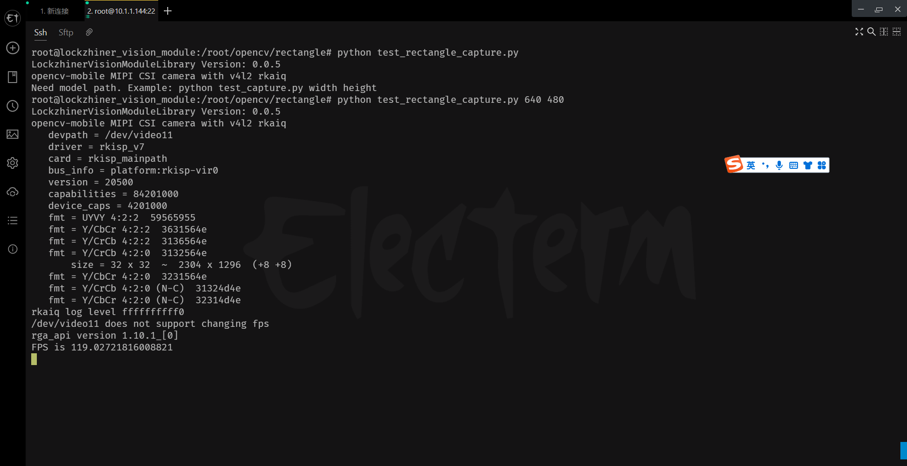

<h1 align="center">凌智视觉模块 OpenCV 矩形检测 Python 部署指南</h1>

发布版本：V0.0.0

日期：2024-11-29

文件密级：□绝密 □秘密 □内部资料 ■公开  

---

**免责声明**  

本文档按**现状**提供，福州凌睿智捷电子有限公司（以下简称**本公司**）不对本文档中的任何陈述、信息和内容的准确性、可靠性、完整性、适销性、适用性及非侵权性提供任何明示或暗示的声明或保证。本文档仅作为使用指导的参考。  

由于产品版本升级或其他原因，本文档可能在未经任何通知的情况下不定期更新或修改。  

**读者对象**  

本教程适用于以下工程师：  

- 技术支持工程师  
- 软件开发工程师  

**修订记录**  

| **日期**     | **版本** | **作者** | **修改说明** |
|:-----------| -------- |--------| ------------ |
| 2024/11/29 | 0.0.0    | 钟海滨    | 初始版本     |

## 1 简介

在现代计算机视觉应用中，矩形检测是一项基本但重要的任务，广泛应用于物体识别、场景理解、文档扫描等领域。本指南将详细介绍如何使用 OpenCV 库在凌智视觉模块上部署高效的矩形检测算法。 本文将详细介绍如何使用 OpenCV 库在凌智视觉模块上实现高效的矩形检测功能。


## 2 Python API 文档

```python

def cvtColor(src, code, dstCn=0):
    """
    转换图像颜色空间。
    参数:
    - src: 输入图像。
    - code: 颜色空间转换代码。
    - dstCn: 目标图像的通道数，如果为0则根据code自动确定。
    返回:
    - 转换后的图像。
    """

def GaussianBlur(src, ksize, sigmaX, sigmaY=0, borderType=cv2.BORDER_DEFAULT):
    """
    使用高斯滤波模糊图像。
    参数:
    - src: 输入图像。
    - ksize: 高斯核的大小，必须是奇数。
    - sigmaX: 高斯核在X方向的标准差。
    - sigmaY: 高斯核在Y方向的标准差，如果为0则与sigmaX相同。
    - borderType: 图像边界的处理方式，默认为cv2.BORDER_DEFAULT。
    返回:
    - 模糊后的图像。
    """

def threshold(src, thresh, maxval, type):
    """
    对图像应用阈值处理。
    参数:
    - src: 输入图像。
    - thresh: 阈值。
    - maxval: 阈值处理后的最大值。
    - type: 阈值处理的类型。
    返回:
    - 计算出的阈值。
    - 阈值处理后的图像。
    """

def drawContours(img, contours, contourIdx, color, thickness=1, lineType=8, shift=0):
    """
    在图像上绘制轮廓。
    参数:
    - img: 输入图像。
    - contours: 要绘制的轮廓列表。
    - contourIdx: 要绘制的轮廓索引，-1表示绘制所有轮廓。
    - color: 轮廓的颜色。
    - thickness: 轮廓线的厚度。
    - lineType: 轮廓线的类型。
    - shift: 轮廓坐标的小数位数。
    """
 
def findContours(image, mode, method, point=cv2.Point()):
    """
    在二值图像中检测轮廓。
    参数:
    - image: 输入的二值图像。
    - mode: 轮廓的检索模式。
    - method: 轮廓的近似方法。
    - point: 轮廓检索的起始点。
    返回:
    - 检测到的轮廓列表。
    - 轮廓的层次结构。
    """
  
def arcLength(curve, closed):
    """
    计算曲线的长度。
    参数:
    - curve: 输入的曲线，由点序列组成。
    - closed: 曲线是否封闭。
    返回:
    - 曲线的长度。
    """

def approxPolyDP(curve, epsilon, closed):
    """
    使用Douglas-Peucker算法近似曲线。
    参数:
    - curve: 输入的曲线，由点序列组成。
    - epsilon: 近似精度，通常为原始曲线长度的百分之一。
    - closed: 曲线是否封闭。
    返回:
    - 近似后的曲线。
    """

```

## 3 在凌智视觉模块上进行边缘检测案例 

为了方便大家入手，我们提供了 OpenCV 矩形检测的 Python 例程。该程序可以使用摄像头进行端到端推理。

```python
from lockzhiner_vision_module.cv2 import VideoCapture
import lockzhiner_vision_module.cv2 as cv2
from lockzhiner_vision_module.edit import Edit
import time
import sys

pi = 3.14159265358979323846
if __name__ == "__main__":
    args = sys.argv
    if len(args) != 3:
        print("Need model path. Example: python test_capture.py width height")
        exit(1)

    edit = Edit()
    edit.start_and_accept_connection()

    video_capture = VideoCapture()
    video_capture.set_width(int(args[1]))
    video_capture.set_height(int(args[2]))
    if video_capture.open(0) is False:
        print("Failed to open capture")
        exit(1)

    while True:
        read_index = 0
        total_time_ms = 0
        for i in range(30):
            start_time = time.time()
            ret, mat = video_capture.read()
            if ret is False:
                continue
            end_time = time.time()
            # 转换为灰度图像
            gray = cv2.cvtColor(mat, cv2.COLOR_BGR2GRAY)
            # 高斯模糊
            blurred = cv2.GaussianBlur(gray, (5, 5), 0)
            # 二值化
            _, binary = cv2.threshold(blurred, 127, 255, cv2.THRESH_BINARY_INV)
            edges = cv2.Canny(binary, 30, 200)
            contours, _ = cv2.findContours(edges.copy(), cv2.RETR_LIST, cv2.CHAIN_APPROX_SIMPLE)
            for contour in contours:
                # 近似轮廓
                # 计算轮廓周长
                epsilon = 0.02 * cv2.arcLength(contour, True)
                # 将轮廓近似为多边形
                if epsilon < 15:
                    continue
                approx = cv2.approxPolyDP(contour, epsilon, True)
                # 如果近似轮廓有4个顶点，则认为是矩形
                if len(approx) == 4:
                    cv2.putText(mat, "Rectangle", (50,50), cv2.FONT_HERSHEY_SIMPLEX, 1, (0, 0, 255), 2)
                    cv2.drawContours(mat, [approx], -1, (0, 255, 0), 2)
            edit.print(mat)
            total_time_ms += end_time - start_time
            read_index += 1
        print(f"FPS is {1.0 / (total_time_ms / read_index)}")


```
## 4 上传并测试 Python 程序

参考 [连接设备指南](../../../../docs/introductory_tutorial/connect_device_using_ssh.md) 正确连接 Lockzhiner Vision Module 设备。


请使用 Electerm Sftp 依次上传以下文件:

- 进入存放 **test_rectangle.py** 脚本文件的目录，将 **test_rectangle.py** 上传到 Lockzhiner Vision Module

上传文件


请使用 Electerm Ssh 并在命令行中执行以下命令:

```bash
python test_rectangle.py 640 480
```
运行程序后，屏幕上输出 



矩形检测结果图片


