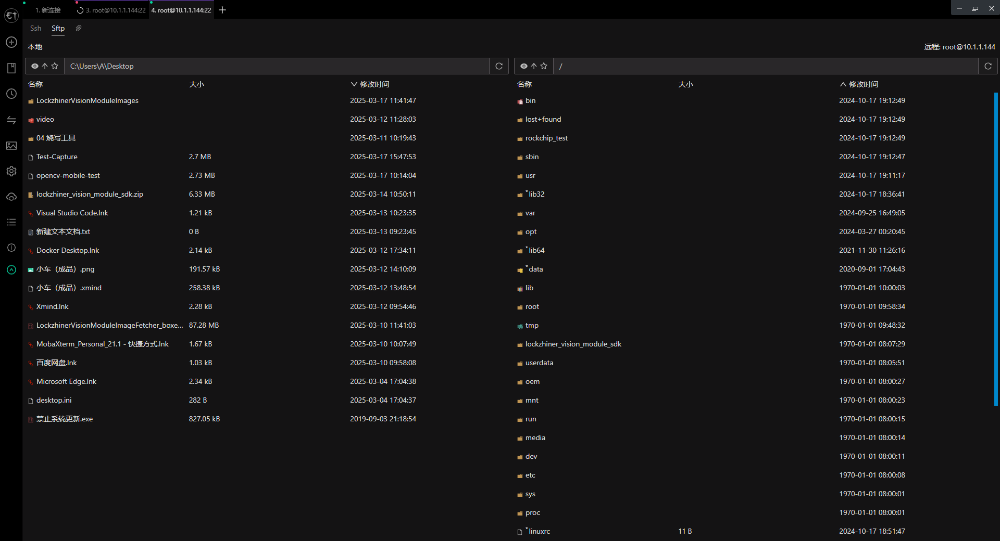

<h1 align="center">凌智视觉模块视觉巡线部署指南 Cpp 部署指南</h1>

发布版本：V0.0.0

日期：2024-09-27

文件密级：□绝密 □秘密 □内部资料 ■公开  

---

**免责声明**  

本文档按**现状**提供，福州凌睿智捷电子有限公司（以下简称**本公司**）不对本文档中的任何陈述、信息和内容的准确性、可靠性、完整性、适销性、适用性及非侵权性提供任何明示或暗示的声明或保证。本文档仅作为使用指导的参考。  

由于产品版本升级或其他原因，本文档可能在未经任何通知的情况下不定期更新或修改。  

**读者对象**  

本教程适用于以下工程师：  

- 技术支持工程师  
- 软件开发工程师  

**修订记录**  

| **日期**     | **版本** | **作者** | **修改说明** |
|:-----------| -------- |--------| ------------ |
| 2025/03/17 | 0.0.0    | 林铮汉    | 初始版本     |

## 1 简介

接下来让我们基于 Cpp 来部署视觉巡线案例，在开始本章节前：


## 2 Cpp API 文档
本次项目中的使用的opencv函数API
```python
class Point:
    def __init__(self):
        self.point = cv2.Point()

    @property
    def x(self):
        """
        获取坐标点的 x 坐标

        Returns:
            int: 坐标点的 x 坐标
        """
        return self.rect.x

    @property
    def y(self):
        """
        获取坐标点的 y 坐标

        Returns:
            int: 坐标点的 y 坐标
        """
        return self.rect.y

class CodeResult:
    """
    条码识别检测结果类，用于封装和处理条码识别结果数据。

    该类主要提供了一个包装层，用于访问和管理由视觉模块产生的条码识别结果。
    """

    def __init__(self):
        self.qr_code_result = vision.CodeResult()

    @property
    def top_left(self):
        """
        获取条码识别结果的左上角坐标

        Returns:
            Point: 左上角坐标
        """
        return self.qr_code_result.top_left

    @property
    def top_right(self):
        """
        获取条码识别结果的右上角坐标

        Returns:
            Point: 右上角坐标
        """
        return self.qr_code_result.top_right

    @property
    def bottom_left(self):
        """
        获取条码识别结果的左下角坐标

        Returns:
            Point: 左下角坐标
        """
        return self.qr_code_result.bottom_left

    @property
    def bottom_right(self):
        """
        获取条码识别结果的右下角坐标

        Returns:
            Point: 右下角坐标
        """
        return self.qr_code_result.bottom_right

    @property
    def text(self):
        """
        获取条码识别结果的文本数据

        Returns:
            Point: 条码识别结果的文本数据
        """
        return self.qr_code_result.text

class Code39Detector:
    """
    Code39Detector 类 - 用于 Code39 检测识别的封装类
    """

    def __init__(self):
        self.model = vision.Code39Detector()

    def predict(self, input_mat):
        """
        进行预测

        Args:
            input_mat (cv2.Mat): 输入的图像数据，通常是一个 cv2.Mat 变量。

        Returns:
            list(CodeResult): 预测结果对象列表，每一个预测结果包含了条码坐标和文本。
        """
        return self.model.predict(input_mat)


class Code93Detector:
    """
    Code93Detector 类 - 用于 Code93 检测识别的封装类
    """

    def __init__(self):
        self.model = vision.Code93Detector()

    def predict(self, input_mat):
        """
        进行预测

        Args:
            input_mat (cv2.Mat): 输入的图像数据，通常是一个 cv2.Mat 变量。

        Returns:
            list(CodeResult): 预测结果对象列表，每一个预测结果包含了条码坐标和文本。
        """
        return self.model.predict(input_mat)


class Code128Detector:
    """
    Code128Detector 类 - 用于 Code128 检测识别的封装类
    """

    def __init__(self):
        self.model = vision.Code128Detector()

    def predict(self, input_mat):
        """
        进行预测

        Args:
            input_mat (cv2.Mat): 输入的图像数据，通常是一个 cv2.Mat 变量。

        Returns:
            list(CodeResult): 预测结果对象列表，每一个预测结果包含了条码坐标和文本。
        """
        return self.model.predict(input_mat)
```

## 3 项目介绍

在本案例中，使用黑线作为实例，可通过更改色彩掩膜来识别不同颜色的线。

```Cpp
#include <lockzhiner_vision_module/edit/edit.h>
#include <iostream>
#include <opencv2/core/core.hpp>
#include <opencv2/highgui/highgui.hpp>
#include <opencv2/imgproc/imgproc.hpp>
#include <opencv2/opencv.hpp>

int main(int argc, char *argv[]) {
    // 设置默认摄像头分辨率
    int width = 640;
    int height = 480;

    // 如果命令行参数提供了宽度和高度，则使用它们
    if (argc == 3) {
        width = std::stoi(argv[1]);
        height = std::stoi(argv[2]);
    }

    // 初始化编辑模块并尝试连接设备
    lockzhiner_vision_module::edit::Edit edit;
    if (!edit.StartAndAcceptConnection()) {
        std::cerr << "Error: Failed to start and accept connection." << std::endl;
        return EXIT_FAILURE;
    }
    std::cout << "Device connected successfully." << std::endl;

    cv::VideoCapture cap;
    cap.set(cv::CAP_PROP_FRAME_WIDTH, width);
    cap.set(cv::CAP_PROP_FRAME_HEIGHT, height);
    cap.open(0);

    // 获取实际的帧尺寸
    double frameWidth = cap.get(cv::CAP_PROP_FRAME_WIDTH);
    double frameHeight = cap.get(cv::CAP_PROP_FRAME_HEIGHT);
    std::cout << "Frame size: " << frameWidth << "x" << frameHeight << std::endl;

    // 定义ROI区域
    cv::Rect roi_rect(40, 300, 560, 180);

    while (true) {
        cv::Mat temp_mat;
        cap >> temp_mat; // 获取新的一帧
        if (temp_mat.empty()) {
            std::cerr << "Warning: Couldn't read a frame from the camera." << std::endl;
            continue;
        }

        // 提取ROI区域，并转换到HSV色彩空间
        cv::Mat roi_image = temp_mat(roi_rect);
        cv::cvtColor(roi_image, roi_image, cv::COLOR_BGR2HSV); // 注意原代码中是RGB2HSV，应改为BGR2HSV

        // 创建黑白掩膜
        cv::Scalar lower_black(0, 0, 0);
        cv::Scalar upper_black(180, 100, 60);
        cv::Mat mask;
        cv::inRange(roi_image, lower_black, upper_black, mask);

        // 应用掩膜
        cv::Mat res;
        cv::bitwise_and(roi_image, roi_image, res, mask);

        // 计算图像矩并找到质心
        cv::Moments m = cv::moments(mask, false);
        double cx = m.m10 / (m.m00 + 1e-6); // 防止除以零
        double cy = m.m01 / (m.m00 + 1e-6);

        // 在原始图像上绘制ROI边框和质心位置
        cv::rectangle(temp_mat, roi_rect, cv::Scalar(255, 0, 0), 2); // 绘制ROI边框
        cv::circle(temp_mat, cv::Point(static_cast<int>(cx + roi_rect.x), static_cast<int>(cy + roi_rect.y)), 5, cv::Scalar(0, 255, 0), -1); // 绿色圆点表示质心位置

        // 输出质心的X坐标
        std::cout << "Centroid X: " << cx + roi_rect.x << std::endl;

        // 将当前帧发送到编辑模块打印
        if (!edit.Print(temp_mat)) {
            std::cerr << "Error: Failed to print to edit module." << std::endl;
            break;
        }

    }

    return EXIT_SUCCESS;
}


```

## 4 上传并测试

参考 [连接设备指南](../../../../docs/introductory_tutorial/connect_device_using_ssh.md) 正确连接 Lockzhiner Vision Module 设备。


请使用 Electerm Sftp 依次上传以下两个文件:

- 进入存放 **test_bar_code_recognition.py** 脚本文件的目录，将 **test_bar_code_recognition.py** 上传到 Lockzhiner Vision Module



请使用 Electerm Ssh 并在命令行中执行以下命令:

```bash
python test_bar_code_recognition.py
```

运行程序后，使用凌智视觉模块图片传输助手连接设备，屏幕上开始打印条码位置和置信度，凌智视觉模块图片传输助手出现可视化的结果


<!-- ## 5 其他 -->

<!-- 如果你需要使用 C++ 来部署 PaddleClas 请参考[凌智视觉模块分类模型 C++ 部署指南](../cpp/README.md)。 -->
