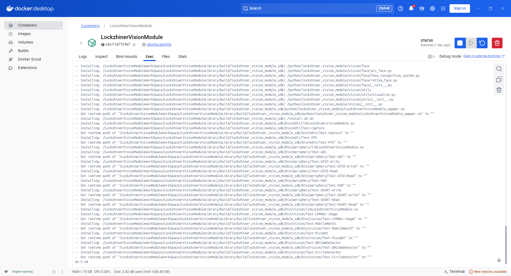
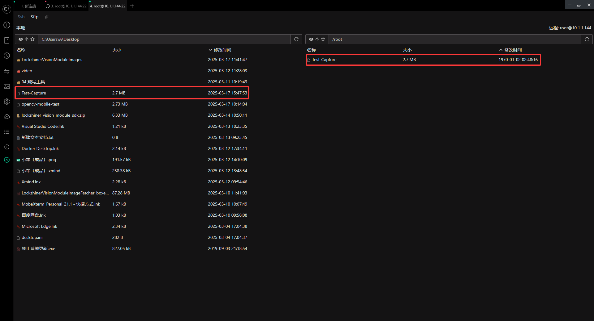
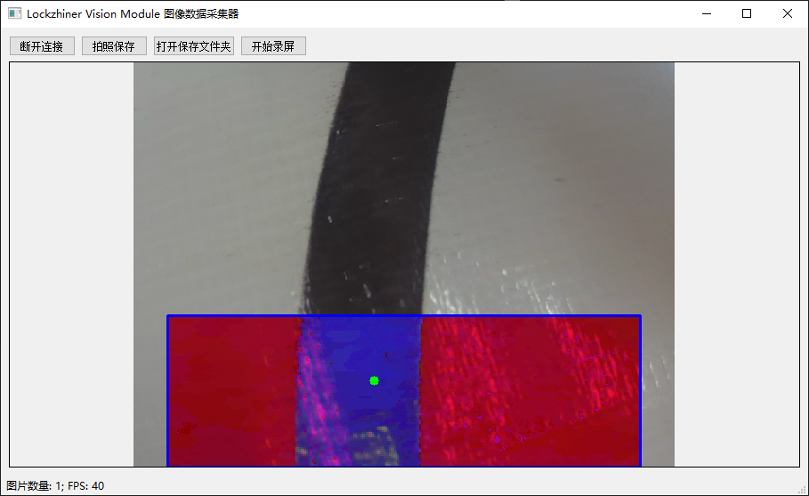

<h1 align="center">凌智视觉模块视觉巡线部署指南 Cpp 部署指南</h1>

发布版本：V0.0.0

日期：2025-03-18

文件密级：□绝密 □秘密 □内部资料 ■公开  

---

**免责声明**  

本文档按**现状**提供，福州凌睿智捷电子有限公司（以下简称**本公司**）不对本文档中的任何陈述、信息和内容的准确性、可靠性、完整性、适销性、适用性及非侵权性提供任何明示或暗示的声明或保证。本文档仅作为使用指导的参考。  

由于产品版本升级或其他原因，本文档可能在未经任何通知的情况下不定期更新或修改。  

**读者对象**  

本教程适用于以下工程师：  

- 技术支持工程师  
- 软件开发工程师  

**修订记录**  

| **日期**     | **版本** | **作者** | **修改说明** |
|:-----------| -------- |--------| ------------ |
| 2025/03/17 | 0.0.0    | 林铮汉    | 初始版本     |

## 1 简介

接下来让我们基于 Cpp 来部署视觉巡线案例，在开始本章节前：

- 你已经按照 [开发环境搭建指南](../../../docs/introductory_tutorial/development_environment.md) 正确配置了开发环境。
- 点击 [凌智视觉模块图片传输助手下载地址](https://gitee.com/LockzhinerAI/LockzhinerVisionModule/releases/download/v0.0.0/LockzhinerVisionModuleImageFetcher_v0.0.0.exe) 下载凌智视觉模块图片传输助手。

## 2 Cpp API 文档
凌智视觉模块使用 opencv-mobile 来读取摄像头数据。关于摄像头读取，请参考传统的 OpenCV 摄像头 API 来实现，需要注意的是:

- 受限于运行内存，请使用我们编译的 [OpenCV Mobile](https://gitee.com/LockzhinerAI/opencv-mobile) 库来代替传统的 OpenCV 库
- LockzhinerVisionModule 只有一个摄像头，因此在打开摄像头时，不管输入什么参数，都只会打开这个摄像头
- 配置摄像头长宽时，请保证长和宽都是 8 的倍数
- 在本次项目中使用的 OpenCV 函数完全适配标准 OpenCv 函数，相关 API 参考标准 OpenCV 函数接口。

## 3 项目介绍

在本案例中，使用黑线作为实例，可通过更改色彩掩膜来识别不同颜色的线。

```Cpp
#include <lockzhiner_vision_module/edit/edit.h>
#include <iostream>
#include <opencv2/core/core.hpp>
#include <opencv2/highgui/highgui.hpp>
#include <opencv2/imgproc/imgproc.hpp>
#include <opencv2/opencv.hpp>

int main(int argc, char *argv[]) {
    // 设置默认摄像头分辨率
    int width = 640;
    int height = 480;

    // 如果命令行参数提供了宽度和高度，则使用它们
    if (argc == 3) {
        width = std::stoi(argv[1]);
        height = std::stoi(argv[2]);
    }

    // 初始化编辑模块并尝试连接设备
    lockzhiner_vision_module::edit::Edit edit;
    if (!edit.StartAndAcceptConnection()) {
        std::cerr << "Error: Failed to start and accept connection." << std::endl;
        return EXIT_FAILURE;
    }
    std::cout << "Device connected successfully." << std::endl;

    cv::VideoCapture cap;
    cap.set(cv::CAP_PROP_FRAME_WIDTH, width);
    cap.set(cv::CAP_PROP_FRAME_HEIGHT, height);
    cap.open(0);

    // 获取实际的帧尺寸
    double frameWidth = cap.get(cv::CAP_PROP_FRAME_WIDTH);
    double frameHeight = cap.get(cv::CAP_PROP_FRAME_HEIGHT);
    std::cout << "Frame size: " << frameWidth << "x" << frameHeight << std::endl;

    // 定义ROI区域
    cv::Rect roi_rect(40, 300, 560, 180);

    while (true) {
        cv::Mat temp_mat;
        cap >> temp_mat; // 获取新的一帧
        if (temp_mat.empty()) {
            std::cerr << "Warning: Couldn't read a frame from the camera." << std::endl;
            continue;
        }

        // 提取ROI区域，并转换到HSV色彩空间
        cv::Mat roi_image = temp_mat(roi_rect);
        cv::cvtColor(roi_image, roi_image, cv::COLOR_BGR2HSV); // 注意原代码中是RGB2HSV，应改为BGR2HSV

        // 创建黑白掩膜
        cv::Scalar lower_black(0, 0, 0);
        cv::Scalar upper_black(180, 100, 60);
        cv::Mat mask;
        cv::inRange(roi_image, lower_black, upper_black, mask);

        // 应用掩膜
        cv::Mat res;
        cv::bitwise_and(roi_image, roi_image, res, mask);

        // 计算图像矩并找到质心
        cv::Moments m = cv::moments(mask, false);
        double cx = m.m10 / (m.m00 + 1e-6); // 防止除以零
        double cy = m.m01 / (m.m00 + 1e-6);

        // 在原始图像上绘制ROI边框和质心位置
        cv::rectangle(temp_mat, roi_rect, cv::Scalar(255, 0, 0), 2); // 绘制ROI边框
        cv::circle(temp_mat, cv::Point(static_cast<int>(cx + roi_rect.x), static_cast<int>(cy + roi_rect.y)), 5, cv::Scalar(0, 255, 0), -1); // 绿色圆点表示质心位置

        // 输出质心的X坐标
        std::cout << "Centroid X: " << cx + roi_rect.x << std::endl;

        // 将当前帧发送到编辑模块打印
        if (!edit.Print(temp_mat)) {
            std::cerr << "Error: Failed to print to edit module." << std::endl;
            break;
        }
    }
    return EXIT_SUCCESS;
}

 
```
## 4 编译项目
在本次项目中为使编译更为简单，可将上文中的 Cpp 代码直接替换进 /LockzhinerVisionModuleWorkSpace/LockzhinerVisionModuleLibrary/example/edit/test_capture.cc 中。
后通过下述指令编译整个工程：
```bash
cd /LockzhinerVisionModuleWorkSpace/LockzhinerVisionModuleLibrary
rm -rf build && mkdir build && cd build
export TOOLCHAIN_ROOT_PATH=${PWD}/../../arm-rockchip830-linux-uclibcgnueabihf
cmake -DCMAKE_TOOLCHAIN_FILE=../toolchains/arm-rockchip830-linux-uclibcgnueabihf.toolchain.cmake \
      -DCMAKE_BUILD_TYPE=Release \
      -DENABLE_TESTS=ON \
      -DCMAKE_INSTALL_PREFIX=${PWD}/lockzhiner_vision_module_sdk \
      ..
make -j8 && make install
zip -r -9 lockzhiner_vision_module_sdk.zip lockzhiner_vision_module_sdk
```
编译后如下图所示:

编译完成后在/LockzhinerVisionModuleWorkSpace/LockzhinerVisionModuleLibrary/build/lockzhiner_vision_module_sdk/bin/edit中所生成的Test-Capture可执行文件即为所需文件。
## 4 上传并测试

参考 [连接设备指南](../../../../docs/introductory_tutorial/connect_device_using_ssh.md) 正确连接 Lockzhiner Vision Module 设备。
先将编译文件从 Docker 中下载到本地。

请使用 Electerm Sftp 上传以下一个文件:

- 进入存放 **Test-Capture** 可执行文件的目录，将 **Test-Capture** 上传到 Lockzhiner Vision Module



请使用 Electerm Ssh 并在命令行中执行以下命令:

```bash
chmod 777 Test-Capture 
./Test-Capture 
```

运行程序后，使用凌智视觉模块图片传输助手连接设备，屏幕上开始打印识别黑线的质心 X 轴坐标，凌智视觉模块图片传输助手出现可视化的结果


