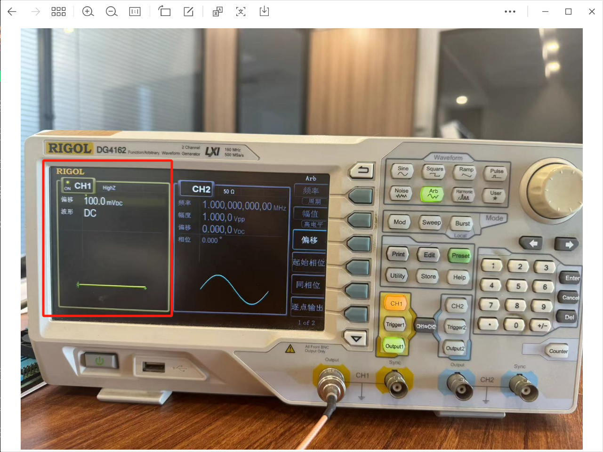

<h1 align="center">凌智视觉模块 ADC 使用指南</h1>

发布版本：V0.0.0

日期：2024-09-11

文件密级：□绝密 □秘密 □内部资料 ■公开  

---

**免责声明**  

本文档按**现状**提供，福州凌睿智捷电子有限公司（以下简称**本公司**）不对本文档中的任何陈述、信息和内容的准确性、可靠性、完整性、适销性、适用性及非侵权性提供任何明示或暗示的声明或保证。本文档仅作为使用指导的参考。  

由于产品版本升级或其他原因，本文档可能在未经任何通知的情况下不定期更新或修改。  

**读者对象**  

本教程适用于以下工程师：  

- 技术支持工程师  
- 软件开发工程师  

**修订记录**  

| **日期**   | **版本** | **作者** | **修改说明** |
| :--------- | -------- | -------- | ------------ |
| 2024/09/11 | 0.0.0    | 郑必城     | 初始版本     |

## 1 简介

作为连接模拟世界与数字世界的桥梁，ADC 能够将连续的模拟信号（如温度、压力、声音等）转换为离散的数字信号，使得主控芯片能够处理和分析这些信号。本章节中，我们将教会你如何使用凌智视觉模块读取 ADC 数据。

## 2 正确连接设备

> 注意: Lockzhiner Vision Module ADC 引脚最大可承载电压是 1.8V 切忌不要输入超过 1.8V 的电压，否则可能烧板子！！！！

为了方便调试，我们这里使用 **信号源** 进行调试，请正确的将 Lockzhiner Vision Module 的引脚按照以下方式连接

* LockzhinerVisionModule ADC <-> Output IO
* LockzhinerVisionModule GND <-> Output GND

板子上的引脚丝印较小，如果看不清引脚信息，可以参考下图

信号源我们配置了 100mV 的电压，如下图所示

## 3 在凌智视觉模块上部署 ADC 例程

请参考以下教程使用 C++ 或 Python 在凌智视觉模块上部署 ADC 例程：

* [凌智视觉模块 ADC C++ 部署指南](./cpp/README.md)
* [凌智视觉模块 ADC Python 部署指南](./python/README.md)