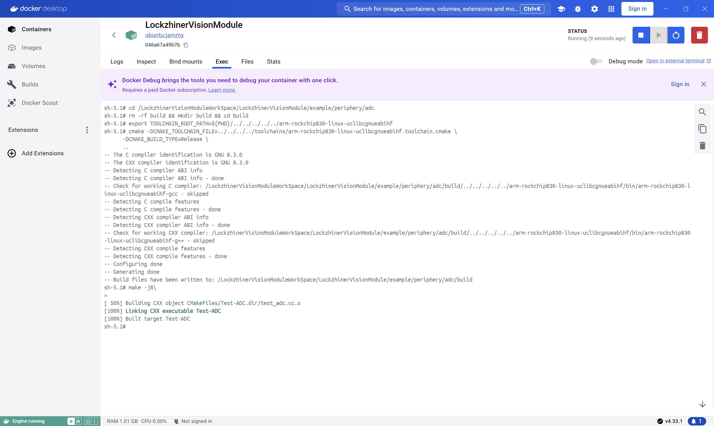
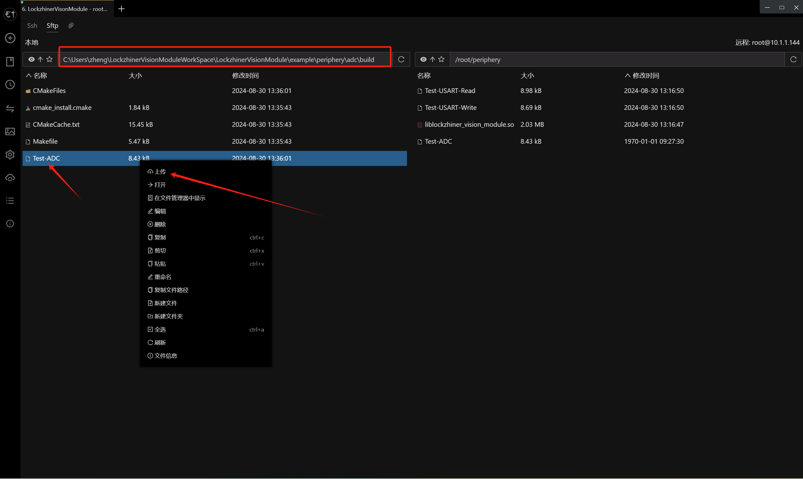
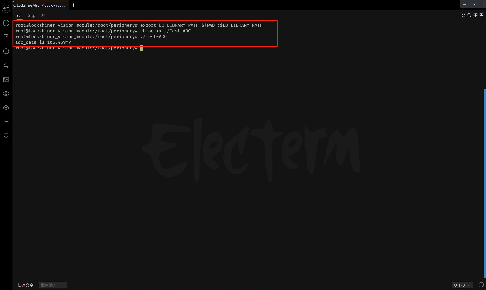

<h1 align="center">凌智视觉模块 ADC C++ 部署指南</h1>

发布版本：V0.0.0

日期：2024-09-11

文件密级：□绝密 □秘密 □内部资料 ■公开  

---

**免责声明**  

本文档按**现状**提供，福州凌睿智捷电子有限公司（以下简称**本公司**）不对本文档中的任何陈述、信息和内容的准确性、可靠性、完整性、适销性、适用性及非侵权性提供任何明示或暗示的声明或保证。本文档仅作为使用指导的参考。  

由于产品版本升级或其他原因，本文档可能在未经任何通知的情况下不定期更新或修改。  

**读者对象**  

本教程适用于以下工程师：  

- 技术支持工程师  
- 软件开发工程师  

**修订记录**  

| **日期**   | **版本** | **作者** | **修改说明** |
| :--------- | -------- | -------- | ------------ |
| 2024/09/11 | 0.0.0    | 郑必城     | 初始版本     |


## 1 简介

接下来让我们基于 C++ 来部署 ADC 例程。在开始本章节前：

- 请确保你已经按照 [开发环境搭建指南](../../../../docs/introductory_tutorial/cpp_development_environment.md) 正确配置了开发环境。

## 2 API 文档

```c++
/**
 * @class ADC
 * @brief 这是一个模数转换器（ADC）的抽象类，用于从模拟源读取数据。
 *
 * 该类提供基本的ADC操作接口，包括打开ADC设备以及从ADC读取数据。
 * 注意：该ADC不得接入超过1.8V的电压，否则可能会损坏设备。
 */
class ADC {
 public:
  /**
   * @brief 默认构造函数。
   *
   * 初始化ADC类的实例。
   */
  ADC() = default;

  /**
   * @brief 默认析构函数。
   *
   * 清理ADC类实例使用的资源。
   */
  ~ADC() = default;

  /**
   * @brief 打开ADC设备。
   *
   * 初始化ADC硬件并准备进行读取操作。
   * @return bool 如果设备成功打开则返回true，否则返回false。
   */
  bool Open();

  /**
   * @brief 从ADC读取数据。
   *
   * 从ADC读取当前的模拟值（mV），并将其转换为浮点数形式。
   * 注意：确保ADC未接入超过1.8V的电压。
   * @param[out] adc_data 存储读取到的ADC数据的变量（以浮点数形式）。
   * @return bool 如果成功读取数据则返回true，否则返回false。
   */
  bool Read(float& adc_data);

 private:
  float scale_ = 0.0;
};
```

## 3 项目介绍

为了方便大家入手，我们做了一个简易的 ADC 例程。该例程可以输出当前的 ADC 数值。

```cmake
# CMake最低版本要求  
cmake_minimum_required(VERSION 3.10)  

project(test_adc)

# 定义项目根目录路径
set(PROJECT_ROOT_PATH "${CMAKE_CURRENT_SOURCE_DIR}/../../..")
# 定义 LockzhinerVisionModule SDK 路径
set(LockzhinerVisionModule_ROOT_PATH "${PROJECT_ROOT_PATH}/third_party/lockzhiner_vision_module_sdk")
set(LockzhinerVisionModule_DIR "${LockzhinerVisionModule_ROOT_PATH}/lib/cmake/lockzhiner_vision_module")
find_package(LockzhinerVisionModule REQUIRED)

# 配置 ADC 读取例程
add_executable(Test-ADC test_adc.cc)
target_include_directories(Test-ADC PRIVATE ${LOCKZHINER_VISION_MODULE_INCLUDE_DIRS})
target_link_libraries(Test-ADC PRIVATE ${LOCKZHINER_VISION_MODULE_LIBRARIES})
```

读取 ADC 数据的核心代码如下:

```cpp
#include <lockzhiner_vision_module/periphery/adc/adc.h>

#include <iostream>

int main() {
  lockzhiner_vision_module::periphery::ADC adc;
  if (!adc.Open()) {
    std::cout << "Failed to open adc." << std::endl;
    return 1;
  }

  float adc_data;
  if (!adc.Read(adc_data)) {
    std::cout << "Failed to read adc data." << std::endl;
    return 1;
  }
  std::cout << "adc_data is " << adc_data << "mv" << std::endl;
  return 0;
}
```

## 4 编译项目

使用 Docker Destop 打开 LockzhinerVisionModule 容器并执行以下命令来编译项目

```bash
# 进入 Demo 目录
cd /LockzhinerVisionModuleWorkSpace/LockzhinerVisionModule/example/periphery/adc/cpp

# 创建编译目录
rm -rf build && mkdir build && cd build

# 配置交叉编译工具链
export TOOLCHAIN_ROOT_PATH=${PWD}/../../../../../../arm-rockchip830-linux-uclibcgnueabihf

# 使用 cmake 配置项目
cmake -DCMAKE_TOOLCHAIN_FILE=../../../../../toolchains/arm-rockchip830-linux-uclibcgnueabihf.toolchain.cmake \
      -DCMAKE_BUILD_TYPE=Release \
      ..

# 执行编译
make -j8
```



## 5 执行 ADC 测试程序

参考 [连接设备指南](../../../../docs/introductory_tutorial/connect_device_using_ssh.md) 正确连接 Lockzhiner Vision Module 设备。


使用 SFTP 功能将软件上传到 Lockzhiner Vision Module



在 Lockzhiner Vision Module 上运行以下代码来执行 ADC 测试程序

```bash
chmod +x ./Test-ADC
./Test-ADC
```



可以看到有一定的误差，误差一般在10mv以内

## 6 其他

如果你需要使用 Python 来部署 ADC 例程请参考[凌智视觉模块分类模型 Python 部署指南](../python/README.md)。