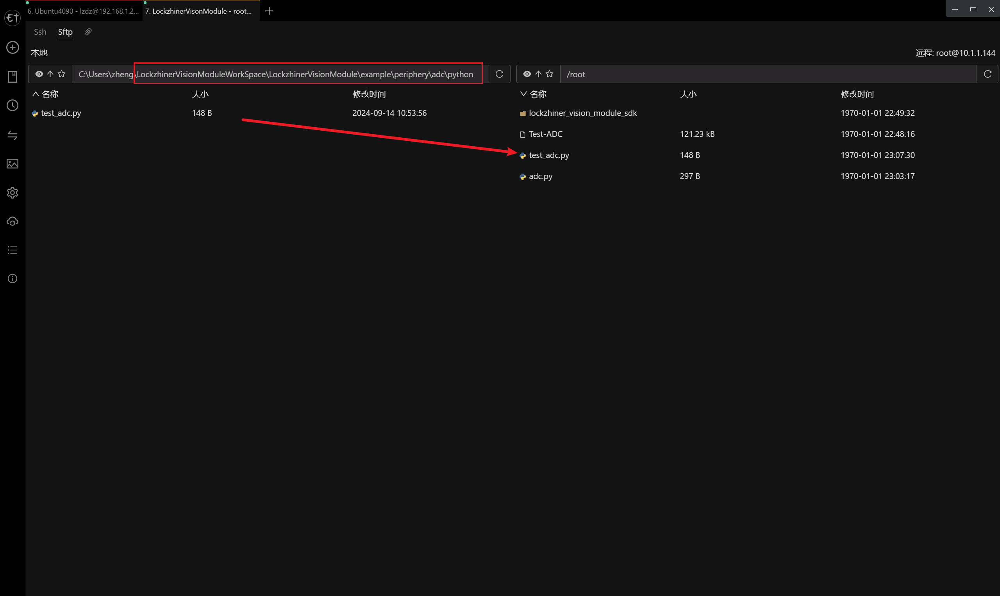
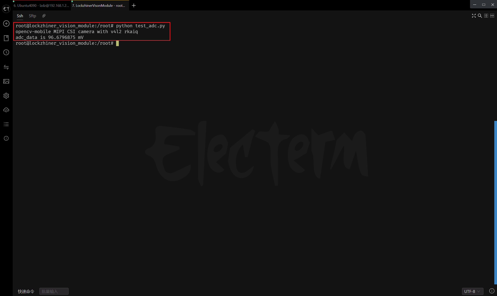

<h1 align="center">凌智视觉模块 ADC Python 部署指南</h1>

发布版本：V0.0.0

日期：2024-09-14

文件密级：□绝密 □秘密 □内部资料 ■公开  

---

**免责声明**  

本文档按**现状**提供，福州凌睿智捷电子有限公司（以下简称**本公司**）不对本文档中的任何陈述、信息和内容的准确性、可靠性、完整性、适销性、适用性及非侵权性提供任何明示或暗示的声明或保证。本文档仅作为使用指导的参考。  

由于产品版本升级或其他原因，本文档可能在未经任何通知的情况下不定期更新或修改。  

**读者对象**  

本教程适用于以下工程师：  

- 技术支持工程师  
- 软件开发工程师  

**修订记录**  

| **日期**   | **版本** | **作者** | **修改说明** |
| :--------- | -------- | -------- | ------------ |
| 2024/09/11 | 0.0.0    | 郑必城     | 初始版本     |

## 1 简介

接下来让我们基于 Python 来部署 ADC 例程。在开始本章节前：

- 请确保你已经按照 [开发环境搭建指南](../../../../docs/introductory_tutorial/python_development_environment.md) 正确配置了开发环境。
- 请确保你已经按照 [凌智视觉模块 ADC Python 部署指南](../README.md) 正确将信号连接到开发板。

## 2 API 文档

```python
class ADCBase:
    """
    @brief ADC 基类，用于初始化和管理 ADC 对象

    该类提供了一个基础接口来读取 ADC 的数据。通过传入具体的 ADC 类，
    该类能够实例化并调用具体 ADC 类的读取方法，从而实现对不同ADC设备的统一访问。

    @param adc_class: 具体的 ADC 类，该类必须包含一个 read 方法用于读取ADC数据
    """

    def __init__(self, adc_class):
        """
        @brief 构造函数，用于初始化 ADC 对象

        在实例化 ADCBase 对象时，会调用此构造函数来创建具体的 ADC 类实例，并将其保存在成员变量 self.adc 中。

        @param adc_class: 具体的 ADC 类，用于创建 ADC 实例
        """
        self.adc = adc_class()

    def read(self):
        """
        @brief 读取ADC数据

        该方法调用具体的 ADC 实例的 read 方法，返回读取到的 ADC 数据。

        @return 读取到的 ADC 数据
        """
        return self.adc.read()


class ADCIN1(ADCBase):
    def __init__(self):
        super().__init__(periphery.ADCIN1)
```

## 3 项目介绍

为了方便大家入手，我们做了一个简易的 ADC 例程。该例程可以输出当前的 ADC 数值。

```python
from lockzhiner_vision_module.periphery import ADCIN1


if __name__ == "__main__":
    adc = ADCIN1()
    print(f"adc_data is {adc.read()} mV")
```

## 4 执行 ADC 测试程序

参考 [连接设备指南](../../../../docs/introductory_tutorial/connect_device_using_ssh.md) 正确连接 Lockzhiner Vision Module 设备。


使用 SFTP 功能将 Python 代码上传到 Lockzhiner Vision Module



在 Lockzhiner Vision Module 上运行以下代码来执行 ADC 测试程序

```bash
chmod +x ./Test-ADC
./Test-ADC
```



可以看到有一定的误差，误差一般在10mv以内

## 5 其他

如果你需要使用 C++ 来部署 ADC 例程请参考[凌智视觉模块 ADC C++ 部署指南](../cpp/README.md)。