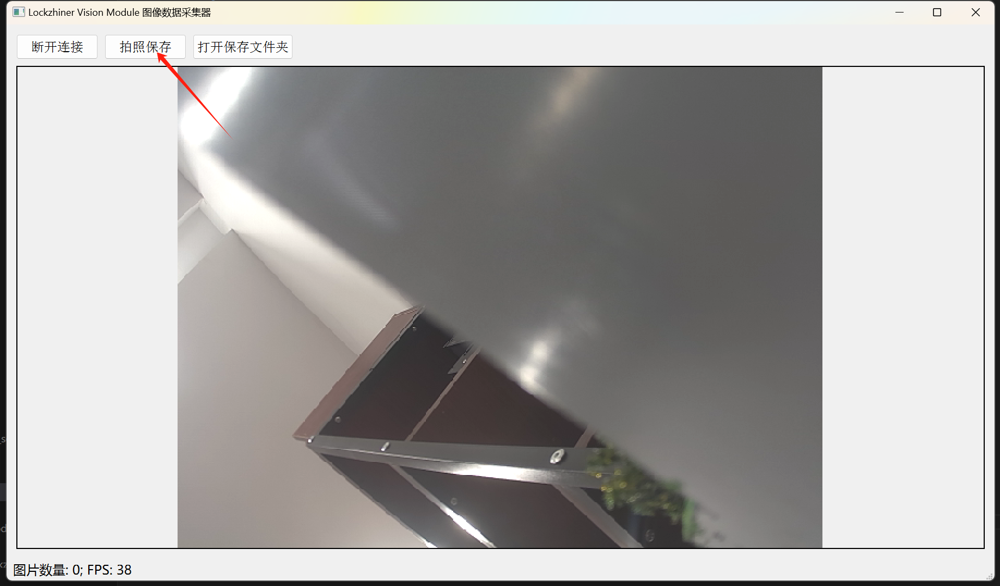

<h1 align="center">摄像头使用指南</h1>

发布版本：V0.0.0

日期：2024-09-04

文件密级：□绝密 □秘密 □内部资料 ■公开  

---

**免责声明**  

本文档按**现状**提供，福州凌睿智捷电子有限公司（以下简称**本公司**）不对本文档中的任何陈述、信息和内容的准确性、可靠性、完整性、适销性、适用性及非侵权性提供任何明示或暗示的声明或保证。本文档仅作为使用指导的参考。  

由于产品版本升级或其他原因，本文档可能在未经任何通知的情况下不定期更新或修改。  

**读者对象**  

本教程适用于以下工程师：  

- 技术支持工程师  
- 软件开发工程师  

**修订记录**  

| **日期**   | **版本** | **作者** | **修改说明** |
| :--------- | -------- | -------- | ------------ |
| 2024/09/04 | 0.0.0    | 郑必城     | 初始版本     |

## 1 简介

Lockzhiner Vision Module 上自带了一个摄像头，该摄像头可以支持最大 **2304x1296(16:9)** 的分辨率。本章节中，我们将教会你如何使用 Lockzhiner Vision Module 读取 摄像头数据，并使用 Lockzhiner Vision Module 传输图片到本地，方便保存数据。

## 2 数据表

受限于解码能力，Lockzhiner Vision Module 在不同的分辨率下，摄像头的帧率是不一样的，具体可以参考如下表格:

### 2.1 长宽比为 4:3

| 摄像头分辨率| FPS |
| :----: | :----: |
| 480x360(4:3) | 25 |
| 640x480(4:3) | 25 |
| 960x720(4:3) | 14 |
| 1280x960(4:3) | 13 |
| 1920x1440(4:3) | 13 |

### 2.2 长宽比为 16:9

| 摄像头分辨率| FPS |
| :----: | :----: |
| 480x270(16:9) | 25 |
| 640x360(16:9) | 25 |
| 960x540(16:9) | 25 |
| 1280x720(16:9) | 15 |
| 1920x1080(16:9) | 12 |

## 3 前期准备

在开始这个章节前，请确保:

- 你已经按照 [开发环境搭建指南](../../../docs/introductory_tutorial/development_environment.md) 正确配置了开发环境。
- 点击 [Lockzhiner Vision Module 图片获取助手下载地址](https://gitee.com/LockzhinerAI/LockzhinerVisionModule/releases/download/v0.0.0/LockzhinerVisionModuleImageFetcher_v0.0.0.exe) 下载 Lockzhiner Vision Module 图片获取助手。

## 4 API 文档

关于摄像头读取，请参考传统的 OpenCV 摄像头 API 来实现，需要注意的是:

- 受限于运行内存，请使用我们编译的 [OpenCV Mobile](https://gitee.com/LockzhinerAI/opencv-mobile) 库来代替传统的 OpenCV 库
- LockzhinerVisionModule 只有一个摄像头，因此在打开摄像头时，不管输入什么参数，都只会打开这个摄像头
- 配置摄像头长宽时，请保证长和宽都是 8 的倍数

关于 Lockzhiner Vision Module 中的图片获取 API，请参考以下文档:

```cpp
/**
 * @brief  Edit 类提供了对摄像头数据的控制接口。
 *
 * 需要注意的是， Edit 传输的数据必须使用 Lockzhiner Vision Module 图片获取助手来接收
 */
class Edit {
 public:
  Edit() = default;
  ~Edit() = default;

  /**
   * @brief 接收客户端连接
   *
   * 此函数尝试阻塞等待客户端连接。
   * 成功时返回 true，失败时返回 false。
   *
   * @return bool 指示操作是否成功。
   */
  bool StartAndAcceptConnection();

  /**
   * @brief 输出图片
   *
   * 此函数尝试向客户端传输图片数据
   * 成功时返回 true，失败时返回 false。
   *
   * @return bool 指示操作是否成功。
   */
  bool Print(const cv::Mat &mat);

 private:
  int server_fd_;
  int port_ = 6868;
  int new_socket_;

  void BuildPacket(const cv::Mat &mat, uint8_t *buffer, uint64_t size);
  bool Write(const void *buf, size_t len);
};
```

## 5 项目介绍

为了方便大家入手，我们做了一个简易的图片传输例程。该例程接收 Lockzhiner Vision Module 图片获取助手的连接并向其传输图片数据。

```cmake
# CMake最低版本要求  
cmake_minimum_required(VERSION 3.10)  

project(test_adc)

# 定义项目根目录路径
set(PROJECT_ROOT_PATH "${CMAKE_CURRENT_SOURCE_DIR}/../../..")
# 定义 OpenCV SDK 路径
set(OpenCV_ROOT_PATH "${PROJECT_ROOT_PATH}/third_party/opencv-mobile-4.10.0-lockzhiner-vision-module")
set(OpenCV_DIR "${OpenCV_ROOT_PATH}/lib/cmake/opencv4")
find_package(OpenCV REQUIRED)
set(OPENCV_LIBRARIES "${OpenCV_LIBS}")
# 定义 LockzhinerVisionModule SDK 路径
set(LockzhinerVisionModule_ROOT_PATH "${PROJECT_ROOT_PATH}/third_party/lockzhiner_vision_module_sdk")
set(LockzhinerVisionModule_DIR "${LockzhinerVisionModule_ROOT_PATH}/lib/cmake/lockzhiner_vision_module")
find_package(LockzhinerVisionModule REQUIRED)

# 配置摄像头数据
add_executable(Test-Capture test_capture.cc)
target_include_directories(Test-Capture PRIVATE ${LOCKZHINER_VISION_MODULE_INCLUDE_DIRS})
target_link_libraries(Test-Capture PRIVATE ${OPENCV_LIBRARIES} ${LOCKZHINER_VISION_MODULE_LIBRARIES})
```

读取并传输摄像头数据的核心代码如下:

```cpp
#include <lockzhiner_vision_module/edit/edit.h>

#include <iostream>
#include <opencv2/core/core.hpp>
#include <opencv2/highgui/highgui.hpp>
#include <opencv2/imgproc/imgproc.hpp>

int main(int argc, char *argv[]) {
  int width = 640;
  int height = 480;
  if (argc == 3) {
    width = atoi(argv[1]);
    height = atoi(argv[2]);
  }

  lockzhiner_vision_module::edit::Edit edit;
  // 打开服务器并阻塞接收客户端连接
  if (!edit.StartAndAcceptConnection()) {
    std::cout << "Failed to start and accept connection" << std::endl;
    return 1;
  }
  std::cout << "Succeed to connect device" << std::endl;

  cv::VideoCapture cap;
  // 设置摄像头长宽
  cap.set(cv::CAP_PROP_FRAME_WIDTH, width);
  cap.set(cv::CAP_PROP_FRAME_HEIGHT, height);
  // 打开摄像头
  cap.open(0);

  const int w = cap.get(cv::CAP_PROP_FRAME_WIDTH);
  const int h = cap.get(cv::CAP_PROP_FRAME_HEIGHT);
  cv::Mat temp_mat;
  while (true) {
    cap >> temp_mat;
    // 判断获取的图片是否为空
    if (temp_mat.empty()) {
      continue;
    }
    // 向客户端输出图片
    if (!edit.Print(temp_mat)) {
      std::cout << "Failed to print to edit" << std::endl;
      break;
    }
  }
  return 0;
}
```

## 6 编译项目

使用 Docker Destop 打开 LockzhinerVisionModule 容器并执行以下命令来编译项目

```bash
# 进入 Demo 目录
cd /LockzhinerVisionModuleWorkSpace/LockzhinerVisionModule/example/periphery/capture

# 创建编译目录
rm -rf build && mkdir build && cd build

# 配置交叉编译工具链
export TOOLCHAIN_ROOT_PATH=${PWD}/../../../../../arm-rockchip830-linux-uclibcgnueabihf

# 使用 cmake 配置项目
cmake -DCMAKE_TOOLCHAIN_FILE=../../../../toolchains/arm-rockchip830-linux-uclibcgnueabihf.toolchain.cmake \
      -DCMAKE_BUILD_TYPE=Release \
      ..

# 执行编译
make -j8
```


## 7 执行摄像头测试程序

参考 [连接设备指南](../../../docs/introductory_tutorial/connect_device_using_ssh.md) 正确连接 Lockzhiner Vision Module 设备。


参考之前的例程，将 **Test-Capture** 传输到 Lockzhiner Vision Module 上


传输完成后执行以下代码

```bash
chmod +x ./Test-Capture
./Test-Capture
```

代码开启后程序将阻塞并等待摄像头连接


打开下载的 Lockzhiner Vision Module 图片获取助手，点击连接设备


成功连接设备后，将出现摄像头的画面

> 提示:
> 如果摄像头的画面不够清晰，请尝试轻轻转动摄像头来调整合适的焦距


点击拍照保存可以将图片保存到程序保存路径下的 **LockzhinerVisionModuleImages** 文件夹中



你可以点击**打开保存文件夹**按钮来快速打开这个文件夹
