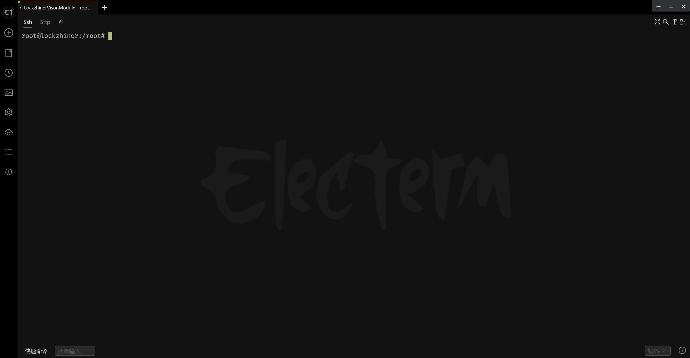

<h1 align="center">凌智视觉模块摄像头 Python 部署指南</h1>

发布版本：V0.0.0

日期：2024-09-25

文件密级：□绝密 □秘密 □内部资料 ■公开  

---

**免责声明**  

本文档按**现状**提供，福州凌睿智捷电子有限公司（以下简称**本公司**）不对本文档中的任何陈述、信息和内容的准确性、可靠性、完整性、适销性、适用性及非侵权性提供任何明示或暗示的声明或保证。本文档仅作为使用指导的参考。  

由于产品版本升级或其他原因，本文档可能在未经任何通知的情况下不定期更新或修改。  

**读者对象**  

本教程适用于以下工程师：  

- 技术支持工程师  
- 软件开发工程师  

**修订记录**  

| **日期**   | **版本** | **作者** | **修改说明** |
| :--------- | -------- | -------- | ------------ |
| 2024/09/25 | 0.0.0    | 郑必城     | 初始版本     |

## 1 简介

Lockzhiner Vision Module 上自带了一个摄像头，该摄像头可以支持最大 **2304x1296(16:9)** 的分辨率。本章节中，我们将教会你如何使用 Lockzhiner Vision Module 读取 摄像头数据，并使用 Lockzhiner Vision Module 传输图片到本地，方便保存数据。

## 2 前期准备

在开始这个章节前，请确保:

- 你已经按照 [开发环境搭建指南](../../../../docs/introductory_tutorial/python_development_environment.md) 正确配置了开发环境。
- 点击 [凌智视觉模块图片传输助手下载地址](https://gitee.com/LockzhinerAI/LockzhinerVisionModule/releases/download/v0.0.0/LockzhinerVisionModuleImageFetcher_v0.0.0.exe) 下载凌智视觉模块图片传输助手。

## 3 API 文档

### 3.1 读取摄像头文档

读取摄像头的 API 对齐了 OpenCV，具体 API 文档如下:

```python
class VideoCapture:
    """
    OpenCV 摄像头类
    """
    def __init__(self):
        self.video_capture = cv2.VideoCapture()

    def open(self, index=0):
        """
        打开摄像头
        
        Returns:
            bool: 摄像头打开过程过是否出现逻辑错误
        """
        return self.video_capture.open(index)

    def isOpened(self):
        """
        判断摄像头是否打开成功
        
        Returns:
            bool: 摄像头是否打开成功
        """
        return self.video_capture.isOpened()

    def read(self):
        """
        读取摄像头数据
        
        Returns:
            bool: 摄像头是否成功读取到数据
            cv::Mat: 摄像头读取的图像数据
        """
        mat = self.video_capture.read()
        return not mat.empty(), mat

    def release(self):
        """
        关闭摄像头
        
        Returns:
            bool: 是否释放成功
        """
        return self.video_capture.release()
```

### 3.2 传输摄像头数据文档

为了让大家直观的看到摄像头获取的数据，我们编写了凌智视觉模块图片传输助手。关于 Lockzhiner Vision Module 中的图片发送 API，请参考以下文档:

```python
class Edit:
    """
    图片数据传输类，用于传输 CV::Mat 到凌智图片传输助手
    """
    def __init__(self):
        self.edit = edit.Edit()

    def start_and_accept_connection(self):
        """
        阻塞等待凌智图片传输助手的连接请求
        """
        return self.edit.start_and_accept_connection()

    def print(self, mat):
        """
        传输图片到凌智图片传输助手

        Args:
            mat (cv::Mat): OpenCV 图片 Array

        Returns:
            bool: 传输是否成功
        """
        return self.edit.print(mat)
```

## 4 项目介绍

为了方便大家入手，我们做了一个简易的图片传输例程。该例程接收 Lockzhiner Vision Module 图片获取助手的连接并向其传输图片数据。

```cpp
```

## 5 执行摄像头测试程序

参考 [连接设备指南](../../../../docs/introductory_tutorial/connect_device_using_ssh.md) 正确连接 Lockzhiner Vision Module 设备。



参考之前的例程，将 **test_capture.py** 传输到 Lockzhiner Vision Module 上


传输完成后，返回代码执行界面，执行以下代码

```bash
python ./test_capture.py
```

代码开启后程序将阻塞并等待摄像头连接


打开下载的 Lockzhiner Vision Module 图片获取助手，点击连接设备


成功连接设备后，将出现摄像头的画面

> 提示:
> 如果摄像头的画面不够清晰，请尝试轻轻转动摄像头来调整合适的焦距


点击拍照保存可以将图片保存到程序保存路径下的 **LockzhinerVisionModuleImages** 文件夹中


你可以点击**打开保存文件夹**按钮来快速打开这个文件夹
