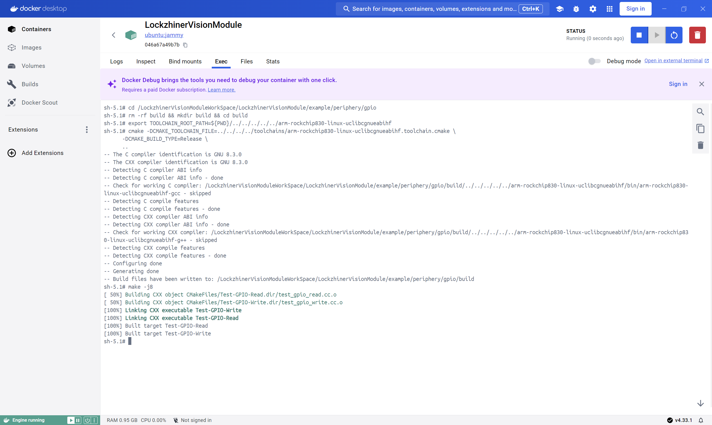
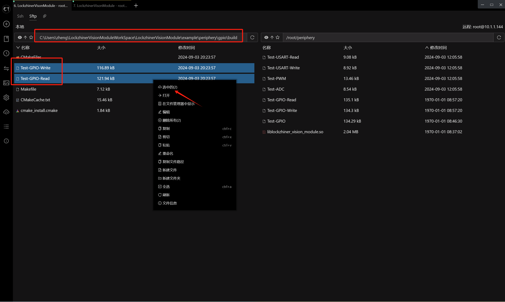
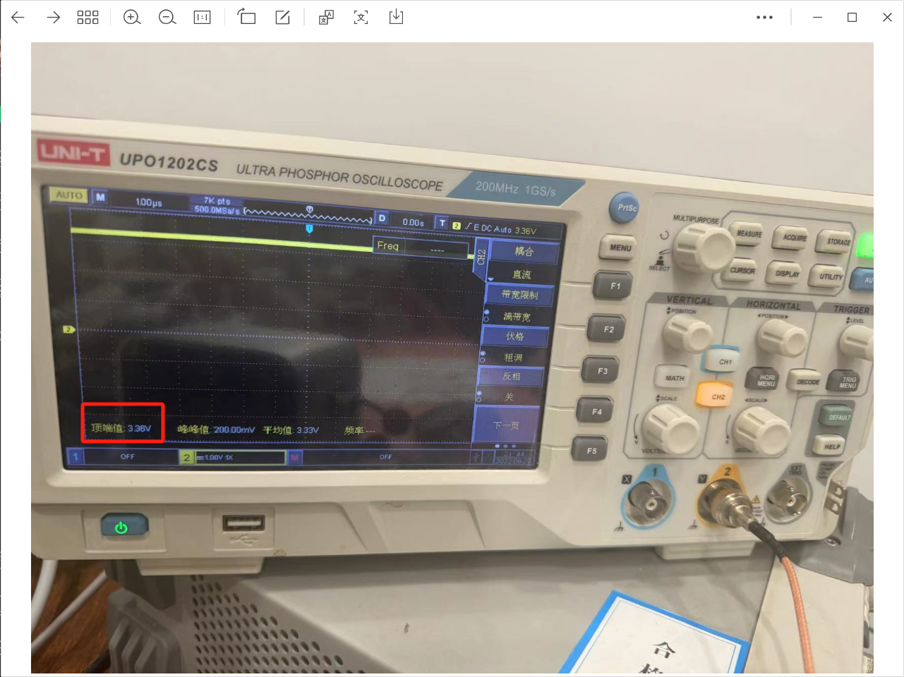
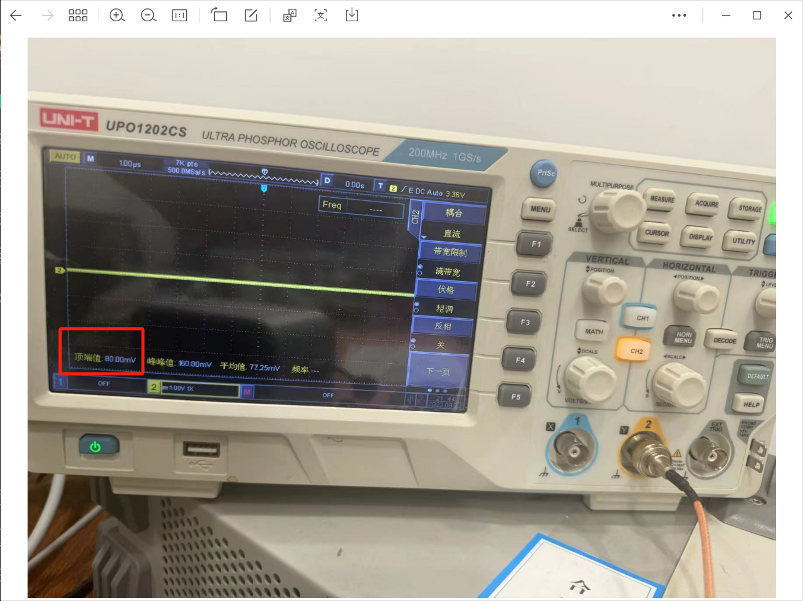
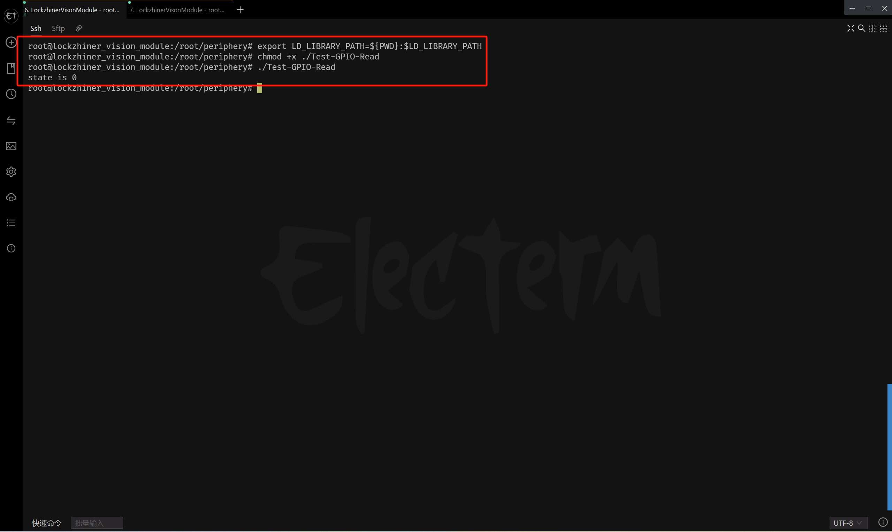

<h1 align="center">GPIO 使用指南</h1>

发布版本：V0.0.0

日期：2024-09-03

文件密级：□绝密 □秘密 □内部资料 ■公开  

---

**免责声明**  

本文档按**现状**提供，福州凌睿智捷电子有限公司（以下简称**本公司**）不对本文档中的任何陈述、信息和内容的准确性、可靠性、完整性、适销性、适用性及非侵权性提供任何明示或暗示的声明或保证。本文档仅作为使用指导的参考。  

由于产品版本升级或其他原因，本文档可能在未经任何通知的情况下不定期更新或修改。  

**读者对象**  

本教程适用于以下工程师：  

- 技术支持工程师  
- 软件开发工程师  

**修订记录**  

| **日期**   | **版本** | **作者** | **修改说明** |
| :--------- | -------- | -------- | ------------ |
| 2024/09/03 | 0.0.0    | 郑必城     | 初始版本     |


## 1 简介

GPIO（General Purpose Input/Output，通用输入/输出）是一种在嵌入式系统和微控制器上常用的接口，用于实现基本的输入输出操作。这些引脚可以被配置为输入模式，用于读取外部信号（如按钮按下、传感器数据等），或者配置为输出模式，用于控制外部设备（如LED灯、电机等）。本章节中，我们将教会你如何使用 Lockzhiner Vision Module 上的 GPIO 输出和读取电平。

## 2 前期准备

在开始这个章节前，请确保你已经按照 [开发环境搭建指南](../../../docs/introductory_tutorial/development_environment.md) 正确配置了开发环境。

## 3 API 文档

```c++
/// @enum GPIOMode
/// @brief GPIO引脚的工作模式枚举。
enum class GPIOMode {
  /// @brief 输入模式。
  IN,
  /// @brief 输出模式。
  OUT,
};

/// @enum GPIOState
/// @brief GPIO引脚的状态枚举。
enum class GPIOState {
  /// @brief 高电平状态。
  HIGH = 1,
  /// @brief 低电平状态。
  LOW = 0,
};

/// @template GPIO_Base
/// @brief GPIO基类模板，用于表示和操作GPIO引脚。
/// @param bank GPIO引脚所属的银行（或组）。
/// @param port_char GPIO引脚所在的端口字符（'A' - 'Z'）。
/// @param pin GPIO引脚号。
template <uint8_t bank, char port_char, uint8_t pin>
class GPIO_Base {
 public:
  GPIO_Base();
  ~GPIO_Base();

  /// @brief 配置GPIO引脚的工作模式。
  /// @param mode 要设置的工作模式（输入或输出）。
  /// @return 配置是否成功。
  bool Config(GPIOMode mode);

  /// @brief 写入GPIO引脚的状态。
  /// @param state 要写入的状态（高电平或低电平）。
  /// @return 写入是否成功。
  bool Write(GPIOState state);

  /// @brief 读取GPIO引脚的状态。
  /// @param[out] state 读取到的状态（高电平或低电平）。
  /// @return 读取是否成功。
  bool Read(GPIOState& state);

 private:
  // clang-format off
  inline constexpr static uint32_t gpio_index_ = (32 * bank + 8 * (port_char - 'A') + pin);
  inline const static std::string direction_file_path_ = fmt::format("/sys/class/gpio/gpio{}/direction", gpio_index_);
  inline const static std::string value_file_path_ = fmt::format("/sys/class/gpio/gpio{}/value", gpio_index_);
  // clang-format on
};

/******************** GPIO_0XX ********************/
template <char port_char, uint8_t pin>
using GPIO_0_Base = GPIO_Base<0, port_char, pin>;
template <uint8_t pin>
using GPIO_0A_Base = GPIO_0_Base<'A', pin>;
using GPIO_0A0 = GPIO_0A_Base<0>;
/******************** GPIO_0XX ********************/

/******************** GPIO_1XX ********************/
template <char port_char, uint8_t pin>
using GPIO_1_Base = GPIO_Base<1, port_char, pin>;
template <uint8_t pin>
using GPIO_1C_Base = GPIO_0_Base<'C', pin>;
using GPIO_1C7 = GPIO_1C_Base<7>;
/******************** GPIO_1XX ********************/
```

## 3 项目介绍

为了方便大家入手，我们将项目拆分为 GPIO 输出电平和 GPIO 输入电平两个部分，他们共用一个 CMake 文件。

```cmake
# CMake最低版本要求  
cmake_minimum_required(VERSION 3.10)  

project(test_gpio)

# 定义项目根目录路径
set(PROJECT_ROOT_PATH "${CMAKE_CURRENT_SOURCE_DIR}/../../..")
# 定义 LockzhinerVisionModule SDK 路径
set(LockzhinerVisionModule_ROOT_PATH "${PROJECT_ROOT_PATH}/third_party/lockzhiner_vision_module_sdk")
set(LockzhinerVisionModule_DIR "${LockzhinerVisionModule_ROOT_PATH}/lib/cmake/lockzhiner_vision_module")
find_package(LockzhinerVisionModule REQUIRED)

# 配置 GPIO 输出 Demo
add_executable(Test-GPIO-Write test_gpio_write.cc)
target_include_directories(Test-GPIO-Write PRIVATE ${LOCKZHINER_VISION_MODULE_INCLUDE_DIRS})
target_link_libraries(Test-GPIO-Write PRIVATE ${LOCKZHINER_VISION_MODULE_LIBRARIES})

# 配置 GPIO 读取 Demo
add_executable(Test-GPIO-Read test_gpio_read.cc)
target_include_directories(Test-GPIO-Read PRIVATE ${LOCKZHINER_VISION_MODULE_INCLUDE_DIRS})
target_link_libraries(Test-GPIO-Read PRIVATE ${LOCKZHINER_VISION_MODULE_LIBRARIES})
```

GPIO 输入电平的核心代码如下:

```cpp
#include <lockzhiner_vision_module/periphery/gpio/gpio.h>

#include <iostream>
#include <thread>

int main() {
  lockzhiner_vision_module::periphery::GPIO_0A0 gpio_0A0;

  if (!gpio_0A0.Config(lockzhiner_vision_module::periphery::GPIOMode::IN)) {
    std::cout << "Failed to config gpio mode" << std::endl;
    return 1;
  }

  lockzhiner_vision_module::periphery::GPIOState state;
  if (!gpio_0A0.Read(state)) {
    std::cout << "Failed to read gpio mode" << std::endl;
    return 1;
  }

  std::cout << "state is " << static_cast<uint8_t>(state) << std::endl;
  return 0;
}
```

GPIO 输出电平的核心代码如下:

```cpp
#include <lockzhiner_vision_module/periphery/gpio/gpio.h>

#include <iostream>
#include <thread>

int main() {
  lockzhiner_vision_module::periphery::GPIO_0A0 gpio_0A0;

  if (!gpio_0A0.Config(lockzhiner_vision_module::periphery::GPIOMode::OUT)) {
    std::cout << "Failed to config gpio mode" << std::endl;
    return 1;
  }

  if (!gpio_0A0.Write(lockzhiner_vision_module::periphery::GPIOState::HIGH)) {
    std::cout << "Failed to config gpio mode" << std::endl;
    return 1;
  }

  for (int i = 0; i < 10; i++) {
    std::cout << "Wait: " << i << "/" << 10 << std::endl;
    std::this_thread::sleep_for(std::chrono::seconds(1));
  }

  if (!gpio_0A0.Write(lockzhiner_vision_module::periphery::GPIOState::LOW)) {
    std::cout << "Failed to config gpio mode" << std::endl;
    return 1;
  }

  return 0;
}
```

## 4 编译项目

使用 Docker Destop 打开 LockzhinerVisionModule 容器并执行以下命令来编译项目

```bash
# 进入 Demo 目录
cd /LockzhinerVisionModuleWorkSpace/LockzhinerVisionModule/example/periphery/gpio

# 创建编译目录
rm -rf build && mkdir build && cd build

# 配置交叉编译工具链
export TOOLCHAIN_ROOT_PATH=${PWD}/../../../../../arm-rockchip830-linux-uclibcgnueabihf

# 使用 cmake 配置项目
cmake -DCMAKE_TOOLCHAIN_FILE=../../../../toolchains/arm-rockchip830-linux-uclibcgnueabihf.toolchain.cmake \
      -DCMAKE_BUILD_TYPE=Release \
      ..

# 执行编译
make -j8
```



## 5 上传测试例程

参考 [连接设备指南](../../../docs/introductory_tutorial/connect_device_using_ssh.md) 正确连接 Lockzhiner Vision Module 设备。


使用 SFTP 功能将软件上传到 Lockzhiner Vision Module



## 6 执行 GPIO 测试程序

### 6.1 测试 GPIO 输出电平

为了方便调试，我们这里使用 **示波器** 进行调试，请正确的将 Lockzhiner Vision Module 的引脚按照以下方式连接

* LockzhinerVisionModule GPIO_0A0 <-> Input IO
* LockzhinerVisionModule GND <-> Input GND

板子上的引脚丝印较小，如果看不清引脚信息，可以参考下图


在 Lockzhiner Vision Module 上运行以下代码来执行 GPIO 输出电平程序

```bash
chmod +x ./Test-GPIO-Write
./Test-GPIO-Write
```

查看示波器可以看到，GPIO_0A0 输出了 3.4V 左右的电压



电压持续 10S 后恢复了正常



### 6.2 测试 GPIO 输入高电平程序

为了方便调试，我们这里使用 **3V3 引脚** 进行调试，请正确的将 Lockzhiner Vision Module 的引脚按照以下方式连接

* LockzhinerVisionModule GPIO_0A0 <-> LockzhinerVisionModule 3V3

在 Lockzhiner Vision Module 上运行以下代码来执行 GPIO 接收程序

```bash
chmod +x ./Test-GPIO-Read
./Test-GPIO-Read
```

可以看到，在接高电平引脚的情况下，引脚的状态信息为 1


### 6.3 测试 GPIO 输入低电平程序

为了方便调试，我们这里使用 **GND 引脚** 进行调试，请正确的将 Lockzhiner Vision Module 的引脚按照以下方式连接

* LockzhinerVisionModule GPIO_0A0 <-> LockzhinerVisionModule GND

在 Lockzhiner Vision Module 上运行以下代码来执行 GPIO 接收程序

```bash
export LD_LIBRARY_PATH=${PWD}:$LD_LIBRARY_PATH
chmod +x ./Test-GPIO-Read
./Test-GPIO-Read
```

可以看到，在低电平引脚的情况下，引脚的状态信息为 0

