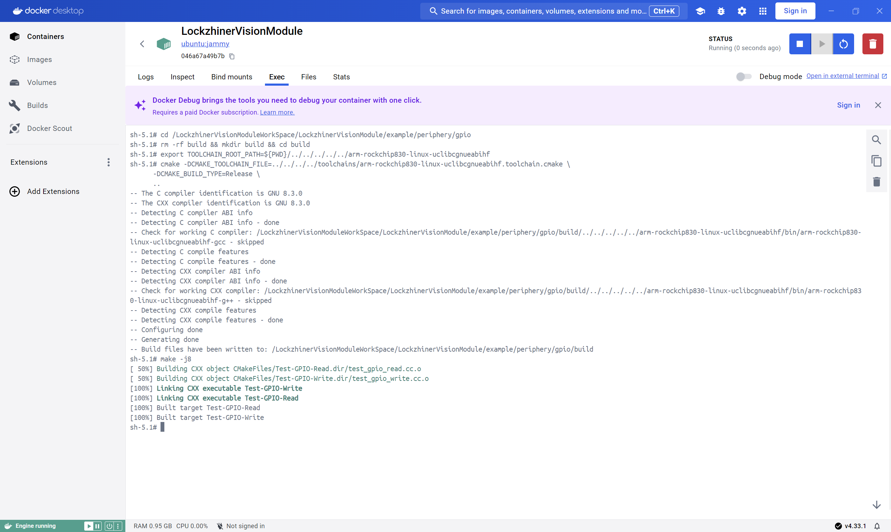
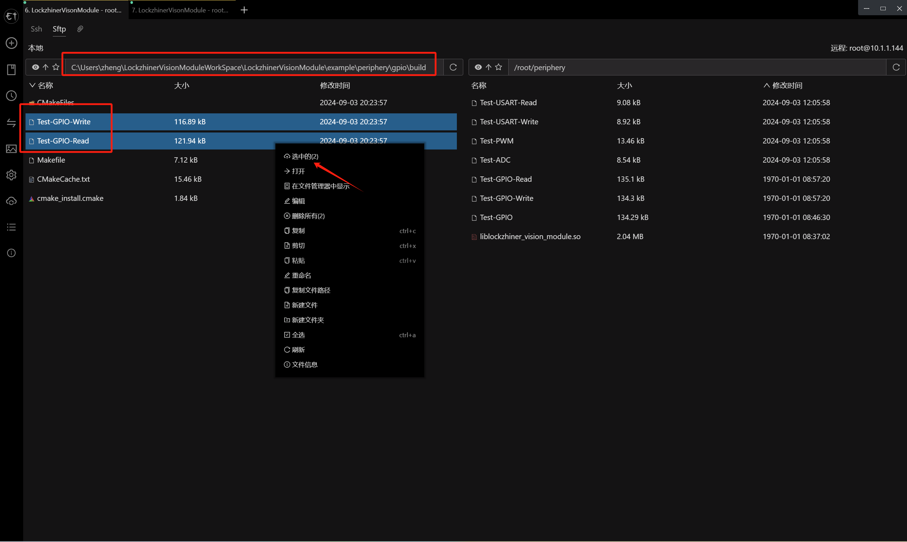
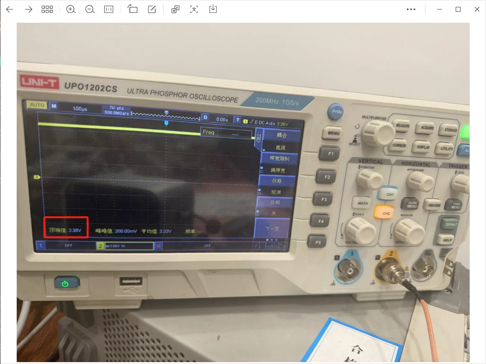
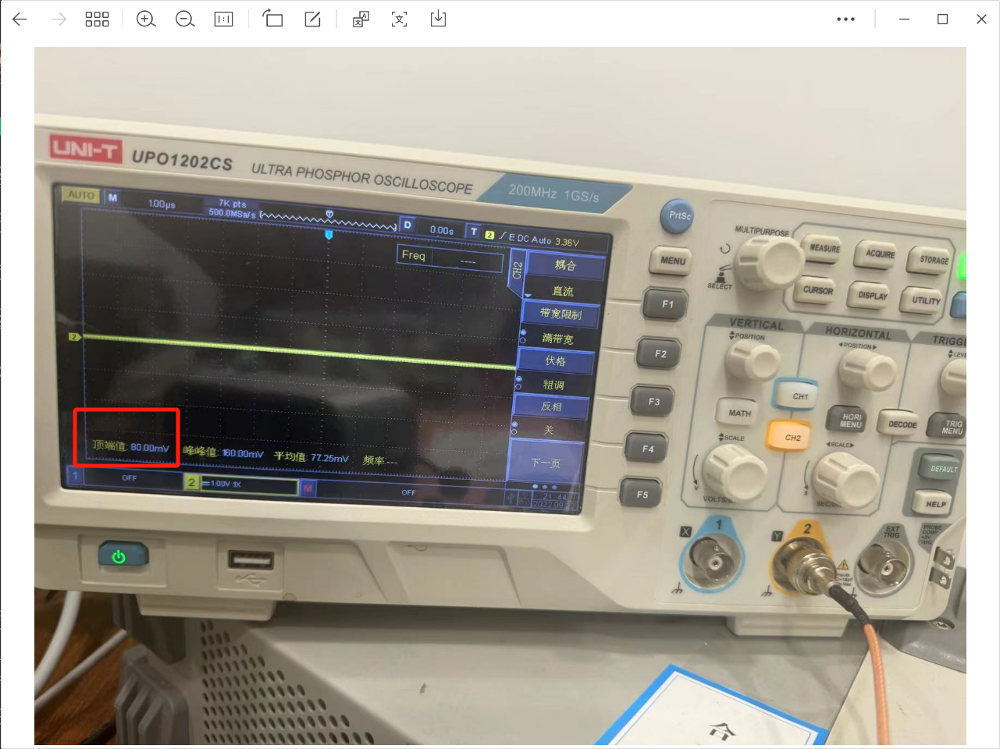
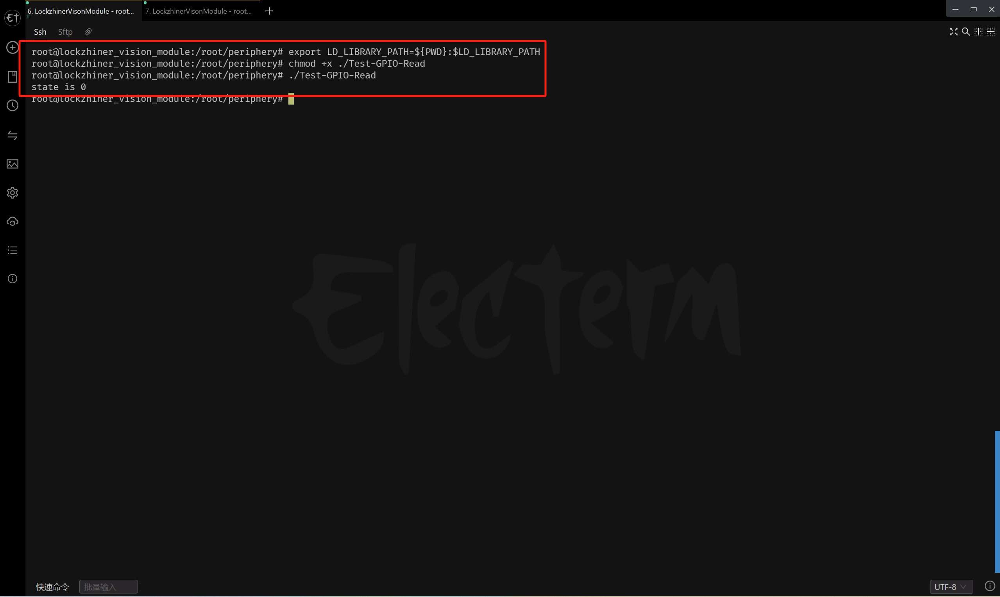

<h1 align="center">凌智视觉模块 GPIO C++ 部署指南</h1>

发布版本：V0.0.0

日期：2024-09-14

文件密级：□绝密 □秘密 □内部资料 ■公开  

---

**免责声明**  

本文档按**现状**提供，福州凌睿智捷电子有限公司（以下简称**本公司**）不对本文档中的任何陈述、信息和内容的准确性、可靠性、完整性、适销性、适用性及非侵权性提供任何明示或暗示的声明或保证。本文档仅作为使用指导的参考。  

由于产品版本升级或其他原因，本文档可能在未经任何通知的情况下不定期更新或修改。  

**读者对象**  

本教程适用于以下工程师：  

- 技术支持工程师  
- 软件开发工程师  

**修订记录**  

| **日期**   | **版本** | **作者** | **修改说明** |
| :--------- | -------- | -------- | ------------ |
| 2024/09/14 | 0.0.0    | 郑必城     | 初始版本     |

## 1 简介

接下来让我们基于 C++ 来部署 GPIO 例程。在开始本章节前：

- 请确保你已经按照 [开发环境搭建指南](../../../../docs/introductory_tutorial/cpp_development_environment.md) 正确配置了开发环境。
- 请确保你已经按照 [凌智视觉模块 GPIO 使用指南](../README.md) 正确将信号连接到开发板。

## 2 API 文档

```c++
/// \enum GPIOMode
/// \brief GPIO 模式枚举类
///
/// 定义 GPIO 的模式，包括输入（IN）和输出（OUT）。
enum class GPIOMode {
  IN,   ///< 输入模式
  OUT,  ///< 输出模式
};

/// \enum GPIOState
/// \brief GPIO 状态枚举类
///
/// 定义 GPIO 的状态，包括错误（ERROR）、高电平（HIGH）和低电平（LOW）。
enum class GPIOState {
  ERROR = 2,  ///< 错误状态
  HIGH = 1,   ///< 高电平状态
  LOW = 0,    ///< 低电平状态
};

/// \class GPIOBase
/// \brief GPIO 基础类模板
///
/// \tparam bank GPIO 端口集合（0-31）
/// \tparam port_char 端口字符（'A'-'D'）
/// \tparam pin GPIO 引脚（0-7）
///
/// 该模板类提供了对 GPIO 引脚的基本操作，包括配置模式、写入状态、读取状态等。
template <uint8_t bank, char port_char, uint8_t pin>
class GPIOBase {
 public:
  /// \brief 构造函数，初始化 GPIO 并导出 GPIO 引脚。
  GPIOBase();

  /// \brief 析构函数，取消导出 GPIO 引脚。
  ~GPIOBase();

  /// \brief 配置 GPIO 模式
  ///
  /// \param mode 要设置的 GPIO 模式
  /// \return 操作成功返回 true，否则返回 false。
  bool Config(GPIOMode mode);

  /// \brief 写入 GPIO 状态
  ///
  /// \param state 要设置的 GPIO 状态
  /// \return 操作成功返回 true，否则返回 false。
  bool Write(GPIOState state);

  /// \brief 读取 GPIO 状态
  ///
  /// \param state 用于存储读取到的 GPIO 状态
  /// \return 读取成功返回 true，否则返回 false。
  bool Read(GPIOState& state);

  /// \brief 读取 GPIO 状态
  ///
  /// \return 返回读取到的 GPIO 状态。
  GPIOState Read();

 private:
  // clang-format off
  inline constexpr static uint32_t gpio_index_ = (32 * bank + 8 * (port_char - 'A') + pin);
  inline const static std::string direction_file_path_ = fmt::format("/sys/class/gpio/gpio{}/direction", gpio_index_);
  inline const static std::string value_file_path_ = fmt::format("/sys/class/gpio/gpio{}/value", gpio_index_);
  // clang-format on
};

/******************** GPIO0XX ********************/
using GPIO0A0 = GPIOBase<0, 'A', 0>;
/******************** GPIO0XX ********************/

/******************** GPIO1XX ********************/
using GPIO1C7 = GPIOBase<1, 'C', 7>;
/******************** GPIO1XX ********************/

/******************** GPIO2XX ********************/
using GPIO2A0 = GPIOBase<2, 'A', 0>;
using GPIO2A1 = GPIOBase<2, 'A', 1>;
using GPIO2A2 = GPIOBase<2, 'A', 2>;
using GPIO2A3 = GPIOBase<2, 'A', 3>;
using GPIO2A4 = GPIOBase<2, 'A', 4>;
using GPIO2A5 = GPIOBase<2, 'A', 5>;
/******************** GPIO2XX ********************/
```

## 3 项目介绍

为了方便大家入手，我们将项目拆分为**测试 GPIO 输出模式**和**测试 GPIO 输入模式**两个例程，他们共用一个 CMake 文件。

```cmake
# CMake最低版本要求  
cmake_minimum_required(VERSION 3.10)  

project(test_gpio)

# 定义项目根目录路径
set(PROJECT_ROOT_PATH "${CMAKE_CURRENT_SOURCE_DIR}/../../../..")
# 定义 LockzhinerVisionModule SDK 路径
set(LockzhinerVisionModule_ROOT_PATH "${PROJECT_ROOT_PATH}/third_party/lockzhiner_vision_module_sdk")
set(LockzhinerVisionModule_DIR "${LockzhinerVisionModule_ROOT_PATH}/lib/cmake/lockzhiner_vision_module")
find_package(LockzhinerVisionModule REQUIRED)

# 配置 GPIO 输出 Demo
add_executable(Test-GPIO-Write test_gpio_write.cc)
target_include_directories(Test-GPIO-Write PRIVATE ${LOCKZHINER_VISION_MODULE_INCLUDE_DIRS})
target_link_libraries(Test-GPIO-Write PRIVATE ${LOCKZHINER_VISION_MODULE_LIBRARIES})

# 配置 GPIO 读取 Demo
add_executable(Test-GPIO-Read test_gpio_read.cc)
target_include_directories(Test-GPIO-Read PRIVATE ${LOCKZHINER_VISION_MODULE_INCLUDE_DIRS})
target_link_libraries(Test-GPIO-Read PRIVATE ${LOCKZHINER_VISION_MODULE_LIBRARIES})
```

测试 GPIO 输入模式的核心代码如下:

```cpp
#include <lockzhiner_vision_module/periphery/gpio/gpio.h>

#include <iostream>
#include <thread>

int main() {
  lockzhiner_vision_module::periphery::GPIO0A0 gpio;

  if (!gpio.Config(lockzhiner_vision_module::periphery::GPIOMode::IN)) {
    std::cout << "Failed to config gpio mode" << std::endl;
    return 1;
  }

  lockzhiner_vision_module::periphery::GPIOState state;
  if (!gpio.Read(state)) {
    std::cout << "Failed to read gpio mode" << std::endl;
    return 1;
  }

  std::cout << "state is " << static_cast<uint8_t>(state) << std::endl;
  return 0;
}
```

测试 GPIO 输出模式的核心代码如下:

```cpp
#include <lockzhiner_vision_module/periphery/gpio/gpio.h>

#include <iostream>
#include <thread>

int main() {
  lockzhiner_vision_module::periphery::GPIO0A0 gpio;

  if (!gpio.Config(lockzhiner_vision_module::periphery::GPIOMode::OUT)) {
    std::cout << "Failed to config gpio mode" << std::endl;
    return 1;
  }

  if (!gpio.Write(lockzhiner_vision_module::periphery::GPIOState::HIGH)) {
    std::cout << "Failed to config gpio mode" << std::endl;
    return 1;
  }

  for (int i = 0; i < 10; i++) {
    std::cout << "Wait: " << i << "/" << 10 << std::endl;
    std::this_thread::sleep_for(std::chrono::seconds(1));
  }

  if (!gpio.Write(lockzhiner_vision_module::periphery::GPIOState::LOW)) {
    std::cout << "Failed to config gpio mode" << std::endl;
    return 1;
  }

  return 0;
}
```

## 4 编译项目

使用 Docker Destop 打开 LockzhinerVisionModule 容器并执行以下命令来编译项目

```bash
# 进入 Demo 目录
cd /LockzhinerVisionModuleWorkSpace/LockzhinerVisionModule/example/periphery/gpio

# 创建编译目录
rm -rf build && mkdir build && cd build

# 配置交叉编译工具链
export TOOLCHAIN_ROOT_PATH=${PWD}/../../../../../../arm-rockchip830-linux-uclibcgnueabihf

# 使用 cmake 配置项目
cmake -DCMAKE_TOOLCHAIN_FILE=../../../../../toolchains/arm-rockchip830-linux-uclibcgnueabihf.toolchain.cmake \
      -DCMAKE_BUILD_TYPE=Release \
      ..

# 执行编译
make -j8
```



## 5 上传测试例程

参考 [连接设备指南](../../../../docs/introductory_tutorial/connect_device_using_ssh.md) 正确连接 Lockzhiner Vision Module 设备。


使用 SFTP 功能将软件上传到 Lockzhiner Vision Module



## 6 执行 GPIO 测试程序

### 6.1 测试 GPIO 输出模式

在 Lockzhiner Vision Module 上运行以下代码来执行 GPIO 输出电平程序

```bash
chmod +x ./Test-GPIO-Write
./Test-GPIO-Write
```

查看示波器可以看到，GPIO_0A0 输出了 3.4V 左右的电压



电压持续 10S 后恢复了正常



### 6.2 测试 GPIO 输入模式（输入高电平）

在 Lockzhiner Vision Module 上运行以下代码来执行 GPIO 接收程序

```bash
chmod +x ./Test-GPIO-Read
./Test-GPIO-Read
```

可以看到，在接高电平引脚的情况下，引脚的状态信息为 1


### 6.3 测试 GPIO 输入模式（输入低电平）

在 Lockzhiner Vision Module 上运行以下代码来执行 GPIO 接收程序

```bash
export LD_LIBRARY_PATH=${PWD}:$LD_LIBRARY_PATH
chmod +x ./Test-GPIO-Read
./Test-GPIO-Read
```

可以看到，在低电平引脚的情况下，引脚的状态信息为 0



## 7 其他

如果你需要使用 Python 来部署 ADC 例程请参考[凌智视觉模块 ADC Python 部署指南](../python/README.md)。
