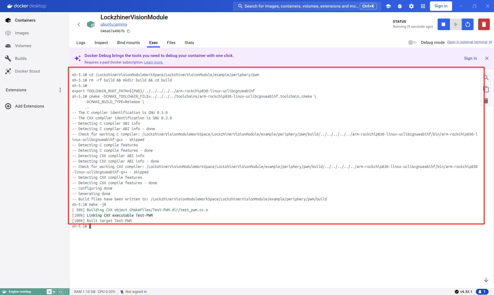
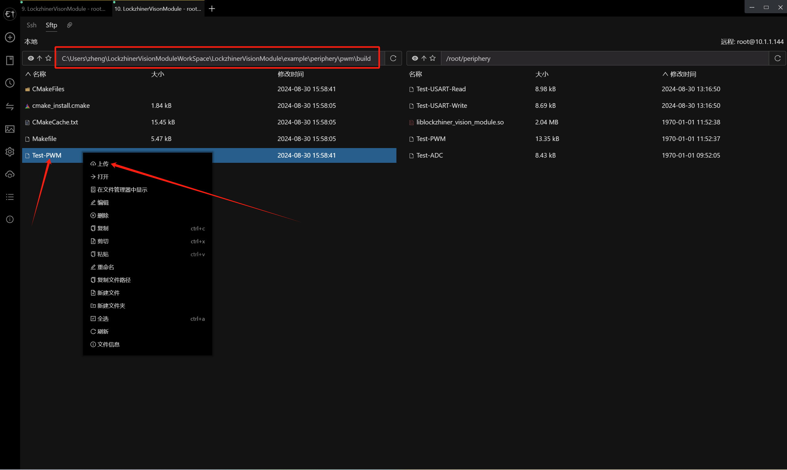
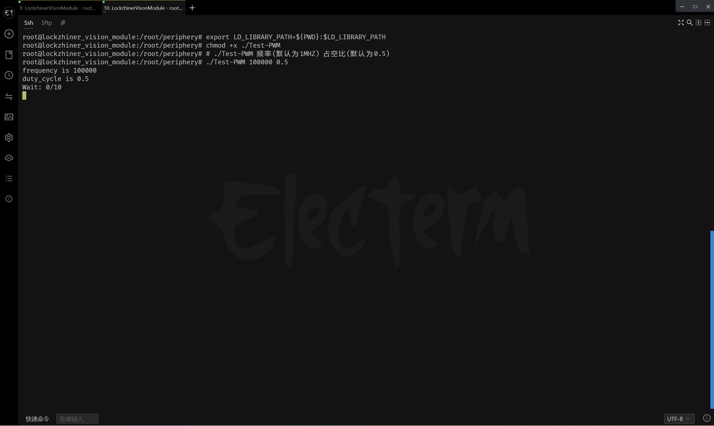
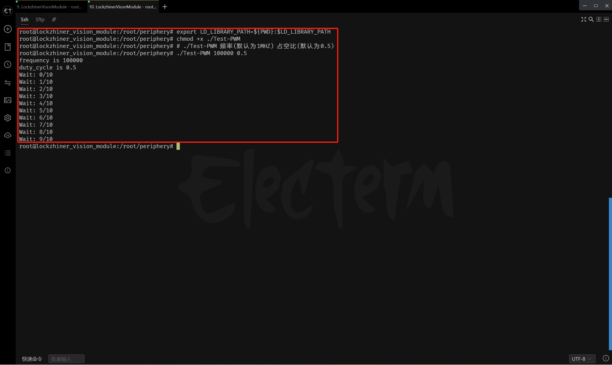
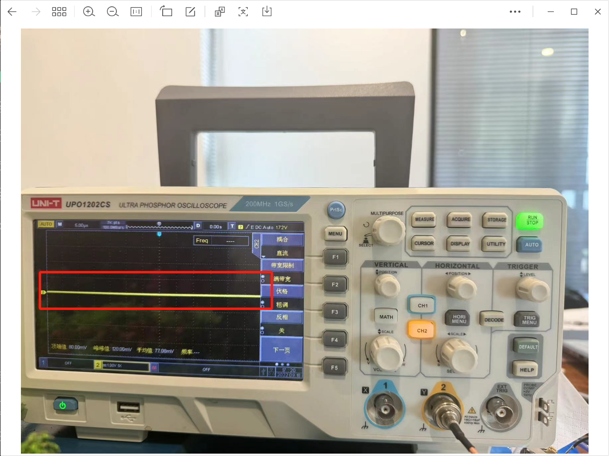

<h1 align="center">PWM 使用指南</h1>

发布版本：V0.0.0

日期：2024-08-30

文件密级：□绝密 □秘密 □内部资料 ■公开  

---

**免责声明**  

本文档按**现状**提供，福州凌睿智捷电子有限公司（以下简称**本公司**）不对本文档中的任何陈述、信息和内容的准确性、可靠性、完整性、适销性、适用性及非侵权性提供任何明示或暗示的声明或保证。本文档仅作为使用指导的参考。  

由于产品版本升级或其他原因，本文档可能在未经任何通知的情况下不定期更新或修改。  

**读者对象**  

本教程适用于以下工程师：  

- 技术支持工程师  
- 软件开发工程师  

**修订记录**  

| **日期**   | **版本** | **作者** | **修改说明** |
| :--------- | -------- | -------- | ------------ |
| 2024/08/30 | 0.0.0    | 郑必城     | 初始版本     |


## 1 简介

在电子工程和嵌入式系统开发中，脉冲宽度调制（PWM, Pulse Width Modulation）是一项关键技术，它允许我们通过调整脉冲信号的占空比来控制模拟信号的平均电平。

## 2 前期准备

在开始这个章节前，请确保你已经按照 [开发环境搭建指南](../../../docs/introductory_tutorial/development_environment.md) 正确配置了开发环境。本章节中，我们将教会你如何控制 Lockzhiner Vision Module 上的 PWM 接口。

## 3 API 文档

```c++
/**
 * @brief  PWM 类提供了对脉冲宽度调制（PWM）信号的控制接口。
 *
 * 这个类允许用户打开、关闭 PWM 通道，并配置 PWM 信号的频率和占空比。
 * 需要注意的是， PWM 输出的电压在低电平时为 0V，高电平时为 3.3V。
 */
class PWM {
 public:
  /**
   * @brief  PWM 类的构造函数。
   *
   * 构造函数初始化 PWM 类的实例，但不自动打开 PWM 通道。
   */
  PWM();

  /**
   * @brief  PWM 类的析构函数。
   *
   * 析构函数负责清理 PWM 类实例使用的资源，但不会自动关闭 PWM 通道。
   * 建议在不需要 PWM 时显式调用 Close() 函数。
   */
  ~PWM();

  /**
   * @brief 打开 PWM 通道。
   *
   * 此函数尝试打开 PWM 通道，但不配置任何参数（如频率和占空比）。
   * 成功时返回 true，失败时返回 false。
   *
   * @return bool 指示操作是否成功。
   */
  bool Open();

  /**
   * @brief 关闭 PWM 通道。
   *
   * 此函数关闭 PWM 通道，停止 PWM 信号的输出。
   * 成功时返回 true，失败时返回 false。
   *
   * @return bool 指示操作是否成功。
   */
  bool Close();

  /**
   * @brief 配置 PWM 信号的频率和占空比。
   *
   * 配置 PWM 信号的频率（以Hz为单位）和占空比（以 0.0 到 1.0 的浮点数表示）。
   * 成功时返回 true，失败时返回 false。
   *
   * @param frequency  PWM 信号的频率（Hz）。
   * @param duty_cycle  PWM 信号的占空比（0.0 到 1.0 之间）。
   * @return bool 指示操作是否成功。
   */
  bool ConfigPWM(uint32_t frequency, float duty_cycle);

  /**
   * @brief 打开 PWM 通道并配置频率与占空比。
   *
   * 这是一个便捷的函数，它首先尝试打开 PWM 通道，然后配置 PWM
   * 信号的频率和占空比。 如果任何一步失败，函数将返回 false。
   *
   * @param frequency  PWM 信号的频率（Hz）。
   * @param duty_cycle  PWM 信号的占空比（0.0 到 1.0 之间）。
   * @return bool 指示操作是否成功。
   */
  bool Open(uint32_t frequency, float duty_cycle);
};
```

## 4 项目介绍

为了方便大家入手，我们做了一个简易的 PWM 例程。该例程可以输出持续 10s 的 PWM 信号。

```cmake
# CMake最低版本要求  
cmake_minimum_required(VERSION 3.10)  

project(test_pwm)

# 定义项目根目录路径
set(PROJECT_ROOT_PATH "${CMAKE_CURRENT_SOURCE_DIR}/../../..")
# 定义 LockzhinerVisionModule SDK 路径
set(LockzhinerVisionModule_ROOT_PATH "${PROJECT_ROOT_PATH}/third_party/lockzhiner_vision_module_sdk")
set(LockzhinerVisionModule_DIR "${LockzhinerVisionModule_ROOT_PATH}/lib/cmake/lockzhiner_vision_module")
find_package(LockzhinerVisionModule REQUIRED)

# 配置 PWM 读取例程
add_executable(Test-PWM test_pwm.cc)
target_include_directories(Test-PWM PRIVATE ${LOCKZHINER_VISION_MODULE_INCLUDE_DIRS})
target_link_libraries(Test-PWM PRIVATE ${LOCKZHINER_VISION_MODULE_LIBRARIES})
```

例程的核心代码如下:

```cpp
#include <lockzhiner_vision_module/periphery/pwm/pwm.h>

#include <cstdlib>  // 为了使用atoi()
#include <cstring>  // 为了使用strtof()
#include <iostream>
#include <thread>

int main(int argc, char* argv[]) {
  uint32_t frequency = 1000000;
  float duty_cycle = 0.5;
  if (argc == 3) {
    frequency = std::atoi(argv[1]);
    duty_cycle = std::strtof(argv[2], nullptr);
  }
  std::cout << "frequency is " << frequency << std::endl;
  std::cout << "duty_cycle is " << duty_cycle << std::endl;

  lockzhiner_vision_module::periphery::PWM pwm;

  // 打开 PWM
  if (!pwm.Open(frequency, duty_cycle)) {
    std::cout << "Failed to open adc." << std::endl;
    return 1;
  }

  for (int i = 0; i < 10; i++) {
    std::cout << "Wait: " << i << "/" << 10 << std::endl;
    std::this_thread::sleep_for(std::chrono::seconds(1));
  }

  // 关闭 PWM
  if (!pwm.Close()) {
    std::cout << "Failed to open adc." << std::endl;
    return 1;
  }
  return 0;
}
```

## 5 编译项目

使用 Docker Destop 打开 LockzhinerVisionModule 容器并执行以下命令来编译项目

```bash
# 进入 Demo 目录
cd /LockzhinerVisionModuleWorkSpace/LockzhinerVisionModule/example/periphery/pwm

# 创建编译目录
rm -rf build && mkdir build && cd build

# 配置交叉编译工具链
export TOOLCHAIN_ROOT_PATH=${PWD}/../../../../../arm-rockchip830-linux-uclibcgnueabihf

# 使用 cmake 配置项目
cmake -DCMAKE_TOOLCHAIN_FILE=../../../../toolchains/arm-rockchip830-linux-uclibcgnueabihf.toolchain.cmake \
      -DCMAKE_BUILD_TYPE=Release \
      ..

# 执行编译
make -j8
```



## 6 正确连接设备

> 注意: Lockzhiner Vision Module PWM 引脚输出的理论高电平为 3.3V，理论低电平为 0V

为了方便调试，我们这里使用 **示波器** 进行调试，请正确的将 Lockzhiner Vision Module 的引脚按照以下方式连接

* LockzhinerVisionModule PWM <-> Input IO
* LockzhinerVisionModule GND <-> Input GND

板子上的引脚丝印较小，如果看不清引脚信息，可以参考下图


## 7 执行 PWM 测试程序

参考 [连接设备指南](../../../../docs/introductory_tutorial/connect_device_using_ssh.md) 正确连接 Lockzhiner Vision Module 设备。


使用 SFTP 功能将软件上传到 Lockzhiner Vision Module



在 Lockzhiner Vision Module 上运行以下代码来执行 PWM 测试程序

```bash
chmod +x ./Test-PWM
# ./Test-PWM 频率(默认为1MHZ) 占空比(默认为0.5)
./Test-PWM 100000 0.5
```

程序运行开始后，屏幕上打印配置的频率和占空比并开始每隔一秒显示当前进度




程序运行 10s 后，程序退出 PWM 停止


