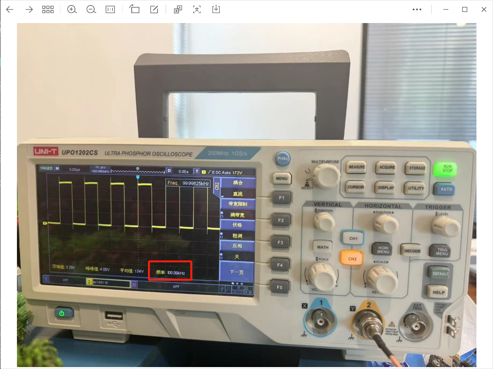
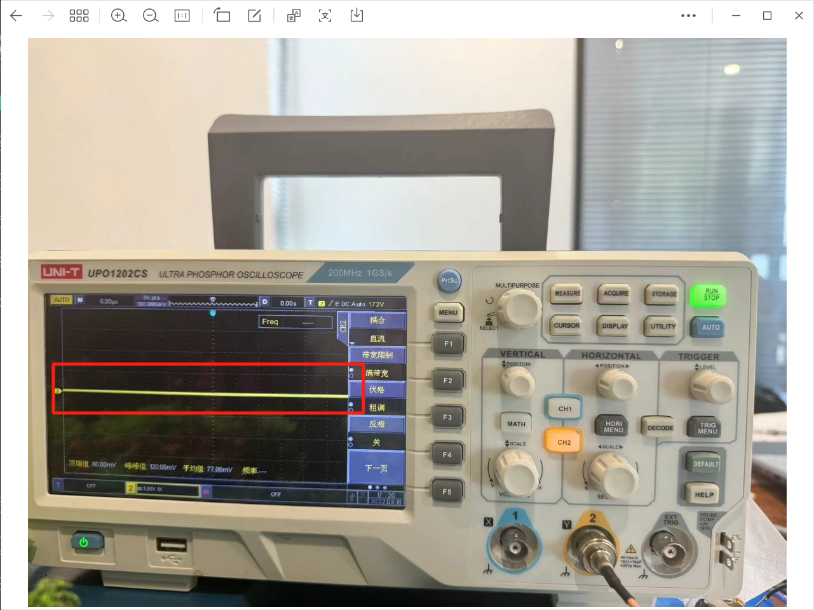

<h1 align="center">凌智视觉模块 PWM Python 部署指南</h1>

发布版本：V0.0.0

日期：2024-09-26

文件密级：□绝密 □秘密 □内部资料 ■公开  

---

**免责声明**  

本文档按**现状**提供，福州凌睿智捷电子有限公司（以下简称**本公司**）不对本文档中的任何陈述、信息和内容的准确性、可靠性、完整性、适销性、适用性及非侵权性提供任何明示或暗示的声明或保证。本文档仅作为使用指导的参考。  

由于产品版本升级或其他原因，本文档可能在未经任何通知的情况下不定期更新或修改。  

**读者对象**  

本教程适用于以下工程师：  

- 技术支持工程师  
- 软件开发工程师  

**修订记录**  

| **日期**   | **版本** | **作者** | **修改说明** |
| :--------- | -------- | -------- | ------------ |
| 2024/09/26 | 0.0.0    | 郑必城     | 初始版本     |

## 1 简介

接下来让我们基于 Python 来部署 PWM 例程。在开始本章节前：

- 请确保你已经按照 [开发环境搭建指南](../../../../docs/introductory_tutorial/python_development_environment.md) 正确配置了开发环境。
- 请确保你已经按照 [凌智视觉模块 PWM 使用指南](../README.md) 正确将信号连接到开发板。

## 2 API 文档

```python
class PWMBase:
    """
    @class PWMBase
    @brief PWM 基础类，用于管理 PWM 设备的初始化和基本操作。

    此类提供了一个接口来配置、打开和关闭 PWM 设备。它依赖于一个具体的 PWM 类实例来实现这些操作。
    """

    def __init__(self, pwm_class):
        """
        @fn __init__(self, pwm_class)
        @brief 构造函数， 初始化 PWMBase 对象。

        @param pwm_class 一个 PWM 类，用于实际的 PWM 设备操作。
        """
        self.pwm = pwm_class()

    def config(self, frequency, duty_cycle):
        """
        @fn config(self, frequency, duty_cycle)
        @brief 配置 PWM 信号的频率和占空比。

        @param frequency PWM 信号的频率。
        @param duty_cycle PWM 信号的占空比。

        @return 配置操作的结果，通常由具体的 PWM 类决定。
        """
        return self.pwm.config(frequency, duty_cycle)

    def open(self):
        """
        @fn open(self)
        @brief 打开 PWM 设备，不指定频率和占空比（使用默认设置）。

        @return 打开操作的结果，通常由具体的 PWM 类决定。
        """
        return self.pwm.open()

    def close(self):
        """
        @fn close(self)
        @brief 关闭 PWM 设备。

        @return 关闭操作的结果，通常由具体的 PWM 类决定。
        """
        return self.pwm.close()


class PWM9(PWMBase):
    def __init__(self):
        super().__init__(periphery.PWM9)
```

## 3 项目介绍

为了方便大家入手，我们准备了 PWM 使用的最小例程，执行程序后 PWM 引脚将输出 10s 的 PWM 波形，代码如下:

```python
from lockzhiner_vision_module.periphery import PWM9
import time


if __name__ == "__main__":
    pwm = PWM9()
    pwm.config(1000000, 0.5)
    pwm.open()

    time_index = 0
    total_time = 10
    while time_index < total_time:
        print(f"Wait: {time_index}/{total_time}")
        time_index += 1
        time.sleep(1)

    pwm.close()
```

## 4 执行 PWM 测试程序

参考 [连接设备指南](../../../../docs/introductory_tutorial/connect_device_using_ssh.md) 正确连接 Lockzhiner Vision Module 设备。


使用 SFTP 功能将软件上传到 Lockzhiner Vision Module


在 Lockzhiner Vision Module 上运行以下代码来执行 PWM 测试程序

```bash
python test_pwm.py
```

程序运行开始后，屏幕上打印配置的频率和占空比并开始每隔一秒显示当前进度



程序运行 10s 后，程序退出 PWM 停止


