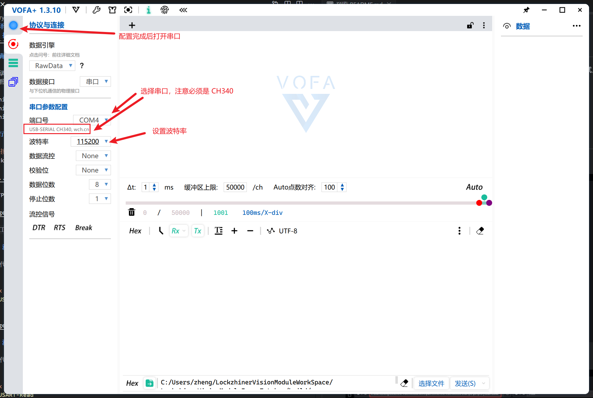

<h1 align="center">凌智视觉模块串口使用指南</h1>

发布版本：V0.0.0

日期：2024-09-21

文件密级：□绝密 □秘密 □内部资料 ■公开  

---

**免责声明**  

本文档按**现状**提供，福州凌睿智捷电子有限公司（以下简称**本公司**）不对本文档中的任何陈述、信息和内容的准确性、可靠性、完整性、适销性、适用性及非侵权性提供任何明示或暗示的声明或保证。本文档仅作为使用指导的参考。  

由于产品版本升级或其他原因，本文档可能在未经任何通知的情况下不定期更新或修改。  

**读者对象**  

本教程适用于以下工程师：  

- 技术支持工程师  
- 软件开发工程师  

**修订记录**  

| **日期**   | **版本** | **作者** | **修改说明** |
| :--------- | -------- | -------- | ------------ |
| 2024/09/21 | 0.0.0    | 郑必城     | 初始版本     |

## 1 简介

串口，也称为串行接口或串行通信接口，是一种用于连接计算机与外部设备并进行数据传输的接口技术。它使用较少的导线（通常只需要几根线），并且可以在较长的距离上可靠地传输数据，尽管速度相对较慢。本章节中，我们将教会你如何使用 Lockzhiner Vision Module 上的串口进行传输数据。

## 2 正确连接设备

为了方便调试，我们这里使用 **CH340 USB 转串口模块（以下简称 CH340）**进行调试，请正确的将模型的引脚按照以下方式连接

* LockzhinerVisionModule RX1 <-> CH340 TXD
* LockzhinerVisionModule TX1 <-> CH340 RXD
* LockzhinerVisionModule GND <-> CH340 GND

> Lockzhiner 也提供官方的 [CH340 USB 转串口模块](http://e.tb.cn/h.gMbjEDBRiaOutkO?tk=kBlS35jFQOE)，如果有需要可以前往购买。

打开串口工具，我这里选择的是 [vofa+](https://www.vofa.plus/)，配置波特率为 115200 并打开串口

## 3 在凌智视觉模块上部署串口例程

请参考以下教程使用 C++ 或 Python 在凌智视觉模块上部署 GPIO 例程：

- [凌智视觉模块 GPIO C++ 部署指南](./cpp/README.md)
- [凌智视觉模块 GPIO Python 部署指南](./python/README.md)