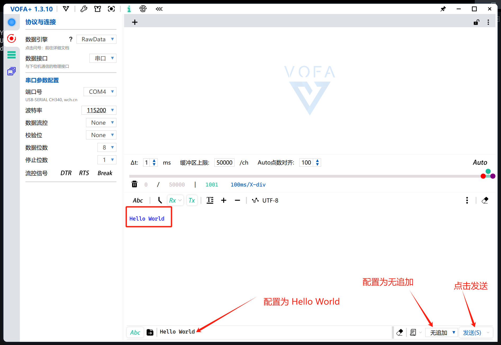

<h1 align="center">凌智视觉模块串口 C++ 部署指南</h1>

发布版本：V0.0.0

日期：2024-09-21

文件密级：□绝密 □秘密 □内部资料 ■公开  

---

**免责声明**  

本文档按**现状**提供，福州凌睿智捷电子有限公司（以下简称**本公司**）不对本文档中的任何陈述、信息和内容的准确性、可靠性、完整性、适销性、适用性及非侵权性提供任何明示或暗示的声明或保证。本文档仅作为使用指导的参考。  

由于产品版本升级或其他原因，本文档可能在未经任何通知的情况下不定期更新或修改。  

**读者对象**  

本教程适用于以下工程师：  

- 技术支持工程师  
- 软件开发工程师  

**修订记录**  

| **日期**   | **版本** | **作者** | **修改说明** |
| :--------- | -------- | -------- | ------------ |
| 2024/09/21 | 0.0.0    | 郑必城     | 初始版本     |


## 1 简介

串口，也称为串行接口或串行通信接口，是一种用于连接计算机与外部设备并进行数据传输的接口技术。它使用较少的导线（通常只需要几根线），并且可以在较长的距离上可靠地传输数据，尽管速度相对较慢。本章节中，我们将教会你如何使用 Lockzhiner Vision Module 上的串口进行传输数据。

## 2 前期准备

接下来让我们基于串口来部署 GPIO 例程。在开始本章节前：

- 在开始这个章节前，请确保你已经按照 [开发环境搭建指南](../../../../docs/introductory_tutorial/cpp_development_environment.md) 正确配置了开发环境。
- 请确保你已经按照 [凌智视觉模块 GPIO 使用指南](../README.md) 正确将信号连接到开发板并打开了串口工具。

## 3 API 文档

```c++
/// \class USART
/// \brief 串口控制类，用于串口通信的数据发送和接收。
///
/// 该类封装了串口的基本操作，包括打开串口、关闭串口、发送数据和接收数据。
class USART {
 public:
  USART() = default;
  ~USART();

  /// \brief 打开串口。
  ///
  /// \param baud_rate 波特率，用于设置串口通信速率，默认为 115200。
  /// \return 成功打开串口返回 true，否则返回 false。
  bool Open(uint32_t baud_rate = 115200);

  /// \brief 关闭串口。
  ///
  /// \return 成功关闭串口返回 true，否则返回 false。
  bool Close();

  /// \brief 发送数据。
  ///
  /// \param data 要发送的数据字符串。
  /// \return 成功发送数据返回 true，否则返回 false。
  bool Write(const std::string& data);

  /// \brief 接收数据。
  ///
  /// \param buffer 用于存储接收到的数据的缓冲区。
  /// \param size 缓冲区的大小。
  /// \return 成功接收数据返回 true，否则返回 false。
  bool Read(std::string& buffer, size_t size);

 private:
  int serial_port_ = -1;
  uint32_t GetBaudRate(int baud_rate);
};
```

## 4 项目介绍

为了方便大家入手，我们将项目拆分为串口接受数据和串口发送数据两个部分，他们共用一个 CMake 文件。

```cmake
# CMake最低版本要求  
cmake_minimum_required(VERSION 3.10)  

project(test_usart)

# 定义项目根目录路径
set(PROJECT_ROOT_PATH "${CMAKE_CURRENT_SOURCE_DIR}/../../..")
# 定义 LockzhinerVisionModule SDK 路径
set(LockzhinerVisionModule_ROOT_PATH "${PROJECT_ROOT_PATH}/third_party/lockzhiner_vision_module_sdk")
set(LockzhinerVisionModule_DIR "${LockzhinerVisionModule_ROOT_PATH}/lib/cmake/lockzhiner_vision_module")
find_package(LockzhinerVisionModule REQUIRED)

# 配置串口输出 Demo
add_executable(Test-USART-Write test_usart_write.cc)
target_include_directories(Test-USART-Write PRIVATE ${LOCKZHINER_VISION_MODULE_INCLUDE_DIRS})
target_link_libraries(Test-USART-Write PRIVATE ${LOCKZHINER_VISION_MODULE_LIBRARIES})

# 配置串口读取 Demo
add_executable(Test-USART-Read test_usart_read.cc)
target_include_directories(Test-USART-Read PRIVATE ${LOCKZHINER_VISION_MODULE_INCLUDE_DIRS})
target_link_libraries(Test-USART-Read PRIVATE ${LOCKZHINER_VISION_MODULE_LIBRARIES})
```

串口接受数据的核心代码如下:

```cpp
#include <lockzhiner_vision_module/periphery/usart/usart.h>  // 串口类头文件

#include <iostream>  // 引入标准输入输出流库

int main() {
  // 创建串口类对象
  lockzhiner_vision_module::periphery::USART usart;

  // 尝试以115200的波特率打开串口
  if (!usart.Open(115200)) {
    // 如果打开失败，则输出错误信息并返回1
    std::cout << "Failed to open usart." << std::endl;
    return 1;
  }

  // 输出开始接收串口数据的提示信息
  std::cout << "Start receiving serial port data." << std::endl;

  // 无限循环，持续接收串口数据
  while (1) {
    std::string buffer;  // 用于存储接收到的串口数据
    // 从串口读取数据到buffer中，最多读取1024字节
    usart.Read(buffer, 1024);
    // 如果buffer不为空，则输出接收到的数据
    if (!buffer.empty()) {
      std::cout << buffer << std::endl;
    }
  }
  return 0;
}
```

串口发送数据的核心代码如下:

```cpp
#include <lockzhiner_vision_module/periphery/usart/usart.h>  // 引入串口类头文件

#include <iostream>  // 引入标准输入输出流库

int main() {
  // 创建串口类对象
  lockzhiner_vision_module::periphery::USART usart;

  // 尝试以115200的波特率打开串口
  if (!usart.Open(115200)) {
    // 如果打开失败，则输出错误信息并返回1
    std::cout << "Failed to open usart." << std::endl;
    return 1;
  }

  // 尝试发送字符串"Hello World\n"
  if (!usart.Write("Hello World\n")) {
    // 如果发送失败，则输出错误信息
    std::cout << "Failed to send data." << std::endl;
  }
  return 0;
}
```

## 5 编译项目

使用 Docker Destop 打开 LockzhinerVisionModule 容器并执行以下命令来编译项目

```bash
# 进入 Demo 目录
cd /LockzhinerVisionModuleWorkSpace/LockzhinerVisionModule/example/periphery/cpp/usart

# 创建编译目录
rm -rf build && mkdir build && cd build

# 配置交叉编译工具链
export TOOLCHAIN_ROOT_PATH=${PWD}/../../../../../arm-rockchip830-linux-uclibcgnueabihf

# 使用 cmake 配置项目
cmake -DCMAKE_TOOLCHAIN_FILE=../../../../toolchains/arm-rockchip830-linux-uclibcgnueabihf.toolchain.cmake \
      -DCMAKE_BUILD_TYPE=Release \
      ..

# 执行编译
make -j8
```


## 6 执行串口测试程序

参考 [连接设备指南](../../../../docs/introductory_tutorial/connect_device_using_ssh.md) 正确连接 Lockzhiner Vision Module 设备。


使用 SFTP 功能将软件上传到 Lockzhiner Vision Module


### 6.1 测试串口发送例程

在 Lockzhiner Vision Module 上运行以下代码来执行串口发送程序

```bash
export LD_LIBRARY_PATH=${PWD}:$LD_LIBRARY_PATH
chmod +x ./Test-USART-Write
./Test-USART-Write
```


vofa+ 上显示发送的字符串（Hello World）


### 6.2 测试串口接收例程

在 Lockzhiner Vision Module 上运行以下代码来执行串口接收程序

```bash
export LD_LIBRARY_PATH=${PWD}:$LD_LIBRARY_PATH
chmod +x ./Test-USART-Read
./Test-USART-Read
```


vofa+ 点击发送字符串（Hello World）



Lockzhiner Vision Module 打印接受到的字符串（Hello World）

